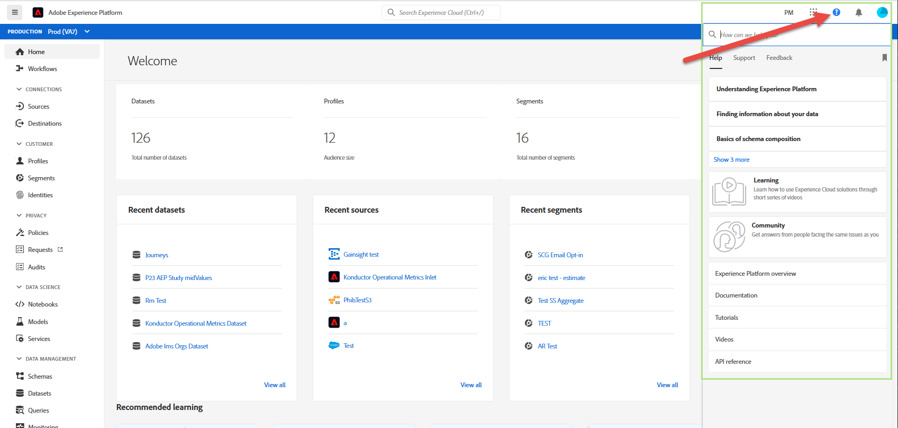

# Handleiding Adobe Experience Platform UI

Deze gids dient als inleiding aan het gebruiken van het gebruikersinterface van Adobe Experience Platform (UI), die verklaart wat de diverse componenten worden gebruikt voor en verbindingen verstrekt aan verdere documentatie voor meer informatie.

Lees voor meer informatie over Adobe Experience Platform de [Overzicht van Experience Platform](home.md).

## Startscherm

Nadat u zich hebt aangemeld bij Adobe Experience Platform, bevindt u zich op het tabblad [!UICONTROL Home] pagina, die bestaat uit de [metriek dashboard](#metrics), [recente gegevens](#recent-data), en [aanbevolen leerllen](#recommended-learning) secties.

### Metrics

Het dashboard Metrics verstrekt kaarten die u informatie over datasets, profielen, segmenten, en bestemmingen binnen uw organisatie geven.

De **[!UICONTROL Datasets]** toont het aantal datasets binnen uw IMS Organisatie. Dit aantal wordt bijgewerkt wanneer een nieuwe dataset wordt gecreeerd. Meer informatie over datasets vindt u in het gedeelte [Overzicht van gegevenssets](../catalog/datasets/overview.md).

De **[!UICONTROL Profiles]** wordt het totale aantal personen met profielen binnen uw IMS-organisatie weergegeven, met uitzondering van profielfragmenten. Dit totale aantal personen vertegenwoordigt het totale adresseerbare publiek en wordt elke 24 uur bijgewerkt. Meer informatie over profielen vindt u in het gedeelte [Overzicht van het realtime klantprofiel](../profile/home.md).

De **[!UICONTROL Segments]** toont het totale aantal segmenten die binnen uw IMS-organisatie zijn gemaakt. Dit aantal wordt bijgewerkt wanneer een nieuw segment wordt gecreeerd. Meer informatie over segmenten vindt u in de [Overzicht van segmentatieservice](../segmentation/home.md).

De **[!UICONTROL Destinations]** wordt het totale aantal doelen weergegeven dat voor de IMS-organisatie is gemaakt. Dit aantal wordt bijgewerkt wanneer een nieuwe bestemming wordt gecreeerd. Meer informatie over bestemmingen vindt u in het gedeelte [Overzicht van doelen](../destinations/home.md).

### Recente gegevens

Het recente gegevensdashboard verstrekt informatie over onlangs gecreeerde datasets, bronnen, segmenten, en bestemmingen.

De **[!UICONTROL Recent datasets]** de sectie maakt een lijst van de vijf onlangs gecreeerde datasets binnen uw organisatie IMS. Deze lijst wordt bijgewerkt telkens als een nieuwe dataset wordt gecreeerd. U kunt een dataset van de lijst selecteren om meer informatie over de gespecificeerde dataset te bekijken of te selecteren **[!UICONTROL View all]** om een lijst van alle gecreeerde datasets te zien. Meer informatie over datasets vindt u in het gedeelte [Overzicht van gegevenssets](../catalog/datasets/overview.md).

De **[!UICONTROL Recent sources]** de sectie maakt een lijst van de vijf onlangs gecreeerde bronschakelaars binnen uw organisatie IMS. Deze lijst wordt bijgewerkt telkens als een nieuwe bronschakelaar wordt gecreeerd. U kunt een bronverbinding in de lijst selecteren om meer informatie over de opgegeven aansluiting te bekijken of **[!UICONTROL View all]** om een lijst van alle gecreeerde bronverbindingen te zien. Meer informatie over bronnen vindt u in de [overzicht van bronnen](../sources/home.md).

De **[!UICONTROL Recent segments]** de sectie maakt een lijst van de vijf onlangs gecreeerd segmentdefinities binnen uw organisatie IMS. Deze lijst wordt bijgewerkt telkens als een nieuwe segmentdefinitie wordt gecreeerd. U kunt een segmentdefinitie in de lijst selecteren om meer informatie over de opgegeven segmentdefinitie te bekijken of **[!UICONTROL View all]** om een lijst van alle gecreeerde segmentdefinities te zien. Meer informatie over segmenten vindt u in de [Overzicht van segmentatieservice](../segmentation/home.md).

De **[!UICONTROL Recent destinations]** de sectie maakt een lijst van de vijf onlangs gecreeerde bestemmingen binnen uw organisatie IMS. Deze lijst wordt bijgewerkt telkens wanneer een nieuwe bestemming wordt gecreeerd. U kunt een doel in de lijst selecteren om meer informatie over het opgegeven doel weer te geven of **[!UICONTROL View all]** om een lijst van alle gecreeerde bestemmingen te zien. Meer informatie over bestemmingen vindt u in het gedeelte [Overzicht van doelen](../destinations/home.md).

### Aanbevolen training

De **[!UICONTROL Recommended learning]** bevat koppelingen naar handige documentatie die u kunt gebruiken om met Adobe Experience Platform aan de slag te gaan.

## Bovenste navigatiebalk

Op de bovenste navigatiebalk in de gebruikersinterface van het Platform wordt de IMS-organisatie weergegeven waarvoor u zich momenteel hebt aangemeld en zijn diverse belangrijke besturingselementen beschikbaar.

Links op de navigatiebalk bevindt zich het Adobe Experience Platform-logo. Als u dit logo op elk gewenst moment selecteert, keert u terug naar het hoofdscherm van de gebruikersinterface van het Platform.

### IMS-organisatieschakelaar

Het eerste item aan de rechterkant van de bovenste navigatiebalk is het **IMS-organisatieschakelaar**.

Als u de schakeloptie selecteert, wordt een vervolgkeuzemenu geopend met IMS-organisaties waartoe u toegang hebt, indien aanwezig. Als u wilt overschakelen naar een andere IMS-organisatie, selecteert u een weergegeven optie.

### Overschakelen op toepassingen

Het volgende item aan de rechterkant van de bovenste navigatie is de **toepassingsschakelaar**, vertegenwoordigd door de  pictogram. Wanneer u dit pictogram selecteert, kunt u schakelen tussen Adobe-toepassingen waartoe uw IMS-organisatie toegang heeft, zoals Experience Platform, Analytics, Assets en andere.

### Help

Rechts van de toepassingsswitch bevindt zich de **Help- en ondersteuningsmenu**, die wordt vertegenwoordigd door de  pictogram. Wanneer u dit pictogram selecteert, wordt een pop-upmenu weergegeven dat verschillende Help- en ondersteuningsbronnen bevat. De **[!UICONTROL Help]** bevat een lijst met relevante documentatie voor de pagina die u momenteel hebt geopend. De **[!UICONTROL Support]** kunt u een ondersteuningsticket maken met het ondersteuningsteam Adobe. De **[!UICONTROL Feedback]** kunt u feedback over Platform naar Adobe sturen.

### Meldingen en aankondigingen

In de **meldingssectie**, die wordt vertegenwoordigd door de  pictogram. De **[!UICONTROL Notifications]** bevat belangrijke informatie over het product en andere relevante updates, terwijl het tabblad **[!UICONTROL Announcements]** tabblad bevat informatie over onderhoud van de service.

### Gebruikersprofiel

Het laatste item op de bovenste navigatiebalk is de **gebruikersinstellingen**, vertegenwoordigd door de  pictogram. Selecteer dit pictogram om uw voorkeuren te bewerken of u af te melden.

U kunt schakelen tussen het lichte en donkere thema voor de interface van het Platform met de schakelaar die net onder uw naam en e-mail wordt gevestigd. Selecteer het gewenste thema.

### Sandboxen

Direct onder de bovenste navigatiebalk bevindt zich de sandboxbalk. Deze balk geeft aan welke sandbox u momenteel gebruikt voor Platform. Meer informatie over sandboxen vindt u in de [sandboxen, overzicht](../sandboxes/home.md).

## Linkernavigatie {#left-nav}

De navigatie op de linkerkant van het scherm maakt een lijst van alle verschillende diensten die in de UI van het Platform worden gesteund.

Klik op het menupictogram om het linkernavigatievenster weer te geven of te verbergen.

U kunt de navigatie op de open positie vergrendelen door nogmaals te klikken nadat u het deelvenster hebt weergegeven.

>[!IMPORTANT]
>
>Op de linkernavigatiebalk ziet u alleen de functies waartoe u toegang hebt. In eerdere versies van Adobe Experience Platform werden niet-beschikbare items uitgeschakeld. Neem contact op met de systeembeheerder als u vindt dat u toegang moet hebben tot een sectie die niet wordt weergegeven.

De **[!UICONTROL Home]** kunt u terugkeren naar de homepage van de gebruikersinterface van het Platform.

De **[!UICONTROL Workflows]** bevat een lijst met uit meerdere stappen bestaande workflows voor het uitvoeren van bewerkingen binnen het Platform. Meer informatie over workflows vindt u in de [workflowoverzicht](./workflows.md).

### [!UICONTROL Connections]

De **[!UICONTROL Sources]** kunt u bronverbindingen maken, bijwerken en verwijderen, zodat u gegevens van externe bronnen in Platform kunt opnemen. Meer informatie over bronnen vindt u in de [overzicht van bronnen](../sources/home.md).

De **[!UICONTROL Destinations]** in de sectie kunt u doelen maken, bijwerken en verwijderen, zodat u gegevens vanuit Platform kunt exporteren naar veel externe doelen. Meer informatie over bestemmingen vindt u in het gedeelte [Overzicht van doelen](../destinations/home.md).

### [!UICONTROL Customer]

De **[!UICONTROL Profiles]** in deze sectie kunt u door klantprofielen bladeren, profielmetriek bekijken, samenvoegbeleid maken en beheren en vakbondsschema&#39;s weergeven. Meer informatie over het gebruik van de [!UICONTROL Profiles] te lezen [[!DNL Profile] gebruikershandleiding](../profile/ui/user-guide.md). Meer informatie over het profiel van de Klant in real time vindt u in het gedeelte [Overzicht van het realtime klantprofiel](../profile/home.md).

De **[!UICONTROL Segments]** in deze sectie kunt u segmentdefinities maken en beheren. Meer informatie over het gebruik van de [!UICONTROL Segments] te lezen [gebruikershandleiding voor segmentatie](../segmentation/ui/overview.md). Meer informatie over de Dienst van de Segmentatie kan in worden gevonden [Overzicht van segmentatieservice](../segmentation/home.md).

De **[!UICONTROL Identities]** kunt u naamruimten maken en beheren. Voor meer informatie over de [!UICONTROL Identities] , inclusief informatie over naamruimten en het gebruik van identiteiten in de gebruikersinterface van het Platform, raadpleegt u de [Overzicht van naamruimte in identiteit](../identity-service/namespaces.md).

### [!UICONTROL Privacy]

De **[!UICONTROL Policies]** kunt u beleid voor gegevensgebruik maken en beheren. Lees voor meer informatie over het gebruik van de sectie Beleid de [gebruikershandleiding voor gegevensgebruiksbeleid](../data-governance/policies/user-guide.md). Meer informatie over het beleid voor gegevensgebruik vindt u in het gedeelte [overzicht van beleidsregels voor gegevensgebruik](../data-governance/policies/overview.md).

De **[!UICONTROL Requests]** kunt u privacyverzoeken maken en beheren. U moet zijn gevoegd op lijst van gewenste personen om toegang te hebben tot de gebruikersinterface van de Privacy Service. Lees voor meer informatie over het gebruik van de sectie Verzoeken de [Gebruikershandleiding voor Privacy Service](../privacy-service/ui/user-guide.md). Meer informatie over Privacy Service vindt u in het gedeelte [Overzicht van Privacy Service](../privacy-service/home.md).

### [!UICONTROL Data Science]

De **[!UICONTROL Notebooks]** biedt toegang tot JupyterLab, een interactieve ontwikkelomgeving waarmee u uw gegevens kunt verkennen, analyseren en modelleren. Lees voor meer informatie over het gebruik van de sectie Laptops de [Gebruikershandleiding voor JupyterLab](../data-science-workspace/jupyterlab/overview.md). Meer informatie over de Werkruimte van de Wetenschap van Gegevens vindt u in [Overzicht van de Data Science Workspace](../data-science-workspace/home.md)

De **[!UICONTROL Models]** in deze sectie kunt u computerleren en kunstmatige intelligentie gebruiken om modellen te maken, te ontwikkelen, te trainen en af te stemmen om voorspellingen te maken. Meer informatie over de sectie Modellen vindt u in de zelfstudie over [training en evaluatie van een model](../data-science-workspace/models-recipes/train-evaluate-model-ui.md).

De **[!UICONTROL Services]** de sectie laat u gepubliceerde modellen voor geplande opleiding en het scoren, of gebruik de Intelligente diensten van Adobe, een reeks publiceren de diensten van AI, die real time, gepersonaliseerde klantenervaringen leveren. Meer informatie over de sectie Services vindt u in de [Een model publiceren als een zelfstudie van de Dienst](../data-science-workspace/models-recipes/publish-model-service-ui.md).

### [!UICONTROL Data management]

De **[!UICONTROL Schemas]** In deze sectie kunt u XDM-schema&#39;s (Experience Data Model) maken en beheren. Lees de zelfstudie voor meer informatie over schema&#39;s [een schema maken](../xdm/tutorials/create-schema-ui.md). Meer informatie over XDM vindt u in de [XDM System, overzicht](../xdm/home.md).

De **[!UICONTROL Datasets]** de sectie laat u datasets tot stand brengen en beheren. Meer informatie over datasets vindt u in het gedeelte [gebruikershandleiding voor gegevenssets](../catalog/datasets/user-guide.md).

De **[!UICONTROL Queries]** in deze sectie kunt u query&#39;s maken en beheren, SQL-query&#39;s van de Adobe Experience Platform Query Service registreren en uw PostSQL-referenties bekijken. Meer informatie over query&#39;s vindt u in de [Gebruikershandleiding voor Query Service](../query-service/ui/overview.md).

De **[!UICONTROL Monitoring]** kunt u de opname van batch- en streaming-tags controleren. Meer informatie over controle vindt u in de [gebruikershandleiding voor het controleren van gegevensinvoer](../ingestion/quality/monitor-data-ingestion.md).

### [!UICONTROL Decisioning]

offer decisioning is een toepassingsservice die is geïntegreerd met Adobe Experience Platform. Zo kunt u Experience Platform gebruiken om uw klanten op het juiste moment de beste aanbieding en ervaring te bieden op alle aanraakpunten. Meer informatie over Offer decisioning, inclusief werken met [!UICONTROL Offers] en [!UICONTROL Activities] bezoek de [Documentatie offer decisioning](https://experienceleague.adobe.com/docs/offer-decisioning.html).

### [!UICONTROL Administration]

De gebruikersinterface van het Platform (UI) verstrekt een dashboard waardoor u belangrijke informatie over het vergunningsgebruik van uw organisatie kunt bekijken, zoals die tijdens een dagelijkse momentopname wordt gevangen. Open dit dashboard door **[!UICONTROL License usage]** in de navigatie. Ga voor meer informatie over het dashboard voor licentiegebruik naar de [Handleiding voor het gebruiksdashboard voor licenties](./license-usage-and-guardrails/license-usage-dashboard.md).

>[!IMPORTANT]
>
>De dashboardfunctionaliteit voor licentiegebruik bevindt zich momenteel in alfa en is niet beschikbaar voor alle gebruikers. De documentatie en de functionaliteit kunnen worden gewijzigd.

## Volgende stappen

Door deze gids te lezen, bent u nu geïntroduceerd aan de homepage en belangrijkste navigatie elementen van de Platform UI. Voor meer informatie over het werken in het gebruikersinterface, gelieve te verwijzen naar de documentatie voor elke individuele dienst van het Platform. Koppelingen naar deze documentatie vindt u in het gedeelte [linkernavigatie](#left-nav) eerder in dit document gevonden.
