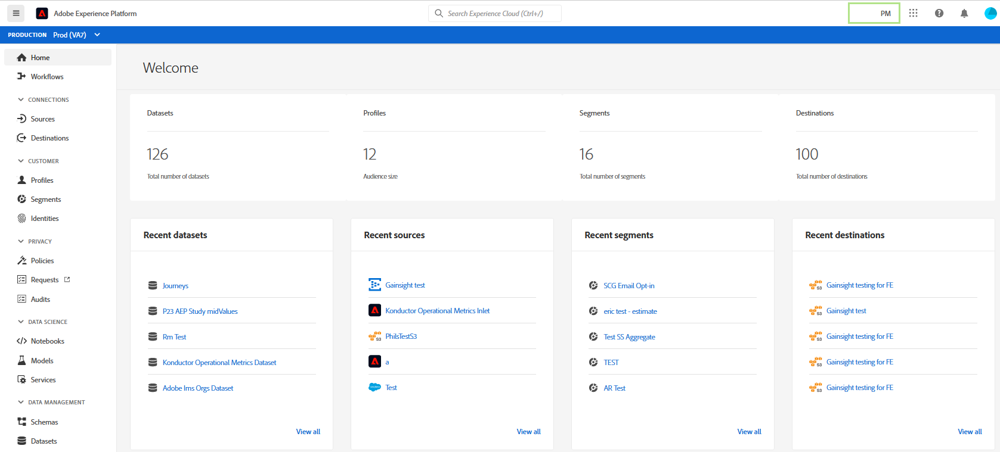

# Handleiding Adobe Experience Platform UI

Deze gids dient als inleiding aan het gebruiken van het gebruikersinterface van Adobe Experience Platform (UI), die verklaart wat de diverse componenten worden gebruikt voor en verbindingen verstrekt aan verdere documentatie voor meer informatie.

Lees het overzicht [van het](./home.md)Experience Platform voor meer informatie over Adobe Experience Platform.

## Startscherm

Nadat u zich hebt aangemeld bij Adobe Experience Platform, gaat u naar de pagina [!UICONTROL Home] , die bestaat uit het dashboard Metrics, de recente gegevens en de aanbevolen leersecties.

### Metrisch dashboard

Het dashboard van metriek verstrekt kaarten die u informatie over datasets, profielen, segmenten, en bestemmingen binnen uw organisatie geven.

De sectie **[!UICONTROL Datasets]** toont het aantal datasets binnen uw organisatie IMS. Dit aantal wordt bijgewerkt wanneer een nieuwe dataset wordt gecreeerd. Meer informatie over datasets kan in het overzicht [van](../catalog/datasets/overview.md)datasets worden gevonden.

In de sectie **[!UICONTROL Profielen]** wordt het totale aantal personen met profielen binnen uw IMS-organisatie weergegeven, exclusief profielfragmenten. Dit totale aantal personen vertegenwoordigt het totale adresseerbare publiek en wordt elke 24 uur bijgewerkt. Meer informatie over profielen vindt u in het overzicht [van het](../profile/home.md)realtime-klantprofiel.

In de sectie **[!UICONTROL Segmenten]** ziet u het totale aantal segmenten dat binnen uw IMS-organisatie is gemaakt. Dit aantal wordt bijgewerkt wanneer een nieuw segment wordt gecreeerd. Meer informatie over segmenten vindt u in het overzicht [van de](../segmentation/home.md)Segmenteringsservice.

De sectie **[!UICONTROL Doelen]** toont het totale aantal bestemmingen die voor de Organisatie IMS worden gecreeerd. Dit aantal wordt bijgewerkt wanneer een nieuwe bestemming wordt gecreeerd. Meer informatie over bestemmingen kan in het [bestemmingsoverzicht](../destinations/home.md)worden gevonden.

### Recente gegevens

Het recente gegevensdashboard verstrekt informatie over onlangs gecreeerde datasets, bronnen, segmenten, en bestemmingen.

De **[!UICONTROL Recente datasetsectie]** maakt een lijst van de vijf onlangs gecreeerde datasets binnen uw organisatie IMS. Deze lijst wordt bijgewerkt telkens als een nieuwe dataset wordt gecreeerd. U kunt een dataset van de lijst selecteren om meer informatie over de gespecificeerde dataset te bekijken of **[!UICONTROL Mening allen]** te selecteren om een lijst van alle gecreeerde datasets te zien. Meer informatie over datasets kan in het overzicht [van](../catalog/datasets/overview.md)datasets worden gevonden.

De **[!UICONTROL Recente bronsectie]** maakt een lijst van de vijf onlangs gecreeerde bronschakelaars binnen uw organisatie IMS. Deze lijst wordt bijgewerkt telkens als een nieuwe bronschakelaar wordt gecreeerd. U kunt een bronverbinding van de lijst selecteren om meer informatie over de gespecificeerde schakelaar te bekijken of allen **[!UICONTROL van de]** Mening selecteren om een lijst van alle gecreeerde bronverbindingen te zien. Meer informatie over bronnen vindt u in het overzicht [van](../sources/home.md)bronnen.

De **[!UICONTROL Recente segmentsectie]** maakt een lijst van de vijf onlangs gecreeerde segmentdefinities binnen uw IMS Organisatie. Deze lijst wordt bijgewerkt telkens als een nieuwe segmentdefinitie wordt gecreeerd. U kunt een segmentdefinitie van de lijst selecteren om meer informatie over de gespecificeerde segmentdefinitie te bekijken of **[!UICONTROL Mening allen]** selecteren om een lijst van alle gecreeerde segmentdefinities te zien. Meer informatie over segmenten vindt u in het overzicht [van de](../segmentation/home.md)Segmenteringsservice.

De **[!UICONTROL Recente bestemmingssectie]** maakt een lijst van de vijf onlangs gecreeerde bestemmingen binnen uw organisatie IMS. Deze lijst wordt bijgewerkt telkens wanneer een nieuwe bestemming wordt gecreeerd. U kunt een bestemming van de lijst selecteren om meer informatie over de gespecificeerde bestemming te bekijken of **[!UICONTROL Mening allen]** selecteren om een lijst van alle gecreeerde bestemmingen te zien. Meer informatie over bestemmingen kan in het [bestemmingsoverzicht](../destinations/home.md)worden gevonden.

### Aanbevolen training

In de sectie **[!UICONTROL Aanbevolen leren]** vindt u koppelingen naar handige documentatie om aan de slag te gaan met Adobe Experience Platform.

## Bovenste navigatiebalk

Op de bovenste navigatiebalk in de gebruikersinterface van het Platform wordt de IMS-organisatie weergegeven waarvoor u zich momenteel hebt aangemeld en zijn diverse belangrijke besturingselementen beschikbaar.

Links op de navigatiebalk bevindt zich het Adobe Experience Platform-logo. Als u deze optie selecteert, keert u terug naar het hoofdscherm van de gebruikersinterface van het Platform.

### IMS-organisatieschakelaar

Het eerste item aan de rechterkant van de navigatiebalk is de schakeloptie **IMS-organisatie**.

Als u de schakeloptie selecteert, wordt een vervolgkeuzemenu geopend met IMS-organisaties waartoe u toegang hebt, indien aanwezig. Selecteer een weergegeven optie om over te schakelen naar die IMS-organisatie.

### Overschakelen op toepassingen

Het volgende punt aan de rechterkant is de **toepassingsschakelaar**, die door het pictogram van de  wordt vertegenwoordigd. Wanneer u dit pictogram selecteert, kunt u schakelen tussen Experience Platform, Middelen, Uitwisseling en Lancering.

### Help

Rechts van de toepassingsschakelaar bevindt zich het **Help- en ondersteuningsmenu**, dat wordt weergegeven door het  -pictogram. Wanneer u dit pictogram selecteert, wordt een pop-upmenu weergegeven dat verschillende Help- en ondersteuningsbronnen bevat. Het tabblad **[!UICONTROL Help]** bevat een lijst met relevante documentatie voor de pagina die u momenteel hebt ingeschakeld. Op het tabblad **[!UICONTROL Ondersteuning]** kunt u een ondersteuningsticket maken met het ondersteuningsteam Adobe. Op het tabblad **[!UICONTROL Feedback]** kunt u feedback over Platform verzenden naar Adobe.

### Meldingen en aankondigingen

Nadat het menu Help en ondersteuning is ingesteld op de sectie **** Meldingen, die wordt weergegeven door het pictogram  . Het tabblad **[!UICONTROL Meldingen]** bevat belangrijke informatie over het product en andere relevante updates, terwijl op het tabblad **[!UICONTROL Aankondigingen]** meldingen over onderhoud van de service worden weergegeven.

### Gebruikersprofiel

Het laatste item op de bovenste navigatiebalk is de **gebruikersinstellingen**, die wordt weergegeven door het pictogram  . Selecteer dit pictogram om uw voorkeuren te bewerken of u af te melden.

### Sandboxen

Direct onder de bovenste navigatiebalk bevindt zich de sandboxbalk. Deze balk geeft aan welke sandbox u momenteel gebruikt voor Platform. Meer informatie over sandboxen vindt u in het overzicht [van de](../sandboxes/home.md)sandboxen.

## Linkernavigatie {#left-nav}

De navigatie op de linkerkant van het scherm maakt een lijst van alle verschillende diensten die in de UI van het Platform worden gesteund.

>[!IMPORTANT]
>
>Sommige secties op de linkernavigatiebalk worden mogelijk niet weergegeven of zijn grijs weergegeven. Dit komt omdat u geen toegang hebt tot deze functies. Neem contact op met de systeembeheerder als u van mening bent dat u toegang tot deze secties moet hebben.

In de sectie **[!UICONTROL Home]** kunt u terugkeren naar de startpagina van de gebruikersinterface van het Platform.

In de sectie **[!UICONTROL Workflows]** wordt een lijst weergegeven met uit meerdere stappen bestaande workflows voor het uitvoeren van bewerkingen binnen het Platform. Meer informatie over workflows vindt u in het overzicht [van](./workflows.md)workflows.

### [!UICONTROL Verbindingen]

Met de sectie **[!UICONTROL Bronnen]** kunt u bronverbindingen maken, bijwerken en verwijderen, zodat u gegevens van externe bronnen in Platform kunt invoeren. Meer informatie over bronnen vindt u in het overzicht [van](../sources/home.md)bronnen.

Met de sectie **[!UICONTROL Doelen]** kunt u doelen maken, bijwerken en verwijderen, zodat u gegevens van Platform kunt exporteren naar vele externe doelen. Meer informatie over bestemmingen kan in het [bestemmingsoverzicht](../destinations/home.md)worden gevonden.

### [!UICONTROL Klant]

In de sectie **[!UICONTROL Profielen]** kunt u door klantprofielen bladeren, profielmetriek bekijken, samenvoegbeleid maken en beheren en vakbondsschema&#39;s weergeven. Lees de [!UICONTROL gebruikershandleiding] voor meer informatie over het gebruik van de sectie [[!DNL Profile] Profielen](../profile/ui/user-guide.md). Meer informatie over het profiel van de Klant in real time kan in het overzicht [van het Profiel van de Klant in](../profile/home.md)real time worden gevonden.

Met de sectie **[!UICONTROL Segmenten]** kunt u segmentdefinities maken en beheren. Lees voor meer informatie over het gebruik van de sectie [!UICONTROL Segmenten] de gebruikershandleiding voor [segmentatie](../segmentation/ui/overview.md). Meer informatie over de Dienst van de Segmentatie kan in het overzicht [van de Dienst van de](../segmentation/home.md)Segmentatie worden gevonden.

In het gedeelte **[!UICONTROL Identiteiten]** kunt u naamruimten maken en beheren. Voor meer informatie over de sectie [!UICONTROL Identiteiten] , met inbegrip van informatie over identiteitsnaamruimten en hoe te om identiteiten in de UI van het Platform te gebruiken, gelieve te verwijzen naar het overzicht [van](../identity-service/namespaces.md)identiteitsnaamruimte.

### [!UICONTROL Privacy]

In de sectie **[!UICONTROL Beleid]** kunt u beleid voor gegevensgebruik maken en beheren. Lees voor meer informatie over het gebruik van de sectie Beleid de gebruikershandleiding voor het [gegevensgebruiksbeleid](../data-governance/policies/user-guide.md). Meer informatie over het beleid voor gegevensgebruik vindt u in het overzicht [van het beleid voor](../data-governance/policies/overview.md)gegevensgebruik.

In het gedeelte **[!UICONTROL Verzoeken]** kunt u privacyverzoeken maken en beheren. U moet zijn toegevoegd op lijst van gewenste personen om toegang te hebben tot de gebruikersinterface van de Privacy Service. Lees de gebruikershandleiding bij de [Privacy Service voor meer informatie over het gebruik van de sectie](../privacy-service/ui/user-guide.md)Verzoeken. Meer informatie over Privacy Service vindt u in het overzicht [van de](../privacy-service/home.md)Privacy Service.

### [!UICONTROL Gegevenswetenschap]

De sectie **[!UICONTROL Laptops]** biedt toegang tot JupyterLab, een interactieve ontwikkelomgeving waarmee u uw gegevens kunt verkennen, analyseren en modelleren. Lees voor meer informatie over het gebruik van de sectie Laptops de [JupyterLab-gebruikershandleiding](../data-science-workspace/jupyterlab/overview.md). Meer informatie over de Werkruimte van de Wetenschap van Gegevens kan in het Overzicht van de Werkruimte van de Wetenschap van [Gegevens worden gevonden](../data-science-workspace/home.md)

Met de sectie **[!UICONTROL Modellen]** kunt u computerleren en kunstmatige intelligentie gebruiken om modellen te maken, te ontwikkelen, te trainen en af te stemmen om voorspellingen te maken. Meer informatie over de sectie Modellen vindt u in de zelfstudie over [training en het evalueren van een model](../data-science-workspace/models-recipes/train-evaluate-model-ui.md).

De sectie van de **[!UICONTROL Diensten]** laat u uw gepubliceerde modellen voor geplande opleiding, of hefboomwerking Adobe Intelligente Diensten beheren AI, een reeks die real time, gepersonaliseerde klantenervaringen leveren. Meer informatie over de sectie van de Diensten kan in het [Publiceren van een Model als zelfstudie](../data-science-workspace/models-recipes/publish-model-service-ui.md)van de Dienst worden gevonden.

### [!UICONTROL Data management]

Met de sectie **[!UICONTROL Schema]** kunt u XDM-schema&#39;s (Experience Data Model) maken en beheren. Lees de zelfstudie over het [maken van een schema](../xdm/tutorials/create-schema-ui.md)voor meer informatie over schema&#39;s. Meer informatie over XDM vindt u in het [XDM-systeemoverzicht](../xdm/home.md).

Met de sectie **[!UICONTROL Datasets]** kunt u gegevenssets maken en beheren. Meer informatie over datasets kan in de de gebruikersgids [van](../catalog/datasets/user-guide.md)datasets worden gevonden.

Met de sectie **[!UICONTROL Query]** kunt u query&#39;s maken en beheren, SQL-query&#39;s van de Adobe Experience Platform Query Service registreren en uw PostSQL-referenties bekijken. Meer informatie over vragen kan in de de gebruikersgids [van de Dienst van de](../query-service/ui/overview.md)Vraag worden gevonden.

Met de sectie **[!UICONTROL Controle]** kunt u de opname van batches en streaming controleren. Meer informatie over controle kan in de de gebruikershandleiding [van de](../ingestion/quality/monitor-data-flows.md)controlegegevens worden gevonden.

### [!UICONTROL Beslissing]

Offer Decisioning is een toepassingsservice die is geïntegreerd met Adobe Experience Platform. Zo kunt u Experience Platform gebruiken om uw klanten de beste aanbieding en ervaring te bieden op alle aanraakpunten op het juiste moment. Meer informatie over Offer Decisioning, zoals het werken met [!UICONTROL aanbiedingen] en [!UICONTROL Activiteiten] , vindt u in de documentatie [van](https://experienceleague.adobe.com/docs/offer-decisioning.html)Offer Decisioning.

### [!UICONTROL Beheer]

De gebruikersinterface van het Platform (UI) verstrekt een dashboard waardoor u belangrijke informatie over het vergunningsgebruik van uw organisatie kunt bekijken, zoals die tijdens een dagelijkse momentopname wordt gevangen. U kunt dit doen door **[!UICONTROL Licentiegebruik]** te selecteren in de navigatie. Ga voor meer informatie over het dashboard voor licentiegebruik naar de handleiding voor het [gebruiksdashboard](license-usage-dashboard.md)voor licenties.

>[!IMPORTANT]
>
>De dashboardfunctionaliteit voor licentiegebruik bevindt zich momenteel in alfa en is niet beschikbaar voor alle gebruikers. De documentatie en de functionaliteit kunnen worden gewijzigd.

## Volgende stappen

Door deze gids te lezen, bent u nu geïntroduceerd aan de homepage en belangrijkste navigatie elementen van de Platform UI. Voor meer informatie over het werken in het gebruikersinterface, gelieve te verwijzen naar de documentatie voor elke individuele dienst van het Platform. Koppelingen naar deze documentatie vindt u in de [linkernavigatiesectie](#left-nav) die eerder in dit document is gevonden.