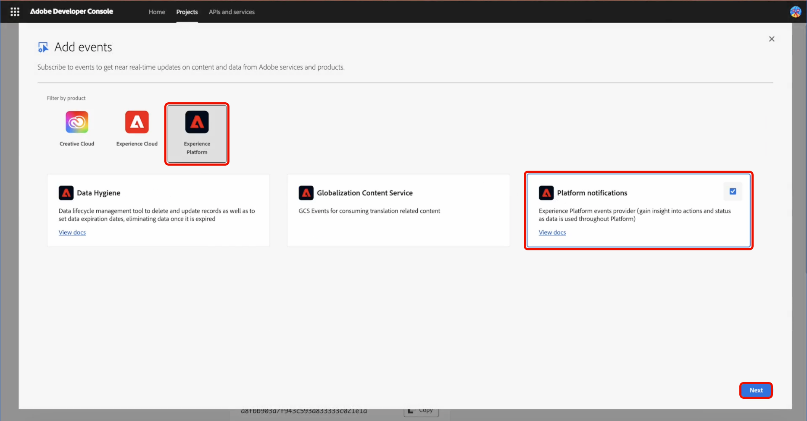
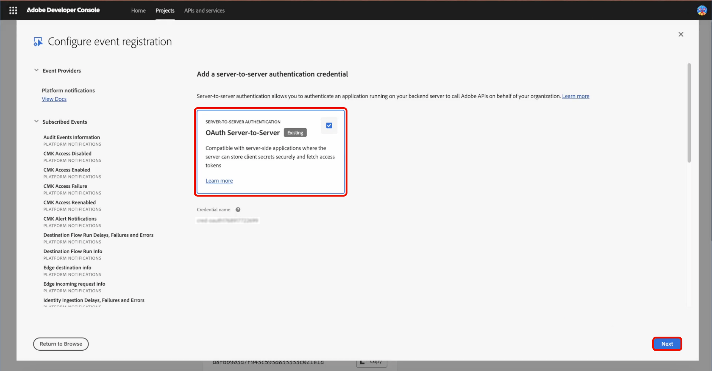

# Slack-integratie voor waarschuwingen voor klanten

Adobe Experience Platform staat u toe om een webshvolmacht op [&#x200B; Adobe App Builder &#x200B;](https://developer.adobe.com/app-builder/docs/get_started/app_builder_get_started/first-app) te gebruiken om [&#x200B; Adobe I/O Events &#x200B;](https://developer.adobe.com/events/docs/guides/) in [!DNL Slack] te ontvangen. De proxy handelt de verificatiehandshake van Adobe af en zet de gebeurtenislading om in [!DNL Slack] -berichten, zodat u klantgerichte waarschuwingen kunt ontvangen die aan uw werkruimte worden geleverd.

## Vereisten {#prerequisites}

Zorg ervoor dat u het volgende hebt voordat u begint:

* **toegang van Adobe Developer Console**: Een rol van Admin of van de Ontwikkelaar van het Systeem in een organisatie met toegelaten App Builder.
* **Node.js en npm**: Node.js (Aanbevolen LTS), die npm voor het installeren van Adobe CLI en projectgebiedsdelen omvat. Voor meer informatie, zie [&#x200B; Download Node.js &#x200B;](https://nodejs.org/) en [&#x200B; npm Begonnen gids &#x200B;](https://docs.npmjs.com/getting-started).
* **Adobe I/O CLI**: Installeer Adobe I/O CLI van uw terminal: `npm install -g @adobe/aio-cli`.
* **app van Slack met Binnenkomende WebHaak**: Een toepassing van Slack in uw werkruimte met **toegelaten Binnenkomende Webhaak**. Zie [&#x200B; een Slack app &#x200B;](https://api.slack.com/apps) en [&#x200B; Slack Inkomende gids Webhooks &#x200B;](https://api.slack.com/messaging/webhooks) creëren om app tot stand te brengen en Web-haak URL (formaat: `https://hooks.slack.com/...`) te verkrijgen.

## Een sjabloonproject instellen {#templated-project}

Als u een sjabloonproject wilt instellen, meldt u zich aan bij de Adobe Developer Console en selecteert u **[!UICONTROL Create project from template]** op het tabblad **[!UICONTROL Home]** .


Selecteer de sjabloon **[!UICONTROL App Builder]** , voer een **[!UICONTROL Project Title]** in en selecteer **[!UICONTROL Add workspace]** . Selecteer ten slotte **[!UICONTROL Save]** .


U ontvangt een bevestiging dat uw project is gemaakt en naar het tabblad **[!UICONTROL Project overview]** wordt doorgestuurd. Hier kunt u een **[!UICONTROL Project description]** toevoegen.


## Project initialiseren {#initialize-project}

Nadat u de proefprojectinstelling hebt ingesteld, initialiseert u het project.

1. Open de terminal en voer de volgende opdracht in om u aan te melden bij Adobe I/O.

   ```bash
   aio login
   ```

1. Initialiseer de toepassing en geef een naam op.

   ```bash
   aio app init slack-webhook-proxy
   ```

1. Selecteer uw `Organization` met de pijltoetsen en selecteer vervolgens de `Project` die u eerder in de Developer Console hebt gemaakt. Selecteer `Only Templates Supported By My Org` voor de sjablonen die u wilt zoeken.

   

1. Daarna, druk **binnengaan** om malplaatjes over te slaan en een standalone toepassing te installeren.

   

1. Geef de Adobe I/O App-functies op die u voor dit project wilt inschakelen. Gebruik de pijltoetsen om te schuiven en `Actions: Deploy Runtime actions` te selecteren.

   

1. Gebruik de pijltoetsen om te schuiven en selecteer `Adobe Experience Platform: Realtime Customer Profile` voor het type voorbeeldacties dat u wilt maken.

   

1. Schuif en selecteer `Pure HTML/JS` voor de gebruikersinterface die u aan de sjabloon wilt toevoegen. De pers **gaat** binnen om de steekproefacties als gebrek te verlaten, dan **gaat** opnieuw in om de naam als gebrek te verlaten.

   

   U ontvangt een bevestiging dat de initialisatie van de app is voltooid.

1. Navigeer naar de projectmap.

   ```bash
   cd slack-webhook-proxy
   ```

1. Voeg de webactie toe.

   ```bash
   aio app add action
   ```

1. Selecteer `Only Action Templates Supported By My Org`. Er wordt een lijst met sjablonen weergegeven.

   

1. Selecteer het malplaatje door spacebar te drukken, dan aan `@adobe/generator-add-publish-events` te navigeren gebruikend uw **Omhoog** en **onderaan** pijlen. Tot slot selecteer het malplaatje door **Spacebar** te drukken en **te drukken gaat** binnen.

   

   Er wordt een bevestiging weergegeven dat `npm package @adobe/generator-add-publish-events` is geïnstalleerd.

1. Geef de handeling een naam `webhook-proxy` .

   

   Er wordt een bevestiging weergegeven dat de sjabloon is geïnstalleerd.

## Maak de bestandsacties en implementeer {#create-file-actions}

Voeg de volmachtscode toe, plaats milieuvariabelen, en stel dan op. De actie is dan beschikbaar in de Developer Console voor registratie.

### De runtime-proxy implementeren {#runtime-proxy}

>[!NOTE]
>
>Handtekeningverificatie en probleemverwerking zijn automatisch wanneer u de registratie van runtimeacties gebruikt.

Navigeer naar de projectmap en open het bestand `actions/webhook-proxy/index.js` . Verwijder de inhoud en vervang deze door:

```
const fetch = require("node-fetch");
const { Core } = require("@adobe/aio-sdk");
 
/**
 * Adobe I/O Events to Slack Runtime Proxy
 *
 * Receives events from Adobe I/O Events and forwards them to Slack.
 * Signature verification and challenge handling are automatic when
 * using Runtime Action registration (non-web action).
 */
async function main(params) {
  const logger = Core.Logger("runtime-proxy", { level: params.LOG_LEVEL || "info" });
 
  try {
    logger.info(`Event received: ${JSON.stringify(params)}`);
 
    // Forward to Slack
    return forwardToSlack(params, params.SLACK_WEBHOOK_URL, logger);
 
  } catch (error) {
    logger.error(`Error: ${error.message}`);
    return { statusCode: 500, body: { error: "Internal server error" } };
  }
}
 
/**
 * Forwards the event payload to Slack
 */
async function forwardToSlack(payload, webhookUrl, logger) {
  if (!webhookUrl) {
    logger.error("SLACK_WEBHOOK_URL not configured");
    return { statusCode: 500, body: { error: "Server configuration error" } };
  }
 
  // Extract Adobe headers passed to runtime action
  const headers = {
    "x-adobe-event-code": payload["x-adobe-event-code"],
    "x-adobe-event-id": payload["x-adobe-event-id"],
    "x-adobe-provider": payload["x-adobe-provider"]
  };
 
  const slackMessage = buildSlackMessage(payload, headers);
 
  const response = await fetch(webhookUrl, {
    method: "POST",
    headers: { "Content-Type": "application/json" },
    body: JSON.stringify(slackMessage)
  });
 
  if (!response.ok) {
    const errorText = await response.text();
    logger.error(`Slack API error: ${response.status} - ${errorText}`);
    return { statusCode: response.status, body: { error: errorText } };
  }
 
  logger.info("Event forwarded to Slack");
  return { statusCode: 200, body: { success: true } };
}
 
/**
 * Builds a Slack Block Kit message from the event payload
 */
function buildSlackMessage(payload, headers) {
  // Adobe passes event code as x-adobe-event-code header (available in params for runtime actions)
  const eventType = headers["x-adobe-event-code"] ||
                    payload["x-adobe-event-code"] ||
                    payload.event_code ||
                    payload.type ||
                    payload.event_type ||
                    "Adobe Event";
  const eventId = headers["x-adobe-event-id"] || payload["x-adobe-event-id"] || payload.event_id || payload.id || "N/A";
  const eventData = payload.data || payload.event || payload;
 
  return {
    blocks: [
      {
        type: "header",
        text: { type: "plain_text", text: `Event: ${eventType}`, emoji: true }
      },
      {
        type: "section",
        fields: formatDataFields(eventData)
      },
      { type: "divider" },
      {
        type: "context",
        elements: [{
          type: "mrkdwn",
          text: `*Event ID:* ${eventId}  |  *Time:* ${new Date().toISOString()}`
        }]
      }
    ]
  };
}
 
/**
 * Formats event data as Slack mrkdwn fields
 */
function formatDataFields(data, maxFields = 10) {
  if (typeof data !== "object" || data === null) {
    return [{ type: "mrkdwn", text: `*Payload:*\n${String(data)}` }];
  }
 
  const entries = Object.entries(data);
  if (entries.length === 0) {
    return [{ type: "mrkdwn", text: "_No data provided_" }];
  }
 
  return entries.slice(0, maxFields).map(([key, value]) => ({
    type: "mrkdwn",
    text: `*${key}:*\n${typeof value === "object" ? `\`\`\`${JSON.stringify(value)}\`\`\`` : value}`
  }));
}
 
exports.main = main;
```

### De handeling configureren in app.config.yaml {#app-config}

>[!IMPORTANT]
>
>De actieconfiguratie in `app.config.yaml` is essentieel. U moet `web: no` gebruiken om een niet-webactie te maken die als een Runtime-actie in de Developer Console kan worden geregistreerd.

Navigeer naar de projectmap en open `app.config.yaml` . Vervang de inhoud door het volgende:

```
application:
  runtimeManifest:
    packages:
      slack-webhook-proxy:
        license: Apache-2.0
        actions:
          webhook-proxy:
            function: actions/webhook-proxy/index.js
            web: no
            runtime: nodejs:22
            inputs:
              LOG_LEVEL: info
              SLACK_WEBHOOK_URL: $SLACK_WEBHOOK_URL
            annotations:
              require-adobe-auth: false
              final: true
```

### Omgevingsvariabelen {#environment-variables}

>[!IMPORTANT]
>
>De toepassing wordt niet uitgevoerd zonder een correct geconfigureerd .env-bestand.

Gebruik omgevingsvariabelen om referenties veilig te beheren. Wijzig het bestand `.env` in de hoofdmap van het project en voeg het volgende toe:

```
SLACK_WEBHOOK_URL=https://hooks.slack.com/services/YOUR/WEBHOOK/URL
```

### De handeling implementeren {#deploy-action}

Zodra de milieuvariabelen worden geplaatst, stel de actie op. Zorg ervoor u in de wortel van uw project (`slack-webhook-proxy`) bent wanneer u dit bevel in de terminal in werking stelt:

```bash
aio app deploy
```

Een bevestiging dat de plaatsing succesvol was wordt getoond.

>[!IMPORTANT]
>
>Je actie wordt uitgevoerd naar Adobe I/O Runtime. De actie is nu beschikbaar in de Developer Console voor registratie.

## De handeling registreren met Adobe I/O Events {#register-events}

Wanneer uw handeling is geïmplementeerd, registreert u deze als de bestemming voor Adobe I/O Events.

Open in de Developer Console uw App Builder-project en selecteer vervolgens uw **[!UICONTROL Workspace]** .

Selecteer **[!UICONTROL Add service]** en **[!UICONTROL Event]** op de overzichtspagina van Workspace.


Selecteer op de pagina Gebeurtenissen toevoegen **[!UICONTROL Experience Platform]** en **[!UICONTROL Platform notifications]** en selecteer vervolgens **[!UICONTROL Next]** .



Selecteer de gebeurtenissen waarvoor u meldingen wilt ontvangen en selecteer vervolgens **[!UICONTROL Next]** .


Selecteer de verificatiereferentie server-naar-server en selecteer vervolgens **[!UICONTROL Next]** .



Voer een **[!UICONTROL Event registration name]** en een spatie **[!UICONTROL Event registration description]** in voor de registratie en selecteer vervolgens **[!UICONTROL Next]** .


Selecteer **[!UICONTROL Runtime Action]** als de leveringsmethode en de `slack-webhook-proxy/runtime-proxy` actie die u hebt gemaakt en selecteer vervolgens **[!UICONTROL Save configured events]** .


Uw webhaakproxy is nu geconfigureerd. U bent teruggekeerd aan de WebHaakvolmachtspagina. U kunt de volledige stroom van begin tot eind testen door het **[!UICONTROL Send sample event]** pictogram naast om het even welke gevormde gebeurtenis te selecteren.


