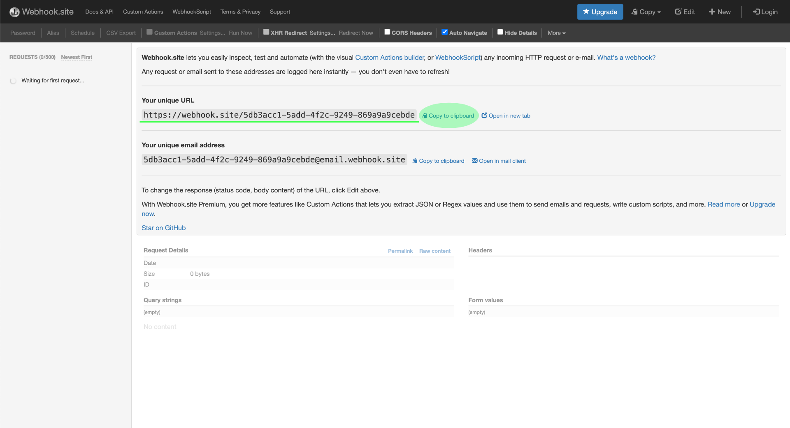
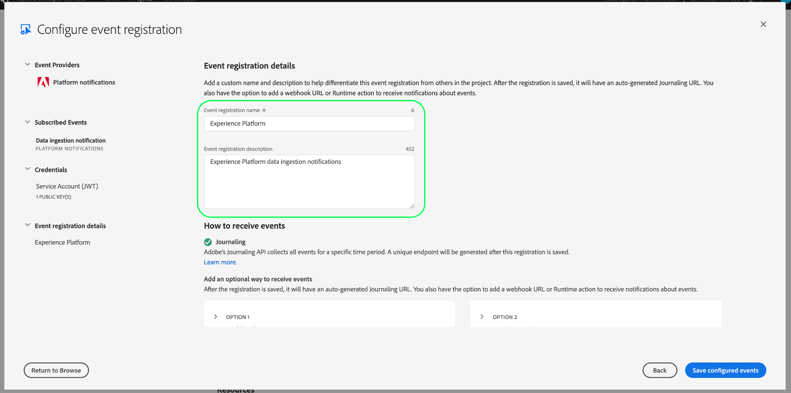

# Abonneren op Adobe I/O-gebeurtenismeldingen

[!DNL Observability Insights] Hiermee kunt u zich abonneren op Adobe I/O Event-meldingen met betrekking tot Adobe Experience Platform-activiteiten. Deze gebeurtenissen worden naar een geconfigureerde webhaak verzonden om een efficiënte automatisering van de bewaking van activiteiten te vergemakkelijken.

Dit document bevat stappen voor het abonneren op Adobe I/O-gebeurtenismeldingen voor Adobe Experience Platform-services. Er wordt ook referentieinformatie over de beschikbare gebeurtenistypen gegeven, samen met koppelingen naar verdere documentatie over hoe de geretourneerde gebeurtenisgegevens voor elke toepasselijke gebeurtenis moeten worden geïnterpreteerd. [!DNL Platform] service.

## Aan de slag

Dit document vereist een goed begrip van webhaken en hoe te om een webhaak van één toepassing aan een andere aan te sluiten. Zie de [[!DNL I/O Events] documentatie](https://www.adobe.io/apis/experienceplatform/events/docs.html#!adobedocs/adobeio-events/master/intro/webhook_docs_intro.md) voor een inleiding tot webhaken.

## Webhaak maken

Om [!DNL I/O Event] moet u een webhaak registreren door een unieke URL voor een webhaak op te geven als onderdeel van de gegevens voor gebeurtenisregistratie.

U kunt uw webhaak configureren met behulp van de client van uw keuze. Voor een tijdelijk adres van de webhaak dat als deel van dit leerprogramma moet worden gebruikt, bezoek [Webhaak.site](https://webhook.site/) en kopieer de opgegeven unieke URL.

Tijdens het eerste validatieproces [!DNL I/O Events] verzendt `challenge` de vraagparameter in een verzoek van de GET aan de webhaak. U moet uw webhaak vormen om de waarde van deze parameter in de antwoordlading terug te keren. Selecteer **[!DNL Edit]** in de rechterbovenhoek en voert u vervolgens `$request.query.challenge$` krachtens **[!DNL Response body]** voordat u selecteert **[!DNL Save]**.

## Nieuw project maken in Adobe Developer Console

Ga naar [Adobe Developer Console](https://www.adobe.com/go/devs_console_ui) en meld u aan met uw Adobe ID. Voer vervolgens de stappen uit die in de zelfstudie worden beschreven [een leeg project maken](https://www.adobe.io/apis/experienceplatform/console/docs.html#!AdobeDocs/adobeio-console/master/projects-empty.md) in de documentatie van de Adobe Developer Console.

## Abonneren op gebeurtenissen

Nadat u een nieuw project hebt gemaakt, navigeert u naar het overzichtsscherm van dat project. Selecteer **[!UICONTROL Add event]**.

Er wordt een dialoogvenster weergegeven waarin u een gebeurtenisprovider kunt toevoegen aan uw project:

* Als u zich abonneert op waarschuwingen over Experience Platforms, selecteert u **[!UICONTROL Platform notifications]**
* Als je je abonneert op Adobe Experience Platform [!DNL Privacy Service] meldingen, selecteren **[!UICONTROL Privacy Service Events]**

Nadat u een gebeurtenisprovider hebt gekozen, selecteert u **[!UICONTROL Next]**.

In het volgende scherm wordt een lijst weergegeven met gebeurtenistypen waarop u zich wilt abonneren. Selecteer de gebeurtenissen waarop u zich wilt abonneren en selecteer vervolgens **[!UICONTROL Next]**.

>[!NOTE]
>
>Raadpleeg de volgende documentatie als u niet zeker weet op welke gebeurtenissen u zich moet abonneren voor de service waarmee u werkt:
>
>* [Meldingen van Platforms](./rules.md)
>* [Privacys Service](../../privacy-service/privacy-events.md)

In het volgende scherm wordt u gevraagd een JSON Web Token (JWT) te maken. U wordt gegeven de optie om een zeer belangrijk paar automatisch te produceren, of uw eigen openbare sleutel te uploaden die in de terminal wordt geproduceerd.

In deze zelfstudie wordt de eerste optie gevolgd. Selecteer het optievak voor **[!UICONTROL Generate a key pair]** Selecteer vervolgens de **[!UICONTROL Generate keypair]** in de rechterbenedenhoek.

Wanneer het sleutelpaar produceert, wordt het automatisch gedownload door browser. U moet dit bestand zelf opslaan omdat het niet wordt voortgezet in de Developer Console.

In het volgende scherm kunt u de details van het nieuwe sleutelpaar bekijken. Selecteren **[!UICONTROL Next]** om door te gaan.

Geef in het volgende scherm een naam en beschrijving voor de gebeurtenisregistratie op in het dialoogvenster [!UICONTROL Event registration details] sectie. De beste manier is om een unieke, gemakkelijk identificeerbare naam te maken om deze gebeurtenisregistratie te onderscheiden van andere registraties voor hetzelfde project.

Verder omlaag op hetzelfde scherm onder [!UICONTROL How to receive events] kunt u desgewenst configureren hoe gebeurtenissen moeten worden ontvangen. **[!UICONTROL Webhook]** kunt u een aangepast webhaadres opgeven om gebeurtenissen te ontvangen, terwijl **[!UICONTROL Runtime action]** kunt u hetzelfde doen met [Adobe I/O Runtime](https://www.adobe.io/apis/experienceplatform/runtime/docs.html).

Voor deze zelfstudie selecteert u **[!UICONTROL Webhook]** en geef de URL op van de webhaak die u eerder hebt gemaakt. Als u klaar bent, selecteert u **[!UICONTROL Save configured events]** om de gebeurtenisregistratie te voltooien.

De detailspagina voor de pas gecreëerde gebeurtenisregistratie verschijnt, waar u zijn configuratie kunt uitgeven, ontvangen gebeurtenissen herzien, zuivert het vinden uitvoeren, en nieuwe gebeurtenisleveranciers toevoegen.

## Volgende stappen

Door deze zelfstudie te volgen, hebt u een webhaak geregistreerd die u kunt ontvangen [!DNL I/O Event] meldingen voor [!DNL Experience Platform] en/of [!DNL Privacy Service]. Raadpleeg de volgende documentatie voor meer informatie over beschikbare gebeurtenissen en hoe u berichtladingen voor elke service kunt interpreteren:

* [[!DNL Privacy Service] meldingen](../../privacy-service/privacy-events.md)
* [[!DNL Data Ingestion] meldingen](../../ingestion/quality/subscribe-events.md)
* [[!DNL Flow Service] (bronnen) meldingen](../../sources/notifications.md)

Zie de [[!DNL Observability Insights] overzicht](../home.md) voor meer informatie over hoe u uw activiteiten kunt controleren op [!DNL Experience Platform] en [!DNL Privacy Service].
