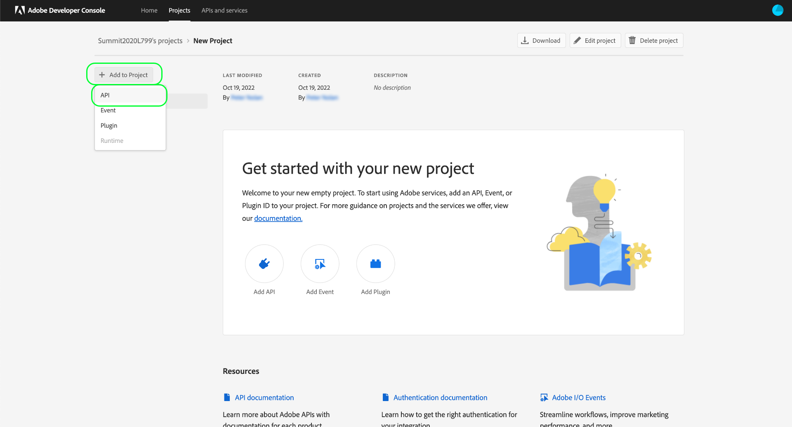
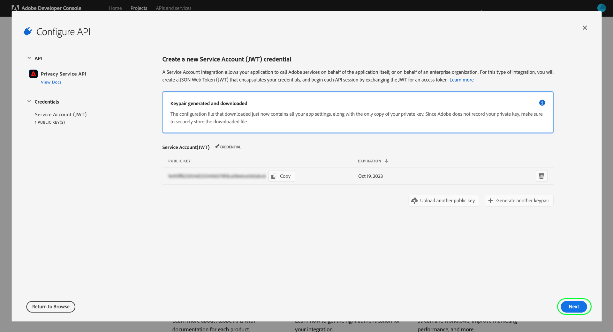

# Handleiding voor ontwikkelaars van Privacys Service

Adobe Experience Platform Privacy Service biedt een RESTful-API en -gebruikersinterface waarmee u de persoonlijke gegevens van uw betrokkenen (klanten) in alle Adobe Experience Cloud-toepassingen kunt beheren (openen en verwijderen). Privacy Service biedt ook een centraal audit- en logboekmechanisme waarmee u toegang krijgt tot de status en resultaten van taken waarbij Experience Cloud-toepassingen betrokken zijn.

In deze handleiding wordt uitgelegd hoe u de Privacy Service-API kunt gebruiken. Zie het overzicht [van de gebruikersinterface van de](../ui/overview.md)Privacy Service voor meer informatie over het gebruik van de gebruikersinterface. Raadpleeg de [API-naslaggids](https://www.adobe.io/apis/experiencecloud/gdpr/api-reference.html)voor een uitgebreide lijst met alle beschikbare eindpunten in de Privacy Service-API.

## Aan de slag

Deze handleiding vereist een goed begrip van de volgende functies van het Experience Platform:

* [Privacy Service](../home.md): Biedt een RESTful-API en -gebruikersinterface waarmee u toegang kunt beheren en aanvragen van uw betrokkenen (klanten) kunt verwijderen voor alle Adobe Experience Cloud-toepassingen.

De volgende secties verstrekken extra informatie die u zult moeten weten om met succes vraag aan Privacy Service API te maken.

### API-voorbeeldaanroepen lezen

Deze zelfstudie biedt voorbeeld-API-aanroepen om aan te tonen hoe uw verzoeken moeten worden opgemaakt. Dit zijn paden, vereiste kopteksten en correct opgemaakte ladingen voor aanvragen. Voorbeeld-JSON die wordt geretourneerd in API-reacties, wordt ook verschaft. Voor informatie over de overeenkomsten die in documentatie voor steekproefAPI vraag worden gebruikt, zie de sectie over [hoe te om voorbeeldAPI vraag](../../landing/troubleshooting.md) in de het oplossen van problemengids van het Experience Platform te lezen.

## Waarden verzamelen voor vereiste koppen

Om vraag aan Privacy Service API te maken, moet u uw toegangsgeloofsbrieven eerst verzamelen die in vereiste kopballen moeten worden gebruikt:

* Autorisatie: Drager `{ACCESS_TOKEN}`
* x-api-key: `{API_KEY}`
* x-gw-ims-org-id: `{IMS_ORG}`

Hiervoor moeten ontwikkelaarsmachtigingen voor Experience Platform worden verkregen in de Adobe Admin Console en moeten de gegevens vervolgens worden gegenereerd in Adobe Developer Console.

### Toegang tot Experience Platform voor ontwikkelaars

Om ontwikkelaarstoegang tot Platform te verkrijgen, volg de eerste stappen in het [Experience Platform authentificatieleerprogramma](../../tutorials/authentication.md). Wanneer u de stap &#39;Toegangsgegevens genereren in Adobe Developer Console&#39; hebt bereikt, gaat u terug naar deze zelfstudie om de referenties te genereren die specifiek zijn voor de Privacy Service.

### Toegangsreferenties genereren

Met Adobe Developer Console moet u de volgende drie toegangsreferenties genereren:

* `{IMS_ORG}`
* `{API_KEY}`
* `{ACCESS_TOKEN}`

Uw `{IMS_ORG}` en `{API_KEY}` hoeven slechts eenmaal te worden gegenereerd en kunnen in toekomstige API-aanroepen opnieuw worden gebruikt. Uw `{ACCESS_TOKEN}` is echter tijdelijk en moet elke 24 uur opnieuw worden gegenereerd.

De stappen voor het genereren van deze waarden worden hieronder in detail besproken.

#### Eenmalige installatie

Ga naar [Adobe Developer Console](https://www.adobe.com/go/devs_console_ui) en meld u aan met uw Adobe ID. Voer vervolgens de stappen uit die worden beschreven in de zelfstudie over het [maken van een leeg project](https://www.adobe.io/apis/experienceplatform/console/docs.html#!AdobeDocs/adobeio-console/master/projects-empty.md) in de documentatie van de Adobe Developer Console.

Nadat u een nieuw project hebt gemaakt, klikt u op API **** toevoegen in het scherm _[!UICONTROL Projectoverzicht]_.

Het scherm _[!UICONTROL Een API]_toevoegen wordt weergegeven. Selecteer**[!UICONTROL  Privacy Service-API ]**in de lijst met beschikbare API&#39;s voordat u op**[!UICONTROL  Volgende ]**klikt.

Het scherm _[!UICONTROL Configure API]_verschijnt. Selecteer de optie om een sleutelpaar**[!UICONTROL  te ]**produceren, dan klik**[!UICONTROL  produceer sleutelpaar ]**in de bodem-juiste hoek.

Het sleutelpaar wordt automatisch geproduceerd, en een dossier van het ZIP dat een privé sleutel en een openbaar certificaat bevat wordt gedownload aan uw lokale machine (die in een recentere stap moet worden gebruikt). Selecteer **[!UICONTROL gevormde API]** opslaan om de configuratie te voltooien.

Zodra API aan het project is toegevoegd, verschijnt de projectpagina opnieuw op de _Privacy Service API overzichtspagina_ . Van hier, scrol neer aan de sectie van de Rekening van de _[!UICONTROL Dienst (JWT)]_, die de volgende toegangsgeloofsbrieven verstrekt die in alle vraag aan Privacy Service API worden vereist:

* **[!UICONTROL CLIENT-ID]**: De client-id is de vereiste `{API_KEY}` voor die id die moet worden opgegeven in de header x-api-key.
* **[!UICONTROL ORGANISATIE-ID]**: De organisatie-id is de `{IMS_ORG}` waarde die moet worden gebruikt in de header x-gw-ims-org-id.

#### Verificatie voor elke sessie

De laatste vereiste referentie die u moet verzamelen, is uw `{ACCESS_TOKEN}`, die wordt gebruikt in de machtigingheader. In tegenstelling tot de waarden voor `{API_KEY}` en `{IMS_ORG}`, moet om de 24 uur een nieuw token worden gegenereerd om door te gaan met het gebruik van Platform-API&#39;s.

Als u een nieuwe sleutel wilt genereren, opent u de eerder gedownloade persoonlijke sleutel en plakt u de inhoud ervan in het tekstvak naast Toegangstoken `{ACCESS_TOKEN}`_[!UICONTROL genereren voordat u op Token]_****genereren klikt.

Er wordt een nieuw toegangstoken gegenereerd en er wordt een knop opgegeven waarmee het token naar het klembord kan worden gekopieerd. Deze waarde wordt gebruikt voor de vereiste kopbal van de Vergunning, en moet in het formaat worden verstrekt `Bearer {ACCESS_TOKEN}`.

## Volgende stappen

Nu u begrijpt welke kopballen aan gebruik, bent u bereid beginnen het maken vraag aan Privacy Service API. Het document over [privacytaken](privacy-jobs.md) doorloopt de verschillende API-aanroepen die u met de Privacy Service-API kunt maken. Elke voorbeeldvraag omvat het algemene API formaat, een steekproefverzoek die vereiste kopballen toont, en een steekproefreactie.
