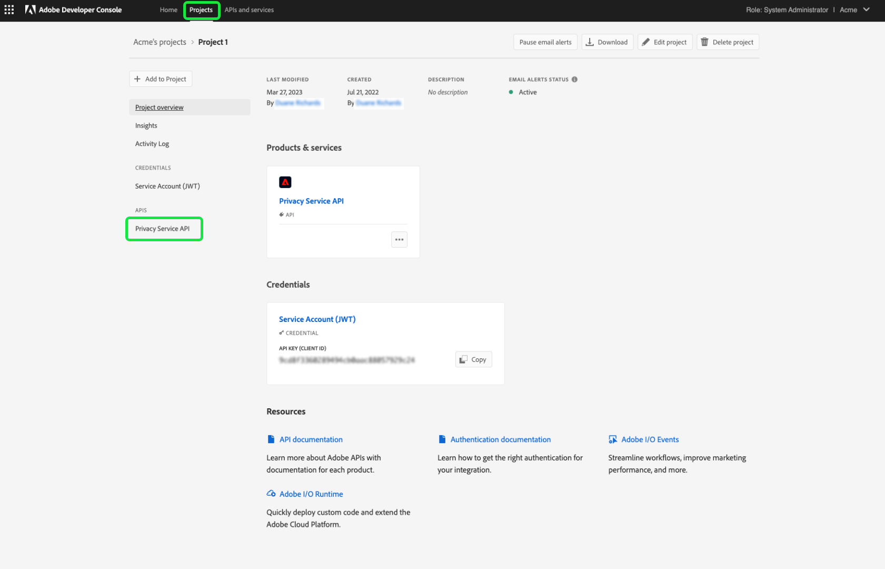

# Machtigingen voor Privacy Service beheren

De toegang tot [&#x200B; Adobe Experience Platform Privacy Service &#x200B;](./home.md) wordt gecontroleerd door granulaire op rol-gebaseerde toestemmingen in Adobe Admin Console. Door productprofielen tot stand te brengen die toestemmingen aan groepen gebruikers toewijzen, kunt u bepalen wie toegang heeft tot welke eigenschappen in de Privacy Service [&#x200B; UI &#x200B;](./ui/overview.md) en [&#x200B; API &#x200B;](./api/overview.md).

>[!NOTE]
>
>Wanneer u een integratie maakt voor de Privacy Service-API, moet u een bestaand productprofiel selecteren om te bepalen voor welke functies of handelingen integratiemachtigingen gelden. Zie de gids op [&#x200B; begonnen worden met de Privacy Service API &#x200B;](./api/getting-started.md) voor meer informatie.

In deze handleiding ziet u hoe u machtigingen voor Privacy Service beheert.

## Aan de slag

Om toegangsbeheer voor Privacy Service te vormen, moet u beheerdervoorrechten voor een organisatie hebben die een productintegratie met Adobe Experience Platform Privacy Service heeft. De minimumrol die toestemmingen kan verlenen of terugtrekken is de beheerder van het a **productprofiel**. Andere beheerderrollen die toestemmingen kunnen beheren zijn **productbeheerders** (kan alle profielen binnen een product beheren) en **systeembeheerders** (geen beperkingen). Zie het artikel op [&#x200B; administratieve rollen &#x200B;](https://helpx.adobe.com/nl/enterprise/using/admin-roles.html) in de het beleidsgids van de Onderneming van de Adobe voor meer informatie.

Deze gids veronderstelt u vertrouwd met basisconcepten van de Admin Console zoals productprofielen en hoe zij producttoestemmingen aan individuele gebruikers en groepen verlenen. Voor meer informatie, zie de [&#x200B; gebruikersgids van de Admin Console &#x200B;](https://helpx.adobe.com/nl/enterprise/using/admin-console.html).

## Beschikbare machtigingen

De volgende lijst schetst de beschikbare toestemmingen voor Privacy Service met beschrijvingen van de specifieke mogelijkheden die zij toegang verlenen tot:

>[!NOTE]
>
>Alle Privacy Service- en [!UICONTROL Opt Out of Sale] -machtigingen zijn gescheiden en gescheiden van elkaar, zonder functionele overlapping. Dit is mogelijk omdat de Privacy Service-API als een epidemie wordt beschouwd.

| Categorie | Machtiging | Beschrijving |
| --- | --- | --- |
| [!UICONTROL Privacy Service Permissions] | [!UICONTROL Privacy Read Permission] | Bepaalt of de gebruiker bestaande toegang en schrappingsverzoeken, samen met hun details kan bekijken. |
| [!UICONTROL Privacy Service Permissions] | [!UICONTROL Privacy Write Permission] | Hiermee wordt bepaald of een gebruiker nieuwe toegangs- en verwijderverzoeken kan maken. |
| [!UICONTROL Privacy Service Permissions] | [!UICONTROL Read (Access) Content Delivery Permission] | Wanneer een toegangsverzoek door Privacy Service wordt verwerkt, wordt een dossier van het PIT die de gegevens van de klant bevat verzonden naar die klant. Wanneer het omhoog zoeken van de details van een toegangsverzoek, bepaalt deze toestemming of de gebruiker tot de downloadverbinding voor het dossier van het ZIP van het verzoek kan toegang hebben. |
| [!UICONTROL Opt Out of Sale Permissions] | [!UICONTROL Read Permission - Opt Out of Sale] | Bepaalt of de gebruiker bestaande opt-out-of-sales verzoeken, samen met hun details kan bekijken. |
| [!UICONTROL Opt Out of Sale Permissions] | [!UICONTROL Write Permission - Opt Out of Sale] | Bepaalt of een gebruiker nieuwe opt-out-of-verkoop verzoeken kan tot stand brengen. |

{style="table-layout:auto"}

## Machtigingen beheren {#manage}

Om de toestemmingen van de Privacy Service te beheren, login aan [&#x200B; Admin Console &#x200B;](https://adminconsole.adobe.com/) en selecteer **[!UICONTROL Products]** van de hoogste navigatie. Selecteer **[!UICONTROL Adobe Experience Platform Privacy Service]** van hier.

### Een productprofiel selecteren of maken

In het volgende scherm ziet u een lijst met beschikbare productprofielen voor Privacy Service onder uw organisatie. Als er geen productprofielen bestaan, selecteert u **[!UICONTROL New Profile]** om een profiel te maken. Als u veelvoudige rollen of gebruikersgroepen in uw organisatie hebt die verschillende niveaus van toegang vereisen, zou u een afzonderlijk productprofiel voor elk van hen moeten creëren.

Na het selecteren van een productprofiel, kunt u het **[!UICONTROL Permissions]** lusje gebruiken om [&#x200B; het uitgeven toestemmingen &#x200B;](#edit-permissions) voor het profiel te beginnen, of het **[!UICONTROL Users]** lusje te selecteren [&#x200B; toewijzend gebruikers &#x200B;](#assign-users) aan het profiel.

### Machtigingen voor het profiel bewerken {#edit-permissions}

Selecteer op het tabblad **[!UICONTROL Permissions]** een van de weergegeven machtigingscategorieën voor toegang tot de weergave voor bewerken van machtigingen.

Wanneer u machtigingen voor een profiel bewerkt, worden in de linkerkolom de beschikbare machtigingen vermeld, terwijl de machtigingen die in het profiel zijn opgenomen in de rechterkolom worden weergegeven. Selecteer de vermelde toestemmingen om hen tussen één van beide kolom te bewegen.

Machtigingen zijn ingedeeld in categorieën. Als u wilt schakelen tussen categorieën, selecteert u de gewenste categorie in de linkernavigatie.

![&#x200B; de [!UICONTROL Opt Out of Sale] sectie onder toestemmingen.](./images/permissions/switch-category.png)

Selecteer **[!UICONTROL Save]** nadat u de machtigingen hebt geconfigureerd.

De weergave van het productprofiel wordt opnieuw weergegeven met de toegevoegde machtigingen weergegeven.

### Gebruikers toewijzen aan het profiel {#assign-users}

Als u gebruikers wilt toewijzen aan het productprofiel (en hun de geconfigureerde machtigingen van het profiel wilt verlenen), selecteert u het tabblad **[!UICONTROL Users]** , gevolgd door **[!UICONTROL Add user]** .

Voor meer informatie bij het beheren van gebruikers voor een productprofiel, zie de [&#x200B; documentatie van de Admin Console &#x200B;](https://helpx.adobe.com/nl/enterprise/using/manage-product-profiles.html).

### Verouderde API-referenties migreren naar het profiel {#migrate-tech-accounts}

>[!NOTE]
>
>Deze sectie is alleen van toepassing op bestaande API-referenties die zijn gemaakt voordat Privacy Service-machtigingen in Adobe Admin Console werden geïntegreerd. Voor nieuwe geloofsbrieven, worden de productprofielen (en hun toestemmingen) toegewezen door [&#x200B; projecten van Adobe Developer Console &#x200B;](https://developer.adobe.com/developer-console/docs/guides/projects/) in plaats daarvan.   zie de sectie over [&#x200B; het toewijzen van productprofielen aan een project &#x200B;](./api/getting-started.md#product-profiles) in Privacy Service API begonnen gids voor meer informatie.

In het verleden was voor technische accounts geen productprofiel vereist voor integratie en machtigingen. Vanwege recente verbeteringen in de machtigingen voor Privacys Service is het nu echter nodig om oude API-gegevens te migreren naar het productprofiel. Met deze update kunnen granulaire machtigingen worden verleend aan houders van technische accounts. Volg de onderstaande stappen om technische accountmachtigingen voor Privacy Service bij te werken.

#### Technische accountmachtigingen bijwerken {#update-tech-account-permissions}

De eerste stap in het toewijzen van een toestemming die voor uw technische rekening wordt geplaatst moet aan [&#x200B; Adobe Admin Console &#x200B;](https://adminconsole.adobe.com/) navigeren en een nieuw productprofiel voor Privacy Service creëren.

Van de Admin Console UI, uitgezochte **Producten** van de navigatiebar, die door **[!UICONTROL Experience Cloud]** en **[!UICONTROL Adobe Experience Platform Privacy Service]** in linkerzijbalk wordt gevolgd. Het tabblad [!UICONTROL Product Profiles] wordt weergegeven. Selecteer **Nieuw Profiel** om een nieuw productprofiel voor Privacy Service tot stand te brengen.

Het dialoogvenster [!UICONTROL Create a new product profile] wordt weergegeven. De volledige instructies op hoe te om een productprofiel tot stand te brengen kunnen in de [&#x200B; gids UI worden gevonden om profielen &#x200B;](../access-control/ui/create-profile.md) tot stand te brengen.

Nadat u uw nieuw productprofiel hebt bewaard, navigeer aan [&#x200B; Adobe Developer Console &#x200B;](https://developer.adobe.com/console/home) en login in dat product of dat project. Selecteer **[!UICONTROL Projects]** in de bovenste navigatie, gevolgd door de kaart voor uw project.

>[!NOTE]
>
>Mogelijk moet u de cache wissen en/of wachten tot het nieuwe project in uw lijst met Developer Console-projecten wordt weergegeven.

Nadat u zich hebt aangemeld bij uw project, selecteert u de **[!UICONTROL Privacy Service API]** -integratie in de linkerzijbalk.

Het Privacy Service API-integratiedashboard wordt weergegeven. Vanuit dit dashboard kunt u het productprofiel bewerken dat aan dat project is gekoppeld. Selecteer **[!UICONTROL Edit product profiles]** om met het proces te beginnen. Het dialoogvenster [!UICONTROL Configure API] wordt weergegeven.

In het dialoogvenster [!UICONTROL Configure API] worden de beschikbare productprofielen weergegeven die momenteel in de service bestaan. Ze correleren met de productprofielen die in de beheerconsole zijn gemaakt. Selecteer in de lijst met beschikbare productprofielen het selectievakje voor het nieuwe productprofiel dat u voor de technische account in de beheerconsole hebt gemaakt. Dit associeert automatisch deze technische rekening met de toestemmingen in het geselecteerde productprofiel. Selecteer **[!UICONTROL Save configured API]** om uw instellingen te bevestigen.

>[!NOTE]
>
>Als er al een technische account is gekoppeld aan een productprofiel, wordt al een van de selectievakjes in de lijst met beschikbare productprofielen geselecteerd.

#### Bevestig dat de instellingen zijn toegepast {#confirm-applied-settings}

Bevestig dat uw instellingen zijn toegepast op het account. Terugkeer aan de [&#x200B; Admin Console &#x200B;](https://adminconsole.adobe.com/) en navigeer aan uw onlangs gecreeerd productprofiel. Selecteer het tabblad **[!UICONTROL API Credentials]** om een lijst met gekoppelde projecten weer te geven. Het in Developer Console gebruikte project waaraan u het productprofiel hebt toegewezen aan de technische account, wordt weergegeven in de lijst met referenties. De naam van elke API-referentie bestaat uit de projectnaam met een willekeurig gegenereerd nummer dat aan het einde is achtervoegd. Selecteer een referentie om het deelvenster [!UICONTROL Details] te openen.

Het deelvenster [!UICONTROL Details] bevat informatie over de API-referentie, waaronder de bijbehorende technische id, de API-sleutel, de datum die u hebt gemaakt en gewijzigd, en de bijbehorende Adobe Producten.

## Volgende stappen

Deze gids behandelde de beschikbare toestemmingen voor Privacy Service en hoe te om hen door Admin Console te beheren.

Voor stappen op hoe te om een nieuwe API integratie na vestiging productprofielen tot stand te brengen, zie [&#x200B; begonnen gids voor de Privacy Service API &#x200B;](./api/getting-started.md). Voor meer informatie bij het beheren van toestemmingen voor andere mogelijkheden van Adobe Experience Platform, verwijs naar de [&#x200B; documentatie van de toegangscontrole &#x200B;](../access-control/home.md).
