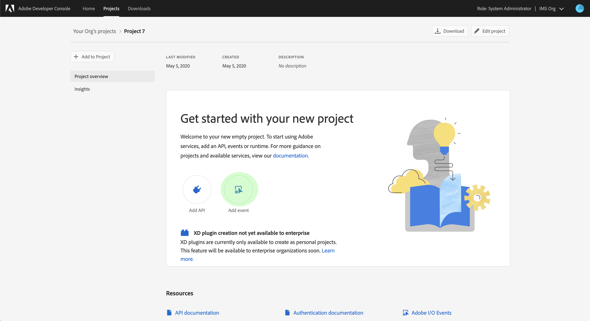

# Abonneren op [!DNL Privacy Events]

[!DNL Privacy Events] zijn berichten die door Adobe Experience Platform worden verstrekt [!DNL Privacy Service], die hefboomwerking I/O Gebeurtenissen die van Adobe naar een gevormde webhaak worden verzonden om efficiënte baanverzoekautomatisering te vergemakkelijken. Ze verminderen of elimineren de noodzaak om de [!DNL Privacy Service] API te raadplegen om te controleren of een taak voltooid is of dat een bepaalde mijlpaal in een werkstroom is bereikt.

Er zijn momenteel vier typen meldingen die betrekking hebben op de levenscyclus van de privacytaakaanvraag:

| Type | Beschrijving |
--- | ---
| Taak voltooid | Alle [!DNL Experience Cloud] oplossingen zijn gemeld en de algemene of algemene status van de baan is als volledig gemarkeerd. |
| Taakfout | Een of meer oplossingen hebben een fout gemeld tijdens de verwerking van het verzoek. |
| Product voltooid | Een van de oplossingen voor deze taak heeft zijn werk voltooid. |
| Productfout | Een van de oplossingen rapporteerde een fout tijdens de verwerking van het verzoek. |

Dit document bevat stappen voor het instellen van een integratie voor [!DNL Privacy Service] meldingen binnen Adobe I/O. Voor een overzicht op hoog niveau van [!DNL Privacy Service] en zijn eigenschappen, zie het overzicht [van de](home.md)Privacy Service.

## Aan de slag

Deze zelfstudie maakt gebruik van **ngrok**, een softwareproduct dat lokale servers via veilige tunnels toegankelijk maakt voor het publiek internet. Installeer voordat u deze zelfstudie start een [notitie](https://ngrok.com/download) om de zelfstudie te volgen en een webhaak voor uw lokale computer te maken. Voor deze handleiding moet u ook een GIT-opslagplaats downloaden die een eenvoudige [Node.js](https://nodejs.org/) -server bevat.

## Een lokale server maken

Uw server Node.js moet een `challenge` parameter terugkeren die door een verzoek aan het wortel (`/`) eindpunt wordt verzonden. Stel uw `index.js` bestand in met de volgende JavaScript-code om dit te bereiken:

```js
var express = require('express')
var app = express()

app.set('port', (process.env.PORT || 3000))
app.use(express.static(__dirname + '/public'))

app.get('/', function(request, response) {
  response.send(request.originalUrl.split('?challenge=')[1]);
})

app.listen(app.get('port'), function() {
  console.log("Node app is running at localhost:" + app.get('port'))
})
```

Navigeer met behulp van de opdrachtregel naar de hoofdmap van uw Node.js-server. Typ vervolgens de volgende opdrachten:

1. `npm install`
1. `npm start`

Met deze opdrachten installeert u alle afhankelijkheden en initialiseert u de server. Als dit lukt, kunt u de server vinden op http://localhost:3000/.

## Webhaak maken met notitie

Open een nieuw opdrachtregelvenster en navigeer naar de map waarin u vroeger op de opdrachtregel hebt geïnstalleerd. Typ hier de volgende opdracht:

```shell
./ngrok http -bind-tls=true 3000
```

Een geslaagde uitvoer ziet er ongeveer als volgt uit:


Neem nota van `Forwarding` URL (`https://212d6cd2.ngrok.io`), aangezien dit zal worden gebruikt om uw webhaak de volgende stap te identificeren.

## Nieuw project maken in Adobe Developer Console

Ga naar [Adobe Developer Console](https://www.adobe.com/go/devs_console_ui) en meld u aan met uw Adobe ID. Voer vervolgens de stappen uit die worden beschreven in de zelfstudie over het [maken van een leeg project](https://www.adobe.io/apis/experienceplatform/console/docs.html#!AdobeDocs/adobeio-console/master/projects-empty.md) in de documentatie van de Adobe Developer Console.

## Privacy-gebeurtenissen toevoegen aan het project

Nadat u een nieuw project in de console hebt gemaakt, klikt u op **[!UICONTROL Gebeurtenis]** toevoegen in het scherm _Projectoverzicht_ .



Het dialoogvenster Gebeurtenissen __ toevoegen wordt weergegeven. Selecteer **[!UICONTROL Experience Cloud]** om de lijst met beschikbare gebeurtenistypen omlaag te filteren en selecteer vervolgens Gebeurtenissen **** Privacys Service voordat u op **[!UICONTROL Volgende]** klikt.


Het dialoogvenster _Gebeurtenisregistratie_ configureren wordt weergegeven. Selecteer welke gebeurtenissen u wilt ontvangen door hun overeenkomstige checkboxes te selecteren. Gebeurtenissen die u selecteert, verschijnen onder _[!UICONTROL Geabonneerde Gebeurtenissen]_in de linkerkolom. Klik op**[!UICONTROL  Volgende ]**als u klaar bent.


In het volgende scherm wordt u gevraagd een openbare sleutel voor de gebeurtenisregistratie op te geven. U wordt gegeven de optie om een zeer belangrijk paar automatisch te produceren, of uw eigen openbare sleutel te uploaden die in de terminal wordt geproduceerd.

In deze zelfstudie wordt de eerste optie gevolgd. Klik op het optievak voor het **[!UICONTROL genereren van een sleutelpaar]** en klik vervolgens op de knop Hoofdpaar **** genereren in de rechterbenedenhoek.


Wanneer het sleutelpaar produceert, wordt het automatisch gedownload door browser. U moet dit bestand zelf opslaan omdat het niet wordt voortgezet in de Developer Console.

In het volgende scherm kunt u de details van het nieuwe sleutelpaar bekijken. Klik op **[!UICONTROL Volgende]** om door te gaan.


Geef in het volgende scherm een naam en een beschrijving op voor de registratie van de gebeurtenis. De beste manier is om een unieke, gemakkelijk identificeerbare naam te maken om deze gebeurtenisregistratie te onderscheiden van andere registraties voor hetzelfde project.


Verderop op het zelfde scherm, krijgt u twee opties om te vormen hoe te om gebeurtenissen te ontvangen. Selecteer **[!UICONTROL Webhaak]** en geef de `Forwarding` URL op voor de bovenstaande webhaak die u eerder onder _[!UICONTROL Webhaak URL]_hebt gemaakt. Selecteer vervolgens de gewenste leveringsstijl (enkele of batch) voordat u op**[!UICONTROL  geconfigureerde gebeurtenissen ]**opslaan klikt om de gebeurtenisregistratie te voltooien.


De detailpagina voor uw project verschijnt opnieuw, met [!DNL Privacy Events] verschijnt onder _[!UICONTROL Gebeurtenissen]_in de linkernavigatie.

## Gebeurtenisgegevens weergeven

Nadat u zich hebt geregistreerd [!DNL Privacy Events] bij uw project en privacytaken zijn verwerkt, kunt u ontvangen meldingen voor die registratie weergeven. Selecteer op het tabblad **[!UICONTROL Projecten]** in Developer Console uw project in de lijst om de pagina met het overzicht _van het_ product te openen. Van hier, selecteer de Gebeurtenissen **[!UICONTROL van de]** Privacy van de linkernavigatie.


Het tabblad _Registratiedetails_ wordt weergegeven, zodat u meer informatie over de registratie kunt bekijken, de configuratie kunt bewerken of de werkelijke gebeurtenissen kunt bekijken die zijn ontvangen sinds u de webhaak hebt geactiveerd.


Klik op het tabblad **[!UICONTROL Foutopsporing overtrekken]** om een lijst met ontvangen gebeurtenissen weer te geven. Klik op een vermelde gebeurtenis om de details ervan weer te geven.


In de sectie _[!UICONTROL Payload]_vindt u details over de geselecteerde gebeurtenis, inclusief het gebeurtenistype (`com.adobe.platform.gdpr.productcomplete`), zoals in het bovenstaande voorbeeld wordt aangegeven.

## Volgende stappen

U kunt de bovenstaande stappen herhalen voor het toevoegen van nieuwe integratie voor verschillende webhaakadressen waar nodig.