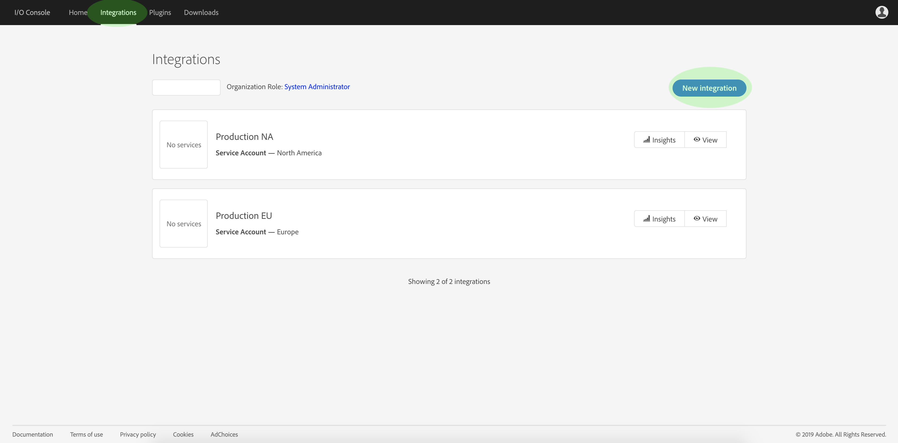
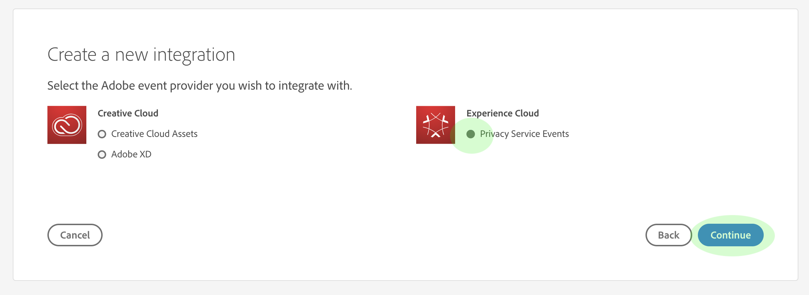
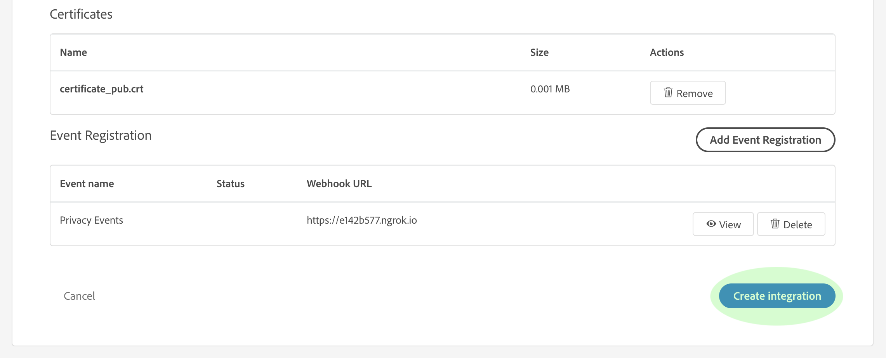
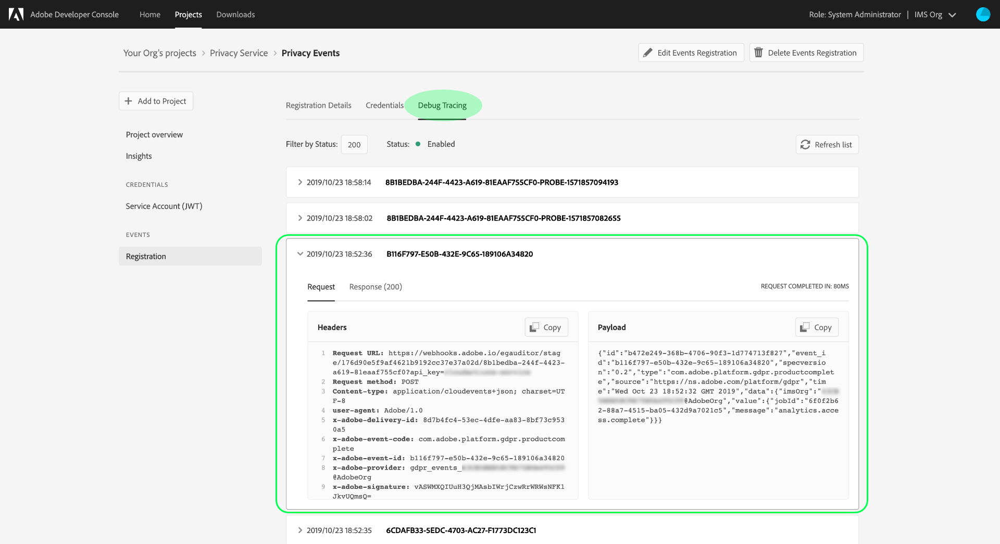

# Abonneren op privacygebeurtenissen

Privacy-gebeurtenissen zijn berichten die worden aangeboden door de Adobe Experience Platform Privacy Service. Deze berichten maken gebruik van Adobe I/O-gebeurtenissen die naar een geconfigureerde webhaak worden verzonden om efficiënte automatisering van taakaanvragen te vergemakkelijken. Zij verminderen of elimineren de behoefte om de Dienst API van de Privacy te onderzoeken om te controleren of een baan volledig is of een bepaalde mijlpaal binnen een werkschema is bereikt.

Er zijn momenteel vier typen meldingen die betrekking hebben op de levenscyclus van de privacytaakaanvraag:

| Type | Beschrijving |
--- | ---
| Taak voltooid | Alle Experience Cloud-oplossingen zijn teruggestuurd en de algemene of algemene status van de taak is als voltooid gemarkeerd. |
| Taakfout | Een of meer oplossingen hebben een fout gemeld tijdens de verwerking van het verzoek. |
| Product voltooid | Een van de oplossingen voor deze taak heeft zijn werk voltooid. |
| Productfout | Een van de oplossingen rapporteerde een fout tijdens de verwerking van het verzoek. |

In dit document worden stappen beschreven voor het instellen van een integratie voor meldingen van de privacyservice in Adobe I/O. Voor een overzicht op hoog niveau van de Dienst van de Privacy en zijn eigenschappen, zie het overzicht [van de Dienst van de](home.md)Privacy.

## Aan de slag

Deze zelfstudie maakt gebruik van **ngrok**, een softwareproduct dat lokale servers via veilige tunnels toegankelijk maakt voor het publiek internet. Installeer voordat u deze zelfstudie start een [notitie](https://ngrok.com/download) om de zelfstudie te volgen en een webhaak voor uw lokale computer te maken. Deze handleiding vereist ook dat u een GIT-opslagplaats downloadt die een eenvoudige server bevat die in [Node.js](https://nodejs.org/)is geschreven.

## Een lokale server maken

Uw server Node.js moet een `challenge` parameter terugkeren die door een verzoek aan het wortel (`/`) eindpunt wordt verzonden. Stel uw `index.js` bestand in met de volgende JavaScript-code om dit te bereiken:

```js
var express = require('express')
var app = express()

app.set('port', (process.env.PORT || 3000))
app.use(express.static(__dirname + '/public'))

app.get('/', function(request, response) {
  response.send(request.originalUrl.split('?challenge=')[1]);
})

app.listen(app.get('port'), function() {
  console.log("Node app is running at localhost:" + app.get('port'))
})
```

Navigeer met behulp van de opdrachtregel naar de hoofdmap van uw Node.js-server. Typ vervolgens de volgende opdrachten:

1. `npm install`
1. `npm start`

Met deze opdrachten installeert u alle afhankelijkheden en initialiseert u de server. Als dit lukt, kunt u de server vinden op http://localhost:3000/.

## Webhaak maken met notitie

Typ de volgende opdracht in dezelfde map en in een nieuw opdrachtregelvenster:

```shell
ngrok http -bind-tls=true 3000
```

Een geslaagde uitvoer ziet er ongeveer als volgt uit:


Neem nota van `Forwarding` URL (`https://e142b577.ngrok.io`), aangezien dit zal worden gebruikt om uw webhaak de volgende stap te identificeren.

## Een nieuwe integratie maken met Adobe I/O-console

Meld u aan bij de [Adobe I/O-console](https://console.adobe.io) en klik op het tabblad **Integraties** . Het venster _Integraties_ wordt weergegeven. Klik hier op **Nieuwe integratie**.



Het *venster Een nieuwe integratie* maken wordt weergegeven. Selecteer Gebeurtenissen **in bijna real-** time ontvangen en klik op **Doorgaan**.


In het volgende scherm vindt u opties waarmee u integratie kunt maken met verschillende gebeurtenissen, producten en services die beschikbaar zijn voor uw organisatie. Deze opties zijn gebaseerd op uw abonnementen, rechten en machtigingen. Voor deze integratie selecteert u **Privacy Service Events** en klikt u op **Doorgaan**.



Het formulier *Integratiedetails* wordt weergegeven. Hierin moet u een naam en beschrijving voor de integratie opgeven, plus een certificaat met een openbare sleutel.


Als u geen openbaar certificaat hebt, kunt u één produceren door het volgende eindbevel te gebruiken:

```shell
openssl req -x509 -sha256 -nodes -days 365 -newkey rsa:2048 -keyout private.key -out certificate_pub
```

Nadat u een certificaat hebt gegenereerd, sleept u het bestand naar het vak **Certificaten** met openbare sleutels of klikt u op Bestand **** selecteren om door de bestandsmap te bladeren en het certificaat rechtstreeks te selecteren.

Nadat u het certificaat hebt toegevoegd, wordt de optie *Gebeurtenisregistratie* weergegeven. Klik op **Gebeurtenisregistratie** toevoegen.


Het dialoogvenster wordt uitgebreid om extra besturingselementen weer te geven. Hier kunt u de gewenste gebeurtenistypen selecteren en uw webhaak registreren. Voer een naam in voor de gebeurtenisregistratie, de URL van de webhaak (het `Forwarding` adres dat wordt geretourneerd toen u de webhaak [voor het eerst](#create-a-webhook-using-ngrok)maakte) en een korte beschrijving. Selecteer ten slotte de gebeurtenistypen waarop u zich wilt abonneren en klik op **Opslaan**.


Nadat het registratieformulier voor gebeurtenissen is voltooid, klikt u op Integratie **** maken en de I/O-integratie is voltooid.



## Gebeurtenisgegevens weergeven

Nadat u de I/O-integratie en privacytaken hebt gemaakt, kunt u alle ontvangen meldingen voor die integratie weergeven. Navigeer op het tabblad **Integraties** in de I/O-console naar uw integratie en klik op **Weergave**.


De detailpagina voor de integratie wordt weergegeven. Klik op **Gebeurtenissen** om de registraties van gebeurtenissen voor de integratie weer te geven. Zoek de registratie voor privacygebeurtenissen en klik op **Weergeven**.


Het venster *Gebeurtenisdetails* wordt weergegeven, zodat u meer informatie over de registratie kunt bekijken, de configuratie kunt bewerken of de feitelijke gebeurtenissen kunt bekijken die zijn ontvangen sinds u de webhaak hebt geactiveerd. U kunt gebeurtenisdetails bekijken en aan de **Debug het Vinden optie** navigeren.



In de sectie **Payload** vindt u details over de geselecteerde gebeurtenis, inclusief het gebeurtenistype (`"com.adobe.platform.gdpr.productcomplete"`), zoals in het bovenstaande voorbeeld wordt aangegeven.

## Volgende stappen

U kunt de bovenstaande stappen herhalen voor het toevoegen van nieuwe integratie voor verschillende webhaakadressen waar nodig.