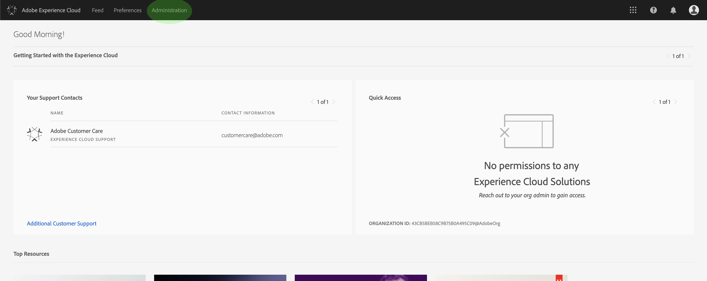
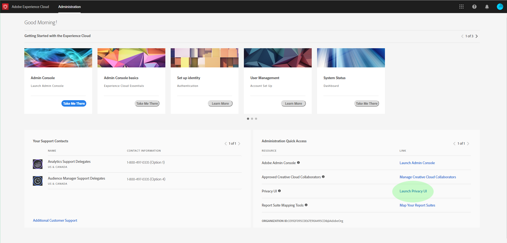

# Overzicht van de gebruikersinterface van de privacyservice

Adobe Experience Platform Privacy Service biedt een RESTful API en gebruikersinterface waarmee u privacy- en compatibiliteitsverzoeken kunt coördineren voor verschillende oplossingen. In dit document wordt de gebruikersinterface van de privacyservice besproken. Voor informatie over het gebruik van de API raadpleegt u de handleiding voor ontwikkelaars van de [privacyservice](../api/getting-started.md).

## Aanmelden bij de gebruikersinterface van de privacyservice

U moet een Adobe-id hebben om te kunnen verifiëren bij de gebruikersinterface van de privacyservice. Bovendien moet u over beheerdersrechten voor het systeem beschikken binnen de organisatie waaraan uw Adobe-id is gekoppeld.

Ga naar de aanmeldingspagina voor Adobe Experience Cloud op https://experience.adobe.com. Klik op **Aanmelden met een Adobe-id** en voer uw Adobe-id in wanneer u hierom wordt gevraagd. Als u bent aangemeld, klikt u op **Beheer**.

>[!NOTE] Het tabblad Beheer wordt alleen weergegeven als u binnen uw organisatie over beheerdersrechten voor het systeem beschikt.

Selecteer ten slotte de optie **Privacy-interface** starten op het volgende scherm om de interface van de privacyservice te openen.

## Volgende stappen

Nu u zich met succes hebt aangemeld, raadpleegt u de [gebruikershandleiding](user-guide.md) voor stappen over het uitvoeren van diverse bewerkingen met de gebruikersinterface van de privacydienst.