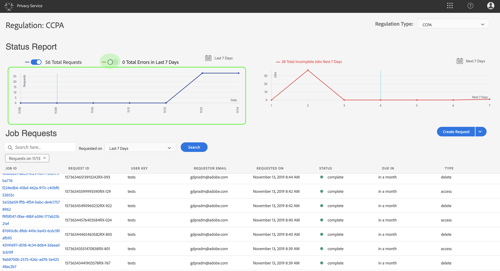
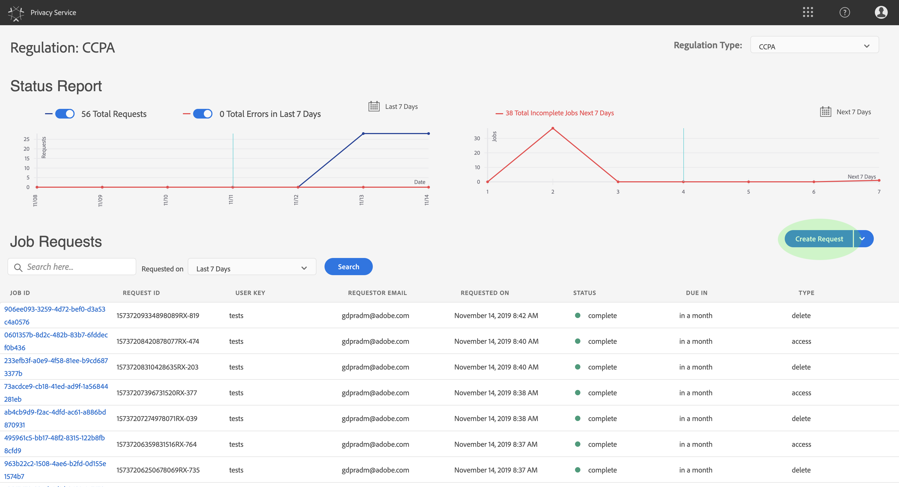
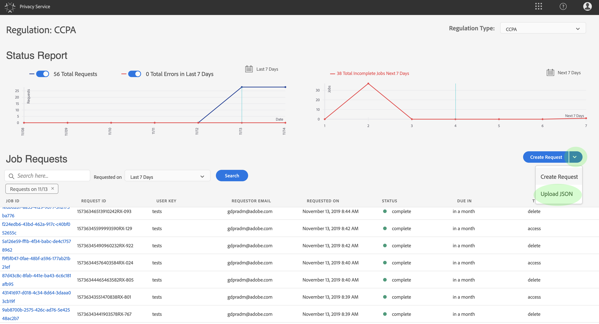

# Gebruikershandleiding voor de privacyservice

Dit document bevat stappen voor het maken en beheren van privacyverzoeken via de gebruikersinterface van de privacyservice.

## Bladeren in het UI-dashboard voor privacyservice

Het dashboard voor de UI van de Dienst van de Privacy verstrekt twee widgets die u toestaan om de status van uw privacybanen te bekijken: **Statusrapport** en **Taakverzoeken**. Op het dashboard wordt ook de huidige geselecteerde regelgeving voor de weergegeven taken weergegeven.

### Type verordening

De Privacy Service steunt baanverzoeken voor twee regulatietypen:

* De algemene gegevensbeschermingsverordening (GDPR)
* The California Consumer Privacy Act (CCPA).

Taken voor elk type regelgeving worden afzonderlijk bijgehouden. Als u wilt schakelen tussen regelgevingstypen, klikt u op het vervolgkeuzemenu **Type** regelgeving en selecteert u de gewenste regeling in de lijst.

Als u het regulatietype wijzigt, wordt het dashboard bijgewerkt en worden alle bewerkingen, filters, widgets en dialoogvensters voor het creëren van werkgelegenheid weergegeven die van toepassing zijn op de geselecteerde verordening.

### Statusrapport

De grafiek aan de linkerkant van de widgetsporen van het Rapport van de Status legde banen tegen om het even welke banen voor die met fouten zouden kunnen zijn gemeld. In de grafiek aan de rechterkant worden taken bijgehouden aan het einde van het nalevingsvenster van 30 dagen.

Klik op een van de twee schakelknoppen boven de grafiek om de desbetreffende cijfers weer te geven of te verbergen.

U kunt het exacte aantal taken dat aan elk gegevenspunt op de grafieken is gekoppeld, weergeven door de muis boven het desbetreffende gegevenspunt te plaatsen.

Als u meer details over een bepaald gegevenspunt wilt weergeven, klikt u op het desbetreffende gegevenspunt om de bijbehorende taken weer te geven in de widget Taakverzoeken. Neem nota van het filter dat net boven de baanlijst wordt toegepast.

>[!NOTE] Wanneer een filter is toegepast op de widget Taakverzoeken, kunt u het filter verwijderen door op de **X** van de filtervulling te klikken. De Verzoeken van de baan keren dan aan het gebrek volgende lijst terug.

### Taakverzoeken

De widget Taakverzoeken bevat een lijst met alle beschikbare taakaanvragen in uw organisatie, inclusief gegevens zoals het type aanvraag, de huidige status, de vervaldatum en het e-mailadres van de aanvrager.

>[!NOTE] De gegevens voor eerder gecreëerde banen zijn slechts 30 dagen na de voltooiingsdatum toegankelijk.

U kunt de lijst filteren door trefwoorden in de zoekbalk onder de titel Taakverzoeken te typen. De lijst filtert automatisch terwijl u typt, tonend verzoeken die waarden bevatten die uw onderzoekstermijnen aanpassen. U kunt ook het vervolgkeuzemenu **Gevraagd op** gebruiken om een tijdbereik te selecteren voor de weergegeven taken.

Als u de details van een bepaalde taakaanvraag wilt weergeven, klikt u in de lijst op de taak-id van de aanvraag om de pagina *Taakdetails* te openen.

Dit dialoogvenster bevat statusinformatie over elke Experience Cloud-oplossing en de huidige status ten opzichte van de algemene taak. Aangezien elke privacybaan asynchroon is, toont de pagina de recentste communicatie datum en tijd (GMT) van elke oplossing, aangezien sommige meer tijd dan anderen vereisen om het verzoek te verwerken.

Als een oplossing om het even welke extra gegevens heeft verstrekt, is het viewable in deze dialoog. U kunt deze gegevens weergeven door op afzonderlijke productrijen te klikken.

Als u de volledige taakgegevens als CSV-bestand wilt downloaden, klikt u op **Exporteren naar CSV** rechtsboven in het dialoogvenster.

## Een nieuw verzoek voor een privacytaak maken

>[!NOTE] Als u een privacytaakverzoek wilt maken, moet u identiteitsgegevens opgeven voor de specifieke klanten van wie de gegevens moeten worden benaderd of verwijderd. Controleer het document over [identiteitsgegevens voor privacyverzoeken](../identity-data.md) voordat u doorgaat met deze sectie.

De interface van de privacyservice biedt twee methoden om nieuwe taakaanvragen te maken:

* [De Request Builder gebruiken](#request-builder)
* [Een JSON-bestand uploaden](#json)

De stappen voor het gebruiken van elk van deze methodes worden verstrekt in de volgende secties.

### De Request Builder gebruiken {#request-builder}

Met de Request Builder kunt u handmatig een nieuw verzoek voor een privacytaak maken in de gebruikersinterface. De Bouwer van het Verzoek wordt best gebruikt voor eenvoudigere en kleinere reeksen verzoeken, omdat de de grensverzoeken van de Bouwer van het Verzoek om slechts identiteitskaart type per gebruiker te hebben. Voor meer gecompliceerde verzoeken is het beter om een JSON-bestand [te](#json) uploaden.

Klik op Verzoek **** maken onder de widget Statusrapport aan de rechterkant van het scherm om de Request-builder te gaan gebruiken.

Het dialoogvenster *Aanvraag* maken wordt geopend en hierin worden de beschikbare opties weergegeven voor het indienen van een aanvraag voor een privacytaak voor het momenteel geselecteerde regulatietype.

 

Selecteer het **Taaktype** van de aanvraag (&quot;Schrapping&quot;of &quot;Toegang&quot;) en één of meerdere beschikbare **Producten** van de lijst.

 

Selecteer onder *Type* Namespace het juiste naamruimtetype voor de klant-id&#39;s die naar de Privacy-service worden verzonden.

 

Wanneer u het _standaardnaamruimtetype_ gebruikt, selecteert u een naamruimte in het keuzemenu (e-mail, ECID of AID) en typt u vervolgens de id-waarden in het tekstvak rechts, waarbij u op **\&lt;enter>** drukt voor elke id om deze toe te voegen aan de lijst.

 

Wanneer u het _aangepaste_ naamruimtetype gebruikt, moet u de naamruimte handmatig typen voordat u de onderstaande id-waarden opgeeft.

 

Klik op **Maken** als u klaar bent.

 

Het dialoogvenster verdwijnt en de nieuwe taak (of taken) worden samen met de huidige verwerkingsstatus weergegeven in de widget Taakverzoeken.

### Een JSON-bestand uploaden {#json}

Wanneer u complexere aanvragen maakt, zoals aanvragen die meerdere id-typen gebruiken voor elke gegevenssubject die wordt verwerkt, kunt u een aanvraag maken door een JSON-bestand te uploaden.

Klik op de pijl naast Verzoek **** maken onder de widget Statusrapport aan de rechterkant van het scherm. Selecteer **JSON** uploaden in de lijst met opties die wordt weergegeven.

Het dialoogvenster JSON ** uploaden wordt weergegeven en u krijgt een venster waarin u uw JSON-bestand kunt slepen en neerzetten.

 

Als u geen JSON-bestand hebt om te uploaden, klikt u op Adobe-GDPR-Request.json **** downloaden om een sjabloon te downloaden dat u kunt vullen op basis van de waarden die u van de betrokkenen hebt verzameld.

 

Zoek het JSON-bestand op uw computer en sleep het naar het dialoogvenster. Als het uploaden is voltooid, wordt de bestandsnaam weergegeven in het dialoogvenster. U kunt desgewenst meer JSON-bestanden toevoegen door deze naar het dialoogvenster te slepen.

Klik op **Maken** als u klaar bent. Het dialoogvenster verdwijnt en de nieuwe taak (of taken) worden samen met de huidige verwerkingsstatus weergegeven in de widget _Taakverzoeken_ .

### Volgende stappen

Door dit document te lezen, hebt u geleerd hoe u de gebruikersinterface van de privacyservice kunt gebruiken om een privacytaak te maken, de gegevens van een taak te bekijken en de verwerkingsstatus van de taak te controleren en de resultaten te downloaden zodra deze zijn voltooid.

Raadpleeg de handleiding voor [ontwikkelaars voor informatie over het programmatisch uitvoeren van deze bewerkingen met de API van de privacyservice](../api/getting-started.md).