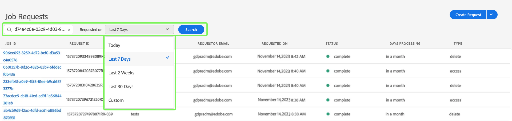
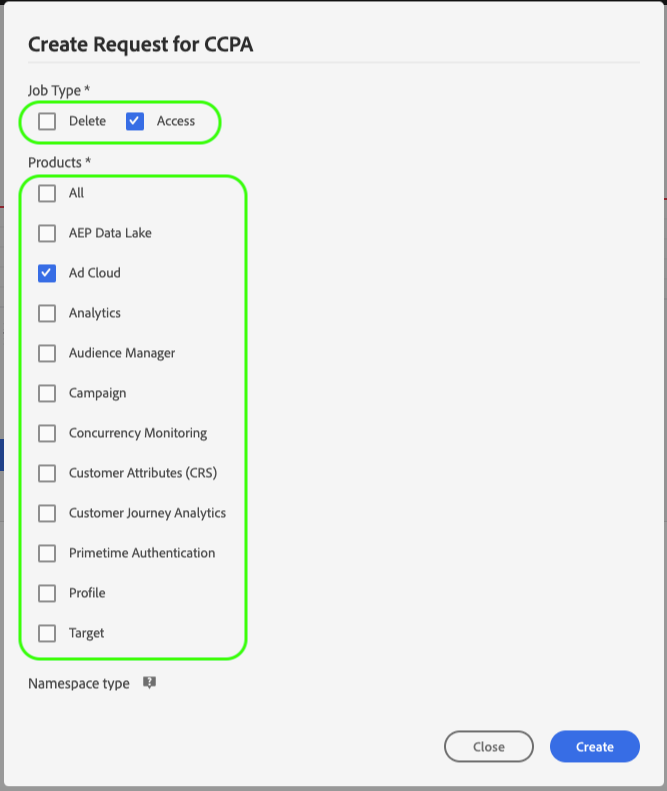

# Privacy-taken beheren in de gebruikersinterface van Privacy Service {#user-guide}

>[!CONTEXTUALHELP]
>id="platform_privacyConsole_requests_description"
>title="Privacyverzoeken van betrokkenen in acht nemen"
>abstract="<h2>Beschrijving</h2>
Met Adobe Experience Platform Privacy Service kunt u privacyverzoeken maken en beheren namens klanten die hun persoonsgegevens willen openen of verwijderen in overeenstemming met de wettelijke privacyregels.
"

Dit document bevat stappen voor het maken en beheren van privacyverzoeken via de gebruikersinterface van [!DNL Privacy Service] .

>[!IMPORTANT]
>
>Privacy Service is alleen bedoeld voor de betrokkenen en verzoeken om consumentenrechten. Elk ander gebruik van Privacy Service voor het opschonen of onderhouden van gegevens wordt niet ondersteund of toegestaan. Adobe is wettelijk verplicht deze tijdig te vervullen. Daarom is het testen van belasting op Privacy Service niet toegestaan, omdat dit een productieomgeving is en een onnodige achterstand oplevert bij geldige privacyverzoeken.
>
>Er is nu een vaste uploadlimiet voor dagelijks gebruik om misbruik van de service te voorkomen. Gebruikers die misbruik van het systeem kunnen maken, hebben toegang tot de service uitgeschakeld. Daarna zal er een vergadering met hen worden gehouden om hun acties te bespreken en te bespreken hoe Privacy Service zich kan inzetten.

## Door het [!DNL Privacy Service] UI-dashboard bladeren

Het dashboard voor [!DNL Privacy Service] UI verstrekt twee widgets die u toestaan om de status van uw privacybanen te bekijken: &quot;[!UICONTROL Status Report]&quot; en &quot;[!UICONTROL Job Requests]&quot;. Op het dashboard wordt ook de huidige geselecteerde regelgeving voor de weergegeven taken weergegeven.

### Type verordening

[!DNL Privacy Service] ondersteunt taakaanvragen voor verschillende privacyregels. In de volgende tabel worden de ondersteunde verordeningen en het bijbehorende label weergegeven, zoals weergegeven in de gebruikersinterface:

| UI-label | Verordening |
|-------------------------------------|------------------------|
| [!UICONTROL APA_AUS  (Australia)] | De [!DNL Australia Privacy Act] |
| [!UICONTROL CCPA (California)] | De [!DNL California Consumer Privacy Act] |
| [!UICONTROL CPA_USA (Colorado)] | De [!DNL Colorado Privacy Act] |
| [!UICONTROL CPRA_USA (California)] | De [!DNL California Consumer Privacy Rights Act (CPRA)] |
| [!UICONTROL CTDPA_USA (Connecticut)] | De [!DNL Connecticut Data Privacy Act] |
| [!UICONTROL DPDPA_USA (Delaware)] | De [!DNL Delaware Personal Data Privacy Act] |
| [!UICONTROL FDBR_USA (Florida)] | De [!DNL Florida Digital Bill of Rights] |
| [!UICONTROL GDPR (European Union)] | De Europese Unie [!DNL General Data Protection Regulation] |
| [!UICONTROL HIPPA_USA (United States)] | De [!DNL Health Insurance Portability and Accountability Act] |
| [!UICONTROL ICDPA_USA] (Iowa) | De [!DNL Iowa Consumer Data Protection Act] |
| [!UICONTROL LGPD_BRA (Brazil)] | Brazilië: &quot;[!DNL General Data Protection Law]&quot; [!DNL Lei Geral de Proteção de Dados] |
| [!UICONTROL MHMDA_USA (Washington)] | De [!DNL Washington My Health My Data Act] |
| [!UICONTROL MCDPA_USA (Montana)] | De [!DNL Montana Consumer Data Privacy Act] |
| [!UICONTROL NDPA_USA (Nebraska)] | De [!DNL Nebraska Data Protection Act] |
| [!UICONTROL NZPA_NZL (New Zealand)] | Nieuw-Zeeland [!DNL Privacy Act] |
| [!UICONTROL NHPA_USA (New Hampshire)] | De [!DNL New Hampshire Privacy Act] |
| [!UICONTROL NJDPA_USA (New Jersey)] | De [!DNL New Jersey Data Protection Act] |
| [!UICONTROL OCPA USA (Oregon)] | De [!DNL Oregon Consumer Privacy Act] |
| [!UICONTROL PDPA_THA (Thailand)] | Thailand [!DNL Personal Data Protection Act] |
| [!UICONTROL QL25_CAN (Quebec)] | [!DNL Quebec Law 25] |
| [!UICONTROL TDPSA USA (Texas)] | De [!DNL Texas Data Privacy and Security Act] |
| [!UICONTROL UCPA_USA (Utah)] | De [!DNL Utah Consumer Privacy Act] |
| [!UICONTROL VCDPA_USA (Virginia)] | De [!DNL Virginia Consumer Data Protection Act] |

{style="table-layout:auto"}

<!-- 
Waiting:
| **[!UICONTROL PIPA_KOR]**  ?        | South Korea [!DNL Personal Information Privacy Act] |
 -->

>[!NOTE]
>
>Zie het overzicht op [ gesteunde privacyverordeningen ](../regulations/overview.md) voor meer informatie over de wettelijke context van elke verordening.

Taken voor elk type regelgeving worden afzonderlijk bijgehouden. Als u wilt schakelen tussen regelgevingstypen, selecteert u het vervolgkeuzemenu **[!UICONTROL Regulation Type]** en selecteert u de gewenste regeling in de lijst.

Als u het regulatietype wijzigt, wordt het dashboard bijgewerkt en worden alle bewerkingen, filters, widgets en dialoogvensters voor het creëren van werkgelegenheid weergegeven die van toepassing zijn op de geselecteerde verordening.

### Statusrapport

De grafiek aan de linkerkant van de widgetsporen van het Rapport van de Status legde banen tegen om het even welke banen voor die met fouten zouden kunnen zijn gemeld. In de grafiek aan de rechterkant worden taken bijgehouden aan het einde van het nalevingsvenster van 30 dagen.

Selecteer een van de twee schakelknoppen boven de grafiek om de desbetreffende cijfers weer te geven of te verbergen.

U kunt het exacte aantal taken dat aan elk gegevenspunt op de grafieken is gekoppeld, weergeven door de muis boven het desbetreffende gegevenspunt te plaatsen.

Als u meer details over een bepaald gegevenspunt wilt weergeven, selecteert u het desbetreffende gegevenspunt om de bijbehorende taken weer te geven in de widget Taakverzoeken. Neem nota van het filter dat net boven de baanlijst wordt toegepast.

>[!NOTE]
>
>Wanneer een filter op de widget van de Verzoeken van de Baan is toegepast, kunt u de filter verwijderen door **X** op de filterpil te selecteren. De Verzoeken van de baan keren dan aan de standaard het volgen lijst terug.

### Taakverzoeken {#job-requests}

De werkruimte [!UICONTROL Job Requests] bevat details over de recente taakaanvragen in uw organisatie. De details omvatten het verzoektype, de huidige status, de vervaldatum, de aanvrager e-mail, etc. Sets van 100 records worden tegelijk geladen. Standaard worden de laatst gemaakte taken bovenaan weergegeven met meer records die zijn geladen wanneer u omlaag schuift om te bladeren.

>[!NOTE]
>
>De gegevens voor eerder gecreëerde banen zijn slechts 30 dagen na de voltooiingsdatum toegankelijk.

U kunt de lijst filteren door trefwoorden in de zoekbalk onder de titel [!UICONTROL Job Requests] te typen. De lijst filtert automatisch terwijl u typt, tonend verzoeken die waarden bevatten die uw onderzoekstermijnen aanpassen. Het zoekveld voert een &#39;snelle&#39; zoekopdracht uit die overeenkomt met de privacytaak-id&#39;s van de taken die momenteel zijn gerenderd of geladen in de gebruikersinterface. Het is geen uitgebreide zoekopdracht naar al uw ingediende taken. Het is eerder een filter dat op de geladen resultaten wordt toegepast. Gebruik Privacy Service API aan [ terugkeerbanen die op een specifieke verordening, datumwaaiers, of één enkele baan ](../api/privacy-jobs.md#list) worden gebaseerd.

>[!TIP]
>
>Als u records vanaf de afgelopen 30 dagen in de gebruikersinterface wilt laden, moet u naar beneden schuiven en meer batches records laden.

U kunt ook de zoekknop gebruiken om een query voor een privacytaak uit te voeren die een bepaald datumbereik omvat. Deze actie retourneert alle privacytaken die door uw organisatie tijdens de opgegeven tijdsperiode zijn ingediend. Selecteer het vervolgkeuzemenu **[!UICONTROL Requested on]** om een begin- en einddatum voor de query te kiezen. De beschikbare opties zijn [!UICONTROL Today] , [!UICONTROL Last 7 Days] , [!UICONTROL Last 2 Weeks] , [!UICONTROL Last 30 Days] of [!UICONTROL Custom] . Wanneer de zoekfunctie wordt gebruikt met de optie [!UICONTROL Requested on] , worden alleen taakaanvragen weergegeven die zijn verzonden tussen de gekozen datumbereiken.

Als u de details van een bepaalde taakaanvraag wilt bekijken, selecteert u de taak-id van de aanvraag in de lijst om de pagina **[!UICONTROL Job Details]** te openen.

Dit dialoogvenster bevat statusinformatie over elke [!DNL Experience Cloud] -oplossing en de huidige status ten opzichte van de algemene taak. Aangezien elke privacybaan asynchroon is, toont de pagina de recentste communicatie datum en tijd (GMT) van elke oplossing, aangezien sommige meer tijd dan anderen vereisen om het verzoek te verwerken.

Als een oplossing om het even welke extra gegevens heeft verstrekt, is het viewable in deze dialoog. U kunt deze gegevens weergeven door afzonderlijke productrijen te selecteren.

Als u de volledige taakgegevens als CSV-bestand wilt downloaden, selecteert u **[!UICONTROL Export to CSV]** rechtsboven in het dialoogvenster.

## Een nieuw verzoek voor een privacytaak maken {#create-a-new-privacy-job-request}

>[!CONTEXTUALHELP]
>id="platform_privacyConsole_requests_instructions"
>title="Instructies"
>abstract="<ul><li>Selecteer <a href="https://experienceleague.adobe.com/docs/experience-platform/privacy/ui/overview.html#logging-in-from-experience-platform"> Verzoeken </a> in de linkernavigatie om Ul van de Privacy te openen, dan uitgezocht <b> creeer Verzoek </b>.</li><li>Vanaf hier kunt u de aanvraagbuilder gebruiken of een JSON-bestand van betrokkenen uploaden.</li><li>Als u de aanvraagbuilder gebruikt, selecteert u het taaktype (toegang en/of verwijderen) en kiest u het type identiteit dat u opgeeft (e-mail, ECID of AID), of voert u een naamruimte voor een aangepaste identiteit in. Ga de aangewezen identiteitswaarden voor de klanten in en selecteer <b> creëren </b> wanneer gebeëindigd.</li><li>Als u een JSON-bestand uploadt, selecteert u de pijl naast Verzoek maken. Van de lijst van opties, uitgezochte <b> uploadt JSON </b> en uploadt uw dossier. Als u geen JSON- dossier hebt om te uploaden, uitgezochte <b> Download Adobe-GDPR-Request.json </b> om een malplaatje te downloaden dat u kunt bevolken. Upload JSON en selecteer <b> creëren </b> wanneer gebeëindigd.</li><li>Voor meer hulp met deze eigenschap, verwijs naar de <a href="https://experienceleague.adobe.com/docs/experience-platform/privacy/ui/user-guide.html"> gebruikersgids van Privacy Service </a> op Experience League.</li></ul>"

>[!NOTE]
>
>Als u een privacytaakverzoek wilt maken, moet u identiteitsgegevens opgeven voor de specifieke klanten van wie de gegevens moeten worden benaderd of verwijderd. Gelieve te herzien het document op [ identiteitsgegevens voor privacyverzoeken ](../identity-data.md) alvorens met deze sectie verder te gaan.

De gebruikersinterface van [!DNL Privacy Service] biedt twee methoden om nieuwe taakaanvragen te maken:

* [De Request Builder gebruiken](#request-builder)
* [Een JSON-bestand uploaden](#json)

De stappen voor het gebruiken van elk van deze methodes worden verstrekt in de volgende secties.

### De Request Builder gebruiken {#request-builder}

Met de Request Builder kunt u handmatig een nieuw verzoek voor een privacytaak maken in de gebruikersinterface. De Bouwer van het Verzoek wordt best gebruikt voor eenvoudigere en kleinere reeksen verzoeken, omdat de de grensverzoeken van de Bouwer van het Verzoek om slechts identiteitskaart type per gebruiker te hebben. Voor meer gecompliceerde verzoeken, kan het beter [ een JSON- dossier ](#json) in plaats daarvan uploaden.

Selecteer **[!UICONTROL Create Request]** onder de widget Statusrapport aan de rechterkant van het scherm om de Request Builder te gaan gebruiken.

Het dialoogvenster **[!UICONTROL Create Request]** wordt geopend met de beschikbare opties voor het indienen van een aanvraag voor een privacytaak voor het momenteel geselecteerde regulatietype.

{width=500}

Selecteer de **[!UICONTROL Job Type]** van de aanvraag (&quot;Verwijderen&quot; of &quot;Toegang&quot;) en een of meer beschikbare producten in de lijst.

Privacy Service ondersteunt twee soorten taakaanvragen voor persoonlijke gegevens: [!UICONTROL Access] (lezen) en/of [!UICONTROL Delete] . U kunt een verzoek indienen om alle informatie in het product te ontvangen die betrekking heeft op het onderwerp van het onderzoek, of u kunt verzoeken om alle informatie te schrappen die betrekking heeft op het onderwerp van het onderzoek.

{width=500}

Selecteer onder **[!UICONTROL Namespace type]** het juiste naamruimtetype voor de klant-id&#39;s die naar [!DNL Privacy Service] worden verzonden.

{width=500}

Wanneer het gebruiken van het standaard namespace type, selecteer een namespace van het drop-down menu (e-mail, ECID, of STEUN), dan typ de waarden van identiteitskaart in textbox aan het recht, drukkend **\ &lt;enter>** voor elke identiteitskaart om het aan de lijst toe te voegen.

{width=500}

Wanneer u het aangepaste naamruimtetype gebruikt, moet u de naamruimte handmatig typen voordat u de onderstaande id-waarden opgeeft.

{width=500}

Selecteer **[!UICONTROL Create]** als u klaar bent.

{width=500}

Het dialoogvenster verdwijnt en de nieuwe taak (of taken) worden samen met de huidige verwerkingsstatus weergegeven in de widget Taakverzoeken.

### Een JSON-bestand uploaden {#json}

Wanneer u complexere aanvragen maakt, zoals aanvragen die meerdere id-typen gebruiken voor elke gegevenssubject die wordt verwerkt, kunt u een aanvraag maken door een JSON-bestand te uploaden.

Selecteer de pijl naast **[!UICONTROL Create Request]** onder de widget Statusrapport aan de rechterkant van het scherm. Selecteer **[!UICONTROL Upload JSON]** in de lijst met opties die wordt weergegeven.

Het dialoogvenster **[!UICONTROL Upload JSON]** wordt weergegeven en geeft u een venster waarin u uw JSON-bestand kunt slepen en neerzetten.

{width=500}

Als u geen JSON-bestand hebt om te uploaden, selecteert u **[!UICONTROL Download Adobe-GDPR-Request.json]** om een sjabloon te downloaden die u kunt vullen op basis van de waarden die u van de betrokkenen hebt verzameld.

{width=500}

Zoek het JSON-bestand op uw computer en sleep het naar het dialoogvenster. Als het uploaden is voltooid, wordt de bestandsnaam weergegeven in het dialoogvenster. U kunt desgewenst meer JSON-bestanden toevoegen door deze naar het dialoogvenster te slepen.

Selecteer **[!UICONTROL Create]** als u klaar bent. Het dialoogvenster verdwijnt en de nieuwe taak (of taken) worden samen met de huidige verwerkingsstatus weergegeven in de widget Taakverzoeken.

### Volgende stappen

Door dit document te lezen, hebt u geleerd hoe u de gebruikersinterface van [!DNL Privacy Service] kunt gebruiken om een privacytaak te maken, de gegevens van een taak te bekijken en de verwerkingsstatus van de taak te controleren en de resultaten te downloaden zodra deze zijn voltooid.

Voor stappen op hoe te om deze verrichtingen programmatically uit te voeren gebruikend [!DNL Privacy Service] API, gelieve te verwijzen naar de [ API gids ](../api/overview.md).
