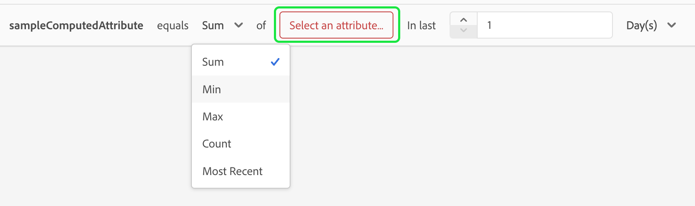

# Gebruikershandleiding voor berekende kenmerken

>[!NOTE]
>
>Om toegang tot gegevens verwerkte attributen te krijgen, zult u de aangewezen toestemmingen moeten hebben (**Mening Berekende attributen** en **beheert Gedetailleerde attributen**). Voor meer informatie over de vereiste toestemmingen, te lezen gelieve de [ documentatie van de toegangscontrole ](../../access-control/home.md). Leren hoe te om deze toestemmingen toe te passen, te lezen gelieve [ het leiden toestemmingengids ](../../access-control/ui/permissions.md).

In Adobe Experience Platform zijn berekende kenmerken functies die worden gebruikt om gegevens op gebeurtenisniveau samen te voegen tot kenmerken op profielniveau. Deze functies worden automatisch berekend zodat zij over segmentatie, activering, en verpersoonlijking kunnen worden gebruikt.

In dit document wordt uitgelegd hoe u berekende kenmerken kunt maken en bijwerken met de gebruikersinterface van Adobe Experience Platform.

## Aan de slag

Deze UI-gids vereist inzicht in de verschillende [!DNL Experience Platform] -services die bij het beheren van [!DNL Real-Time Customer Profiles] betrokken zijn. Voordat u deze handleiding leest of in de gebruikersinterface werkt, raadpleegt u de documentatie voor de volgende services:

- [[!DNL Real-Time Customer Profile]](../home.md): biedt een uniform, real-time consumentenprofiel dat is gebaseerd op geaggregeerde gegevens van meerdere bronnen.
- [[!DNL Experience Data Model (XDM) System]](../../xdm/home.md): Het gestandaardiseerde framework waarmee [!DNL Experience Platform] gegevens voor de klantervaring indeelt.

## Berekende kenmerken weergeven {#view}

Selecteer in de gebruikersinterface van Experience Platform de optie **[!UICONTROL Profiles]** in de linkernavigatie, gevolgd door **[!UICONTROL Computed attributes]** om een lijst weer te geven met de berekende kenmerken die beschikbaar zijn voor uw organisatie. Dit omvat informatie over de gegevens verwerkte naam van de attributen, beschrijving, laatste evaluatiedatum, en laatste evaluatiestatus.

![ de [!UICONTROL Profile] sectie en de [!UICONTROL Computed attributes] lusjes worden benadrukt, die gebruikers tonen hoe te om tot de gegevens verwerkte attributen toegang te hebben doorbladert pagina.](./images/ui/browse.png)

Om te selecteren welke gebieden zichtbaar zijn, kunt u  om toe te voegen of te verwijderen welke gebieden u wilt worden getoond.

| Veld | Beschrijving |
| ----- | ----------- |
| [!UICONTROL Name] | De weergavenaam van het berekende kenmerk. |
| [!UICONTROL Description] | De beschrijving voor het berekende kenmerk. |
| [!UICONTROL Evaluation method] | De evaluatiemethode voor de gegevens verwerkte attributen. Op dit ogenblik, slechts wordt de **partij** gesteund. |
| [!UICONTROL Last evaluated] | Dit tijdstempel vertegenwoordigt de laatste geslaagde evaluatieronde. Slechts worden de gebeurtenissen die **vóór** dit timestamp verschenen overwogen in de laatste succesvolle evaluatie. |
| [!UICONTROL Last evaluation status] | De status die verklaart al dan niet de gegevens verwerkte attributen met succes in de laatste evaluatielooppas werd berekend. Mogelijke waarden zijn **[!UICONTROL Success]** of **[!UICONTROL Failed]** . |
| [!UICONTROL Refresh frequency] | Een indicatie hoe vaak het berekende attribuut naar verwachting zal worden vernieuwd. Mogelijke waarden zijn uurwaarden, dagwaarden, weekwaarden of maandwaarden. |
| [!UICONTROL Fast refresh] | Een waarde die toont al dan niet snel verfrist voor dit compute attribuut wordt toegelaten. Als de snelle verfrissing wordt toegelaten, laat dit de gegevens verwerkte attributen op een dagelijkse basis, eerder dan op een wekelijkse, bi-wekelijkse, of maandbasis worden verfrist. Deze waarde is alleen van toepassing op berekende kenmerken met een terugzoekperiode die langer is dan een week. |
| [!UICONTROL Lifecycle status] | De huidige status van het berekende kenmerk. Er zijn drie mogelijke statussen: <ul><li>**[!UICONTROL Draft]:** het gegevens verwerkte attribuut heeft **&#x200B;**&#x200B;nog geen gebied dat op het schema wordt gecreeerd. In deze status kan het berekende kenmerk worden bewerkt. </li><li>**[!UICONTROL Published]:** het gegevens verwerkte attribuut heeft een gebied dat op het schema wordt gecreeerd en is klaar om te worden gebruikt. In deze staat, kan de gegevens verwerkte attributen **niet** worden uitgegeven.</li><li>**[!UICONTROL Inactive]:** Het berekende kenmerk is uitgeschakeld. Voor meer informatie over de inactieve status, te lezen gelieve de [ pagina van Veelgestelde vragen ](./faq.md#inactive-status). </li> |
| [!UICONTROL Created] | Een tijdstempel met de datum en tijd waarop het berekende kenmerk is gemaakt. |
| [!UICONTROL Last modified] | Een tijdstempel met de datum en tijd waarop het berekende kenmerk voor het laatst is gewijzigd. |

U kunt de weergegeven berekende kenmerken ook filteren op basis van de levenscyclusstatus. Selecteer het  pictogram.

U kunt er nu voor kiezen om de berekende kenmerken te filteren op status ([!UICONTROL Draft], [!UICONTROL Published] en [!UICONTROL Inactive]).

![ de opties die u de gegevens verwerkte attributen door kunt filtreren worden benadrukt. Deze opties zijn onder andere [!UICONTROL Draft] , [!UICONTROL Published] en [!UICONTROL Inactive] . ](./images/ui/view-filters.png)

Bovendien kunt u een berekend attribuut selecteren om meer gedetailleerde informatie over het te zien. Voor meer informatie over de gegevens verwerkte pagina van de attributendetails, te lezen gelieve [ mening de gegevens van een gegevens verwerkte attribuut sectie ](#view-details).

## Een berekend kenmerk maken {#create}

Als u een nieuw berekend kenmerk wilt maken, selecteert u **[!UICONTROL Create computed attribute]** om de nieuwe workflow voor berekende kenmerken in te voeren.

![ de [!UICONTROL Create computed attributes] knoop wordt benadrukt, tonend gebruikers hoe te om tot een gegevens verwerkte attributenpagina te bereiken.](./images/ui/create.png)

De pagina **[!UICONTROL Create computed attribute]** wordt weergegeven. Op deze pagina kunt u de basisgegevens toevoegen voor het berekende kenmerk dat u wilt maken.

| Veld | Beschrijving |
| ----- | ----------- |
| [!UICONTROL Display name] | The name which the computed attribute will be known by. Deze weergavenaam moet uniek blijven voor elk berekend kenmerk. Als beste praktijken, zou deze vertoningsnaam herkenningstekens met betrekking tot het gegevens verwerkte attribuut moeten bevatten. Bijvoorbeeld &quot;Som van aankopen voor schoenen in de afgelopen 7 dagen&quot;. |
| [!UICONTROL Field name] | Een naam die wordt gebruikt om naar het berekende attribuut in andere stroomafwaartse diensten te verwijzen. Deze naam wordt automatisch afgeleid van de vertoningsnaam en in camelCase geschreven. |
| [!UICONTROL Description] | Een beschrijving van het berekende kenmerk dat u wilt maken. |

![ de [!UICONTROL Basic information] sectie van de [!UICONTROL Create computed attribute] pagina wordt benadrukt.](./images/ui/basic-information.png)

Nadat u de berekende kenmerkdetails hebt toegevoegd, kunt u uw regels gaan definiëren.

### Gebeurtenisfiltervoorwaarden opgeven

Als u een regel wilt maken, selecteert u eerst kenmerken in de sectie **[!UICONTROL Events]** om gebeurtenissen omlaag te filteren waarop u wilt aggregeren. Momenteel worden alleen niet-arraytype-gebeurteniskenmerken ondersteund.

![ de [!UICONTROL Events] sectie wordt benadrukt.](./images/ui/events.png)

Nadat u het kenmerk hebt geselecteerd dat u wilt gebruiken in de berekende kenmerkdefinitie, kunt u kiezen met welke waarde deze waarde wordt vergeleken.

### Samenvoegingsfunctie toepassen

Nu kunt u een functie op het veld toepassen vanuit de voorwaardelijke uitvoer. Selecteer eerst het type aggregatiefunctie. Beschikbare opties zijn [!UICONTROL Sum] , [!UICONTROL Min] , [!UICONTROL Max] , [!UICONTROL Count] en [!UICONTROL Most Recent] . Meer informatie over deze functies kan in de [ functiesectie ](./overview.md#functions) van het gegevens verwerkte attributenoverzicht worden gevonden.

Nadat u een functie hebt gekozen, kunt u het veld kiezen waarop u wilt aggregeren. Welke velden in aanmerking komen, is afhankelijk van de geselecteerde functie.

### Duur van opzoeken

Na het toepassen van de samenvoegingsfunctie, zult u de raadplegingsperiode van de gegevens verwerkte attributen moeten bepalen. Deze terugzoekperiode geeft de tijdsduur aan waarop u gebeurtenissen wilt samenvoegen. Deze terugzoekduur kan worden opgegeven in uren, dagen, weken of maanden.

### Snel vernieuwen {#fast-refresh}

>[!CONTEXTUALHELP]
>id="platform_profile_computedAttributes_fastRefresh"
>title="Snel vernieuwen"
>abstract="Met Snel vernieuwen kunt u uw kenmerken up-to-date houden. Als u deze optie inschakelt, kunt u uw berekende kenmerken dagelijks vernieuwen, zelfs voor langere terugzoekperiodes, zodat u snel kunt reageren op gebruikersactiviteiten. Deze waarde is alleen van toepassing op berekende kenmerken met een terugzoekperiode die langer is dan een week."

Tijdens het toepassen van de samenvoegingsfunctie, kunt u snel toelaten verfrist zich als de raadplegingsperiode groter is dan één week.

![ checkbox [!UICONTROL Fast Refresh] wordt benadrukt.](./images/ui/enable-fast-refresh.png)

Met Snel vernieuwen kunt u uw kenmerken up-to-date houden. Als u deze optie inschakelt, kunt u uw berekende kenmerken dagelijks vernieuwen, zelfs voor langere terugzoekperiodes, zodat u snel kunt reageren op gebruikersactiviteiten.

Voor meer informatie over snel verfrist zich, te lezen gelieve [ snel verfrist sectie ](./overview.md#fast-refresh) van het gegevens verwerkte attributenoverzicht.

Als deze stappen zijn voltooid, kunt u dit berekende kenmerk nu opslaan als concept of het meteen publiceren.

![ de [!UICONTROL Save as draft] en [!UICONTROL Publish] knopen worden benadrukt.](./images/ui/draft-or-publish.png)

## De details van een berekend kenmerk weergeven {#view-details}

Om de details van een gegevens verwerkt attribuut te bekijken, selecteer het gegevens verwerkte attribuut u details over op [!UICONTROL **wilt zien doorbladert**] pagina.

De inhoud van de pagina verschilt, afhankelijk van het berekende kenmerk **[!UICONTROL Published]** of in **[!UICONTROL Draft]** .

### Gepubliceerd berekend kenmerk {#published}

Als u een gepubliceerd, berekend kenmerk selecteert, wordt de detailpagina met berekende kenmerken weergegeven.

Deze pagina bevat een overzicht van de gegevens van het berekende kenmerk en een grafiek met de waardeverdeling en voorbeeldprofielen die in aanmerking komen voor het berekende kenmerk.

>[!NOTE]
>
>De waardeverdeling weerspiegelt de verdeling van kenmerkwaarden voor profielen op het moment van de monstertaak. De berekende kenmerkwaarde in het voorbeeldprofiel weerspiegelt de meest recente samengevoegde profielwaarde voor een paar voorbeeldprofielen.

### Concept, berekend kenmerk {#draft}

Wanneer u een concept met een berekend kenmerk selecteert, wordt de pagina **[!UICONTROL Edit computed attributes]** weergegeven. Op deze pagina, net als op de pagina [!UICONTROL Create computed attributes] , kunt u de basisinformatie en de definitie van het berekende kenmerk bewerken voordat u het concept kunt bijwerken of publiceren.

![ de [!UICONTROL Edit computed attributes] pagina wordt getoond.](./images/ui/edit.png)

## Berekende kenmerken gebruiken {#usage}

>[!IMPORTANT]
>
>Als u een gegevens verwerkt attribuut met de **Recentste** functie in een segmentdefinitie gebruikt, moet u **&#x200B;**&#x200B;omvatten **zowel** de waarde als de timestamp waarde in het gegevens verwerkte attributenvoorwerp.
>
>Bijvoorbeeld, als u een segmentdefinitie creeert die &quot;Alle profielen zoekt die een geldig e-mailadres&quot;hebben waar het e-mailadresgebied door een gegevens verwerkt attribuut met de meest recente functie wordt bevolkt, moet u **zowel de waarde omvatten van het e-mailadres** bestaat en **de timestamp van het e-mailadres bestaat.**

Na het creëren van een gegevens verwerkt attribuut, kunt u **gepubliceerde** gegevens verwerkte attributen in andere stroomafwaartse diensten gebruiken. Aangezien de gegevens verwerkte attributen profielkenmerkgebieden zijn die op uw profiel worden gecreeerd verenigen schema, kunt u gegevens verwerkte attributenwaarden voor een Real-Time Profiel van de Klant opzoeken, hen in een publiek gebruiken, hen activeren aan een bestemming, of hen gebruiken voor verpersoonlijking in reizen in Adobe Journey Optimizer.

>[!NOTE]
>
>De gegevens verwerkte attributen **kunnen** niet in publiek **samenstellingen** worden gebruikt.

## Volgende stappen

Om meer over gegevens verwerkte attributen te leren, te lezen gelieve [ gegevens verwerkt attributenoverzicht ](./overview.md). Voor informatie bij het creëren van en het vormen gegevens verwerkt attributen gebruikend API, gelieve te lezen [ gegevens verwerkte gids van de attributenontwikkelaar ](./api.md).
