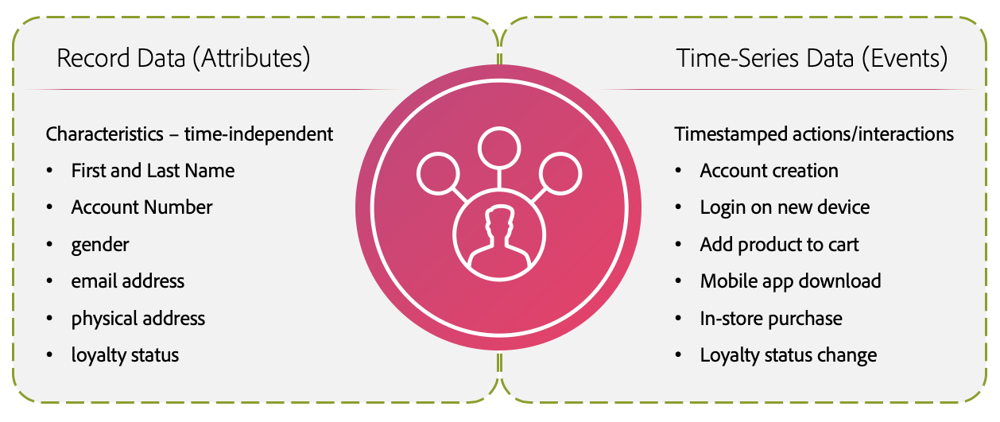

# Standaardgeleiding voor [!DNL Real-time Customer Profile] data

Met Adobe Experience Platform kunt u persoonlijke interkanaalervaringen bieden op basis van gedragsinzichten en klantkenmerken in de vorm van realtime klantprofielen. Om deze nieuwe benadering van profielen te steunen, gebruikt Experience Platform een hoogst gedenormaliseerd hybride gegevensmodel dat van het traditionele relationele gegevensmodel verschilt.

Dit document bevat standaardgebruiks- en tarieflimieten waarmee u uw profielgegevens kunt modelleren voor optimale systeemprestaties. Bij het bekijken van de volgende instructies wordt aangenomen dat u de gegevens correct hebt gemodelleerd. Als u vragen hebt over het modelleren van uw gegevens, neemt u contact op met uw medewerker van de klantenservice.

>[!NOTE]
>
>De meeste klanten overschrijden deze standaardgrenzen niet. Neem contact op met uw medewerker van de klantenservice als u meer wilt weten over aangepaste limieten.

## Aan de slag

De volgende services van het Experience Platform zijn betrokken bij het modelleren van gegevens van het realtime klantprofiel:

* [[!DNL Real-time Customer Profile]](home.md): Uniforme consumentenprofielen maken met gegevens uit meerdere bronnen.
* [Identiteiten](../identity-service/home.md): De identiteiten van de brug van ongelijksoortige gegevensbronnen aangezien zij in Platform worden opgenomen.
* [Schemas](../xdm/home.md): De schema&#39;s van het Model van de Gegevens van de ervaring (XDM) zijn het gestandaardiseerde kader waardoor het Platform gegevens van de klantenervaring organiseert.
* [Segmenten](../segmentation/home.md): De segmenteringsmotor binnen Platform wordt gebruikt om segmenten van uw klantenprofielen tot stand te brengen die op klantengedrag en attributen worden gebaseerd.

## Limiettypen

Dit document bevat twee typen standaardlimieten:

* **Zachte limiet:** Het is mogelijk om verder te gaan dan een zachte limiet, maar zachte limieten bieden een aanbevolen richtlijn voor systeemprestaties.

* **Harde limiet:** Een harde grens verstrekt een absoluut maximum.

>[!NOTE]
>
>De limieten die in dit document worden uiteengezet, worden voortdurend verbeterd. Kom regelmatig terug voor updates. Neem contact op met uw vertegenwoordiger van de klantenservice als u meer wilt weten over aangepaste limieten.

## Gegevensmodellimieten

De volgende instructies bieden aanbevolen limieten bij het modelleren van gegevens in realtime-klantprofiel. Zie de sectie over primaire entiteiten en dimensie-entiteiten voor meer informatie over primaire entiteiten en dimensie-entiteiten [entiteitstypen](#entity-types) in het aanhangsel.

### Primaire entiteitsinstructies

| Guardrail | Limiet | Limiettype | Beschrijving |
| --- | --- | --- | --- |
| Gegevenssets voor de klasse XDM Individueel profiel | 20 | Zacht | Een maximum van 20 datasets die hefboomwerking de individuele klasse van het Profiel XDM wordt geadviseerd. |
| Gegevenssets voor de klasse XDM ExperienceEvent | 20 | Zacht | Een maximum van 20 datasets die hefboomwerking de klasse XDM ExperienceEvent wordt geadviseerd. |
| Gegevenssets van Adobe Analytics-rapportsuite ingeschakeld voor profiel | 1 | Zacht | Een maximum van één (1) dataset van de het rapportreeks van Analytics zou voor Profiel moeten worden toegelaten. Het proberen om veelvoudige datasets van de het rapportreeks van Analytics voor Profiel toe te laten kan onbedoelde gevolgen voor gegevenskwaliteit hebben. Zie de sectie over [Adobe Analytics-gegevenssets](#aa-datasets) in het aanhangsel. |
| Relaties met meerdere entiteiten | 5 | Zacht | Er worden maximaal vijf relaties tussen primaire entiteiten en dimensie-entiteiten aanbevolen. Aanvullende relatietoewijzingen moeten pas worden gemaakt wanneer een bestaande relatie is verwijderd of uitgeschakeld. |
| JSON-diepte voor id-veld gebruikt in relatie met meerdere entiteiten | 4 | Zacht | De aanbevolen maximale JSON-diepte voor een id-veld in relaties met meerdere entiteiten is 4. Dit betekent dat in een hoogst genest schema, gebieden die meer dan 4 niveaus diep worden genesteld niet als gebied van identiteitskaart in een verhouding zouden moeten worden gebruikt. |
| Arraycardinaliteit in een profielfragment | &lt;=500 | Zacht | De optimale arraycardinaliteit in een profielfragment (tijdonafhankelijke gegevens) is &lt;=500. |
| Array-kardinaliteit in ExperienceEvent | &lt;=10 | Zacht | De optimale arraycardinaliteit in een ExperienceEvent (tijdreeksgegevens) is &lt;=10. |
| Identiteitstelling voor individueel profiel Identiteitsgrafiek | 50 | Hard | **Het maximumaantal identiteiten in een identiteitsgrafiek voor een individueel profiel is 50.** Profielen met meer dan 50 identiteiten worden uitgesloten van segmentatie, export en lookups. |

{style=&quot;table-layout:auto&quot;}

### Dimension-entiteitsgeleidingen

| Guardrail | Limiet | Limiettype | Beschrijving |
| --- | --- | --- | --- |
| Geen gegevens uit tijdreeksen toegestaan voor niet-[!DNL XDM Individual Profile] entiteiten | 0 | Hard | **Gegevens uit tijdreeksen zijn niet toegestaan voor niet-tijdreeksen[!DNL XDM Individual Profile] entiteiten in de profielservice.** Als een reeks gegevensreeksen met een niet-reeks wordt geassocieerd[!DNL XDM Individual Profile] ID, de dataset zou niet moeten worden toegelaten voor [!DNL Profile]. |
| Geen geneste relaties | 0 | Zacht | U moet geen relatie maken tussen twee niet-[!DNL XDM Individual Profile] schema&#39;s. De capaciteit om verhoudingen tot stand te brengen wordt niet geadviseerd voor om het even welke schema&#39;s die geen deel van zijn [!DNL Profile] samenvoegingsschema. |
| JSON-diepte voor veld primaire id | 4 | Zacht | De aanbevolen maximale JSON-diepte voor het veld primaire id is 4. Dit betekent dat in een hoogst genest schema, u geen gebied als primaire identiteitskaart zou moeten selecteren als het meer dan 4 niveaus diep wordt genesteld. Een veld op het vierde geneste niveau kan als primaire id worden gebruikt. |

{style=&quot;table-layout:auto&quot;}

## Limieten voor gegevensgrootte

De volgende instructies verwijzen naar de gegevensgrootte en bieden aanbevolen limieten voor gegevens die kunnen worden ingevoerd, opgeslagen en opgevraagd, zoals bedoeld. Zie de sectie over primaire entiteiten en dimensie-entiteiten voor meer informatie over primaire entiteiten en dimensie-entiteiten [entiteitstypen](#entity-types) in het aanhangsel.

>[!NOTE]
>
>De gegevensgrootte wordt gemeten als ongecomprimeerde gegevens in JSON op het moment van inname.

### Primaire entiteitsinstructies

| Guardrail | Limiet | Limiettype | Beschrijving |
| --- | --- | --- | --- |
| Maximale grootte ExperienceEvent | 10 KB | Hard | **De maximale grootte van een gebeurtenis is 10 kB.** De inname gaat door, maar alle gebeurtenissen die groter zijn dan 10 kB gaan verloren. |
| Maximale recordgrootte profiel | 100 kB | Hard | **De maximale grootte van een profielrecord is 100 kB.** De inname gaat door, maar profielrecords die groter zijn dan 100 kB worden verwijderd. |
| Maximale framegrootte profiel | 50 MB | Hard | **De maximale grootte van één profielfragment is 50 MB.** De segmentatie, de uitvoer, en de raadplegingen kunnen voor om het even welke ontbreken [profielfragment](#profile-fragments) dat groter is dan 50 MB. |
| Maximale grootte voor profielopslag | 50 MB | Zacht | **De maximale grootte van een opgeslagen profiel is 50 MB.** Nieuw toevoegen [profielfragmenten](#profile-fragments) in een profiel dat groter is dan 50 MB, de systeemprestaties beïnvloeden. Een profiel kan bijvoorbeeld één fragment bevatten dat 50 MB is of meerdere fragmenten kan bevatten voor meerdere datasets met een gecombineerde totale grootte van 50 MB. Het opslaan van een profiel met één fragment dat groter is dan 50 MB of meerdere fragmenten die samen meer dan 50 MB groot zijn, heeft invloed op de systeemprestaties. |
| Aantal per dag ingenomen Profile- of ExperienceEvent-batches | 90 | Zacht | **Het maximumaantal per dag ingenomen Profile of ExperienceEvent-batches is 90.** Dit houdt in dat het gecombineerde totaal van de elke dag ingeslikte Profile en ExperienceEvent batches niet meer dan 90 mag bedragen. Door extra batches in te voeren worden de systeemprestaties beïnvloed. |

{style=&quot;table-layout:auto&quot;}

### Dimension-entiteitsgeleidingen

| Guardrail | Limiet | Limiettype | Beschrijving |
| --- | --- | --- | --- |
| Totale grootte voor alle dimensionale entiteiten | 5 GB | Zacht | De aanbevolen totale grootte voor alle dimensionale entiteiten is 5 GB. Het inzetten van entiteiten met een grote dimensie kan van invloed zijn op de systeemprestaties. Het wordt bijvoorbeeld niet aanbevolen een productcatalogus van 10 GB als een dimensie-entiteit te laden. |
| Datasets per dimensionaal eenheidschema | 5 | Zacht | Het wordt aanbevolen maximaal vijf datasets toe te voegen aan elk dimensionaal eenheidschema. Bijvoorbeeld, als u een schema voor &quot;producten&quot;creeert en vijf bijdragende datasets toevoegt, zou u geen zesde dataset moeten creëren verbonden aan het productschema. |
| Per dag ingenomen partijen van Dimension-entiteit | 4 per entiteit | Zacht | Het aanbevolen maximumaantal per dag ingeslikte batches voor dimensieentiteiten is 4 per entiteit. U kunt bijvoorbeeld updates van een productcatalogus tot vier keer per dag invoeren. Het invoeren van extra dimensieentiteitsbatches voor dezelfde entiteit kan de systeemprestaties beïnvloeden. |

{style=&quot;table-layout:auto&quot;}

## Segmenteringsgeleiding

De instructies in deze sectie verwijzen naar het aantal en de aard van de segmenten die een organisatie binnen het Experience Platform kan maken, en naar het toewijzen en activeren van segmenten aan bestemmingen.

| Guardrail | Limiet | Limiettype | Beschrijving |
| --- | --- | --- | --- |
| Segmenten per sandbox | 4000 | Zacht | Een organisatie kan in totaal meer dan 4000 segmenten hebben, zolang er minder dan 4000 segmenten in elke afzonderlijke sandbox zijn. Het maken van extra segmenten kan van invloed zijn op de systeemprestaties. |
| Streaming segmenten per sandbox | 500 | Zacht | Een organisatie kan in totaal meer dan 500 streaming segmenten hebben, zolang er zich in elke sandbox minder dan 500 streaming segmenten bevinden. Het maken van extra streaming segmenten kan van invloed zijn op de systeemprestaties. |
| Batchsegmenten per sandbox | 4000 | Zacht | Een organisatie kan in totaal meer dan 4000 batchsegmenten hebben, zolang er zich in elke sandbox minder dan 4000 batchsegmenten bevinden. Het maken van extra batchsegmenten kan van invloed zijn op de systeemprestaties. |

{style=&quot;table-layout:auto&quot;}

## Aanhangsel

Deze sectie bevat aanvullende details voor de limieten in dit document.

### Typen entiteiten

De [!DNL Profile] opslaggegevensmodel bestaat uit twee kerneenheidstypen:

* **Primaire entiteit:** Een primaire entiteit, of profielentiteit, voegt gegevens samen om een &quot;enige bron van waarheid&quot;voor een individu te vormen. Deze verenigde gegevens worden vertegenwoordigd gebruikend wat als &quot;verenigingsmening&quot;wordt bekend is. Een verenigingsmening voegt de gebieden van alle schema&#39;s samen die de zelfde klasse in één enkel samenvoegingsschema uitvoeren. Het samenvoegingsschema voor [!DNL Real-time Customer Profile] is een gedenormaliseerd hybride gegevensmodel dat als container voor alle profielattributen en gedragsgebeurtenissen dienst doet.

   Tijdonafhankelijke kenmerken, ook bekend als &quot;recordgegevens&quot;, worden gemodelleerd met behulp van [!DNL XDM Individual Profile], terwijl tijdreeksgegevens, ook wel &quot;gebeurtenisgegevens&quot; genoemd, worden gemodelleerd met [!DNL XDM ExperienceEvent]. Als in Adobe Experience Platform record- en tijdreeksgegevens worden ingevoerd, wordt dit geactiveerd [!DNL Real-time Customer Profile] beginnen gegevens in te voeren die voor het gebruik ervan zijn ingeschakeld. Hoe meer interacties en details worden opgenomen, hoe robuuster de afzonderlijke profielen worden.

   

* **Dimension-entiteit:** Hoewel de profielgegevensopslag het handhaven van profielgegevens geen relationele opslag is, staat het Profiel integratie met kleine afmetingsentiteiten toe om segmenten op een vereenvoudigde en intuïtieve manier tot stand te brengen. Deze integratie wordt bekend als [segmentatie van meerdere entiteiten](../segmentation/multi-entity-segmentation.md). Uw organisatie kan ook klassen XDM bepalen om dingen buiten individuen, zoals opslag, producten, of eigenschappen te beschrijven. Deze[!DNL XDM Individual Profile] schema&#39;s worden &quot;dimensie-entiteiten&quot; genoemd en bevatten geen tijdreeksgegevens. Dimension-entiteiten bieden opzoekgegevens die de segmentatieprogramma&#39;s van meerdere entiteiten ondersteunen en vereenvoudigen. Deze moeten zo klein zijn dat de gehele gegevensset door de segmenteringsengine in het geheugen kan worden geladen voor optimale verwerking (snelle puntzoekopdracht).

   

### Profielfragmenten

In dit document zijn er verschillende hulplijnen die naar &quot;profielfragmenten&quot; verwijzen. In Experience Platform worden meerdere profielfragmenten samengevoegd tot het realtime klantprofiel. Elk fragment vertegenwoordigt een unieke primaire identiteit en de overeenkomstige record- of gebeurtenisgegevens voor die id binnen een bepaalde gegevensset. Raadpleeg voor meer informatie over profielfragmenten de [Profieloverzicht](home.md#profile-fragments-vs-merged-profiles).

### Beleid samenvoegen {#merge-policies}

Wanneer het samenbrengen van gegevens uit veelvoudige bronnen, is het fusiebeleid de regels die het Platform gebruikt om te bepalen hoe de gegevens aan voorrang zullen worden gegeven en welke gegevens zullen worden gecombineerd om die verenigde mening tot stand te brengen. Bijvoorbeeld, als een klant met uw merk over verscheidene kanalen in wisselwerking staat, zal uw organisatie veelvoudige profielfragmenten met betrekking tot die enige klant hebben die in veelvoudige datasets verschijnen. Wanneer deze fragmenten in Platform worden opgenomen, worden ze samengevoegd om één profiel voor die klant te maken. Wanneer de gegevens uit meerdere bronnen conflicteren, bepaalt het samenvoegbeleid welke informatie moet worden opgenomen in het profiel voor de persoon. Een maximum van vijf (5) samenvoegbeleid wordt toegestaan per organisatie. Voor meer informatie over samenvoegingsbeleid leest u de [overzicht van samenvoegbeleid](merge-policies/overview.md).

### Gegevenssets van de Adobe Analytics-rapportsuite in Platform {#aa-datasets}

Een maximum van één (1) dataset van de het rapportreeks van Adobe Analytics zou voor Profiel moeten worden toegelaten. Dit is een zachte grens, die betekent dat u meer dan één dataset van de Analyse voor Profiel kunt toelaten, maar het wordt niet geadviseerd omdat het onbedoelde gevolgen voor uw gegevens kan hebben. Dit is toe te schrijven aan de verschillen tussen schema&#39;s van het Gegevensmodel van de Ervaring (XDM), die de semantische structuur voor gegevens in Experience Platform verstrekken en voor consistentie in gegevensinterpretatie, en de klantgerichte aard van eVars en omzettingsvariabelen in Adobe Analytics toestaan.

In Adobe Analytics kan een enkele organisatie bijvoorbeeld meerdere rapportensuites hebben. Als rapportsuite A eVar 4 aanwijst als &#39;interne zoekterm&#39; en rapportsuite B eVar 4 aanwijst als &#39;verwijzend domein&#39;, worden deze waarden in hetzelfde veld in Profiel opgenomen, wat verwarring en een verslechterende gegevenskwaliteit veroorzaakt.
