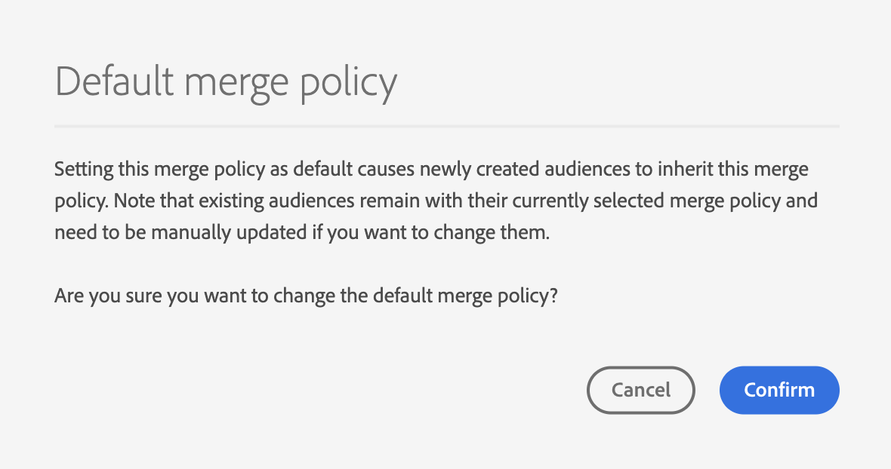

# UI-gids voor samenvoegen

Met Adobe Experience Platform kunt u gegevensfragmenten uit meerdere bronnen samenvoegen en combineren om een volledig beeld van elk van uw individuele klanten te krijgen. Wanneer u deze gegevens samenbrengt, zijn samenvoegbeleidsregels de regels die [!DNL Experience Platform] gebruikt om te bepalen hoe de prioriteit van gegevens wordt bepaald en welke gegevens worden gecombineerd om de verenigde weergave te maken.

Gebruikend RESTful APIs of het gebruikersinterface, kunt u nieuw samenvoegbeleid tot stand brengen, bestaand beleid beheren, en een standaardsamenvoegbeleid voor uw organisatie plaatsen. Deze handleiding bevat stapsgewijze instructies voor het werken met samenvoegbeleidsregels via de gebruikersinterface van Adobe Experience Platform (UI).

Om meer over fusiebeleid te leren en zij rol zij binnen Experience Platform spelen, gelieve te beginnen door het [&#x200B; overzicht van het fusiebeleid &#x200B;](overview.md) te lezen.

## Aan de slag

Deze handleiding vereist een goed begrip van verschillende belangrijke functies van [!DNL Experience Platform] . Lees de documentatie voor de volgende services voordat u deze handleiding volgt:

* [&#x200B; Real-Time Profiel van de Klant &#x200B;](../home.md): Verstrekt een verenigd, real-time consumentenprofiel dat op samengevoegde gegevens van veelvoudige bronnen wordt gebaseerd.
* [&#x200B; de Dienst van de Identiteit van Adobe Experience Platform &#x200B;](../../identity-service/home.md): Laat Real-Time het Profiel van de Klant toe door identiteiten van ongelijke gegevensbronnen te overbruggen die in [!DNL Experience Platform] worden opgenomen.
* [&#x200B; Model van de Gegevens van de Ervaring (XDM) &#x200B;](../../xdm/home.md): Het gestandaardiseerde kader waardoor [!DNL Experience Platform] gegevens van de klantenervaring organiseert.

## Samenvoegbeleid weergeven {#view-merge-policies}

>[!CONTEXTUALHELP]
>id="platform_errors_uplib_101221_404"
>title="Samenvoegbeleid niet gevonden"
>abstract="Dit betekent dat Experience Platform het gewenste samenvoegingsbeleid niet kon vinden. Probeer een van de volgende oplossingen om deze fout op te lossen:<ul><li>Controleer of de juiste id voor het samenvoegbeleid in de URL wordt vermeld.</li><li>Zorg ervoor dat u de juiste organisatie- en sandboxcombinatie hebt voor het samenvoegbeleid waartoe u toegang probeert te krijgen.</li></ul>"

In de gebruikersinterface van [!DNL Experience Platform] kunt u beginnen met het gebruik van samenvoegingsbeleid door **[!UICONTROL Profiles]** te selecteren in de linkernavigatie en vervolgens het tabblad **[!UICONTROL Merge Policies]** te selecteren.

Dit lusje omvat een lijst van al bestaand samenvoegingsbeleid voor uw organisatie, evenals details voor elk fusiebeleid met inbegrip van de beleidsnaam, al dan niet het fusiebeleid het standaardfusiebeleid is, en de schemaklasse waarop het fusiebeleid betrekking heeft.

Om te selecteren welke details zichtbaar zijn, of om extra kolommen aan de vertoning toe te voegen, selecteer  en selecteer een kolomnaam om het van mening toe te voegen of te verwijderen.

## Samenvoegbeleid maken {#create-a-merge-policy}

Als u een nieuw samenvoegbeleid wilt maken, selecteert u **[!UICONTROL Create merge policy]** op het tabblad Samenvoegbeleid om de nieuwe werkstroom voor samenvoegingsbeleid in te voeren.

Voor de **[!UICONTROL New merge policy]** -workflow moet u belangrijke informatie voor het nieuwe samenvoegbeleid opgeven via een aantal stappen. Deze stappen worden beschreven in de volgende secties.

## [!UICONTROL Configure] {#configure}

De eerste stap in het werkschema staat u toe om uw samenvoegbeleid te vormen door basisinformatie te verstrekken. Deze informatie omvat:

* **[!UICONTROL Name]**: De naam van het samenvoegbeleid moet beschrijvend maar beknopt zijn.
* **[!UICONTROL Schema class]**: De XDM-schemaklasse die aan het samenvoegbeleid is gekoppeld. This specifies the schema class for which this merge policy is created. Organisaties kunnen meerdere samenvoegbeleidsregels per schemaklasse maken. Momenteel is alleen de klasse [!UICONTROL XDM Individual Profile] beschikbaar in de gebruikersinterface. U kunt een voorbeeld van het samenvoegingsschema voor de schemaklasse bekijken door **[!UICONTROL View Union Schema]** te selecteren. Voor meer informatie, zie de sectie over [&#x200B; het bekijken van het unieschema &#x200B;](#view-union-schema) dat volgt.
* **[!UICONTROL ID stitching]**: In dit veld wordt gedefinieerd hoe de verwante identiteiten van een klant worden bepaald. Er zijn twee mogelijke waarden voor identiteitsstitching, en het is belangrijk om te begrijpen hoe het type van identiteitsstitching dat u selecteert uw gegevens zal beïnvloeden. Om meer te leren, te verwijzen gelieve naar het [&#x200B; overzicht van het samenvoegbeleid &#x200B;](overview.md).
   * **[!UICONTROL None]**: voer geen identiteitsstitching uit.
   * **[!UICONTROL Private Graph]**: identiteitsstitching uitvoeren op basis van uw persoonlijke identiteitsgrafiek.
* **[!UICONTROL Default merge policy]**: Een schakelknop waarmee u kunt bepalen of dit samenvoegbeleid al dan niet de standaardinstelling voor uw organisatie is. Als de kiezer is ingeschakeld, wordt een waarschuwing weergegeven met de vraag of u het standaardsamenvoegbeleid van uw organisatie wilt wijzigen. Zie het [&#x200B; overzicht van het samenvoegingsbeleid &#x200B;](overview.md) om meer over standaardsamenvoegingsbeleid te leren.
  
* **[!UICONTROL Active-On-Edge Merge Policy]**: Een schakelknop waarmee u kunt bepalen of dit samenvoegbeleid al dan niet actief is aan de rand. Om ervoor te zorgen dat alle profielgebruikers met dezelfde weergave aan de randen werken, kan het samenvoegbeleid als actief aan de rand worden gemarkeerd. Een publiek kan alleen aan de rand worden geactiveerd (gemarkeerd als een randpubliek) als het is gekoppeld aan een samenvoegbeleid dat als actief aan de rand is gemarkeerd. Als een publiek **niet** gebonden aan een fusiebeleid is dat als actief op rand duidelijk is, zal het publiek niet als actief op rand worden gemerkt, en zal als het stromen publiek worden gemerkt. Bovendien, kan elke zandbak in een Organisatie **slechts één** fusiebeleid hebben dat op rand actief is.

Nadat de vereiste velden zijn voltooid, kunt u **[!UICONTROL Next]** selecteren om door te gaan met de workflow.

## [!UICONTROL View Union Schema] {#view-union-schema}

Wanneer u een samenvoegbeleid maakt of bewerkt, kunt u het samenvoegingsschema voor de gekozen schema-klasse weergeven door **[!UICONTROL View Union Schema]** te selecteren.

Hiermee opent u het dialoogvenster [!UICONTROL View Union Schema] waarin alle bijdragende schema&#39;s, identiteiten en relaties worden weergegeven die aan het samenvoegingsschema zijn gekoppeld. U kunt het dialoogvenster gebruiken om het samenvoegingsschema te verkennen op dezelfde manier als u zou doen door het tabblad [!UICONTROL Union Schema] in het gedeelte [!UICONTROL Profiles] van de gebruikersinterface van Experience Platform te openen.

Voor gedetailleerde informatie over unieschema&#39;s, met inbegrip van hoe te met hen in het [!UICONTROL Union Schema] lusje of de [!UICONTROL View Union Schema] dialoog in het werkschema van het fusiebeleid wordt getoond, gelieve de [&#x200B; gids UI van het unieschema &#x200B;](../ui/union-schema.md) te bezoeken.

## [!UICONTROL Select Profile datasets] {#select-profile-datasets}

In het scherm **[!UICONTROL Select Profile datasets]** moet u de **[!UICONTROL Merge method]** selecteren die u voor het samenvoegbeleid wilt gebruiken. Ook weergegeven op het scherm is het totale aantal [!UICONTROL Profile datasets] in uw organisatie dat betrekking heeft op de schemaklasse die is geselecteerd op het vorige scherm.

Afhankelijk van de samenvoegmethode die u kiest, zullen alle datasets van het Profiel door de orde worden samengevoegd waarin zij (timestamp bevolen) laatst werden bijgewerkt of u zult moeten selecteren welke datasets van het Profiel in het fusiebeleid en de orde omvatten waarin om hen (datasetbelangrijkheid) samen te voegen.

Voor meer informatie over fusiemethodes, gelieve te verwijzen naar het [&#x200B; overzicht van het fusiebeleid &#x200B;](overview.md).

>[!BEGINTABS]

>[!TAB  geordende timestamp ]

Als u **[!UICONTROL Timestamp ordered]** selecteert als samenvoegmethode, hebben kenmerken van de meest recente bijgewerkte gegevenssets voorrang. Dit geldt voor alle profielgegevenssets.

>[!NOTE]
>
>Het getal tussen haakjes naast **[!UICONTROL Profile datasets]** (bijvoorbeeld `(37)` in de getoonde afbeelding) geeft het totale aantal profielgegevenssets weer dat wordt opgenomen.

>[!TAB  de belangrijkheid van de Dataset ]

Als u **[!UICONTROL Dataset precedence]** selecteert als samenvoegmethode, moet u Profielgegevenssets selecteren en handmatig voorrang geven aan deze gegevenssets. Elke vermelde dataset omvat ook de status van de laatste partij die wordt opgenomen of toont een bericht dat geen partijen in die dataset zijn opgenomen.

U kunt tot 50 datasets van de datasetlijst selecteren om in het fusiebeleid te omvatten.

>[!NOTE]
>
>Het getal tussen haakjes naast **[!UICONTROL Profile datasets]** (bijvoorbeeld `(37)` in de weergegeven afbeelding) geeft het totale aantal profielgegevenssets weer dat beschikbaar is voor selectie.

Als datasets zijn geselecteerd, worden deze toegevoegd aan de sectie **[!UICONTROL Select datasets]** , zodat u de gegevenssets kunt slepen en neerzetten en volgens de gewenste prioriteit kunt rangschikken. Aangezien de datasets in de lijst worden aangepast, zal rangschikken (1, 2, 3, enz.) naast de dataset bijwerken, tonend prioriteit (1 die de hoogste prioriteit wordt gegeven, dan 2, en verder).

Als u een gegevensset selecteert, wordt ook de sectie **[!UICONTROL Union schema]** bijgewerkt, waarin de velden in het samenvoegingsschema worden weergegeven waaraan elke gegevensset gegevens levert. Voor meer informatie over verenigingsschema&#39;s, met inbegrip van hoe te met de visualisaties in UI in wisselwerking te staan, gelieve de [&#x200B; gids van het uniesschema UI &#x200B;](../ui/union-schema.md) te verwijzen

>[!ENDTABS]

## [!UICONTROL Select ExperienceEvent datasets] {#select-experienceevent-datasets}

De volgende stap in het werkschema vereist u om datasets te selecteren ExperienceEvent. Dit scherm wordt beïnvloed door de fusiemethode die u op het [[!UICONTROL Select Profile datasets]](#select-profile-datasets) scherm selecteerde.

>[!BEGINTABS]

>[!TAB  geordende timestamp ]

Als u **[!UICONTROL Timestamp ordered]** als samenvoegmethode voor de datasets van het Profiel selecteerde, zullen de attributen van de onlangs bijgewerkte datasets ExperienceEvent ook hier belangrijkheid nemen.

>[!NOTE]
>
>Het aantal tussen haakjes naast **[!UICONTROL ExperienceEvent datasets]** (bijvoorbeeld, `(1)` in het getoonde beeld) toont het totale aantal datasets ExperienceEvent die door uw organisatie worden gecreeerd die op de schemaklasse betrekking hebben die u op het scherm van de configuratieconfiguratie van het fusiebeleid selecteerde.

>[!TAB  de belangrijkheid van de Dataset ]

Als u **[!UICONTROL Dataset precedence]** als samenvoegmethode voor de datasets van het Profiel selecteerde, zult u te omvatten datasets moeten selecteren ExperienceEvent. U kunt tot 50 datasets ExperienceEvent van de datasetlijst selecteren.

>[!NOTE]
>
>Het aantal tussen haakjes naast **[!UICONTROL ExperienceEvent datasets]** (bijvoorbeeld, `(1)` in het getoonde beeld) toont het totale aantal datasets ExperienceEvent die door uw organisatie worden gecreeerd die op de schemaklasse betrekking hebben die u op het scherm van de configuratieconfiguratie van het fusiebeleid selecteerde.

Terwijl gegevenssets zijn geselecteerd, worden deze weergegeven in de sectie [!UICONTROL Select datasets] .

De datasets van ExperienceEvent kunnen niet manueel worden bevolen, in plaats daarvan worden de attributen in de datasets ExperienceEvent toegevoegd aan de datasets van het Profiel als zij deel van het zelfde profielfragment uitmaken.

Net als bij het selecteren van profielgegevenssets wordt door het selecteren van een ExperienceEvent-gegevensset ook de sectie **[!UICONTROL Union schema]** bijgewerkt, waarin de velden in het samenvoegingsschema worden weergegeven waaraan elke gegevensset gegevens levert. Voor meer informatie over unieschema&#39;s, met inbegrip van hoe te met de visualisaties in UI in wisselwerking te staan, gelieve de [&#x200B; gids UI van het unieschema &#x200B;](../ui/union-schema.md) te verwijzen.

>[!ENDTABS]

## [!UICONTROL Review] {#review}

De laatste stap in de workflow is het controleren van het samenvoegbeleid. In het scherm **[!UICONTROL Review]** wordt informatie weergegeven over het samenvoegbeleid, waaronder de geselecteerde methode voor id-stitching, de geselecteerde samenvoegmethode en de opgenomen datasets. (Als u alle meegeleverde profiel- of ExperienceEvent-gegevenssets wilt weergeven, selecteert u het aantal gegevenssets waarmee u de vervolgkeuzelijst wilt uitvouwen.)

Op het revisiescherm vindt u ook de tabel **[!UICONTROL Preview data]** met voorbeeldprofielrecords die uw samenvoegbeleid gebruiken. Zo kunt u een voorvertoning bekijken van een klantprofiel voordat u het samenvoegbeleid opslaat.

Controleer of u de configuratie van het samenvoegbeleid en de voorbeeldgegevens zorgvuldig controleert voordat u **[!UICONTROL Finish]** selecteert om de aanmaakworkflow te voltooien.

>[!BEGINTABS]

>[!TAB  geordende timestamp ]

Als u **[!UICONTROL Timestamp ordered]** als fusiemethode voor uw samenvoegbeleid selecteerde, omvat de lijst van de datasets van het Profiel alle datasets die door uw organisatie met betrekking tot de schemacategorie, in volgorde van timestamp zijn gecreeerd. De lijst van datasets ExperienceEvent omvat alle datasets die uw organisatie voor de gekozen schemaklasse heeft gecreeerd en aan de datasets van het Profiel zal worden toegevoegd.

De tabel **[!UICONTROL Preview data]** bevat voorbeeldprofielrecords die zijn gebaseerd op een tijdstempelvolgorde van de gegevenssets. Zo kunt u een voorvertoning bekijken van een klantprofiel voordat u het samenvoegbeleid opslaat.

Selecteer **[!UICONTROL Finish]** om een nieuw samenvoegbeleid te maken.

>[!TAB  de belangrijkheid van de Dataset ]

Als u **[!UICONTROL Dataset precedence]** als samenvoegmethode voor uw samenvoegbeleid selecteerde, omvatten de lijsten van Profiel en de datasets ExperienceEvent slechts de datasets van het Profiel en van ExperienceEvent die u tijdens het creatiewerkschema selecteerde, respectievelijk. De volgorde van de profielgegevenssets moet overeenkomen met de prioriteit die u tijdens het maken hebt opgegeven. Als dit niet het geval is, gebruikt u de knop [!UICONTROL Back] om terug te keren naar de vorige workflowstappen en de prioriteit aan te passen.

In de tabel **[!UICONTROL Preview data]** worden voorbeeldprofielrecords weergegeven die de geselecteerde gegevenssets gebruiken. Zo kunt u een voorvertoning bekijken van een klantprofiel voordat u het samenvoegbeleid opslaat.

Selecteer **[!UICONTROL Finish]** om een nieuw samenvoegbeleid te maken.

>[!ENDTABS]

## Een samenvoegingsbeleid bewerken {#edit}

Via het tabblad [!UICONTROL Merge Policies] kunt u een bestaand samenvoegbeleid dat voor de [!DNL XDM Individual Profile] -klasse is gemaakt, wijzigen door de **[!UICONTROL Policy name]** te selecteren voor het samenvoegbeleid dat u wilt bewerken.

Wanneer het scherm **[!UICONTROL Edit merge policy]** wordt weergegeven, kunt u de naam en de methode [!UICONTROL ID stitching] wijzigen en wijzigen of dit beleid het standaardsamenvoegbeleid voor uw organisatie is.

Selecteer **[!UICONTROL Next]** om door de werkstroom van het fusiebeleid verder te gaan om de fusiemethode en datasets inbegrepen in het fusiebeleid bij te werken.

Nadat u de benodigde wijzigingen hebt aangebracht, controleert u het samenvoegbeleid en selecteert u **[!UICONTROL Finish]** om de wijzigingen op te slaan en terug te keren naar het tabblad [!UICONTROL Merge policies] .

>[!WARNING]
>
>Het wijzigen van een samenvoegbeleid kan invloed hebben op segmentatie en profielresultaten, omdat dit de manier wijzigt waarop gegevensconflicten worden opgelost. Controleer de wijzigingen in het samenvoegbeleid zorgvuldig voordat u ze opslaat.

## Schendingen van het beleid inzake gegevensbeheer

Wanneer het creëren van of het bijwerken van een samenvoegbeleid, wordt een controle uitgevoerd om te bepalen als het fusiebeleid om het even welk beleid van het gegevensgebruik schendt dat door uw organisatie wordt bepaald. Het beleid voor gegevensgebruik maakt deel uit van Adobe Experience Platform Data Governance en is een regel die het soort marketingacties beschrijft dat u mag uitvoeren op of mag beperken tot specifieke [!DNL Experience Platform] -gegevens.

Bijvoorbeeld, als een fusiebeleid werd gebruikt om een publiek tot stand te brengen dat aan een derdebestemming activeerde, en uw organisatie een beleid van het gegevensgebruik had dat de uitvoer van specifieke gegevens naar derden verhindert, zou u een **[!UICONTROL Data governance policy violation detected]** bericht wanneer het proberen om uw fusiebeleid te bewaren ontvangen.

Deze melding bevat een lijst met beleidsregels voor gegevensgebruik die zijn overtreden. U kunt de details van de schending bekijken door een beleid in de lijst te selecteren. Wanneer u een overtreden beleid selecteert, biedt het tabblad **[!UICONTROL Data lineage]** de reden voor de schending en de betrokken activering, elk met meer details over de manier waarop het beleid voor gegevensgebruik is overtreden.

Meer over leren hoe het gegevensbeheer binnen Adobe Experience Platform wordt uitgevoerd, gelieve te beginnen door het [&#x200B; overzicht van het Beleid van Gegevens te lezen &#x200B;](../../data-governance/home.md).

## Volgende stappen

Nu u samenvoegbeleid voor uw organisatie hebt gemaakt en geconfigureerd, kunt u deze gebruiken om de weergave van klantprofielen in Experience Platform aan te passen en om een publiek te maken op basis van uw profielgegevens. Zie het [&#x200B; segmentatieoverzicht &#x200B;](../../segmentation/home.md) voor meer informatie over om met publiek tot stand te brengen en te werken gebruikend [!DNL Experience Platform] UI en APIs.
