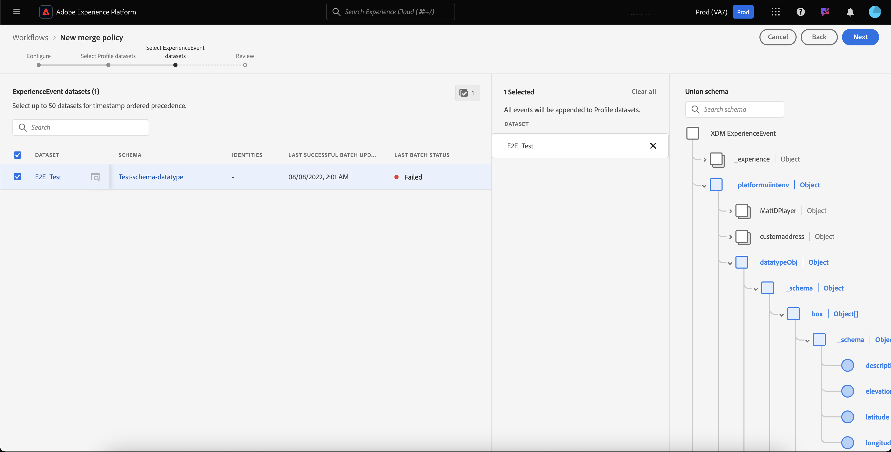

# UI-gids voor samenvoegen

Met Adobe Experience Platform kunt u gegevensfragmenten uit meerdere bronnen samenvoegen en combineren om een volledig beeld van elk van uw individuele klanten te krijgen. Wanneer het brengen van deze gegevens samen, zijn het fusiebeleid de regels die [!DNL Platform] gebruiken om te bepalen hoe de gegevens aan voorrang zullen worden gegeven en welke gegevens zullen worden gecombineerd om die verenigde mening tot stand te brengen.

Bijvoorbeeld, als een klant met uw merk over verscheidene kanalen in wisselwerking staat, zal uw organisatie veelvoudige profielfragmenten met betrekking tot die enige klant hebben die in veelvoudige datasets verschijnen. Wanneer deze fragmenten in Platform worden opgenomen, worden ze samengevoegd om één profiel voor die klant te maken. Wanneer de gegevens van veelvoudige bronnen conflicten (bijvoorbeeld één fragment maakt een lijst van de klant als &quot;enig&quot;terwijl de andere klant als &quot;gehuwd&quot;een lijst maakt) bepaalt het fusiebeleid welke informatie om in het profiel voor het individu te omvatten.

Gebruikend RESTful APIs of het gebruikersinterface, kunt u nieuw samenvoegbeleid tot stand brengen, bestaand beleid beheren, en een standaardsamenvoegbeleid voor uw organisatie plaatsen. Deze handleiding bevat stapsgewijze instructies voor het werken met samenvoegbeleidsregels via de gebruikersinterface van Adobe Experience Platform (UI).

Als u liever met de [!DNL Real-time Customer Profile] API werkt voor samenvoegbeleid, volgt u de instructies in de API-handleiding voor [samenvoegbeleid](../api/merge-policies.md).

## Aan de slag

Deze gids vereist een werkend inzicht in verscheidene belangrijke [!DNL Experience Platform] eigenschappen. Lees de documentatie voor de volgende services voordat u deze handleiding volgt of profiel-API&#39;s gebruikt:

* [Klantprofiel](../home.md)in realtime: Verstrekt een verenigd, real-time consumentenprofiel dat op bijeengevoegde gegevens van veelvoudige bronnen wordt gebaseerd.
* [Adobe Experience Platform Identity Service](../../identity-service/home.md): Laat het Profiel van de Klant in real time toe door identiteiten van ongelijke gegevensbronnen te overbruggen die in worden opgenomen [!DNL Platform].
* [XDM (Experience Data Model)](../../xdm/home.md): Het gestandaardiseerde kader waardoor de gegevens van de klantenervaring worden [!DNL Platform] georganiseerd.

## Methoden samenvoegen {#merge-methods}

Elk profielfragment bevat informatie voor slechts één identiteit van het totale aantal identiteiten dat voor een individu zou kunnen bestaan. Wanneer het samenvoegen van die gegevens om een klantenprofiel te vormen, is er het potentieel voor die informatie aan conflict en de prioriteit moet worden gespecificeerd. Het selecteren van een fusiemethode staat u toe om te specificeren welke datasetattributen om voorrang te geven als een fusieconflict tussen datasets voorkomt.

Er zijn twee mogelijke samenvoegmethoden beschikbaar voor het samenvoegbeleid. Elk van deze methoden wordt hieronder samengevat met aanvullende informatie in de volgende secties:

* **[!UICONTROL Tijdstempel geordend]:** In geval van een conflict wordt prioriteit gegeven aan het profielfragment dat het laatst is bijgewerkt.
   * **Aangepaste tijdstempels:** [!UICONTROL Tijdstempel dat is geordend] , ondersteunt ook aangepaste tijdstempels die voorrang hebben op systeemtijdstempels bij het samenvoegen van gegevens binnen dezelfde gegevensset (meerdere identiteiten) of over gegevenssets heen. Zie de sectie over het [gebruik van aangepaste tijdstempels](#custom-timestamps)voor meer informatie.
* **[!UICONTROL Prioriteit]gegevensset:** In geval van een conflict, geef prioriteit aan profielfragmenten die op de dataset worden gebaseerd waaruit zij kwamen. Wanneer het selecteren van deze optie, moet u de verwante datasets en hun orde van prioriteit kiezen.

### Tijdstempel geordend {#timestamp-ordered}

Aangezien profielverslagen in Experience Platform worden opgenomen, wordt een systeemtimestamp verkregen op het tijdstip van opneming en toegevoegd aan het verslag. Wanneer de geordende **** tijdstempel is geselecteerd als samenvoegmethode voor een samenvoegbeleid, worden profielen samengevoegd op basis van de tijdstempel van het systeem. Met andere woorden, het samenvoegen wordt uitgevoerd op basis van de tijdstempel voor het tijdstip waarop de record in het Platform is opgenomen.

#### Aangepaste tijdstempels gebruiken {#custom-timestamps}

Soms zijn er gebruiksgevallen waarin het nodig is een aangepaste tijdstempel op te geven en het samenvoegbeleid de aangepaste tijdstempel moet gebruiken in plaats van de systeemtijdstempel. Voorbeelden hiervan zijn het terugvullen van gegevens of het garanderen van de juiste volgorde van gebeurtenissen als records buiten de bestelling worden opgenomen.

Als u een aangepaste tijdstempel wilt gebruiken, moet u de **[!UICONTROL External Source System Audit Details Mixin]** toevoegen aan uw profielschema. Nadat u de aangepaste tijdstempel hebt toegevoegd, kunt u deze in het `lastUpdatedDate` veld vullen. Wanneer een verslag met het bevolkte `lastUpdatedDate` gebied wordt opgenomen, zal het Experience Platform dat gebied gebruiken om verslagen over datasets samen te voegen. Als `lastUpdatedDate` het Platform niet aanwezig of niet gevuld is, blijft het de tijdstempel van het systeem gebruiken.

>[!NOTE]
>
>U moet ervoor zorgen dat de `lastUpdatedDate` tijdstempel wordt gevuld wanneer u een update in dezelfde record opneemt.

In de volgende schermafbeelding worden de velden weergegeven in de [!UICONTROL External Source System Audit Details Mixin]. Voor geleidelijke instructies bij het werken met schema&#39;s die de interface van het Platform gebruiken, met inbegrip van hoe te om mengsels aan schema&#39;s toe te voegen, te bezoeken gelieve het [leerprogramma voor het creëren van een schema gebruikend UI](../../xdm/tutorials/create-schema-ui.md).

Als u met aangepaste tijdstempels wilt werken met de API, raadpleegt u de sectie met de gids voor het eindpunt van [samenvoegbeleid bij het gebruik van aangepaste tijdstempels](../api/merge-policies.md#custom-timestamps).

### Dataset-prioriteit {#dataset-precedence}

Wanneer de **[!UICONTROL voorkeur]** van de Dataset als fusiemethode voor een fusiebeleid wordt geselecteerd, kunt u prioriteit aan profielfragmenten geven die op de dataset worden gebaseerd waaruit zij kwamen. Een geval van het voorbeeldgebruik zou zijn als uw organisatie informatie aanwezig in één dataset had die over gegevens in een andere dataset voorkeur of vertrouwd is.

Om een samenvoegbeleid tot stand te brengen gebruikend **[!UICONTROL Dataset belangrijkheid]**, moet u de datasets van het Profiel en van ExperienceEvent selecteren die inbegrepen zijn en dan kunt u de datasets van het Profiel voor belangrijkheid manueel in orde brengen. Zodra de datasets zijn geselecteerd en bevolen, zal de hoogste dataset hoogste prioriteit worden gegeven, zal de tweede dataset tweede-hoogste zijn, etc.

## [!UICONTROL ID stitching] {#id-stitching}

Identiteitsstitching ([!UICONTROL ID stitching]) is het proces om gegevensfragmenten te identificeren en hen te combineren om een volledig profielverslag te vormen. Om het verschillende stitching gedrag te illustreren, overweeg één enkele klant die met een merk gebruikend twee verschillende e-mailadressen interactie aangaat.

* **[!UICONTROL Geen]:** Als deze optie is geselecteerd, worden id&#39;s niet aan elkaar gekoppeld. Wanneer segmentatie voorkomt, zullen de identiteiten die tot de zelfde persoon kunnen behoren niet samen worden vastgemaakt en de segmentatie zal slechts de attributen in aanmerking nemen verbonden aan elke individuele identiteitskaart wanneer het bepalen als een klant voor segmentlidmaatschap in aanmerking komt. Dit kan ertoe leiden dat één enkele klant veelvoudige profielen heeft en elk profiel voor verschillende segmenten in aanmerking zou kunnen komen, resulterend in veelvoudige marketing berichten die naar de zelfde klant worden verzonden.
* **[!UICONTROL Privégrafiek]:** Als de privégrafiek is geselecteerd, worden meerdere identiteiten met betrekking tot dezelfde persoon samengevoegd. Dit resulteert in de klant die één enkel profiel heeft en staat segmentatie toe om veelvoudige attributen van veelvoudige verwante identiteiten te overwegen wanneer het bepalen van segmentkwalificatie. In dit scenario zal de klant waarschijnlijk één profiel hebben, in aanmerking komen voor één segment op basis van de combinatie van kenmerken tussen identiteiten en slechts één marketingbericht ontvangen.

Om meer over identiteiten en hun rol in het produceren van profielen en segmenten te leren, gelieve te beginnen door het overzicht [van de Dienst van de](../../identity-service/home.md)Identiteit te lezen.

## Standaardsamenvoegbeleid {#default-merge-policy}

Een organisatie kan een standaardsamenvoegbeleid maken dat door haar organisatie kan worden gebruikt bij het samenvoegen van profielfragmenten. Op deze manier kunnen gebruikers het standaardbeleid eenvoudig selecteren wanneer ze handelingen uitvoeren in een Experience Platform, zoals het weergeven van klantprofielen of het maken van segmenten. In de meeste gevallen, tenzij een ander fusiebeleid wordt gespecificeerd, zal het standaardfusiebeleid worden gebruikt.

Elke organisatie kan veelvoudige fusiebeleid met betrekking tot één enkele XDM schemaklasse tot stand brengen, nochtans kunnen zij slechts één standaardsamenvoegbeleid hebben dat voor elke klasse wordt gedeclareerd. Uw organisatie zou bijvoorbeeld een standaardsamenvoegbeleid kunnen hebben met betrekking tot de [!DNL XDM Individual Profile] klasse en een ander standaardsamenvoegbeleid voor een op maat gemaakte klasse van de Inventaris van het Product.

Als u een nieuw samenvoegbeleid creeert en het plaatst als gebrek, zal het vorige standaardfusiebeleid automatisch door het systeem worden bijgewerkt om niet meer het gebrek te zijn.

>[!WARNING]
>
>De tellingen en de segmenten van het profiel met een bestaand bijbehorend standaardsamenvoegbeleid kunnen worden beïnvloed. Om het even welk segment dat een toegepast standaardsamenvoegingsbeleid heeft zal worden bijgewerkt aan het nieuwe standaardsamenvoegbeleid.

## Samenvoegbeleid weergeven {#view-merge-policies}

Binnen [!DNL Experience Platform] UI, kunt u beginnen met het werken met fusiebeleid door **[!UICONTROL Profielen]** in de linkernavigatie te selecteren en dan het lusje van het Beleid **[!UICONTROL van de]** Fusie te selecteren. Dit lusje omvat een lijst van al bestaand samenvoegingsbeleid voor uw organisatie, evenals details voor elk fusiebeleid met inbegrip van de beleidsnaam, al dan niet het fusiebeleid het standaardfusiebeleid is, en de schemaklasse waarop het fusiebeleid betrekking heeft.

Om te selecteren welke details zichtbaar zijn, of om extra kolommen aan de vertoning toe te voegen, **[!UICONTROL vorm kolommen]** en klik op een kolomnaam om het toe te voegen of te verwijderen uit mening.

## Samenvoegbeleid maken {#create-a-merge-policy}

Als u een nieuw samenvoegbeleid wilt maken, selecteert u Samenvoegbeleid **** maken op het tabblad Samenvoegbeleid.

Op het **[!UICONTROL Nieuwe de werkschemascherm van het samenvoegbeleid]** , kunt u belangrijke informatie voor uw nieuw fusiebeleid door een reeks geleide stappen verstrekken.

### [!UICONTROL Configureren] {#configure}

De eerste stap in het werkschema staat u toe om uw samenvoegbeleid te vormen door basisinformatie te verstrekken. Deze informatie omvat:

* **[!UICONTROL Naam]**: De naam van uw samenvoegingsbeleid moet beschrijvend maar beknopt zijn.
* **[!UICONTROL Schema, klasse]**: De XDM-schemaklasse die aan het samenvoegbeleid is gekoppeld. This specifies the schema class for which this merge policy is created. Organisaties kunnen meerdere samenvoegbeleidsregels per schemaklasse maken. Momenteel is alleen de [!UICONTROL klasse Individueel profiel] XDM beschikbaar in de gebruikersinterface.
* **[!UICONTROL ID stitching]**: In dit veld wordt gedefinieerd hoe de verwante identiteiten van een klant worden bepaald. Zie de sectie over [ID stitching](#id-stitching) eerder in deze gids voor meer informatie. Er zijn twee mogelijke waarden:
   * **[!UICONTROL Geen]**: Geen identiteitsstitching uitvoeren.
   * **[!UICONTROL Privégrafiek]**: Identiteitsstitching uitvoeren op basis van uw persoonlijke identiteitsgrafiek.
* **[!UICONTROL Standaardsamenvoegbeleid]**: Een schakelknop waarmee u kunt bepalen of dit samenvoegbeleid al dan niet de standaardinstelling voor uw organisatie is. Als de kiezer is ingeschakeld, wordt een waarschuwing weergegeven met de vraag of u het standaardsamenvoegbeleid van uw organisatie wilt wijzigen. Zie de sectie over [standaard samenvoegbeleid](#default-merge-policy) eerder in deze handleiding voor meer informatie.
   

Nadat de vereiste velden zijn voltooid, kunt u **[!UICONTROL Volgende]** selecteren om door te gaan met de workflow.

### [!UICONTROL Gegevenssets profiel selecteren] {#select-profile-datasets}

Voor het **[!UICONTROL Uitgezochte scherm van de datasets]** van het Profiel, moet u de methode **[!UICONTROL van de]** Fusie selecteren die u om voor uw fusiebeleid wenst te gebruiken. Ook getoond op het scherm is het totale aantal datasets [!UICONTROL van het] Profiel in uw organisatie die op de schemaklasse betrekking hebben die op het vorige scherm werd geselecteerd.

Afhankelijk van de samenvoegmethode die u kiest, zullen alle datasets van het Profiel door de orde worden samengevoegd waarin zij (timestamp bevolen) laatst werden bijgewerkt of u zult moeten selecteren welke datasets van het Profiel in het fusiebeleid en de orde omvatten waarin om hen (datasetbelangrijkheid) samen te voegen. Voor meer informatie over samenvoegmethoden raadpleegt u de sectie [Samenvoegmethoden](#merge-methods) die eerder in dit document is weergegeven.

#### Tijdstempel geordend {#timestamp-ordered-profile}

Als u **[!UICONTROL Tijdstempel selecteert die als samenvoegmethode is geordend]** , hebben kenmerken van de meest recente bijgewerkte gegevenssets voorrang. Dit geldt voor alle profielgegevenssets.

#### Dataset-prioriteit {#dataset-precedence-profile}

Het selecteren van de belangrijkheid **[!UICONTROL van]** Dataset als fusiemethode vereist u om de datasets van het Profiel te selecteren en hen manueel voorrang te geven. U kunt tot 50 datasets van de datasetlijst selecteren. Aangezien de datasets worden geselecteerd, verschijnen zij op de rechterkant van het scherm, toestaand u om de datasets te slepen en te laten vallen en hen te ordenen. Aangezien de datasets in de lijst worden aangepast, zal rangschikken (1, 2, 3, enz.) naast de dataset bijwerken, tonend prioriteit (1 die de hoogste prioriteit wordt gegeven, dan 2, en verder).

### [!UICONTROL ExperienceEvent-gegevenssets selecteren] {#select-experienceevent-datasets}

De volgende stap in het werkschema vereist u om datasets te selecteren ExperienceEvent. Dit scherm wordt beïnvloed door de fusiemethode die u op het [[!UICONTROL Uitgezochte scherm van de datasets]](#select-profile-datasets) van het Profiel selecteerde.

Ook getoond op dit scherm is het totale aantal datasets **[!UICONTROL van]** ExperienceEvent die door uw organisatie met betrekking tot de schemaklasse worden gecreeerd die u op het scherm van de de configuratieconfiguratie van het fusiebeleid selecteerde.

#### Tijdstempel geordend {#timestamp-ordered-experienceevent}

Als u **[!UICONTROL Tijdstempel hebt geselecteerd die als samenvoegmethode voor profielgegevenssets is geordend]** , hebben de kenmerken van de meest recente bijgewerkte datasets van ExperienceEvent ook hier voorrang.

#### Dataset-prioriteit {#dataset-precedence-experienceevent}

Als u **[!UICONTROL de voorkeur]** van de Dataset als fusiemethode voor de datasets van het Profiel selecteerde, zult u de datasets moeten selecteren ExperienceEvent om te omvatten. U kunt tot 50 datasets ExperienceEvent van de datasetlijst selecteren. Aangezien de datasets worden geselecteerd, verschijnen zij op de rechterkant van het scherm. De datasets van ExperienceEvent kunnen niet manueel worden bevolen, in plaats daarvan worden de attributen in de datasets ExperienceEvent toegevoegd aan de datasets van het Profiel als zij deel van het zelfde profielfragment uitmaken.

### [!UICONTROL Controleren] {#review}

De laatste stap in de workflow is het controleren van het samenvoegbeleid. Het scherm van het **[!UICONTROL Overzicht]** toont de naam van uw nieuw samenvoegbeleid, de schemaklasse waarop het wordt gebaseerd, de [!UICONTROL identiteitskaart het stitching] optie die u selecteerde, evenals de fusiemethode en de datasets inbegrepen in het fusiebeleid. Als u alle meegeleverde profiel- of ExperienceEvent-gegevenssets wilt weergeven, selecteert u het aantal gegevenssets waarmee u de vervolgkeuzelijst wilt uitvouwen.

Controleer of u het samenvoegbeleid zorgvuldig controleert voordat u **[!UICONTROL Voltooien]** selecteert om de aanmaakworkflow te voltooien.

#### Tijdstempel geordend {#timestamp-ordered-review}

Als u **[!UICONTROL Tijdstempel selecteerde die als fusiemethode voor uw samenvoegbeleid wordt bevolen]** , omvat de lijst van de datasets van het Profiel alle datasets die door uw organisatie met betrekking tot de schemacategorie, in volgorde van timestamp zijn gecreeerd. De lijst van datasets ExperienceEvent omvat alle datasets die uw organisatie voor de gekozen schemaklasse heeft gecreeerd en aan de datasets van het Profiel zal worden toegevoegd.

#### Dataset-prioriteit {#dataset-precedence-review}

Als u **[!UICONTROL Dataset-prioriteit]** hebt geselecteerd als samenvoegmethode voor uw samenvoegbeleid, bevatten de lijsten met profiel- en ExperienceEvent-gegevenssets alleen de Profile- en ExperienceEvent-gegevenssets die u tijdens de ontwerpworkflow hebt geselecteerd. De orde van de datasets van het Profiel zou de belangrijkheid moeten aanpassen die u tijdens verwezenlijking specificeerde. Als dit niet het geval is, gebruikt u de knop [!UICONTROL Terug] om terug te keren naar de vorige workflowstappen en de prioriteit aan te passen.

### Bijgewerkte lijst van samenvoegingsbeleid {#updated-list}

Nadat u de workflow hebt voltooid om een nieuw samenvoegbeleid te maken, gaat u terug naar het tabblad **[!UICONTROL Samenvoegingsbeleid]** . De lijst met samenvoegingsbeleid voor uw organisatie moet nu het samenvoegbeleid bevatten dat u zojuist hebt gemaakt.

## Een samenvoegingsbeleid bewerken

Vanuit het tabblad [!UICONTROL Samenvoegen] kunt u een bestaand samenvoegbeleid dat voor de [!DNL XDM Individual Profile] klasse is gemaakt, wijzigen door de naam **** Beleid te selecteren voor het samenvoegbeleid dat u wilt bewerken.

Wanneer het **[!UICONTROL Edit scherm van het]** Samenvoegbeleid verschijnt, kunt u veranderingen in naam en [!UICONTROL identiteitskaart het stitching]aanbrengen, evenals veranderen al dan niet dit beleid het standaardfusiebeleid voor uw organisatie is.

Selecteer **[!UICONTROL Volgende]** om door het werkschema van het fusiebeleid verder te gaan om de fusiemethode en datasets inbegrepen in het fusiebeleid bij te werken.

Nadat u de benodigde wijzigingen hebt aangebracht, controleert u het samenvoegbeleid en selecteert u **[!UICONTROL Voltooien]** om terug te keren naar het tabblad **[!UICONTROL Samenvoegingsbeleid]** .

>[!WARNING]
>
>Het wijzigen van een samenvoegbeleid kan invloed hebben op segmentatie en profielresultaten, omdat dit de manier wijzigt waarop gegevensconflicten worden opgelost.

## Schendingen van het beleid inzake gegevensbeheer

Wanneer het creëren van of het bijwerken van een samenvoegbeleid, wordt een controle uitgevoerd om te bepalen als het fusiebeleid om het even welk beleid van het gegevensgebruik schendt dat door uw organisatie wordt bepaald. Het beleid voor gegevensgebruik maakt deel uit van Adobe Experience Platform [!DNL Data Governance] en is een regel die het soort marketingacties beschrijft dat u op specifieke [!DNL Platform] gegevens mag uitvoeren of waarvan u een beperking hebt. Bijvoorbeeld, als een fusiebeleid werd gebruikt om een segment tot stand te brengen dat aan een derdebestemming activeerde, en uw organisatie een beleid van het gegevensgebruik had dat de uitvoer van specifieke gegevens naar derden verhindert, zou u een **[!UICONTROL Gegevens beheersbeleidsschending ontvangen die bericht wanneer het proberen om uw fusiebeleid te bewaren wordt ontdekt]** .

Deze melding bevat een lijst met beleidsregels voor gegevensgebruik die zijn overtreden. U kunt de details van de schending bekijken door een beleid in de lijst te selecteren. Wanneer u een overtreden beleid selecteert, biedt het tabblad **[!UICONTROL Gegevenskoppeling]** de reden voor de schending en de desbetreffende activering, elk met meer details over de manier waarop het beleid voor gegevensgebruik is overtreden.

Als u meer wilt weten over de manier waarop gegevensbeheer in Adobe Experience Platform wordt uitgevoerd, leest u eerst het overzicht [van](../../data-governance/home.md)gegevensbeheer.

## Volgende stappen

Nu u en gevormd samenvoegbeleid voor uw organisatie hebt gecreeerd, kunt u hen gebruiken om de mening van klantenprofielen binnen Platform aan te passen en publiekssegmenten van uw gegevens van het Profiel tot stand te brengen. Zie het overzicht [van de](../../segmentation/home.md) Segmentatie voor meer informatie over om tot stand te brengen en met segmenten te werken gebruikend [!DNL Experience Platform] UI en APIs.