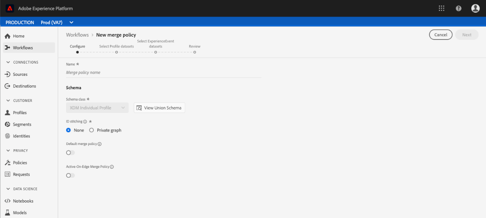

# Gebruikershandleiding voor beleid samenvoegen

Met het Adobe Experience Platform kunt u gegevens uit meerdere bronnen samenvoegen en combineren om een volledig beeld van elk van uw individuele klanten te krijgen. Wanneer het brengen van deze gegevens samen, zijn het fusiebeleid de regels die het Platform gebruikt om te bepalen hoe de gegevens voorrang zullen worden gegeven en welke gegevens zullen worden gecombineerd om die verenigde mening tot stand te brengen.

Gebruikend RESTful APIs of het gebruikersinterface, kunt u nieuw samenvoegbeleid tot stand brengen, bestaand beleid beheren, en een standaardsamenvoegbeleid voor uw organisatie plaatsen. Deze handleiding bevat stapsgewijze instructies voor het werken met samenvoegbeleidsregels via de gebruikersinterface van Adobe Experience Platform.

Als u liever met samenvoegbeleidsregels werkt met de Real-Time Customer Profile API, volgt u de instructies in de zelfstudie over de [samenvoegbeleidsAPI](../api/merge-policies.md).

## Aan de slag

Deze gids vereist een werkend inzicht in de diverse diensten van het Platform van de Ervaring betrokken bij fusiebeleid. Voordat u met deze zelfstudie begint, raadpleegt u de documentatie voor de volgende services:

* [Klantprofiel](../home.md)in realtime: Verstrekt een verenigd, real-time consumentenprofiel dat op bijeengevoegde gegevens van veelvoudige bronnen wordt gebaseerd.
* [Identiteitsservice](../../identity-service/home.md): Laat het Profiel van de Klant in real time toe door identiteiten van ongelijke gegevensbronnen te overbruggen die in Platform worden opgenomen.
* [XDM (Experience Data Model)](../../xdm/home.md): Het gestandaardiseerde kader waardoor Platform gegevens van de klantenervaring organiseert.

## Samenvoegbeleid weergeven

Binnen het gebruikersinterface van het Platform van de Ervaring, kunt u beginnen met het samenvoegen beleid en een lijst van het bestaande samenvoegen van uw organisatie te zien door **Profiel** in linker-spoorlijn te klikken en dan het beleid **van de** Fusie te selecteren tabel.

De details voor elk samenvoegbeleid beschikbaar aan uw organisatie zijn zichtbaar op de het landen pagina, met inbegrip van de Naam *van het* Beleid, het Beleid *van de* StandaardFusie, en *Schema*.

Als u wilt selecteren welke details zichtbaar zijn of extra kolommen wilt toevoegen aan de weergave, selecteert u het pictogram voor kolomkiezer aan de rechterkant en klikt u op de kolomnaam om deze toe te voegen aan of te verwijderen uit de weergave.

## Samenvoegbeleid maken

Als u een nieuw samenvoegbeleid wilt maken, klikt u op **Samenvoegbeleid** maken rechtsboven op het tabblad **Samenvoegingsbeleid** .

Het scherm **Samenvoegbeleid** maken wordt weergegeven, zodat u belangrijke informatie voor het nieuwe samenvoegbeleid kunt opgeven.

* **Naam**: De naam van uw samenvoegingsbeleid moet beschrijvend maar beknopt zijn.
* **Schema**: Het schema dat is gekoppeld aan het samenvoegbeleid. Dit specificeert het schema XDM waarvoor dit fusiebeleid wordt gecreeerd. Organisaties kunnen per schema meerdere samenvoegbeleidsregels maken.
* **ID stitching**: In dit veld wordt gedefinieerd hoe de verwante identiteiten van een klant worden bepaald. Er zijn twee mogelijke waarden:
   * **Geen**: Geen identiteitsstitching uitvoeren.
   * **Privégrafiek**: Identiteitsstitching uitvoeren op basis van uw persoonlijke identiteitsgrafiek.
* **Kenmerk samenvoegen**: Een profielfragment is de profielinformatie voor slechts één identiteit uit de lijst van identiteiten die voor een individuele klant bestaan. Wanneer het gebruikte type van identiteitsgrafiek in meer dan één identiteit resulteert, is er de mogelijkheid voor het in conflict brengen van de waarden van het profielbezit en de prioriteit moet worden gespecificeerd. Door *kenmerksamenvoeging* te gebruiken, kunt u opgeven welke waarden voor het gegevenssetprofiel moeten worden prioriteerd als er een samenvoegconflict optreedt. Er zijn twee mogelijke waarden:
   * **Tijdstempel geordend**: Geef in geval van een conflict prioriteit aan het profiel dat het laatst is bijgewerkt.
   * **Prioriteit** gegevensset: Geef voorrang aan profielfragmenten die op de dataset worden gebaseerd waaruit zij kwamen. Wanneer het selecteren van deze optie, moet u de verwante datasets en hun orde van prioriteit selecteren. Zie de details over [datasetbelangrijkheid](#dataset-precedence) hieronder voor meer informatie.
* **Standaardsamenvoegbeleid**: Een schakelknop waarmee u kunt bepalen of dit samenvoegbeleid al dan niet de standaardinstelling voor uw organisatie is. Als de kiezer wordt ingeschakeld en het nieuwe beleid wordt opgeslagen, wordt het vorige standaardbeleid automatisch bijgewerkt zodat het niet langer de standaardbeleid is.

### Dataset-prioriteit {#dataset-precedence}

Wanneer het selecteren van een waarde van de samenvoeging *van* Attributen, kunt u de voorkeur *van de* Dataset selecteren die u toestaat om prioriteit aan profielfragmenten te geven die op de dataset worden gebaseerd waaruit zij kwamen.

Een geval van het voorbeeldgebruik zou zijn als uw organisatie informatie aanwezig in één dataset had die over gegevens in een andere dataset voorkeur of vertrouwd is.

Wanneer het selecteren van de belangrijkheid *van de* Dataset, opent een afzonderlijk paneel dat u van *Beschikbare datasets* vereist (of gebruik checkbox om allen te selecteren) welke datasets zullen worden omvat. U kunt die datasets dan slepen en neerzetten in het *Geselecteerde paneel van Datasets* en hen slepen in de correcte orde van prioriteit. De hoogste dataset zal hoogste prioriteit worden gegeven, dan zal tweede dataset tweede-hoogste zijn, etc.

Als u klaar bent met het maken van het samenvoegbeleid, klikt u op **Opslaan** om terug te keren naar het tabblad *Samenvoegingsbeleid* waar het nieuwe samenvoegbeleid nu wordt weergegeven in de lijst met beleidsregels.

## Een samenvoegingsbeleid bewerken

U kunt een bestaand samenvoegbeleid wijzigen via het tabblad *Samenvoegen van beleidsregels* door op de *Beleidsnaam* te klikken voor het samenvoegbeleid dat u wilt bewerken.

Wanneer het *Edit scherm van het Samenvoegingsbeleid* verschijnt, kunt u veranderingen in de *Naam*, het *Schema*, het *identiteitskaart stitching* type, en de samenvoegingstype *van* ** Attributen aanbrengen, evenals selecteren of dit beleid al dan niet het Default samenvoegbeleid voor uw organisatie zal zijn.

>[!Nofferte]
>U kunt de beleids-id voor samenvoegen, die boven in het bewerkingsscherm wordt weergegeven, niet bewerken. Dit is een alleen-lezen, door het systeem gegenereerde id die niet kan worden gewijzigd.

Nadat u de benodigde wijzigingen hebt aangebracht, klikt u op **Opslaan** om terug te keren naar het tabblad *Samenvoegingsbeleid* waar de bijgewerkte informatie over het samenvoegingsbeleid nu wordt weergegeven.

## Schendingen van het beleid inzake gegevensbeheer

Wanneer het creëren van of het bijwerken van een samenvoegbeleid, wordt een controle uitgevoerd om te bepalen als het fusiebeleid om het even welk beleid van het gegevensgebruik schendt dat door uw organisatie wordt bepaald. Beleid voor gegevensgebruik maakt deel uit van Data Governance in het Adobe Experience Platform. Dit zijn regels die de soorten marketingacties beschrijven die u kunt uitvoeren of waarvan u een beperking hebt opgelegd voor het uitvoeren van specifieke Platform-gegevens. Bijvoorbeeld, als een fusiebeleid werd gebruikt om een segment tot stand te brengen dat aan een derdebestemming activeerde, en uw organisatie een beleid van het gegevensgebruik had dat de uitvoer van specifieke gegevens naar derden verhindert, zou u een bericht &quot;van de het beleidsschending van Gegevens ontdekt&quot;wanneer het proberen om uw fusiebeleid te bewaren.

Deze melding bevat een lijst met beleidsregels voor gegevensgebruik die zijn overtreden. U kunt de details van de schending bekijken door een beleid in de lijst te selecteren. Als u een overtreden beleid selecteert, biedt het tabblad *Gegevenskoppeling* de *reden voor schending* en de betreffende *activering*, elk met meer details over de manier waarop het beleid voor gegevensgebruik is overtreden.

Als u meer wilt weten over de manier waarop gegevensbeheer wordt uitgevoerd in het Adobe Experience Platform, leest u eerst het overzicht [van](../../data-governance/home.md)gegevensbeheer.

## Volgende stappen

Nu u samenvoegbeleid voor uw IMS-organisatie hebt gemaakt en geconfigureerd, kunt u deze gebruiken om publiekssegmenten te maken op basis van uw profielgegevens. Zie het overzicht [van de](../../segmentation/home.md) Segmentatie voor meer informatie over om tot stand te brengen en met segmenten te werken gebruikend het Platform van de Ervaring.