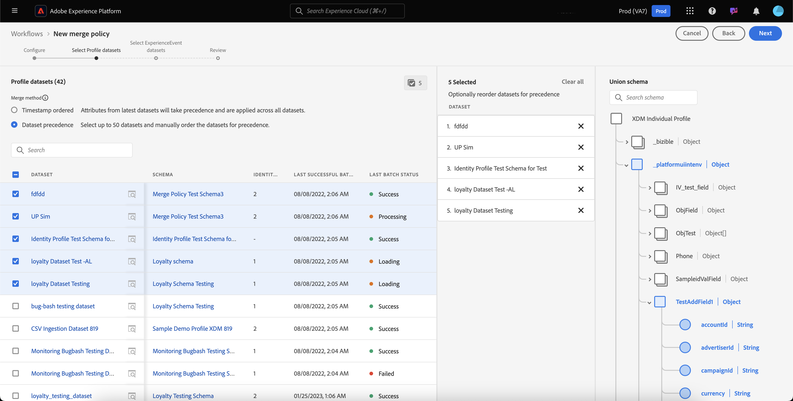

# UI-gids voor samenvoegen

Met Adobe Experience Platform kunt u gegevensfragmenten uit meerdere bronnen samenvoegen en combineren om een volledig beeld van elk van uw individuele klanten te krijgen. Wanneer het samenbrengen van deze gegevens, zijn het fusiebeleid de regels die [!DNL Platform] gebruikt om te bepalen hoe de gegevens aan voorrang zullen worden gegeven en welke gegevens zullen worden gecombineerd om een verenigde mening tot stand te brengen.

Bijvoorbeeld, als een klant met uw merk over verscheidene kanalen in wisselwerking staat, zal uw organisatie veelvoudige profielfragmenten met betrekking tot die enige klant hebben die in veelvoudige datasets verschijnen. Wanneer deze fragmenten in Platform worden opgenomen, worden ze samengevoegd om één profiel voor die klant te maken. Wanneer de gegevens van veelvoudige bronnen conflicten (bijvoorbeeld één fragment maakt een lijst van de klant als &quot;enig&quot;terwijl de andere klant als &quot;gehuwd&quot;een lijst maakt) bepaalt het fusiebeleid welke informatie om in het profiel voor het individu te omvatten.

Gebruikend RESTful APIs of het gebruikersinterface, kunt u nieuw samenvoegbeleid tot stand brengen, bestaand beleid beheren, en een standaardsamenvoegbeleid voor uw organisatie plaatsen. Deze handleiding bevat stapsgewijze instructies voor het werken met samenvoegbeleidsregels via de gebruikersinterface van Adobe Experience Platform (UI).

Als u liever met samenvoegbeleid werkt met de [!DNL Real-time Customer Profile]-API, volgt u de instructies in de [handleiding voor samenvoegbeleidsregels](../api/merge-policies.md).

## Aan de slag

Deze gids vereist een werkend inzicht van verscheidene belangrijke [!DNL Experience Platform] eigenschappen. Lees de documentatie voor de volgende services voordat u deze handleiding volgt of profiel-API&#39;s gebruikt:

* [Klantprofiel](../home.md) in realtime: Verstrekt een verenigd, real-time consumentenprofiel dat op bijeengevoegde gegevens van veelvoudige bronnen wordt gebaseerd.
* [Adobe Experience Platform Identity Service](../../identity-service/home.md): Laat het Profiel van de Klant in real time toe door identiteiten van ongelijke gegevensbronnen te overbruggen die in worden opgenomen  [!DNL Platform].
* [XDM (Experience Data Model)](../../xdm/home.md): Het gestandaardiseerde kader waardoor de gegevens van de  [!DNL Platform] klantenervaring worden georganiseerd.

## Methoden {#merge-methods} samenvoegen

Elk profielfragment bevat informatie voor slechts één identiteit van het totale aantal identiteiten dat voor een individu zou kunnen bestaan. Wanneer het samenvoegen van die gegevens om een klantenprofiel te vormen, is er het potentieel voor die informatie aan conflict en de prioriteit moet worden gespecificeerd. Het selecteren van een fusiemethode staat u toe om te specificeren welke datasetattributen om voorrang te geven als een fusieconflict tussen datasets voorkomt.

Er zijn twee mogelijke samenvoegmethoden beschikbaar voor het samenvoegbeleid. Elk van deze methoden wordt hieronder samengevat met aanvullende informatie in de volgende secties:

* **[!UICONTROL Timestamp ordered]:** In geval van een conflict, wordt de prioriteit gegeven aan het profielfragment dat onlangs werd bijgewerkt.
   * **Aangepaste tijdstempels:** [!UICONTROL Timestamp ordered] ook aangepaste tijdstempels die prioriteit hebben boven systeemtijdstempels bij het samenvoegen van gegevens binnen dezelfde gegevensset (meerdere identiteiten) of over gegevenssets heen. Zie de sectie over [aangepaste tijdstempels](#custom-timestamps) voor meer informatie.
* **[!UICONTROL Dataset precedence]:** In geval van een conflict, geef prioriteit aan profielfragmenten die op de dataset worden gebaseerd waaruit zij kwamen. Wanneer het selecteren van deze optie, moet u de verwante datasets en hun orde van prioriteit kiezen.

### Tijdstempel geordend {#timestamp-ordered}

Aangezien profielverslagen in Experience Platform worden opgenomen, wordt een systeemtimestamp verkregen op het tijdstip van opneming en toegevoegd aan het verslag. Als **[!UICONTROL Timestamp ordered]** is geselecteerd als samenvoegmethode voor een samenvoegbeleid, worden profielen samengevoegd op basis van de tijdstempel van het systeem. Met andere woorden, het samenvoegen wordt uitgevoerd op basis van de tijdstempel voor het tijdstip waarop de record in het Platform is opgenomen.

#### Aangepaste tijdstempels gebruiken {#custom-timestamps}

Soms zijn er gebruiksgevallen waarin het nodig is een aangepaste tijdstempel op te geven en het samenvoegbeleid de aangepaste tijdstempel moet gebruiken in plaats van de systeemtijdstempel. Voorbeelden hiervan zijn het terugvullen van gegevens of het garanderen van de juiste volgorde van gebeurtenissen als records buiten de bestelling worden opgenomen.

Als u een aangepaste tijdstempel wilt gebruiken, moet de schemaveldgroep **[!UICONTROL External Source System Audit Details]worden toegevoegd aan uw profielschema.** Nadat de aangepaste tijdstempel is toegevoegd, kan deze worden ingevuld met het veld `lastUpdatedDate`. Wanneer een verslag met het `lastUpdatedDate` gebied wordt opgenomen bevolkt, zal het Experience Platform dat gebied gebruiken om verslagen over datasets samen te voegen. Als `lastUpdatedDate` niet aanwezig, of niet bevolkt is, zal het Platform blijven gebruiken timestamp van het systeem.

>[!NOTE]
>
>U moet ervoor zorgen dat de tijdstempel `lastUpdatedDate` wordt gevuld wanneer u een update in dezelfde record invoegt.

In de volgende schermafbeelding worden de velden in de veldgroep [!UICONTROL External Source System Audit Details] weergegeven. Voor geleidelijke instructies bij het werken met schema&#39;s gebruikend het Platform UI, met inbegrip van hoe te om gebiedsgroepen aan schema&#39;s toe te voegen, gelieve [zelfstudie voor het creëren van een schema te bezoeken gebruikend UI](../../xdm/tutorials/create-schema-ui.md).

Als u met aangepaste tijdstempels wilt werken met de API, raadpleegt u de sectie [Bindpuntgids voor samenvoegbeleid bij het gebruik van aangepaste tijdstempels](../api/merge-policies.md#custom-timestamps).

### Datasetprioriteit {#dataset-precedence}

Wanneer **[!UICONTROL Dataset precedence]** als fusiemethode voor een fusiebeleid wordt geselecteerd, kunt u prioriteit aan profielfragmenten geven die op de dataset worden gebaseerd waaruit zij kwamen. Een geval van het voorbeeldgebruik zou zijn als uw organisatie informatie aanwezig in één dataset had die over gegevens in een andere dataset voorkeur of vertrouwd is.

Om een samenvoegbeleid tot stand te brengen gebruikend **[!UICONTROL Dataset precedence]**, moet u de datasets van het Profiel en van ExperienceEvent selecteren die inbegrepen zijn en dan kunt u de datasets van het Profiel voor belangrijkheid manueel in orde brengen. Zodra de datasets zijn geselecteerd en bevolen, zal de hoogste dataset hoogste prioriteit worden gegeven, zal de tweede dataset tweede-hoogste zijn, etc.

## [!UICONTROL ID stitching] {#id-stitching}

Identiteitsstitching ([!UICONTROL ID stitching]) is het proces om gegevensfragmenten te identificeren en hen te combineren om een volledig profielverslag te vormen. Om het verschillende stitching gedrag te illustreren, overweeg één enkele klant die met een merk gebruikend twee verschillende e-mailadressen interactie aangaat.

* **[!UICONTROL None]:** Als deze optie is geselecteerd, worden id&#39;s niet aan elkaar gekoppeld. Wanneer segmentatie voorkomt, zullen de identiteiten die tot de zelfde persoon kunnen behoren niet samen worden vastgemaakt en de segmentatie zal slechts de attributen in aanmerking nemen verbonden aan elke individuele identiteitskaart wanneer het bepalen als een klant voor segmentlidmaatschap in aanmerking komt. Dit zou in één enkele klant kunnen resulteren die veelvoudige profielen heeft en elk profiel voor verschillende segmenten zou kunnen kwalificeren, resulterend in veelvoudige marketing berichten die naar de zelfde klant worden verzonden.
* **[!UICONTROL Private graph]:** Wanneer de privégrafiek is geselecteerd, worden meerdere identiteiten met betrekking tot dezelfde persoon samengevoegd. Dit resulteert in de klant die één enkel profiel heeft en staat segmentatie toe om veelvoudige attributen van veelvoudige verwante identiteiten te overwegen wanneer het bepalen van segmentkwalificatie. In dit scenario zal de klant waarschijnlijk één profiel hebben, in aanmerking komen voor één segment op basis van de combinatie van kenmerken tussen identiteiten en slechts één marketingbericht ontvangen.

Om meer over identiteiten en hun rol in het produceren van profielen en segmenten te leren, gelieve te beginnen door [Overzicht van de Dienst van de Identiteit](../../identity-service/home.md) te lezen.

## Standaardsamenvoegbeleid {#default-merge-policy}

Een organisatie kan een standaardsamenvoegbeleid maken dat door haar organisatie kan worden gebruikt bij het samenvoegen van profielfragmenten. Op deze manier kunnen gebruikers het standaardbeleid eenvoudig selecteren wanneer ze handelingen uitvoeren in een Experience Platform, zoals het weergeven van klantprofielen of het maken van segmenten. In de meeste gevallen, tenzij een ander fusiebeleid wordt gespecificeerd, zal het standaardfusiebeleid worden gebruikt.

Elke organisatie kan veelvoudige fusiebeleid met betrekking tot één enkele XDM schemaklasse tot stand brengen, nochtans kunnen zij slechts één standaardsamenvoegbeleid hebben dat voor elke klasse wordt gedeclareerd. Uw organisatie zou bijvoorbeeld een standaardsamenvoegbeleid kunnen hebben met betrekking tot de [!DNL XDM Individual Profile]-klasse en een ander standaardsamenvoegbeleid voor een aangepaste, samengestelde klasse Product Inventory.

Als u een nieuw samenvoegbeleid creeert en het plaatst als gebrek, zal het vorige standaardfusiebeleid automatisch door het systeem worden bijgewerkt om niet meer het gebrek te zijn.

>[!WARNING]
>
>De tellingen en de segmenten van het profiel met een bestaand bijbehorend standaardsamenvoegbeleid kunnen worden beïnvloed. Om het even welk segment dat een toegepast standaardsamenvoegingsbeleid heeft zal worden bijgewerkt aan het nieuwe standaardsamenvoegbeleid.

## Samenvoegbeleid weergeven {#view-merge-policies}

Binnen [!DNL Experience Platform] UI, kunt u beginnen werkend met fusiebeleid door **[!UICONTROL Profiles]** in de linkernavigatie te selecteren en dan **[!UICONTROL Merge Policies]** tabel te selecteren. Dit lusje omvat een lijst van al bestaand samenvoegingsbeleid voor uw organisatie, evenals details voor elk fusiebeleid met inbegrip van de beleidsnaam, al dan niet het fusiebeleid het standaardfusiebeleid is, en de schemaklasse waarop het fusiebeleid betrekking heeft.

Als u wilt selecteren welke details zichtbaar zijn of extra kolommen aan de weergave wilt toevoegen, selecteert u **[!UICONTROL Configure columns]** en klikt u op een kolomnaam om deze toe te voegen aan of te verwijderen uit de weergave.

## Samenvoegbeleid maken {#create-a-merge-policy}

Als u een nieuw samenvoegbeleid wilt maken, selecteert u **[!UICONTROL Create merge policy]** op het tabblad Samenvoegingsbeleid.

Op het **[!UICONTROL New merge policy]** werkschemascherm, kunt u belangrijke informatie voor uw nieuw fusiebeleid door een reeks geleide stappen verstrekken.

### [!UICONTROL Configure] {#configure}

De eerste stap in het werkschema staat u toe om uw samenvoegbeleid te vormen door basisinformatie te verstrekken. Deze informatie omvat:

* **[!UICONTROL Name]**: De naam van uw samenvoegingsbeleid moet beschrijvend maar beknopt zijn.
* **[!UICONTROL Schema class]**: De XDM-schemaklasse die aan het samenvoegbeleid is gekoppeld. This specifies the schema class for which this merge policy is created. Organisaties kunnen meerdere samenvoegbeleidsregels per schemaklasse maken. Momenteel is alleen de klasse [!UICONTROL XDM Individual Profile] beschikbaar in de gebruikersinterface. U kunt een voorbeeld van het samenvoegingsschema voor de schemaklasse bekijken door **[!UICONTROL View Union Schema]** te selecteren. Voor meer informatie, zie de sectie over [het bekijken van verenigingsschema](#view-union-schema) die volgt.
* **[!UICONTROL ID stitching]**: In dit veld wordt gedefinieerd hoe de verwante identiteiten van een klant worden bepaald. Zie de sectie over [ID stitching](#id-stitching) vroeger in deze gids voor meer informatie. Er zijn twee mogelijke waarden:
   * **[!UICONTROL None]**: Geen identiteitsstitching uitvoeren.
   * **[!UICONTROL Private Graph]**: Identiteitsstitching uitvoeren op basis van uw persoonlijke identiteitsgrafiek.
* **[!UICONTROL Default merge policy]**: Een schakelknop waarmee u kunt bepalen of dit samenvoegbeleid al dan niet de standaardinstelling voor uw organisatie is. Als de kiezer is ingeschakeld, wordt een waarschuwing weergegeven met de vraag of u het standaardsamenvoegbeleid van uw organisatie wilt wijzigen. Zie de sectie over [standaardsamenvoegbeleid](#default-merge-policy) vroeger in deze gids om meer te leren.
   

Nadat de vereiste velden zijn voltooid, kunt u **[!UICONTROL Next]** selecteren om door te gaan met de workflow.

#### [!UICONTROL View Union Schema] {#view-union-schema}

Wanneer u een samenvoegbeleid maakt of bewerkt, kunt u het samenvoegingsschema voor de gekozen schema-klasse weergeven door **[!UICONTROL View Union Schema]** te selecteren.

Dit opent de [!UICONTROL View Union Schema] dialoog, die alle bijdragende schema&#39;s, identiteiten, en verhoudingen verbonden aan het unieschema toont. U kunt de dialoog gebruiken om het verenigingsschema te onderzoeken op de zelfde manier dat u door tot het [!UICONTROL Union Schema] lusje in [!UICONTROL Profiles] sectie van het Platform UI toegang te hebben.

Voor gedetailleerde informatie over unieschema&#39;s, met inbegrip van hoe te met hen in het [!UICONTROL Union Schema] lusje of [!UICONTROL View Union Schema] dialoog in het werkschema van het fusiebeleid wordt getoond, te bezoeken gelieve [de gids UI van het unieschema](union-schema.md).

### [!UICONTROL Select Profile datasets] {#select-profile-datasets}

Op het **[!UICONTROL Select Profile datasets]** scherm, moet u **[!UICONTROL Merge method]** selecteren die u voor uw fusiebeleid wenst te gebruiken. Ook weergegeven op het scherm is het totale aantal [!UICONTROL Profile datasets] in uw organisatie dat betrekking heeft op de schemaklasse die is geselecteerd op het vorige scherm.

Afhankelijk van de samenvoegmethode die u kiest, zullen alle datasets van het Profiel door de orde worden samengevoegd waarin zij (timestamp bevolen) laatst werden bijgewerkt of u zult moeten selecteren welke datasets van het Profiel in het fusiebeleid en de orde omvatten waarin om hen (datasetbelangrijkheid) samen te voegen. Voor meer informatie over samenvoegmethoden raadpleegt u de sectie [merge methods](#merge-methods) die eerder in dit document is opgegeven.

#### Tijdstempel geordend {#timestamp-ordered-profile}

Als u **[!UICONTROL Timestamp ordered]** selecteert als samenvoegmethode, hebben kenmerken van de meest recente bijgewerkte datasets voorrang. Dit geldt voor alle profielgegevenssets.

#### Datasetprioriteit {#dataset-precedence-profile}

Als u **[!UICONTROL Dataset precedence]** selecteert als samenvoegmethode, moet u de gegevenssets Profiel selecteren en handmatig voorrang geven aan de gegevenssets. Elke vermelde dataset omvat ook de status van de laatste partij die wordt opgenomen of toont een bericht dat geen partijen in die dataset zijn opgenomen.

U kunt tot 50 datasets van de datasetlijst selecteren om in het fusiebeleid te omvatten. Aangezien datasets worden geselecteerd, worden zij toegevoegd aan **[!UICONTROL Select datasets]** sectie, die u toestaat om de datasets te slepen en te laten vallen en hen volgens uw gewenste belangrijkheid te plaatsen. Aangezien de datasets in de lijst worden aangepast, zal rangschikken (1, 2, 3, enz.) naast de dataset bijwerken, tonend prioriteit (1 die de hoogste prioriteit wordt gegeven, dan 2, en verder).

Als u een gegevensset selecteert, wordt ook de sectie **[!UICONTROL Union schema]** bijgewerkt en worden de velden in het samenvoegingsschema weergegeven waaraan elke gegevensset gegevens bijdraagt. Voor meer informatie over verenigingsschema&#39;s, met inbegrip van hoe te met de visualisaties in UI in wisselwerking te staan, gelieve te verwijzen [verenigingsschema UI gids](union-schema.md)

### [!UICONTROL Select ExperienceEvent datasets] {#select-experienceevent-datasets}

De volgende stap in het werkschema vereist u om datasets te selecteren ExperienceEvent. Dit scherm wordt beïnvloed door de fusiemethode die u op het [[!UICONTROL Select Profile datasets]](#select-profile-datasets) scherm selecteerde.

Ook getoond op dit scherm is het totale aantal **[!UICONTROL ExperienceEvent datasets]** die door uw organisatie met betrekking tot de schemaklasse wordt gecreeerd die u op het de configuratiescherm van het fusiebeleid selecteerde.

#### Tijdstempel geordend {#timestamp-ordered-experienceevent}

Als u **[!UICONTROL Timestamp ordered]** als fusiemethode voor de datasets van het Profiel selecteerde, zullen de attributen van de onlangs bijgewerkte datasets ExperienceEvent ook hier belangrijkheid nemen.

#### Datasetprioriteit {#dataset-precedence-experienceevent}

Als u **[!UICONTROL Dataset precedence]** als fusiemethode voor de datasets van het Profiel selecteerde, zult u de datasets moeten selecteren ExperienceEvent om te omvatten. U kunt tot 50 datasets ExperienceEvent van de datasetlijst selecteren. Aangezien datasets worden geselecteerd, verschijnen zij in [!UICONTROL Select datasets] sectie.

De datasets van ExperienceEvent kunnen niet manueel worden bevolen, in plaats daarvan worden de attributen in de datasets ExperienceEvent toegevoegd aan de datasets van het Profiel als zij deel van het zelfde profielfragment uitmaken.

Vergelijkbaar met het selecteren van de datasets van het Profiel, werkt het selecteren van een dataset ExperienceEvent ook de **[!UICONTROL Union schema]** sectie bij, die de gebieden in het unieschema toont waaraan elke dataset gegevens bijdraagt. Voor meer informatie over verenigingsschema&#39;s, met inbegrip van hoe te met de visualisaties in UI in wisselwerking te staan, gelieve te verwijzen [verenigingsschema UI gids](union-schema.md)

### [!UICONTROL Review] {#review}

De laatste stap in de workflow is het controleren van het samenvoegbeleid. Het **[!UICONTROL Review]** scherm toont de naam van uw nieuw samenvoegbeleid, de schemaklasse waarop het wordt gebaseerd, de [!UICONTROL ID stitching] optie die u selecteerde, evenals de fusiemethode en de datasets inbegrepen in het fusiebeleid. Als u alle meegeleverde profiel- of ExperienceEvent-gegevenssets wilt weergeven, selecteert u het aantal gegevenssets waarmee u de vervolgkeuzelijst wilt uitvouwen.

Controleer of u het samenvoegbeleid zorgvuldig controleert voordat u **[!UICONTROL Finish]** selecteert om de aanmaakworkflow te voltooien.

#### Tijdstempel geordend {#timestamp-ordered-review}

Als u **[!UICONTROL Timestamp ordered]** als fusiemethode voor uw samenvoegbeleid selecteerde, omvat de lijst van de datasets van het Profiel alle datasets die door uw organisatie met betrekking tot de schemacategorie, in volgorde van timestamp zijn gecreeerd. De lijst van datasets ExperienceEvent omvat alle datasets die uw organisatie voor de gekozen schemaklasse heeft gecreeerd en aan de datasets van het Profiel zal worden toegevoegd.

#### Datasetprioriteit {#dataset-precedence-review}

Als u **[!UICONTROL Dataset precedence]** als fusiemethode voor uw samenvoegbeleid selecteerde, omvatten de lijsten van Profiel en datasets ExperienceEvent slechts de datasets van het Profiel en van de ExperienceEvent die u tijdens het creatiewerkschema selecteerde, respectievelijk. De orde van de datasets van het Profiel zou de belangrijkheid moeten aanpassen die u tijdens verwezenlijking specificeerde. Als dit niet het geval is, gebruikt u de knop [!UICONTROL Back] om terug te keren naar de vorige workflowstappen en de prioriteit aan te passen.

### Bijgewerkte lijst van samenvoegingsbeleid {#updated-list}

Nadat u de workflow hebt voltooid om een nieuw samenvoegbeleid te maken, gaat u terug naar het tabblad **[!UICONTROL Merge Policies]**. De lijst met samenvoegingsbeleid voor uw organisatie moet nu het samenvoegbeleid bevatten dat u zojuist hebt gemaakt.

## Een samenvoegingsbeleid bewerken

Vanuit het tabblad [!UICONTROL Merge Policies] kunt u een bestaand samenvoegbeleid wijzigen dat voor de klasse [!DNL XDM Individual Profile] is gemaakt door **[!UICONTROL Policy name]** te selecteren voor het samenvoegbeleid dat u wilt bewerken.

Wanneer het **[!UICONTROL Edit merge policy]** scherm verschijnt, kunt u veranderingen in de naam en [!UICONTROL ID stitching] aanbrengen, evenals veranderen of dit beleid al dan niet het standaardsamenvoegbeleid voor uw organisatie is.

Selecteer **[!UICONTROL Next]** om door het werkschema van het fusiebeleid verder te gaan om de fusiemethode en datasets inbegrepen in het fusiebeleid bij te werken.

Nadat u de benodigde wijzigingen hebt aangebracht, controleert u het samenvoegbeleid en selecteert u **[!UICONTROL Finish]** om terug te keren naar het tabblad **[!UICONTROL Merge policies]**.

>[!WARNING]
>
>Het wijzigen van een samenvoegbeleid kan invloed hebben op segmentatie en profielresultaten, omdat dit de manier wijzigt waarop gegevensconflicten worden opgelost.

## Schendingen van het beleid inzake gegevensbeheer

Wanneer het creëren van of het bijwerken van een samenvoegbeleid, wordt een controle uitgevoerd om te bepalen als het fusiebeleid om het even welk beleid van het gegevensgebruik schendt dat door uw organisatie wordt bepaald. Het beleid voor gegevensgebruik maakt deel uit van Adobe Experience Platform [!DNL Data Governance] en is een regel die het soort marketingacties beschrijft dat u mag uitvoeren of waarvan u een beperking hebt opgelegd voor specifieke [!DNL Platform]-gegevens. Bijvoorbeeld, als een fusiebeleid werd gebruikt om een segment tot stand te brengen dat aan een derdebestemming activeerde, en uw organisatie een beleid van het gegevensgebruik had dat de uitvoer van specifieke gegevens naar derden verhindert, zou u een **[!UICONTROL Data governance policy violation detected]** bericht wanneer het proberen om uw fusiebeleid te bewaren ontvangen.

Deze melding bevat een lijst met beleidsregels voor gegevensgebruik die zijn overtreden. U kunt de details van de schending bekijken door een beleid in de lijst te selecteren. Bij het selecteren van een overtreden beleid, verstrekt het **[!UICONTROL Data lineage]** lusje de reden voor de schending en de beïnvloede activeringen, elk die meer detail verstrekken in hoe het beleid van het gegevensgebruik is overtreden.

Als u meer wilt weten over de manier waarop gegevensbeheer in Adobe Experience Platform wordt uitgevoerd, leest u eerst het [Overzicht gegevensbeheer](../../data-governance/home.md).

## Volgende stappen

Nu u en gevormd samenvoegbeleid voor uw organisatie hebt gecreeerd, kunt u hen gebruiken om de mening van klantenprofielen binnen Platform aan te passen en publiekssegmenten van uw gegevens van het Profiel tot stand te brengen. Zie [Segmentatieoverzicht](../../segmentation/home.md) voor meer informatie over om tot stand te brengen en met segmenten te werken gebruikend [!DNL Experience Platform] UI en APIs.
