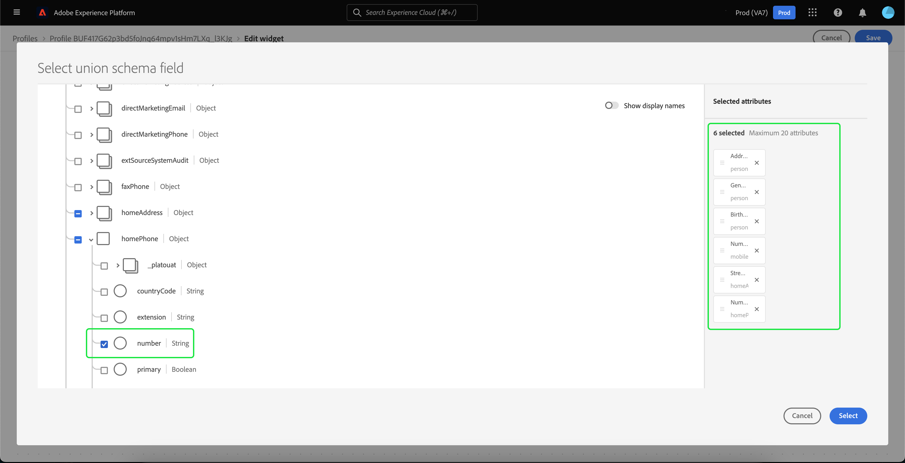
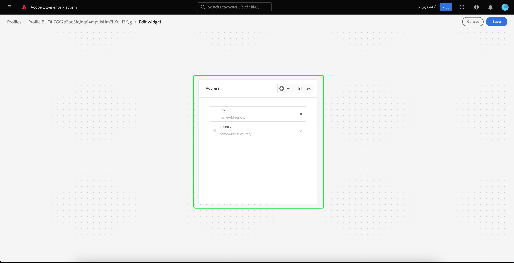
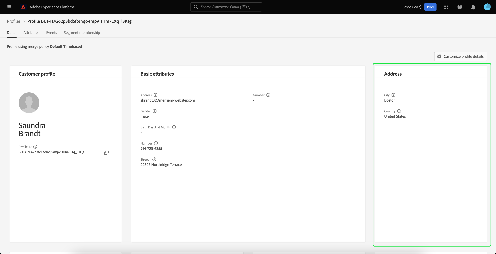

# [!DNL Real-time Customer Profile] detailaanpassing {#profile-detail-customization}

In de Adobe Experience Platform-gebruikersinterface kunt u bekijken en communiceren met [!DNL Real-time Customer Profile] gegevens in de vorm van klantprofielen. De profielgegevens die in de gebruikersinterface worden weergegeven, zijn samengevoegd vanuit meerdere profielfragmenten en vormen één weergave van elke afzonderlijke klant. Dit omvat details zoals basiskenmerken, gekoppelde identiteiten en kanaalvoorkeuren. De standaardvelden in profielen kunnen ook op organisatorisch niveau worden gewijzigd en de voorkeur krijgen [!DNL Profile] kenmerken. Deze gids verstrekt geleidelijke instructies voor het aanpassen van de manier waarin [!DNL Profile] gegevens worden weergegeven in de gebruikersinterface van het Platform.

Voor een volledige handleiding naar de profielgebruikersinterface gaat u naar de [Handleiding voor profielgebruikersinterface](user-guide.md).

## Kaarten opnieuw ordenen en het formaat ervan wijzigen {#reorder-and-resize-cards}

Van de **[!UICONTROL Detail]** tabblad van het klantprofiel, kunt u **[!UICONTROL Customize profile details]** om bestaande kaarten te vergroten of te verkleinen en opnieuw te rangschikken.

Nadat u het dashboard hebt gewijzigd, kunt u de kaarten opnieuw rangschikken door de kaarttitel te selecteren en de kaarten in de gewenste volgorde te slepen. U kunt ook het formaat van een kaart wijzigen door het hoeksymbool in de rechterbenedenhoek van de kaart te selecteren (`⌟`) en sleept u de kaart naar het gewenste formaat. In dit voorbeeld wordt **[!UICONTROL Basic attributes]** wordt de grootte van de kaart gewijzigd.

De geselecteerde kaart wordt aangepast aan de gewenste grootte en de omringende kaarten worden dynamisch verplaatst. Hierdoor kunnen sommige kaarten naar extra rijen worden verplaatst, waardoor u omlaag moet schuiven om alle kaarten weer te geven. Wanneer bijvoorbeeld &quot;[!UICONTROL Basic attributes]&quot; de kaart wordt vergroot of verkleind. &quot;[!UICONTROL Linked identities]&quot; De kaart is niet meer zichtbaar op de bovenste rij en wordt nu weergegeven op een nieuwe tweede rij in het profiel (niet weergegeven). Als u &quot;[!UICONTROL Linked identities]&quot;-kaart naar de bovenste rij kunt u slepen en neerzetten op de huidige positie van &quot;[!UICONTROL Channel preferences]&quot; kaart.

## Kaarten bewerken en verwijderen

Naast het wijzigen van het formaat en het opnieuw ordenen van kaarten, kunt u de inhoud van bepaalde kaarten bewerken en enkele kaarten volledig uit het dashboard verwijderen. De ovalen selecteren (`...`) in de rechterbovenhoek van de kaart om deze te bewerken of te verwijderen. Hiermee wordt een vervolgkeuzelijst geopend met opties voor het bewerken of verwijderen van de kaart, afhankelijk van de eigenschappen van de geselecteerde kaart.

>[!NOTE]
>
>Niet alle kaarten kunnen worden bewerkt of verwijderd. Dit komt omdat sommige kaarten alleen-lezen of vereiste informatie bevatten. Als een kaart geen ellipsen in de hoger-juiste hoek heeft, bevat het read-only EN vereiste informatie en kan niet worden uitgegeven noch kan het worden verwijderd. Als een kaart ovalen in de hoek heeft en u deze selecteert, wordt alleen een optie voor het verwijderen van de kaart weergegeven. De kaartgegevens zijn alleen-lezen en kunnen dan niet worden bewerkt.

Selecteren **[!UICONTROL Edit]** in het vervolgkeuzemenu om het dialoogvenster **[!UICONTROL Edit widget]** in de werkruimte, waar u de kaarttitel kunt bijwerken, de zichtbare kenmerken opnieuw kunt ordenen of verwijderen, of extra kenmerken kunt toevoegen met behulp van de **[!UICONTROL Add attributes]** knop.

## Kenmerken toevoegen {#add-attributes}

Van de **[!UICONTROL Edit widget]** scherm, selecteren **[!UICONTROL Add attributes]** in de rechterbovenhoek van de kaart om kenmerken aan die kaart toe te voegen.

Wanneer de **[!UICONTROL Select union schema field]** wordt geopend, wordt aan de linkerkant van het dialoogvenster de volledige [!UICONTROL XDM Individual Profile] samenvoegingsschema, met onderliggende velden genest. Voor meer informatie over unieschema&#39;s raadpleegt u de [vakbondsschema&#39;s [!DNL Profile] gebruikershandleiding](user-guide.md#union-schema).

De **[!UICONTROL Selected Attributes]** in de rechterzijde van het dialoogvenster worden de kenmerken weergegeven die momenteel zijn opgenomen in de kaart die u bewerkt. U kunt hier ook kenmerken verwijderen en opnieuw ordenen. Het totale aantal geselecteerde kenmerken en het maximumaantal kenmerken (20) dat aan één kaart kan worden toegevoegd, worden weergegeven.

U kunt om het even welke beschikbare gebieden van het unieschema selecteren om de attributen op de kaart aan te passen die u uitgeeft. Geselecteerde velden worden weergegeven met een vinkje ernaast en worden automatisch toegevoegd aan de lijst met geselecteerde kenmerken. Als u alle kenmerken hebt toegevoegd die u op de kaart wilt weergeven, kiest u **[!UICONTROL Select]** om terug te keren naar de **[!UICONTROL Edit widget]** scherm.

Wanneer u terugkeert naar de **[!UICONTROL Edit widget]** , moet de lijst met kenmerken op de kaart nu worden bijgewerkt om uw keuzes weer te geven. U kunt de kaartkenmerken nog steeds verwijderen of opnieuw rangschikken of de kaarttitel desgewenst bewerken. Als uw bewerkingen zijn voltooid, selecteert u **[!UICONTROL Save]** om uw wijzigingen op te slaan.

Nadat u het bestand hebt opgeslagen, gaat u terug naar de **[!UICONTROL Detail]** waar de bijgewerkte kaart en kenmerken zichtbaar zijn.

## Een nieuwe kaart toevoegen {#add-a-new-card}

Als u de weergave van profielen in het Experience Platform verder wilt aanpassen, kunt u ervoor kiezen nieuwe kaarten toe te voegen aan het dashboard en de kenmerken te selecteren die u op die kaarten wilt weergeven. Selecteer **[!UICONTROL Modify dashboard]** op de **[!UICONTROL Detail]** tab.

Selecteer vervolgens **[!UICONTROL Add widget]** in de linkerbovenhoek van het dashboard.

Als u een nieuwe kaart wilt toevoegen, wordt het dialoogvenster **[!UICONTROL Edit widget]** op het scherm waar u een titel voor de nieuwe kaart kunt opgeven en de kenmerken kunt kiezen die de kaart moet weergeven. Selecteer **[!UICONTROL Add attributes]**.

Wanneer de **[!UICONTROL Select union schema field]** wordt geopend, wordt links in het dialoogvenster de volledige [!UICONTROL XDM Individual Profile] verenigingsschema en de **[!UICONTROL Selected Attributes]** aan de rechterkant van het dialoogvenster worden de kenmerken weergegeven die u voor uw kaart selecteert. Zie voor meer informatie over het toevoegen van kenmerken de [sectie over het toevoegen van kenmerken](#add-attributes) die eerder in dit document wordt weergegeven.

Het totale aantal geselecteerde kenmerken en het maximumaantal kenmerken (20) dat aan één kaart kan worden toegevoegd, worden weergegeven. U kunt de geselecteerde kenmerken ook uit dit scherm verwijderen en opnieuw rangschikken. Als u alle kenmerken hebt toegevoegd die u op de kaart wilt weergeven, kiest u **[!UICONTROL Select]** om terug te keren naar de **[!UICONTROL Edit widget]** scherm.

Wanneer u terugkeert naar de **[!UICONTROL Edit widget]** , moet de lijst met kenmerken op de kaart uw keuzes in het vorige scherm weerspiegelen. U kunt ook de kaartkenmerken naar wens opnieuw rangschikken en verwijderen.

Als u uw nieuwe kaart wilt opslaan, moet u eerst een **[!UICONTROL Card title]**, dan kunt u **[!UICONTROL Save]** en het maken van de kaart voltooien.

Nadat u het bestand hebt opgeslagen, gaat u terug naar de **[!UICONTROL Detail]** waar uw nieuwe kaart en kenmerken zichtbaar zijn.

## Standaardkaarten herstellen

Als u op een gegeven moment besluit dat u de standaardkaarten die sindsdien zijn verwijderd, wilt herstellen, kunt u dit snel en eenvoudig doen. Eerst selecteert u **[!UICONTROL Modify dashboard]** selecteert u vervolgens **[!UICONTROL Restore default cards]**. Als de standaardkaarten zichtbaar zijn, kunt u **[!UICONTROL Save]** om uw veranderingen te bewaren of te selecteren **[!UICONTROL Cancel]** als u de standaardkaarten niet wilt herstellen.

## Volgende stappen

Als u dit document volgt, kunt u nu de profielweergave voor uw organisatie bijwerken, zoals kaarten toevoegen en verwijderen, kaartdetails en kenmerken bewerken en kaarten opnieuw ordenen en vergroten of verkleinen. Meer informatie over werken met [!DNL Profile] gegevens in de gebruikersinterface van het Experience Platform, gelieve te verwijzen naar [[!DNL Profile] gebruikershandleiding](user-guide.md).
