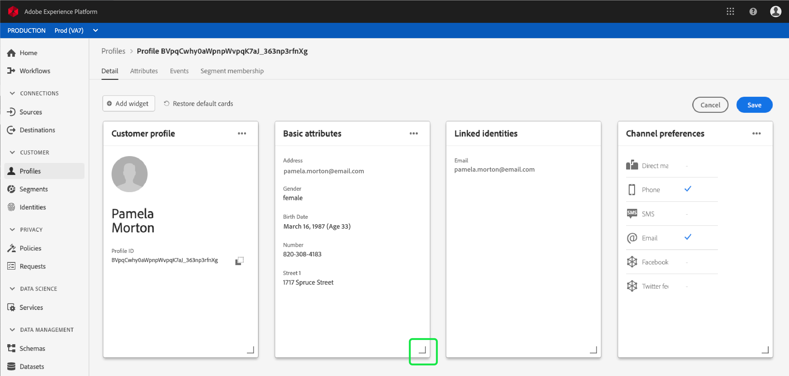
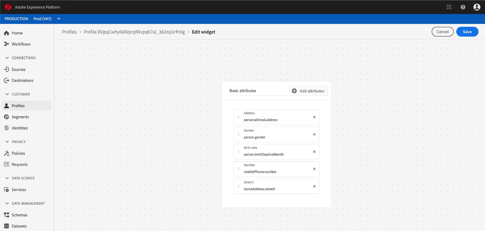
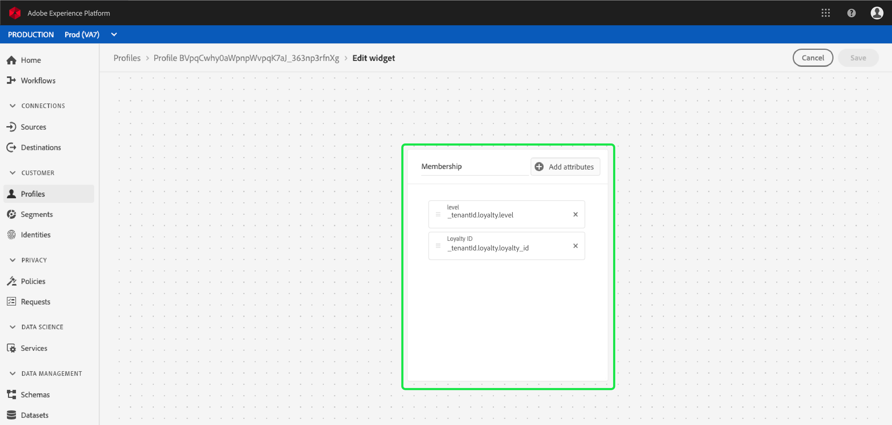

# [!DNL Real-time Customer Profile] detailaanpassing {#profile-detail-customization}

In de gebruikersinterface van Adobe Experience Platform kunt u [!DNL Real-time Customer Profile] gegevens weergeven en gebruiken in de vorm van klantprofielen. De profielgegevens die in de gebruikersinterface worden weergegeven, zijn samengevoegd vanuit meerdere profielfragmenten en vormen één weergave van elke afzonderlijke klant. Dit omvat details zoals basiskenmerken, gekoppelde identiteiten en kanaalvoorkeuren. De standaardvelden in profielen kunnen ook op organisatorisch niveau worden gewijzigd, zodat de voorkeurskenmerken worden weergegeven. [!DNL Profile] Deze gids verstrekt geleidelijke instructies voor het aanpassen van de manier waarin de [!DNL Profile] gegevens binnen UI van het Platform worden getoond.

Voor een volledige gids aan de UI van Profielen, te bezoeken gelieve de gids [van het](user-guide.md)Profiel UI.

## Kaarten opnieuw ordenen en het formaat ervan wijzigen {#reorder-and-resize-cards}

Op het tabblad **[!UICONTROL Details]** van het klantprofiel kunt u het dashboard **** wijzigen selecteren om het formaat en de volgorde van bestaande kaarten te wijzigen.

Nadat u het dashboard hebt gewijzigd, kunt u de kaarten opnieuw rangschikken door de kaarttitel te selecteren en de kaarten in de gewenste volgorde te slepen. U kunt het formaat van een kaart ook wijzigen door het hoeksymbool in de rechterbenedenhoek van de kaart (`⌟`) te selecteren en de kaart naar de gewenste grootte te slepen. In dit voorbeeld wordt de grootte van de **[!UICONTROL standaardkenmerkkaart]** gewijzigd.

De geselecteerde kaart wordt aangepast aan de gewenste grootte en de omringende kaarten worden dynamisch verplaatst. Hierdoor kunnen sommige kaarten naar extra rijen worden verplaatst, waardoor u omlaag moet schuiven om alle kaarten weer te geven. Wanneer bijvoorbeeld de grootte van de kaart &quot;[!UICONTROL Basiskenmerken]&quot; wordt gewijzigd, is de kaart &quot;[!UICONTROL Gekoppelde identiteiten]&quot; niet meer zichtbaar op de bovenste rij en wordt deze nu weergegeven op een nieuwe tweede rij in het profiel (niet weergegeven). Als u de kaart &quot;[!UICONTROL Gekoppelde identiteiten]&quot; wilt terugzetten naar de bovenste rij, kunt u deze naar de huidige positie van de kaart &quot;[!UICONTROL Kanaalvoorkeuren]&quot; slepen.

## Kaarten bewerken en verwijderen

Naast het wijzigen van het formaat en het opnieuw ordenen van kaarten, kunt u de inhoud van bepaalde kaarten bewerken en enkele kaarten volledig uit het dashboard verwijderen. Selecteer de ellipsen (`...`) in de rechterbovenhoek van de kaart om deze te bewerken of te verwijderen. Hiermee wordt een vervolgkeuzelijst geopend met opties voor het bewerken of verwijderen van de kaart, afhankelijk van de eigenschappen van de geselecteerde kaart.

>[!NOTE]
>
>Niet alle kaarten kunnen worden bewerkt of verwijderd. Dit komt omdat sommige kaarten alleen-lezen of vereiste informatie bevatten. Als een kaart geen ellipsen in de hoger-juiste hoek heeft, bevat het read-only EN vereiste informatie en kan niet worden uitgegeven noch kan het worden verwijderd. Als een kaart ovalen in de hoek heeft en u deze selecteert, wordt alleen een optie voor het verwijderen van de kaart weergegeven. De kaartgegevens zijn alleen-lezen en kunnen dan niet worden bewerkt.

Selecteer **[!UICONTROL Bewerken]** in het vervolgkeuzemenu om de werkruimte **[!UICONTROL Widget]** bewerken te openen, waar u de kaarttitel kunt bijwerken, de zichtbare kenmerken opnieuw kunt ordenen of eruit kunt verwijderen, of extra kenmerken kunt toevoegen met de knop **[!UICONTROL Kenmerken]** toevoegen.

## Kenmerken toevoegen {#add-attributes}

Selecteer in het scherm **[!UICONTROL Widget]** bewerken de optie Kenmerken **** toevoegen rechtsboven op de kaart om kenmerken aan die kaart toe te voegen.

Wanneer het dialoogvenster **[!UICONTROL Unieschema-veld]** selecteren wordt geopend, ziet u aan de linkerkant van het dialoogvenster het volledige [!UICONTROL XDM Individual Profile] union-schema met de onderliggende velden. Voor meer informatie over verenigingsschema&#39;s, gelieve te verwijzen naar de [unieschemas sectie van [!DNL Profile] de gebruikersgids](user-guide.md#union-schema).

In de sectie **[!UICONTROL Geselecteerde kenmerken]** aan de rechterkant van het dialoogvenster ziet u de kenmerken die momenteel zijn opgenomen in de kaart die u bewerkt. U kunt hier ook kenmerken verwijderen en opnieuw ordenen. Het totale aantal geselecteerde kenmerken en het maximumaantal kenmerken (20) dat aan één kaart kan worden toegevoegd, worden weergegeven.

U kunt om het even welke beschikbare gebieden van het unieschema selecteren om de attributen op de kaart aan te passen die u uitgeeft. Geselecteerde velden worden weergegeven met een vinkje ernaast en worden automatisch toegevoegd aan de lijst met geselecteerde kenmerken. Nadat u alle kenmerken hebt toegevoegd die u op de kaart wilt weergeven, kiest u **[!UICONTROL Selecteren]** om terug te keren naar het scherm **[!UICONTROL Widget]** bewerken.

Wanneer u terugkeert naar het scherm **[!UICONTROL Widget]** bewerken, moet de lijst met kenmerken op de kaart nu worden bijgewerkt met uw opties. U kunt de kaartkenmerken nog steeds verwijderen of opnieuw rangschikken of de kaarttitel desgewenst bewerken. Nadat de bewerkingen zijn voltooid, selecteert u **[!UICONTROL Opslaan]** om de wijzigingen op te slaan.

Nadat u de kaart hebt opgeslagen, gaat u terug naar het tabblad **[!UICONTROL Details]** waar de bijgewerkte kaart en kenmerken zichtbaar zijn.

## Een nieuwe kaart toevoegen {#add-a-new-card}

Als u de weergave van profielen in het Experience Platform verder wilt aanpassen, kunt u ervoor kiezen nieuwe kaarten aan het dashboard toe te voegen en de kenmerken te selecteren die u op die kaarten wilt weergeven. Selecteer eerst **[!UICONTROL Het dashboard]** wijzigen op het tabblad **[!UICONTROL Details]** .

Selecteer vervolgens Widget **** toevoegen in de linkerbovenhoek van het dashboard.

Als u een nieuwe kaart wilt toevoegen, wordt het scherm **[!UICONTROL Widget]** bewerken geopend, waarin u een titel voor de nieuwe kaart kunt opgeven en de kenmerken kunt kiezen die u op de kaart wilt weergeven. Als u kenmerken aan de kaart wilt toevoegen, selecteert u Kenmerken **** toevoegen.

Wanneer het dialoogvenster **[!UICONTROL Unieschema]** selecteren wordt geopend, ziet u aan de linkerkant van het dialoogvenster het volledige [!UICONTROL XDM Individual Profile] union-schema en ziet u in het gedeelte **[!UICONTROL Geselecteerde kenmerken]** aan de rechterkant van het dialoogvenster de kenmerken die u voor uw kaart selecteert. Zie de [sectie over het toevoegen van kenmerken](#add-attributes) die eerder in dit document wordt weergegeven voor meer informatie over het toevoegen van kenmerken.

Het totale aantal geselecteerde kenmerken en het maximumaantal kenmerken (20) dat aan één kaart kan worden toegevoegd, worden weergegeven. U kunt de geselecteerde kenmerken ook uit dit scherm verwijderen en opnieuw rangschikken. Nadat u alle kenmerken hebt toegevoegd die u op de kaart wilt weergeven, kiest u **[!UICONTROL Selecteren]** om terug te keren naar het scherm **[!UICONTROL Widget]** bewerken.

Wanneer u terugkeert naar het scherm **[!UICONTROL Widget]** bewerken, moet de lijst met kenmerken op de kaart de keuzes weerspiegelen die u in het vorige scherm hebt gemaakt. U kunt ook de kaartkenmerken naar wens opnieuw rangschikken en verwijderen.

Als u uw nieuwe kaart wilt opslaan, moet u eerst een **[!UICONTROL kaarttitel]** opgeven, kunt u **[!UICONTROL Opslaan]** selecteren en het maken van de kaart voltooien.

Na het opslaan gaat u terug naar het tabblad **[!UICONTROL Details]** waar uw nieuwe kaart en kenmerken zichtbaar zijn.

## Standaardkaarten herstellen

Als u op een gegeven moment besluit dat u de standaardkaarten die sindsdien zijn verwijderd, wilt herstellen, kunt u dit snel en eenvoudig doen. Selecteer eerst **[!UICONTROL Het dashboard]** wijzigen en selecteer vervolgens **[!UICONTROL Standaardkaarten]** herstellen. Als de standaardkaarten zichtbaar zijn, kunt u **[!UICONTROL Opslaan]** selecteren om uw wijzigingen op te slaan of **[!UICONTROL Annuleren]** selecteren als u de standaardkaarten niet wilt herstellen.

## Volgende stappen

Als u dit document volgt, kunt u nu de profielweergave voor uw organisatie bijwerken, zoals kaarten toevoegen en verwijderen, kaartdetails en kenmerken bewerken en kaarten opnieuw ordenen en vergroten of verkleinen. Raadpleeg voor meer informatie over het werken met [!DNL Profile] gegevens in de gebruikersinterface van het Experience Platform de [[!DNL Profile] gebruikershandleiding](user-guide.md).