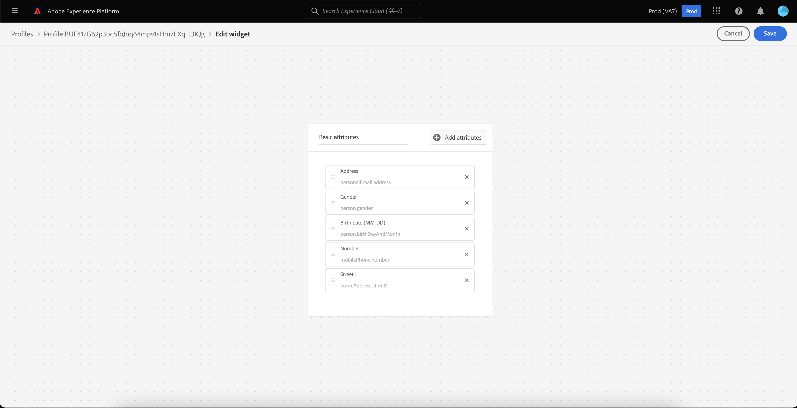

# [!DNL Real-Time Customer Profile] detailaanpassing {#profile-detail-customization}

In de Adobe Experience Platform-gebruikersinterface kunt u [!DNL Real-Time Customer Profile] -gegevens weergeven en ermee werken in de vorm van klantprofielen. De profielgegevens die in de gebruikersinterface worden weergegeven, zijn samengevoegd vanuit meerdere profielfragmenten en vormen één weergave van elke afzonderlijke klant. Dit omvat details zoals basiskenmerken, gekoppelde identiteiten en kanaalvoorkeuren. De standaardvelden in profielen kunnen ook op organisatorisch niveau worden gewijzigd, zodat de voorkeurskenmerken [!DNL Profile] worden weergegeven. Deze handleiding bevat stapsgewijze instructies voor het aanpassen van de manier waarop [!DNL Profile] -gegevens worden weergegeven in de gebruikersinterface van Experience Platform.

Voor een volledige gids aan Profielen UI, gelieve te bezoeken de [ gids UI van het Profiel ](user-guide.md).

## Kaarten opnieuw ordenen en het formaat ervan wijzigen {#reorder-and-resize-cards}

Op het tabblad **[!UICONTROL Detail]** van het klantprofiel kunt u **[!UICONTROL Customize profile details]** selecteren om bestaande kaarten te vergroten of te verkleinen en opnieuw te rangschikken.

Nadat u het dashboard hebt gewijzigd, kunt u de kaarten opnieuw rangschikken door de kaarttitel te selecteren en de kaarten in de gewenste volgorde te slepen. U kunt een kaart ook resize door het hoeksymbool in de bodem-juiste hoek van de kaart (`⌟`) te selecteren en de kaart te slepen aan de gewenste grootte. In dit voorbeeld wordt de grootte van de **[!UICONTROL Basic attributes]** -kaart gewijzigd.

De geselecteerde kaart wordt aangepast aan de gewenste grootte en de omringende kaarten worden dynamisch verplaatst. Hierdoor kunnen sommige kaarten naar extra rijen worden verplaatst, waardoor u omlaag moet schuiven om alle kaarten weer te geven. Bijvoorbeeld, wanneer de &quot;[!UICONTROL Basic attributes]&quot;kaart resized de &quot;[!UICONTROL Linked identities]&quot;kaart niet meer op de hoogste rij zichtbaar is en nu op een nieuwe tweede rij binnen het profiel (getoond niet) verschijnt. Om &quot;[!UICONTROL Linked identities]&quot;kaart aan de hoogste rij terug te keren, kon u het slepen en in de huidige positie van &quot;[!UICONTROL Channel preferences]&quot;kaart laten vallen.

## Kaarten bewerken en verwijderen

Naast het wijzigen van het formaat en het opnieuw ordenen van kaarten, kunt u de inhoud van bepaalde kaarten bewerken en enkele kaarten volledig uit het dashboard verwijderen. Selecteer de ellipsen (`...`) in de hoger-juiste hoek van de kaart om het uit te geven of te verwijderen. Hiermee wordt een vervolgkeuzelijst geopend met opties voor het bewerken of verwijderen van de kaart, afhankelijk van de eigenschappen van de geselecteerde kaart.

>[!NOTE]
>
>Niet alle kaarten kunnen worden bewerkt of verwijderd. Dit komt omdat sommige kaarten alleen-lezen of vereiste informatie bevatten. Als een kaart geen ellipsen in de hoger-juiste hoek heeft, bevat het read-only EN vereiste informatie en kan niet worden uitgegeven noch kan het worden verwijderd. Als een kaart ovalen in de hoek heeft en u deze selecteert, wordt alleen een optie voor het verwijderen van de kaart weergegeven. De kaartgegevens zijn alleen-lezen en kunnen dan niet worden bewerkt.

Selecteer **[!UICONTROL Edit]** in het vervolgkeuzemenu om de werkruimte van **[!UICONTROL Edit widget]** te openen, waar u de kaarttitel kunt bijwerken, de zichtbare kenmerken opnieuw kunt ordenen of eruit kunt verwijderen of extra kenmerken kunt toevoegen met de knop **[!UICONTROL Add attributes]** .

## Kenmerken toevoegen {#add-attributes}

Selecteer in het scherm **[!UICONTROL Edit widget]** de optie **[!UICONTROL Add attributes]** in de rechterbovenhoek van de kaart om kenmerken aan die kaart toe te voegen.

Wanneer het dialoogvenster **[!UICONTROL Select union schema field]** wordt geopend, ziet u aan de linkerkant van het dialoogvenster het volledige [!UICONTROL XDM Individual Profile] -samenvoegingsschema, met onderliggende velden. Voor meer informatie over unieschema&#39;s, gelieve te verwijzen naar de [ sectie van unieschema&#39;s van de  [!DNL Profile]  gebruikersgids ](user-guide.md#union-schema).

In de sectie **[!UICONTROL Selected Attributes]** aan de rechterkant van het dialoogvenster ziet u de kenmerken die momenteel zijn opgenomen in de kaart die u bewerkt. U kunt hier ook kenmerken verwijderen en opnieuw ordenen. Het totale aantal geselecteerde kenmerken en het maximumaantal kenmerken (20) dat aan één kaart kan worden toegevoegd, worden weergegeven.

U kunt om het even welke beschikbare gebieden van het unieschema selecteren om de attributen op de kaart aan te passen die u uitgeeft. Wanneer u de velden selecteert, kunt u kiezen of u de naam van het bestandspad of de weergavenaam wilt zien. Als u wilt schakelen tussen deze twee weergaven, selecteert u de schakeloptie **[!UICONTROL Show display names]** .

![ de [!UICONTROL Show display names] knevel wordt benadrukt binnen de de detailpagina van het Profiel.](../images/profile-customization/show-display-names.png)

Geselecteerde velden worden weergegeven met een vinkje ernaast en worden automatisch toegevoegd aan de lijst met geselecteerde kenmerken. Nadat u alle kenmerken hebt toegevoegd die u op de kaart wilt weergeven, kiest u **[!UICONTROL Select]** om terug te keren naar het **[!UICONTROL Edit widget]** -scherm.

Wanneer u terugkeert naar het scherm **[!UICONTROL Edit widget]** , moet de lijst met kenmerken op de kaart nu worden bijgewerkt om uw keuzes weer te geven. U kunt de kaartkenmerken nog steeds verwijderen of opnieuw rangschikken of de kaarttitel desgewenst bewerken. Nadat de bewerkingen zijn voltooid, selecteert u **[!UICONTROL Save]** om de wijzigingen op te slaan.

Na het opslaan gaat u terug naar het tabblad **[!UICONTROL Detail]** waar de bijgewerkte kaart en kenmerken zichtbaar zijn.

## Een nieuwe kaart toevoegen {#add-a-new-card}

Als u de weergave van profielen in Experience Platform verder wilt aanpassen, kunt u ervoor kiezen nieuwe kaarten toe te voegen aan het dashboard en de kenmerken te selecteren die u op die kaarten wilt weergeven. Selecteer eerst **[!UICONTROL Modify dashboard]** op de tab **[!UICONTROL Detail]** .

Selecteer vervolgens **[!UICONTROL Add widget]** in de linkerbovenhoek van het dashboard.

Als u een nieuwe kaart wilt toevoegen, wordt het scherm **[!UICONTROL Edit widget]** geopend waarin u een titel voor de nieuwe kaart kunt opgeven en de kenmerken kunt kiezen die u op de kaart wilt weergeven. Selecteer **[!UICONTROL Add attributes]** als u kenmerken aan de kaart wilt toevoegen.

Wanneer het dialoogvenster **[!UICONTROL Select union schema field]** wordt geopend, ziet u aan de linkerkant van het dialoogvenster het volledige [!UICONTROL XDM Individual Profile] union-schema en in de sectie **[!UICONTROL Selected Attributes]** aan de rechterkant van het dialoogvenster ziet u de kenmerken die u voor uw kaart selecteert. Voor meer informatie bij het toevoegen van attributen, zie de [ sectie bij het toevoegen van attributen ](#add-attributes) die vroeger in dit document verschijnt.

Het totale aantal geselecteerde kenmerken en het maximumaantal kenmerken (20) dat aan één kaart kan worden toegevoegd, worden weergegeven. U kunt de geselecteerde kenmerken ook uit dit scherm verwijderen en opnieuw rangschikken. Nadat u alle kenmerken hebt toegevoegd die u op de kaart wilt weergeven, kiest u **[!UICONTROL Select]** om terug te keren naar het **[!UICONTROL Edit widget]** -scherm.

Wanneer u terugkeert naar het scherm **[!UICONTROL Edit widget]** , moet de lijst met kenmerken op de kaart uw keuzes uit het vorige scherm weerspiegelen. U kunt de kaartkenmerken ook opnieuw rangschikken en verwijderen.

Als u uw nieuwe kaart wilt opslaan, moet u eerst een **[!UICONTROL Card title]** opgeven, kunt u **[!UICONTROL Save]** selecteren en het maken van de kaart voltooien.

Na het opslaan gaat u terug naar het tabblad **[!UICONTROL Detail]** waar uw nieuwe kaart en kenmerken zichtbaar zijn.

## Standaardkaarten herstellen

Als u op een gegeven moment besluit dat u de standaardkaarten die sindsdien zijn verwijderd, wilt herstellen, kunt u dit snel en eenvoudig doen. Selecteer eerst **[!UICONTROL Modify dashboard]** en selecteer vervolgens **[!UICONTROL Restore default cards]** . Wanneer de standaardkaarten zichtbaar zijn, kunt u **[!UICONTROL Save]** selecteren om uw wijzigingen op te slaan of **[!UICONTROL Cancel]** selecteren als u de standaardkaarten niet wilt herstellen.

## Volgende stappen

Als u dit document volgt, kunt u nu de profielweergave voor uw organisatie bijwerken, zoals kaarten toevoegen en verwijderen, kaartdetails en kenmerken bewerken en kaarten opnieuw ordenen en vergroten of verkleinen. Meer over het werken met [!DNL Profile] gegevens in Experience Platform UI leren, gelieve te verwijzen naar de [[!DNL Profile]  gebruikersgids ](user-guide.md).
