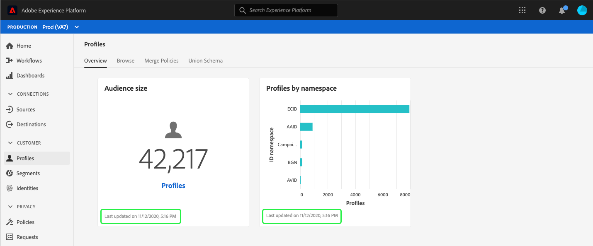

# (Alpha) [!DNL Real-time Customer Profile] dashboard {#profile-dashboard}

>[!IMPORTANT]
>
>De dashboardfunctionaliteit die in dit document wordt beschreven, bevindt zich momenteel in alfa en is niet beschikbaar voor alle gebruikers. De documentatie en de functionaliteit kunnen worden gewijzigd.

De gebruikersinterface van Adobe Experience Platform (UI) verstrekt een dashboard waardoor u belangrijke informatie over uw [!DNL Real-time Customer Profile] gegevens kunt bekijken, zoals die tijdens een dagelijkse momentopname wordt gevangen. Deze gids schetst hoe te om tot en met het [!DNL Profile] dashboard in UI toegang te hebben en te werken en verstrekt meer informatie betreffende de metriek die in het dashboard wordt getoond.

Voor een overzicht van alle profielfuncties in de gebruikersinterface van het Experience Platform, gelieve de gids [van het Profiel van de Klant in](user-guide.md)real time te bezoeken.

## Profieldashboardgegevens

Op het dashboard Profiel wordt een momentopname weergegeven van de kenmerkgegevens (record) die uw organisatie heeft in de profielopslag in Experience Platform. De momentopname bevat geen gebeurtenis (tijdreeks)-gegevens.

De kenmerkgegevens in de momentopname geven de gegevens precies zo weer als op het specifieke tijdstip waarop de momentopname is gemaakt. Met andere woorden, de momentopname is geen benadering of voorbeeld van de gegevens en het dashboard van het Profiel wordt niet in real time bijgewerkt.

>[!NOTE]
>
>Wijzigingen of updates die zijn aangebracht in de gegevens nadat de momentopname is gemaakt, worden pas in het dashboard weergegeven als de volgende momentopname is gemaakt.

De metriek die in het dashboard van het Profiel wordt getoond zijn gebaseerd op het standaardsamenvoegbeleid voor uw organisatie. Voor meer informatie over fusiebeleid, en hoe te om uw standaard fusiebeleid te selecteren of te veranderen, gelieve de gids [van het](merge-policies.md)fusiebeleid te bezoeken.

## Het dashboard Profiel verkennen

Om aan het dashboard van het Profiel binnen Platform UI te navigeren, selecteer **[!UICONTROL Profielen]** in de linkerspoorstaaf, dan selecteer het lusje van het **[!UICONTROL Overzicht]** om het dashboard te tonen.

### Widgets en metriek

Het dashboard bestaat uit widgets. Dit zijn alleen-lezen metriek die belangrijke informatie over uw profielgegevens verschaft. De datum en tijd &#39;laatst bijgewerkt&#39; op de widget geven aan wanneer de laatste momentopname van de gegevens is gemaakt.

## Beschikbare widgets

Experience Platform biedt meerdere widgets die u kunt gebruiken voor het visualiseren van verschillende meetgegevens die betrekking hebben op uw profielgegevens. Selecteer de naam van een widget hieronder voor meer informatie:

* [[!UICONTROL Grootte publiek]](#audience-size)
* [[!UICONTROL Profielen op naamruimte]](#profiles-by-namespace)

### [!UICONTROL Grootte publiek] {#audience-size}

De widget **[!UICONTROL Poortgrootte]** geeft het totale aantal samengevoegde profielen weer in de profielgegevensopslag op het moment dat de momentopname werd gemaakt. Dit aantal is het resultaat van het standaardsamenvoegbeleid van uw organisatie dat op uw gegevens van het Profiel wordt toegepast om profielfragmenten samen te voegen om één enkel profiel voor elk individu te vormen.

Voor meer informatie over fragmenten en samengevoegde profielen leest u eerst de sectie [Profielfragmenten versus samengevoegde profielen](../home.md#profile-fragments-vs-merged-profiles) van het [Profieloverzicht](../home.md).

### [!UICONTROL Profielen op naamruimte] {#profiles-by-namespace}

In de **[!UICONTROL widget Profielen op naamruimte]** wordt de uitsplitsing van naamruimten in alle samengevoegde profielen in het archief Profiel weergegeven. Het totale aantal profielen per [!UICONTROL id-naamruimte] (d.w.z. het optellen van de waarden voor elke naamruimte) is altijd hoger dan het totale aantal samenvoegprofielen, omdat aan één profiel meerdere naamruimten kunnen zijn gekoppeld. Bijvoorbeeld, als een klant met uw merk op meer dan één kanaal in wisselwerking staat, zullen de veelvoudige namespaces met die individuele klant worden geassocieerd.

Meer informatie over naamruimten vindt u in de documentatie [van de](../../identity-service/home.md)Adobe Experience Platform Identity Service.

## Aanvullende dashboards

De interface van het Platform biedt extra dashboards voor het bekijken van momentopnamen van uw gegevens binnen Experience Platform. Deze dashboards omvatten segmentatie en vergunningsgebruik. Voor meer informatie over deze extra dashboards, selecteer van de volgende verbindingen:

* [Segmentdashboard](../../segmentation/ui/segment-dashboard.md)
* [Het gebruiksdashboard voor licenties](../../landing/license-usage-dashboard.md)

## Volgende stappen

Als u dit document volgt, kunt u nu het dashboard Profiel vinden en begrijpen welke maatstaven worden weergegeven in de beschikbare widgets. Raadpleeg de handleiding voor de [!DNL Profile] gebruikersinterface voor meer informatie over het werken met [[!DNL Profile] gegevens in de gebruikersinterface van het Experience Platform](user-guide.md).