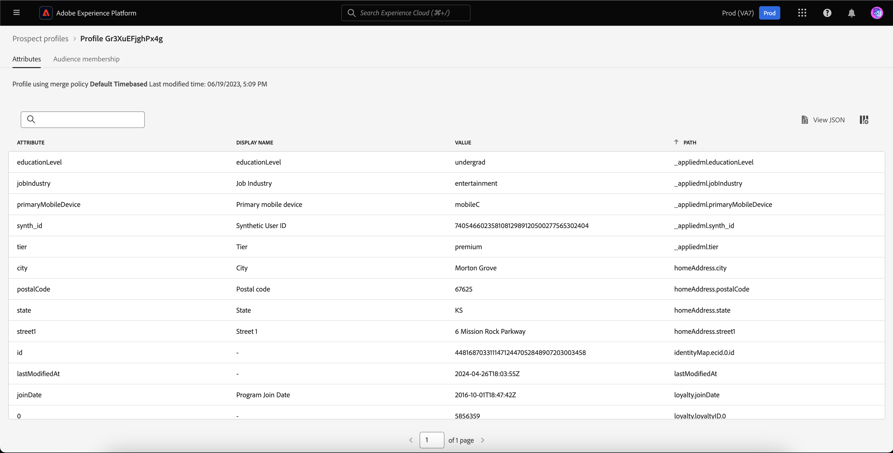

# Prospectieprofielen

Met Adobe Experience Platform kunt u zorgen voor gecoördineerde, consistente en relevante ervaringen voor uw klanten, ongeacht waar of wanneer ze met uw merk communiceren.

Prospectprofielen worden gebruikt om personen te vertegenwoordigen die zich nog niet met uw bedrijf hebben verbonden maar u wilt bereiken. Met perspectiefprofielen, kunt u uw klantenprofielen met attributen van vertrouwde op derdepartners aanvullen.

## Bladeren {#browse}

Selecteer **[!UICONTROL Profiles]** in de sectie **[!UICONTROL Prospects]** voor toegang tot perspectiefprofielen.

De pagina **[!UICONTROL Browse]** wordt weergegeven. Er wordt een lijst met alle perspectiefprofielen voor uw organisatie weergegeven.

![ de [!UICONTROL Profiles] knoop wordt benadrukt, tonend de [!UICONTROL Browse] pagina voor perspectiefprofielen.](../images/prospect-profile/browse-profiles.png)

>[!IMPORTANT]
>
>Terwijl het grootste deel van het doorbladeren functionaliteit tussen klantenprofielen en perspectiefprofielen het zelfde is, kunt u **niet** doorbladeren perspectiefprofielen door samenvoegingsbeleid. Dit is omdat de perspectiefprofielen automatisch door een systeem-ontworpen op tijd-gebaseerd fusiebeleid worden geregeerd. Meer informatie over fusiebeleid kan in het [ overzicht van het fusiebeleid ](../merge-policies/overview.md) worden gevonden.

Voor meer informatie over het doorbladeren van profielen, gelieve te lezen [ doorbladert sectie van de de gebruikersgids van het Profiel ](./user-guide.md#browse-identity).

## Details van profiel voor vooruitzichten {#profile-details}

>[!IMPORTANT]
>
>Een perspectiefprofiel verloopt automatisch na 25 dagen verblijf in Adobe Experience Platform.

Als u meer informatie over een bepaald perspectiefprofiel wilt weergeven, selecteert u een profiel op de pagina [!UICONTROL Browse] .

Informatie over het perspectiefprofiel wordt weergegeven, inclusief de kenmerken die zijn gekoppeld aan het profiel en het publiekslidmaatschap.

Voor meer informatie over deze lusjes, te lezen gelieve de [ sectie van de details van het meningsprofiel van de de gebruikersgids van het Profiel ](./user-guide.md#profile-detail).

U kunt ook alle kenmerken in JSON-indeling zien door **[!UICONTROL View JSON]** te selecteren.

![ de [!UICONTROL View JSON] knoop wordt benadrukt op de pagina van de detailgegevens van het vooruitgangsprofiel.](../images/prospect-profile/profile-select-view-json.png)

Het dialoogvenster [!UICONTROL View JSON] wordt weergegeven. De kenmerken van het perspectiefprofiel worden nu in JSON-vorm weergegeven.

## Aanbevolen gebruiksgevallen {#use-cases}

Lees de volgende gebruiksdocumentatie voor meer informatie over het gebruik van de functie voor perspectiefprofielen in Experience Platform in combinatie met andere Experience Platform-functies:

- [Nieuwe klanten aantrekken en aanschaffen via de prospectieve functionaliteit](../../rtcdp/partner-data/prospecting.md)

## Volgende stappen

Na het lezen van deze handleiding begrijpt u nu hoe perspectiefprofielen kunnen worden gebruikt in Adobe Experience Platform. Leren hoe deze perspectiefprofielen in publiek kunnen worden gebruikt, gelieve de [ gids van het vooruitgangspubliek ](../../segmentation/types/prospect-audiences.md) te lezen.
