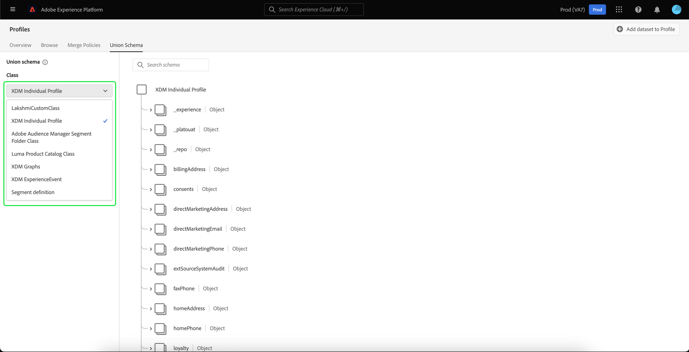

# [!UICONTROL Union schema] UI-hulplijn

In de gebruikersinterface van Adobe Experience Platform (UI) kunt u gemakkelijk om het even welk samenvoegingsschema binnen uw organisatie bekijken en voorproef de gebieden, de identiteiten, de verhoudingen, en bijdragende schema&#39;s voor een specifieke klasse. Deze gids verstrekt gedetailleerde informatie over hoe te om verenigingsschema&#39;s te bekijken en te onderzoeken gebruikend Experience Platform UI.

## Aan de slag {#getting-started}

Deze UI-handleiding vereist inzicht in de verschillende [!DNL Experience Platform] -services die betrokken zijn bij het beheren van realtime-klantprofielgegevens. Voordat u deze handleiding leest of in de gebruikersinterface werkt, raadpleegt u de documentatie voor de volgende services:

* [[!DNL Real-Time Customer Profile]](../home.md): biedt een uniform, real-time consumentenprofiel dat is gebaseerd op geaggregeerde gegevens van meerdere bronnen.
* [[!DNL Identity Service]](../../identity-service/home.md): schakelt [!DNL Real-Time Customer Profile] in door identiteiten te overbruggen van verschillende gegevensbronnen terwijl ze worden ingesloten in [!DNL Experience Platform] .
* [[!DNL Experience Data Model (XDM)]](../../xdm/home.md): Het gestandaardiseerde framework waarmee [!DNL Experience Platform] gegevens voor de klantervaring indeelt.

## Verenigingsschema&#39;s begrijpen {#understanding-union-schemas}

>[!CONTEXTUALHELP]
>id="rtcdp_collaboration_union_schema"
>title="Unieregelingen"
>abstract=""

<!-- The above contextual help is used in the Collaboration UI for a read more link. -->

Met het realtime klantprofiel kunt u robuuste, gecentraliseerde profielen maken met klantkenmerken en gebeurtenissen met een tijdstempel die door elke klant worden gebruikt voor systemen die met Adobe Experience Platform zijn geïntegreerd. Het formaat en de structuur van deze gegevens worden verstrekt door schema&#39;s van het Gegevensmodel van de Ervaring (XDM), met elk schema dat op een klasse XDM wordt gebaseerd en die gebieden bevatten die met die klasse compatibel zijn.

Schema&#39;s kunnen worden gemaakt voor meerdere gebruiksgevallen, waarbij wordt verwezen naar dezelfde klasse maar die velden bevatten die specifiek zijn voor het gebruik ervan. Wanneer een schema voor Profiel wordt toegelaten, wordt het deel van een verenigingsschema. Met andere woorden, verenigingsschema&#39;s zijn samengesteld uit veelvoudige schema&#39;s die de zelfde klasse delen en voor Profiel toegelaten. Met het samenvoegingsschema kunt u een samenvoeging zien van alle velden in schema&#39;s die dezelfde klasse delen. In real time het Profiel van de Klant gebruikt het verenigingsschema om een holistische mening van elke individuele klant tot stand te brengen.

Het werken met unieschema&#39;s vereist een diep inzicht in schema&#39;s XDM. Voor meer informatie, gelieve te beginnen door de [ grondbeginselen van schemacompositie ](../../xdm/schema/composition.md) te lezen.

## Verenigingsschema&#39;s weergeven {#view-union-schemas}

Als u naar samenvoegingsschema&#39;s in de gebruikersinterface van Experience Platform wilt navigeren, selecteert u **[!UICONTROL Profiles]** in de linkernavigatie en selecteert u vervolgens het tabblad **[!UICONTROL Union Schema]** . Het tabblad [!UICONTROL Union Schema] wordt geopend om het samenvoegingsschema voor de geselecteerde klasse weer te geven.

## Een klasse selecteren {#select-a-class}

Selecteer de klasse in het vervolgkeuzemenu **[!UICONTROL Class]** om het samenvoegingsschema voor een specifieke XDM-klasse weer te geven. Vanwege het feit dat niet alle klassen vakbondsschema&#39;s hebben, zijn alleen klassen met vakbondsschema&#39;s (dat wil zeggen klassen met schema&#39;s die zijn ingeschakeld voor Profiel) beschikbaar in de vervolgkeuzelijst.

Nadat een klasse is geselecteerd, het schema dat wordt getoond werkt bij om op het verenigingsschema voor de geselecteerde klasse te wijzen. U kunt bijvoorbeeld **[!UICONTROL XDM Individual Profile]** selecteren om het samenvoegingsschema voor die klasse weer te geven.

## Samenvoegingsschema&#39;s verkennen {#explore-union-schemas}

U kunt het verenigingsschema onderzoeken door naar boven en naar onder te scrollen om de volledige schemastructuur te bekijken en door een recht punthaakje (`>`) te selecteren om genestelde gebieden uit te breiden.

Selecteer een veld om de details weer te geven, zoals de weergavenaam, het gegevenstype, de beschrijving, het pad, de gemaakte datum en de datum die als laatste is gewijzigd. U kunt ook een lijst met bijdragende schema&#39;s bekijken die het gebied bevatten u selecteerde.

Wanneer u de naam van een bijdragend schema selecteert, worden de namen van gegevenssets met betrekking tot dat schema weergegeven die gegevens in het geselecteerde veld invoeren. Elke naam van een gegevensset wordt als een koppeling weergegeven. Het selecteren van een datasetnaam opent het activiteitenlusje voor die dataset in een nieuw venster.

Voor meer informatie over datasets, met inbegrip van het bekijken van datasetactiviteit en het voorvertonen van datasetgegevens in UI, gelieve te bezoeken de [ gids UI van datasets ](../../catalog/datasets/user-guide.md).

## Contribute-schema&#39;s weergeven {#view-contributing-schemas}

U kunt ook zien welke specifieke schema&#39;s bijdragen aan het samenvoegingsschema door **[!UICONTROL All contributing schemas]** te selecteren om de lijst met schema&#39;s uit te breiden. Afhankelijk van de klasse die u hebt geselecteerd en het aantal schema&#39;s dat uw organisatie binnen Experience Platform heeft gemaakt, kan dit een korte lijst zijn met één schema of een lange lijst met vele schema&#39;s.

Als u de naam van een specifiek schema selecteert, worden de velden binnen het samenvoegingsschema gemarkeerd die deel uitmaken van het schema dat u hebt geselecteerd. Nadat u een schema hebt geselecteerd, wordt het samenvoegingsschema grijs weergegeven met zwarte balken die de velden aangeven die deel uitmaken van het bijdragende schema.

## Identiteiten weergeven {#view-identities}

Via de interface kunt u een lijst met identiteiten weergeven die in het samenvoegingsschema zijn opgenomen door **[!UICONTROL Identities]** te selecteren om de lijst uit te vouwen.

Als u een individuele identiteit in de lijst selecteert, wordt het weergegeven schema automatisch bijgewerkt wanneer dat nodig is om het identiteitsveld weer te geven. Dit kan het uitbreiden van meerdere velden omvatten als het identiteitsveld is genest.

Het identiteitsveld wordt gemarkeerd in het samenvoegingsschema en de details van de identiteit worden rechts in het scherm weergegeven. De details omvatten een lijst van bijdragende schema&#39;s die het identiteitsgebied bevatten en u kunt neer boren om verbindingen aan de datasets met betrekking tot dat schema te vinden die gegevens in het geselecteerde identiteitsgebied opnemen.

## Relaties weergeven {#view-relationships}

Het unieschema UI laat u ook toe om verhoudingen te zien die voor schema&#39;s zijn bepaald die op de geselecteerde schemaklasse worden gebaseerd. Het bepalen van een verhouding is een manier om twee regelingen te verbinden die tot verschillende klassen behoren om complexere inzichten in klantengegevens te bereiken.

Als er relaties zijn gemaakt voor de geselecteerde klasse, wordt bij het selecteren van **[!UICONTROL Relationships]** een lijst weergegeven met velden die worden gebruikt om relaties te maken. Niet alle schema&#39;s gebruiken of vereisen vastgestelde verhoudingen, zodat is het gemeenschappelijk voor de relatiesectie om geen gebieden te bevatten.

Meer over schemaverhoudingen leren, met inbegrip van hoe te om hen te bepalen gebruikend UI, bezoek [ dit document op schemaverhoudingen ](../../xdm/tutorials/relationship-ui.md).

Als u een relatieveld in de lijst selecteert, wordt het weergegeven schema zo nodig bijgewerkt om het gemarkeerde relatieveld weer te geven. Dit kan het uitbreiden van meerdere velden omvatten als het relatieveld is genest.

## Volgende stappen

Door deze gids te lezen, weet u nu hoe te om verenigingsschema&#39;s te bekijken en te navigeren gebruikend [!DNL Experience Platform] UI. Voor meer informatie over schema&#39;s, met inbegrip van hoe zij door Experience Platform worden gebruikt, gelieve te beginnen door het [ overzicht van het Systeem XDM ](../../xdm/home.md) te lezen.
