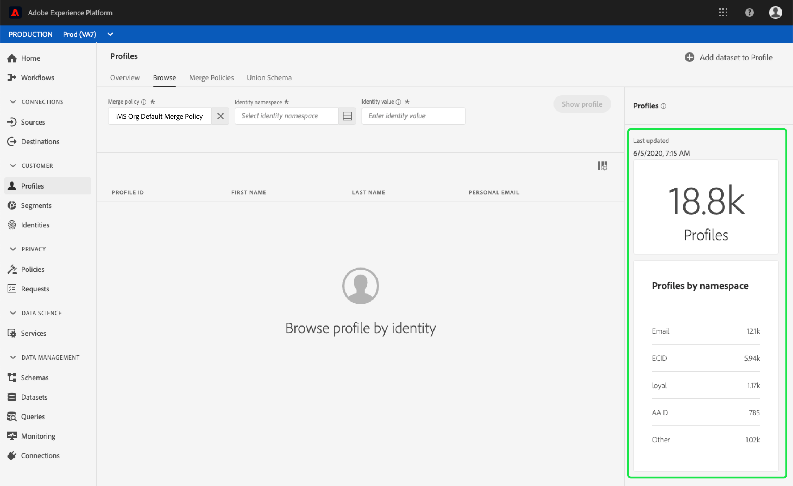
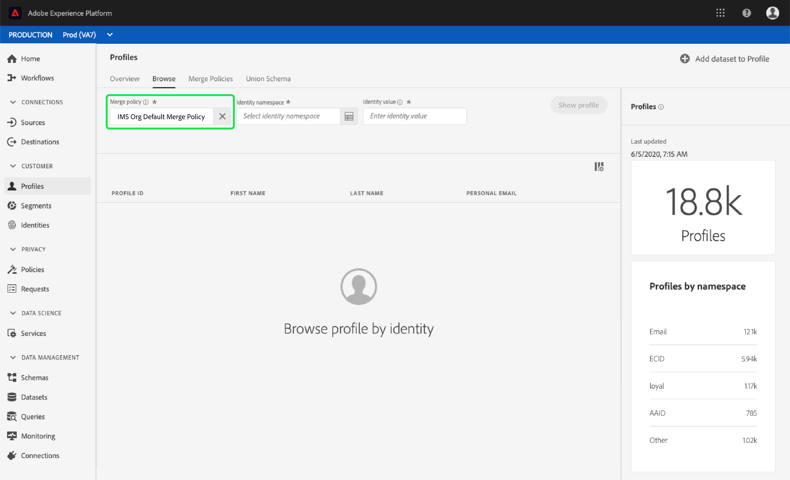

# [!DNL Real-time Customer Profile] UI-hulplijn

[!DNL Real-time Customer Profile] leidt tot een holistische mening van elk van uw individuele klanten, die gegevens van veelvoudige kanalen met inbegrip van online, off-line, CRM, en derdegegevens combineren. Dit document fungeert als richtlijn voor interactie met [!DNL Real-time Customer Profile] gegevens in de gebruikersinterface van Adobe Experience Platform (UI).

## Aan de slag

Deze gids UI vereist een inzicht in de diverse [!DNL Experience Platform] diensten betrokken bij het leiden [!DNL Real-time Customer Profiles]. Voordat u deze handleiding leest of in de gebruikersinterface werkt, raadpleegt u de documentatie voor de volgende services:

* [[!DNL Real-time Customer Profile]](../home.md): Verstrekt een verenigd, real-time consumentenprofiel dat op bijeengevoegde gegevens van veelvoudige bronnen wordt gebaseerd.
* [[!DNL Identity Service]](../../identity-service/home.md): Schakelt [!DNL Real-time Customer Profile] het overbruggen van identiteiten uit verschillende gegevensbronnen in wanneer deze worden ingepakt [!DNL Platform].
* [[!DNL Experience Data Model] (XDM)](../../xdm/home.md): Het gestandaardiseerde kader waardoor de gegevens van de klantenervaring worden [!DNL Platform] georganiseerd.

## Overzicht

Selecteer in de [[!DNL Experience Platform] UI](http://platform.adobe.com)de optie **[!UICONTROL Profielen]** in de linkernavigatie om het tabblad **[!UICONTROL Overzicht]** te openen. Op dit tabblad vindt u koppelingen naar documentatie en video&#39;s die u helpen bij het begrijpen van profielen en het werken met profielen.

## Bladeren

Selecteer het tabblad **[!UICONTROL Bladeren]** om door profielen te bladeren op basis van identiteit.

### Profielafmetingen {#profile-metrics}

Aan de rechterkant van het tabblad **[!UICONTROL Bladeren]** staan verschillende belangrijke metingen voor uw profielgegevens, zoals het totale aantal  profielen en een lijst met [profielen per naamruimte](#profiles-by-namespace).

Deze profielmetriek worden geëvalueerd gebruikend het standaardsamenvoegbeleid van uw organisatie. Voor meer informatie bij het werken met fusiebeleid, met inbegrip van hoe te om een standaardfusiebeleid te bepalen, zie de de gebruikersgids [van het Beleid van de](merge-policies.md)Fusie.

Naast deze metriek, verstrekt de sectie van profielmetriek ook een laatste bijgewerkte datum en tijd, die tonen wanneer de metriek het laatst werden geëvalueerd.

### Aantal profielen {#profile-count}

Het aantal profielen geeft het totale aantal profielen weer dat uw organisatie binnen heeft [!DNL Experience Platform], nadat het standaardsamenvoegbeleid van uw organisatie profielfragmenten heeft samengevoegd tot één profiel voor elke individuele klant. Met andere woorden, uw organisatie kan veelvoudige profielfragmenten met betrekking tot één enkele klant hebben die met uw merk over verschillende kanalen interactie heeft, maar deze fragmenten zouden samen (volgens het standaard fusiebeleid) worden samengevoegd en een telling van &quot;1&quot;profiel terugkeren omdat zij allen met het zelfde individu verwant zijn.

Het aantal profielen omvat ook zowel profielen met kenmerken (recordgegevens) als profielen die alleen tijdreeksgegevens (gebeurtenisgegevens) bevatten, zoals Adobe Analytics-profielen. Het aantal profielen wordt regelmatig vernieuwd om een up-to-date totaal aantal profielen binnen Platform te verstrekken.

Wanneer de opname van records in de [!DNL Profile] winkel de telling met meer dan 5% verhoogt of verlaagt, wordt een baan teweeggebracht om de telling bij te werken. Voor het stromen gegevenswerkschema&#39;s, wordt een controle uitgevoerd op uurbasis om te bepalen als de 5% verhoging of dalingsdrempel is voldaan. Als dit het geval is, wordt er automatisch een taak geactiveerd om het aantal profielen bij te werken. Voor batch-opname wordt binnen 15 minuten na het correct innemen van een batch in de profielopslag een taak uitgevoerd om het aantal profielen bij te werken als aan de drempel van 5% verhoging of afname is voldaan.

### Profielen op naamruimte {#profiles-by-namespace}

Met de metrische waarde **[!UICONTROL Profielen op naamruimte]** worden het totale aantal naamruimten en de totale verdeling daarvan over alle samengevoegde profielen in uw profielarchief weergegeven. Het totale aantal profielen per naamruimte (d.w.z. het optellen van de waarden voor elke naamruimte) zal altijd hoger zijn dan de metrische waarde van het aantal profielen, omdat aan één profiel meerdere naamruimten kunnen zijn gekoppeld. Bijvoorbeeld, als een klant met uw merk op meer dan één kanaal in wisselwerking staat, zullen de veelvoudige namespaces met die individuele klant worden geassocieerd.

Vergelijkbaar met de metrische waarde van het [profielaantal](#profile-count) , wanneer de opname van verslagen in de [!DNL Profile] opslag de telling met meer dan 5% verhoogt of vermindert, wordt een baan teweeggebracht om de namespacemetriek bij te werken. Voor het stromen gegevenswerkschema&#39;s, wordt een controle uitgevoerd op uurbasis om te bepalen als de 5% verhoging of dalingsdrempel is voldaan. Als dit het geval is, wordt er automatisch een taak geactiveerd om het aantal profielen bij te werken. Voor batch-opname wordt binnen 15 minuten na het correct innemen van een batch in de [!DNL Profile] winkel een taak uitgevoerd om de metrische gegevens bij te werken als aan de drempel van 5% voor verhoging of verlaging is voldaan.

### Samenvoegbeleid

Met de **[!UICONTROL optie Samenvoegbeleid]** selecteren wordt automatisch het standaardsamenvoegbeleid voor uw organisatie geselecteerd. Als u dat samenvoegbeleid niet wilt gebruiken, kunt u het `X` naast het standaardsamenvoegbeleid selecteren om het dialoogvenster **[!UICONTROL Samenvoegbeleid]** selecteren te openen waarin u een ander samenvoegbeleid kunt kiezen. Raadpleeg de gebruikershandleiding [voor](merge-policies.md)samenvoegingsbeleid voor meer informatie over samenvoegingsbeleid en hun rol in het Platform.

### Naamruimte identiteit

Met de naamruimte **[!UICONTROL -kiezer]** Identiteit wordt een dialoogvenster geopend waarin u de naamruimte kunt kiezen waarmee u wilt zoeken. U kunt de kenmerken die worden weergegeven in de zoekopdracht aanpassen door het filterpictogram te selecteren en te kiezen welke kenmerken u wilt toevoegen of verwijderen.

Kies in het dialoogvenster Naamruimte **** selecteren de naamruimte waarin u wilt zoeken of gebruik de zoekbalk in het dialoogvenster om de naam van een naamruimte te typen. U kunt een naamruimte selecteren om aanvullende details weer te geven. Nadat u de naamruimte hebt gevonden die u wilt gebruiken, kunt u het keuzerondje selecteren en op **[!UICONTROL Selecteren]** drukken om door te gaan.

### Identiteitswaarde

Nadat u een naamruimte voor identiteit hebt geselecteerd, gaat u terug naar het tabblad **[!UICONTROL Bladeren]** waar u een waarde **[!UICONTROL voor]** Identiteit kunt invoeren. Deze waarde is specifiek voor een individueel klantprofiel en moet een geldige waarde zijn voor de opgegeven naamruimte. Als u bijvoorbeeld de naamruimte E-mail selecteert, hebt u een identiteitswaarde nodig in de vorm van een geldig e-mailadres.

Nadat een waarde is ingevoerd, selecteert u Profiel **** tonen en geeft u één profiel weer dat overeenkomt met de waarde. Selecteer de **[!UICONTROL profiel-id]** om de profieldetails weer te geven.

### Profieldetails {#profile-detail}

Als u de **[!UICONTROL profiel-id]** selecteert, wordt het tabblad **[!UICONTROL Details]** geopend. De profielgegevens die op het tabblad **[!UICONTROL Details]** worden weergegeven, zijn samengevoegd vanuit meerdere profielfragmenten en vormen één weergave van de individuele klant. Dit omvat klantgegevens zoals basiskenmerken, gekoppelde identiteiten en kanaalvoorkeuren. De weergegeven standaardvelden kunnen ook op organisatorisch niveau worden gewijzigd om de voorkeursprofielkenmerken weer te geven. Lees de handleiding voor het aanpassen van de [profieldetails voor meer informatie over het aanpassen van deze velden, inclusief stapsgewijze instructies voor het toevoegen en verwijderen van kenmerken en het wijzigen van het formaat van dashboarddeelvensters](profile-customization.md).

U kunt aanvullende informatie over het afzonderlijke profiel weergeven door een andere beschikbare tabbladen te selecteren. Deze lusjes omvatten attributen, gebeurtenissen, en segmentlidmaatschap, die de segmenten tonen waarvoor het profiel momenteel gekwalificeerd is.

## Beleid samenvoegen

Selecteer in het hoofdmenu **[!UICONTROL Profielen]** het tabblad Beleid **[!UICONTROL voor]** samenvoegen om een lijst weer te geven met samenvoegingsbeleid dat tot uw organisatie behoort. Elk vermeld beleid toont zijn naam, al dan niet het standaardsamenvoegbeleid, en het schema dat het op van toepassing is.

Voor meer informatie over fusiebeleid, zie de gids [UI van het](merge-policies.md)fusiebeleid.

## Unieschema {#union-schema}

Selecteer in het menu **[!UICONTROL Profielen]** het tabblad **[!UICONTROL Unieschema]** om de samenvoegingsschema&#39;s voor uw opgenomen gegevens weer te geven. Een verenigingsschema is een samenvoeging van alle [!DNL Experience Data Model] (XDM) gebieden onder de zelfde klasse, de waarvan schema&#39;s voor gebruik binnen zijn toegelaten [!DNL Real-time Customer Profile].

Voor meer informatie over verenigingsschema&#39;s, zie de gids [UI van het](union-schema.md)uniesschema.

## Volgende stappen

Door deze gids te lezen, weet u nu hoe te om uw [!DNL Profile] gegevens te bekijken en te beheren gebruikend [!DNL Experience Platform] UI. Raadpleeg de handleiding voor ontwikkelaars van [profielen voor informatie over het werken met profielgegevens met de Real-time Customer Profile API](../api/overview.md).