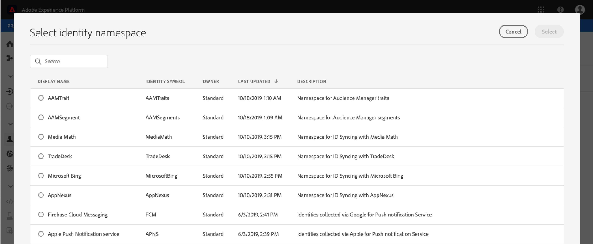

# Gebruikershandleiding voor het profiel van de klant in realtime

Het profiel van de Klant in real time leidt tot een holistische mening van elk van uw individuele klanten, die gegevens van veelvoudige kanalen met inbegrip van online, off-line, CRM, en derdegegevens combineren.

Dit document fungeert als richtlijn voor interactie met Real-time klantprofiel in de gebruikersinterface van het Adobe Experience Platform.

## Aan de slag

Deze gebruikershandleiding vereist inzicht in de verschillende services van het Experience Platform die betrokken zijn bij het beheren van het realtime-klantprofiel. Lees de documentatie voor de volgende services voordat u deze gebruikershandleiding leest:

* [Klantprofiel](../home.md)in realtime: Verstrekt een verenigd, real-time consumentenprofiel dat op bijeengevoegde gegevens van veelvoudige bronnen wordt gebaseerd.
* [Identiteitsservice](../../identity-service/home.md): Laat het Profiel van de Klant in real time toe door identiteiten van ongelijke gegevensbronnen te overbruggen die in Platform worden opgenomen.
* [XDM (Experience Data Model)](../../xdm/home.md): Het gestandaardiseerde kader waardoor Platform gegevens van de klantenervaring organiseert.

## Overzicht

Klik in de gebruikersinterface [van het](http://platform.adobe.com)ervaringsplatform op **Profielen** in de linkernavigatie om het tabblad _Overzicht_ te openen. Op dit tabblad vindt u koppelingen naar documentatie en video&#39;s die u helpen bij het begrijpen van profielen en het werken met profielen.

## Bladeren door profiel

Klik op het tabblad **Bladeren** om door profielen op identiteiten te bladeren. Dit tabblad bevat ook het totale aantal [profielen](#profile-count).

### Aantal profielen {#profile-count}

Het aantal profielen geeft het totale aantal profielen weer dat uw organisatie heeft binnen het Experience Platform, nadat het standaard samenvoegbeleid van uw organisatie profielfragmenten heeft samengevoegd tot één profiel voor elke afzonderlijke klant. Met andere woorden, uw organisatie kan veelvoudige profielfragmenten met betrekking tot één enkele klant hebben die met uw merk over verschillende kanalen interactie heeft, maar deze fragmenten zouden samen (volgens het standaard fusiebeleid) worden samengevoegd en een telling van &quot;1&quot;profiel terugkeren omdat zij allen met het zelfde individu verwant zijn.

Het aantal profielen omvat ook zowel profielen met kenmerken (recordgegevens) als profielen die alleen tijdreeksgegevens (gebeurtenisgegevens) bevatten, zoals Adobe Analytics-profielen. Het aantal profielen wordt regelmatig vernieuwd om een up-to-date totaal aantal profielen binnen Platform te bieden.

Wanneer de opname van profielen in de profielopslag de telling met meer dan 5% verhoogt of vermindert, wordt een baan teweeggebracht om de telling bij te werken. Voor het stromen gegevenswerkschema&#39;s, wordt een controle uitgevoerd op uurbasis om te bepalen als de 5% verhoging of dalingsdrempel is voldaan. Als dit het geval is, wordt er automatisch een taak geactiveerd om het aantal profielen bij te werken. Voor batch-opname wordt binnen 15 minuten na het correct innemen van een batch in de profielopslag een taak uitgevoerd om het aantal profielen bij te werken als aan de drempel van 5% verhoging of verlaging is voldaan.

### Naamruimte identiteit

Met de naamruimte **-kiezer** Identiteit wordt een dialoogvenster geopend waarin u de naamruimte kunt kiezen waarmee u wilt zoeken. U kunt de kenmerken die worden weergegeven in de zoekopdracht aanpassen door het filterpictogram te selecteren en te kiezen welke kenmerken u wilt toevoegen of verwijderen.

Kies in het dialoogvenster Naamruimte ** selecteren de naamruimte waarin u wilt zoeken of gebruik de **zoekbalk** in het dialoogvenster om de naam van een naamruimte te typen. U kunt een naamruimte selecteren om aanvullende details weer te geven. Nadat u de naamruimte hebt gevonden waarnaar u wilt zoeken, kunt u het keuzerondje selecteren en op **Selecteren** drukken om door te gaan.

### Identiteitswaarde

Nadat u een naamruimte **** Identiteit hebt geselecteerd, gaat u terug naar het tabblad *Bladeren* waar u een waarde **** Identiteit kunt invoeren. Deze waarde is specifiek voor een individueel klantprofiel en moet een geldige waarde zijn voor de opgegeven naamruimte. Als u bijvoorbeeld de naamruimte **** Identiteit &quot;E-mail&quot; selecteert, hebt u een **identiteitswaarde** nodig in de vorm van een geldig e-mailadres.

Nadat een waarde is ingevoerd, selecteert u Profiel **** tonen en geeft u één profiel weer dat overeenkomt met de waarde. Selecteer de **profiel-id** om de profieldetails weer te geven.

### Profieldetails

Als u de **profiel-id** selecteert, wordt het tabblad _Details_ geopend. Deze pagina bevat informatie over het geselecteerde profiel, zoals basiskenmerken, gekoppelde identiteiten en beschikbare contactkanalen. De weergegeven profielgegevens zijn samengevoegd vanuit meerdere profielfragmenten en vormen één weergave van de individuele klant.

U kunt aanvullende informatie met betrekking tot het profiel weergeven, zoals kenmerken, gebeurtenissen en segmenten waarvan het profiel lid is.

## Beleid samenvoegen

Klik op **Beleid** samenvoegen om een lijst weer te geven met samenvoegbeleid dat tot uw organisatie behoort. Elk vermeld beleid toont zijn naam, al dan niet het standaardsamenvoegbeleid, en het schema dat het op van toepassing is.

Voor meer informatie bij het werken met fusiebeleid in UI, zie de de gebruikersgids [van het Beleid van de](merge-policies.md)Fusie.

## Unieschema

Klik op **Verenigingsschema** om de samenvoegingsschema&#39;s voor uw profielarchief weer te geven. Een verenigingsschema is een samenvoeging van alle gebieden van het Model van de Gegevens van de Ervaring (XDM) onder de zelfde klasse, de waarvan schema&#39;s voor gebruik in het Profiel van de Klant in real time zijn toegelaten. Klik op een klasse in de lijst links om de structuur van het samenvoegingsschema op het canvas weer te geven.

Als u bijvoorbeeld &quot;XDM-profiel&quot; selecteert, wordt het samenvoegingsschema voor de klasse Individueel profiel XDM weergegeven.

Zie de sectie over verenigingsschema&#39;s in de [schemacompositie gids](../../xdm/schema/composition.md) voor meer informatie over verenigingsschema&#39;s en hun rol in het Profiel van de Klant in real time.

## Volgende stappen

Door deze handleiding te lezen, weet u nu hoe u de profielgegevens kunt bekijken en beheren met de interface van het Experience Platform. Voor informatie over hoe te hefboomwerking de gegevens van het Profiel van de Klant in real time om publiekssegmenten te produceren, zie de documentatie [van de](../../segmentation/home.md)Segmentatie.