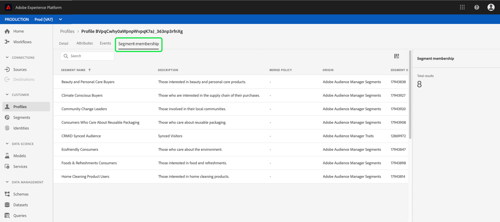

# [!DNL Real-time Customer Profile] UI-hulplijn

[!DNL Real-time Customer Profile] leidt tot een holistische mening van elk van uw individuele klanten, die gegevens van veelvoudige kanalen met inbegrip van online, off-line, CRM, en derdegegevens combineren. Dit document fungeert als richtlijn voor interactie met [!DNL Real-time Customer Profile] gegevens in de gebruikersinterface van Adobe Experience Platform (UI).

## Aan de slag

Deze UI-gids vereist inzicht in de verschillende [!DNL Experience Platform] diensten die betrokken zijn bij het beheer [!DNL Real-time Customer Profiles]. Voordat u deze handleiding leest of in de gebruikersinterface werkt, raadpleegt u de documentatie voor de volgende services:

* [[!DNL Real-time Customer Profile] overzicht](../home.md): Verstrekt een verenigd, real-time consumentenprofiel dat op bijeengevoegde gegevens van veelvoudige bronnen wordt gebaseerd.
* [[!DNL Identity Service]](../../identity-service/home.md): Inschakelen [!DNL Real-time Customer Profile] door identiteiten van verschillende gegevensbronnen te overbruggen aangezien zij worden opgenomen in [!DNL Platform].
* [[!DNL Experience Data Model (XDM)]](../../xdm/home.md): Het gestandaardiseerde kader waardoor [!DNL Platform] organiseert de gegevens van de klantenervaring.

## [!UICONTROL Overview]

Selecteer in de gebruikersinterface van het Experience Platform de optie **[!UICONTROL Profiles]** in de linkernavigatie om de **[!UICONTROL Overview]** tabblad met het profieldashboard.

>[!NOTE]
>
>Als uw organisatie nieuw aan Platform is en nog niet de actieve datasets van het Profiel of gecreeerd verenigingsbeleid heeft, [!UICONTROL Profiles] het dashboard is niet zichtbaar. In plaats daarvan [!UICONTROL Overview] op het tabblad vindt u koppelingen en documentatie om u te helpen aan de slag te gaan met het Real-Time Klantprofiel.

### Profieldashboard {#profile-dashboard}

Het profieldashboard bevat een overzicht van de belangrijkste maatstaven die betrekking hebben op de profielgegevens van uw organisatie.

Ga voor meer informatie naar de [Handleiding voor profieldashboard](../../dashboards/guides/profiles.md).

## [!UICONTROL Browse] tabmetriek

Selecteer **[!UICONTROL Browse]** om verschillende metriek weer te geven die betrekking hebben op de profielgegevens van uw organisatie. U kunt dit tabblad ook gebruiken om door de profielopslag te bladeren met behulp van een samenvoegbeleid of een identiteit, zoals beschreven in de volgende sectie van deze handleiding.

Aan de rechterkant van het **[!UICONTROL Browse]** tab is [aantal profielen](#profile-count) alsmede een lijst van [profielen op naamruimte](#profiles-by-namespace).

>[!NOTE]
>
>Deze profielwaarden kunnen afwijken van de maatstaven die worden weergegeven op het tabblad [profieldashboard](#profile-dashboard) omdat zij gebruikend het standaardsamenvoegbeleid van uw organisatie worden geëvalueerd. Voor meer informatie bij het werken met fusiebeleid, met inbegrip van hoe te om een standaard fusiebeleid te bepalen, zie [overzicht van samenvoegbeleid](../merge-policies/overview.md).

Naast deze metriek, verstrekt deze sectie een laatste bijgewerkte datum en tijd, die tonen wanneer de metriek het laatst werden geëvalueerd.

### Aantal profielen {#profile-count}

Het aantal profielen geeft het totale aantal profielen weer dat uw organisatie binnen het Experience Platform heeft, nadat het standaardsamenvoegbeleid van uw organisatie profielfragmenten heeft samengevoegd tot één profiel voor elke individuele klant. Met andere woorden, uw organisatie kan veelvoudige profielfragmenten met betrekking tot één enkele klant hebben die met uw merk over verschillende kanalen interactie heeft, maar deze fragmenten zouden samen (volgens het standaard fusiebeleid) worden samengevoegd en een telling van &quot;1&quot;profiel terugkeren omdat zij allen met het zelfde individu verwant zijn.

Het aantal profielen omvat ook zowel profielen met kenmerken (recordgegevens) als profielen die alleen tijdreeksgegevens (gebeurtenisgegevens) bevatten, zoals Adobe Analytics-profielen. Het aantal profielen wordt regelmatig vernieuwd om een up-to-date totaal aantal profielen binnen Platform te verstrekken.

#### De metrische waarde voor het aantal profielen bijwerken

Wanneer de opname van records in de [!DNL Profile] de opslag verhoogt of vermindert de telling met meer dan 5%, wordt een baan teweeggebracht om de telling bij te werken. Voor het stromen gegevenswerkschema&#39;s, wordt een controle uitgevoerd op uurbasis om te bepalen als de 5% verhoging of dalingsdrempel is voldaan. Als dit het geval is, wordt er automatisch een taak geactiveerd om het aantal profielen bij te werken. Voor batch-opname wordt binnen 15 minuten na het correct innemen van een batch in de profielopslag een taak uitgevoerd om het aantal profielen bij te werken als aan de drempel van 5% verhoging of afname is voldaan.

### [!UICONTROL Profiles by namespace] {#profiles-by-namespace}

De **[!UICONTROL Profiles by namespace]** Met Metrisch worden het totale aantal naamruimten en de totale verdeling daarvan over alle samengevoegde profielen in uw profielarchief weergegeven. Het totale aantal profielen per naamruimte (d.w.z. het optellen van de waarden voor elke naamruimte) zal altijd hoger zijn dan de metrische waarde van het aantal profielen, omdat aan één profiel meerdere naamruimten kunnen zijn gekoppeld. Bijvoorbeeld, als een klant met uw merk op meer dan één kanaal in wisselwerking staat, zullen de veelvoudige namespaces met die individuele klant worden geassocieerd.

#### Het bijwerken van [!UICONTROL Profiles by namespace] metrisch

Vergelijkbaar met de [aantal profielen](#profile-count) metrisch, wanneer de inname van verslagen in [!DNL Profile] de opslag verhoogt of vermindert de telling met meer dan 5%, wordt een baan teweeggebracht om de namespacemetriek bij te werken. Voor het stromen gegevenswerkschema&#39;s, wordt een controle uitgevoerd op uurbasis om te bepalen als de 5% verhoging of dalingsdrempel is voldaan. Als dit het geval is, wordt er automatisch een taak geactiveerd om het aantal profielen bij te werken. Voor batch-inname, binnen 15 minuten na het met succes innemen van een batch in de [!DNL Profile] slaan, als aan de 5% verhoging of daling drempel wordt voldaan, wordt een baan in werking gesteld om de metriek bij te werken.

## Gebruiken [!UICONTROL Browse] tabblad om profielen weer te geven

Op de **[!UICONTROL Browse]** kunt u voorbeeldprofielen weergeven met behulp van een samenvoegbeleid of specifieke profielen opzoeken met behulp van een naamruimte en waarde voor identiteit.

### Bladeren op [!UICONTROL Merge policy]

De **[!UICONTROL Browse]** wordt standaard ingesteld op het standaardsamenvoegbeleid voor uw organisatie. Als u een ander samenvoegbeleid wilt kiezen, selecteert u de optie `X` naast de naam van het samenvoegbeleid en open vervolgens de kiezer **[!UICONTROL Select merge policy]** .

>[!NOTE]
>
>Als er geen samenvoegbeleid is geselecteerd, gebruikt u de selectieknop naast de knop **[!UICONTROL Merge policy]** om het dialoogvenster Selectie te openen.

Als u een samenvoegbeleid wilt kiezen in het menu **[!UICONTROL Select merge policy]** selecteert u het keuzerondje naast de naam van het beleid en gebruikt u **[!UICONTROL Select]** om terug te keren naar de [!UICONTROL Browse] tab. U kunt vervolgens **[!UICONTROL View]** om de steekproefprofielen te verfrissen en een steekproef van profielen te zien met het nieuwe toegepaste samenvoegbeleid.

De profielen die worden getoond vertegenwoordigen een steekproef van maximaal 20 profielen van de het profielopslag van uw organisatie, nadat het geselecteerde samenvoegbeleid is toegepast. De voorbeeldprofielen voor het geselecteerde samenvoegbeleid worden vernieuwd wanneer nieuwe gegevens worden toegevoegd aan de profielopslag van uw organisatie.

Als u de details van een van de voorbeeldprofielen wilt weergeven, selecteert u de optie **[!UICONTROL Profile ID]**. Zie de sectie verderop in deze handleiding voor meer informatie [profieldetails weergeven](#profile-detail).

Als u meer wilt weten over samenvoegingsbeleid en hun rol in het Platform, raadpleegt u de [overzicht van samenvoegbeleid](../merge-policies/overview.md).

### Bladeren op [!UICONTROL Identity] {#browse-identity}

Op de **[!UICONTROL Browse]** kunt u een naamruimte voor identiteiten gebruiken om een specifiek profiel op te zoeken aan de hand van een identiteitswaarde. Als u bladert op basis van een identiteit, moet u een samenvoegbeleid, een naamruimte voor identiteit en een identiteitswaarde opgeven.

Gebruik indien nodig de **[!UICONTROL Merge policy]** om de **[!UICONTROL Select merge policy]** en kiest u het samenvoegbeleid dat u wilt gebruiken.

Gebruik vervolgens de **[!UICONTROL Identity namespace]** om de **[!UICONTROL Select identity namespace]** en kiest u de naamruimte waarin u wilt zoeken. Als uw organisatie veel naamruimten heeft, kunt u de zoekbalk in het dialoogvenster gebruiken om de naam van een naamruimte te typen.

U kunt een naamruimte selecteren om aanvullende details weer te geven of het keuzerondje selecteren om een naamruimte te kiezen. U kunt vervolgens **[!UICONTROL Select]** om door te gaan.

Nadat u een [!UICONTROL Identity namespace] en terugkeren naar de [!UICONTROL Browse] kunt u een **[!UICONTROL Identity value]** heeft betrekking op de naamruimte die u hebt geselecteerd.

>[!NOTE]
>
>Deze waarde is specifiek voor een individueel klantprofiel en moet een geldige waarde zijn voor de opgegeven naamruimte. Als u bijvoorbeeld de naamruimte E-mail selecteert, hebt u een identiteitswaarde nodig in de vorm van een geldig e-mailadres.

Nadat een waarde is ingevoerd, selecteert u **[!UICONTROL View]** en er wordt één profiel geretourneerd dat overeenkomt met de waarde. Selecteer **[!UICONTROL Profile ID]** om de profieldetails te bekijken.

## Profieldetails weergeven {#profile-detail}

Nadat u een **[!UICONTROL Profile ID]** de **[!UICONTROL Detail]** wordt geopend. De profielgegevens die worden weergegeven op het tabblad **[!UICONTROL Detail]** tab is samengevoegd vanuit meerdere profielfragmenten en vormt zo één weergave van de individuele klant. Dit omvat klantgegevens zoals basiskenmerken, gekoppelde identiteiten en kanaalvoorkeuren.

De weergegeven standaardvelden kunnen ook op organisatorisch niveau worden gewijzigd om de voorkeursprofielkenmerken weer te geven. Als u meer wilt weten over het aanpassen van deze velden, inclusief stapsgewijze instructies voor het toevoegen en verwijderen van kenmerken en het wijzigen van het formaat van dashboarddeelvensters, leest u de [handleiding voor het aanpassen van profieldetails](profile-customization.md).

U kunt aanvullende informatie met betrekking tot het individuele klantenprofiel bekijken door een andere beschikbare lusjes te selecteren. Deze lusjes omvatten attributen, gebeurtenissen, en het lusje van het segmentlidmaatschap dat de segmenten toont waarvoor het profiel momenteel gekwalificeerd is.

### Tabblad Kenmerken

De **[!UICONTROL Attributes]** bevat een lijstweergave waarin een overzicht wordt gegeven van alle kenmerken die betrekking hebben op één profiel, nadat het opgegeven samenvoegbeleid is toegepast.

Deze kenmerken kunnen ook als een JSON-object worden weergegeven door **[!UICONTROL View JSON]**. Dit is handig voor gebruikers die beter willen begrijpen hoe de profielkenmerken in het Platform worden ingevoerd.

### Het tabblad Gebeurtenissen

De **[!UICONTROL Events]** bevat gegevens van de 100 meest recente ExperienceEvents die aan de klant zijn gekoppeld. Deze gegevens kunnen het openen van e-mail, winkelwagentjes en paginaweergaven omvatten. Selecteren **[!UICONTROL View all]** voor elke afzonderlijke gebeurtenis worden aanvullende velden en waarden vastgelegd als onderdeel van de gebeurtenis.

Gebeurtenissen kunnen ook als een JSON-object worden weergegeven door **[!UICONTROL View JSON]**. Dit is handig om te begrijpen hoe gebeurtenissen in het Platform worden vastgelegd.

### Tabblad Segmentlidmaatschap

De **[!UICONTROL Segment membership]** wordt een lijst weergegeven met de naam en beschrijving van de segmenten waartoe het individuele klantprofiel momenteel behoort. Deze lijst wordt automatisch bijgewerkt wanneer het profiel in aanmerking komt of vervalt vanuit segmenten. Het totale aantal segmenten waarvoor het profiel momenteel is gekwalificeerd, wordt aan de rechterkant van het tabblad weergegeven.

Raadpleeg voor meer informatie over segmentering in Experience Platform de [Documentatie Adobe Experience Platform Segmentation Service](../../segmentation/home.md).

## Beleid samenvoegen

Van de belangrijkste **[!UICONTROL Profiles]** selecteert u de **[!UICONTROL Merge Policies]** om een lijst weer te geven met samenvoegbeleid dat tot uw organisatie behoort. Elk vermeld beleid toont zijn naam, al dan niet het standaardsamenvoegbeleid, en de schemaklasse die het op van toepassing is.

Zie voor meer informatie over samenvoegingsbeleid de [overzicht van samenvoegbeleid](../merge-policies/overview.md).

## Unieschema {#union-schema}

Van de belangrijkste **[!UICONTROL Profiles]** selecteert u de **[!UICONTROL Union Schema]** tabblad om beschikbare samenvoegingsschema&#39;s voor uw opgenomen gegevens weer te geven. Een samenvoegingsschema is een samenvoeging van alle [!DNL Experience Data Model] (XDM) velden onder dezelfde klasse, waarvan de schema&#39;s zijn ingeschakeld voor gebruik in [!DNL Real-time Customer Profile].

Ga voor meer informatie over vakbondsschema&#39;s naar de [UI-hulplijn verenigingsschema](union-schema.md).

## Volgende stappen

Door deze gids te lezen, weet u hoe te om de het profielgegevens van uw organisatie te bekijken en te beheren gebruikend de UI van het Experience Platform. Voor informatie over het werken met profielgegevens met Experience Platform-API&#39;s raadpleegt u de [Handleiding voor realtime gebruikersprofiel-API](../api/overview.md).
