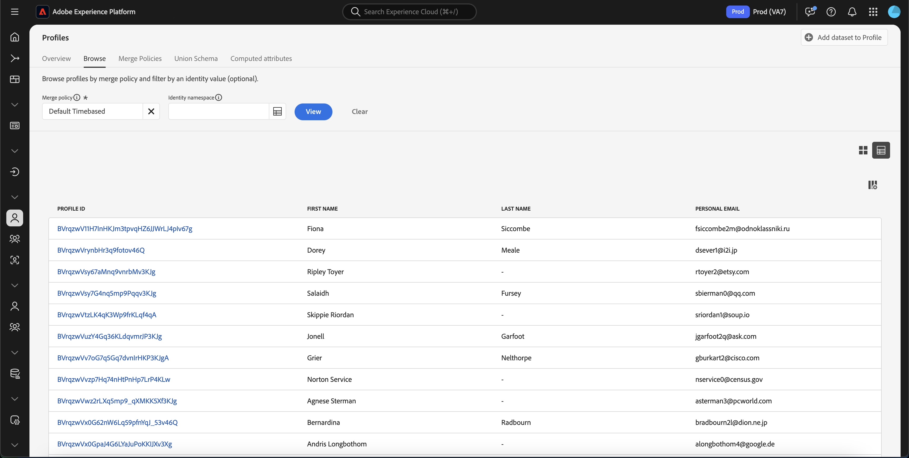
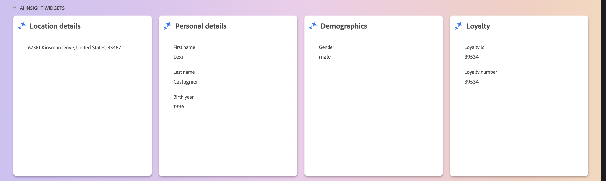

# [!DNL Real-Time Customer Profile] UI-hulplijn

[!DNL Real-Time Customer Profile] maakt een holistische weergave van elk van uw individuele klanten, waarbij gegevens van meerdere kanalen worden gecombineerd, waaronder online-, offline-, CRM- en gegevens van derden. Dit document fungeert als richtlijn voor interactie met [!DNL Real-Time Customer Profile] -gegevens in de gebruikersinterface van Adobe Experience Platform (UI).

## Aan de slag

Deze UI-gids vereist inzicht in de verschillende [!DNL Experience Platform] -services die bij het beheren van [!DNL Real-Time Customer Profiles] betrokken zijn. Voordat u deze handleiding leest of in de gebruikersinterface werkt, raadpleegt u de documentatie voor de volgende services:

* [[!DNL Real-Time Customer Profile]  overzicht &#x200B;](../home.md): Verstrekt een verenigd, in real time consumentenprofiel dat op samengevoegde gegevens van veelvoudige bronnen wordt gebaseerd.
* [[!DNL Identity Service]](../../identity-service/home.md): schakelt [!DNL Real-Time Customer Profile] in door identiteiten te overbruggen van verschillende gegevensbronnen terwijl ze worden ingesloten in [!DNL Experience Platform] .
* [[!DNL Experience Data Model (XDM)]](../../xdm/home.md): Het gestandaardiseerde framework waarmee [!DNL Experience Platform] gegevens voor de klantervaring indeelt.

## [!UICONTROL Overview]

Selecteer in de gebruikersinterface van Experience Platform de optie **[!UICONTROL Profiles]** in de linkernavigatie om het tabblad **[!UICONTROL Overview]** met het profieldashboard te openen.

>[!NOTE]
>
>Als uw organisatie nieuw is voor Experience Platform en nog geen actieve profielgegevenssets of samenvoegbeleid heeft gemaakt, is het dashboard van [!UICONTROL Profiles] niet zichtbaar. In plaats daarvan geeft het tabblad [!UICONTROL Overview] koppelingen en documentatie weer om u te helpen aan de slag te gaan met Real-Time Klantprofiel.

### Profieldashboard {#profile-dashboard}

Het profieldashboard bevat een overzicht van de belangrijkste maatstaven die betrekking hebben op de profielgegevens van uw organisatie.

Meer leren, bezoek de [&#x200B; gids van het profieldashboard &#x200B;](../../dashboards/guides/profiles.md).

## [!UICONTROL Browse] tab

Op het **[!UICONTROL Browse]** lusje kunt u uw profielen of in a **kaart** mening of a **grafiek** mening bekijken door de knevel te selecteren.

Bovendien kunt u door uw profielen bladeren met behulp van een samenvoegbeleid of specifieke profielen opzoeken met behulp van een naamruimte en waarde voor identiteit.

### Bladeren op [!UICONTROL Merge policy]

Het tabblad **[!UICONTROL Browse]** is standaard ingesteld op het standaardsamenvoegbeleid voor uw organisatie. Als u een ander samenvoegbeleid wilt kiezen, selecteert u de `X` naast de naam van het samenvoegbeleid en opent u het dialoogvenster **[!UICONTROL Select merge policy]** met de kiezer.

>[!NOTE]
>
>Als er geen samenvoegbeleid is geselecteerd, opent u het selectiedialoogvenster met de selectieknop naast het veld **[!UICONTROL Merge policy]** .

Als u een samenvoegbeleid wilt kiezen in het dialoogvenster **[!UICONTROL Select merge policy]** , selecteert u het keuzerondje naast de naam van het beleid en gebruikt u **[!UICONTROL Select]** om terug te keren naar het tabblad [!UICONTROL Browse] . Vervolgens kunt u **[!UICONTROL View]** selecteren om de voorbeeldprofielen te vernieuwen en een voorbeeld van profielen weer te geven waarop het nieuwe samenvoegbeleid is toegepast.

De profielen die worden getoond vertegenwoordigen een steekproef van maximaal 20 profielen van de opslag van het Profiel van uw organisatie, nadat het geselecteerde samenvoegbeleid is toegepast. De voorbeeldprofielen voor het geselecteerde samenvoegbeleid worden vernieuwd wanneer nieuwe gegevens worden toegevoegd aan de profielopslag van uw organisatie.

Selecteer **[!UICONTROL Profile ID]** als u de details van een van de voorbeeldprofielen wilt weergeven. Voor meer informatie, zie de sectie later in deze gids op [&#x200B; het bekijken van profieldetails &#x200B;](#profile-detail).

Meer over samenvoegingsbeleid en hun rol binnen Experience Platform leren, zie het [&#x200B; overzicht van het fusiebeleid &#x200B;](../merge-policies/overview.md).

### Bladeren op [!UICONTROL Identity] {#browse-identity}

Op het tabblad **[!UICONTROL Browse]** kunt u een naamruimte voor identiteiten gebruiken om een specifiek profiel op te zoeken aan de hand van een identiteitswaarde. Als u bladert op basis van een identiteit, moet u een samenvoegbeleid, een naamruimte voor identiteit en een identiteitswaarde opgeven.

Gebruik indien nodig de kiezer van **[!UICONTROL Merge policy]** om het dialoogvenster **[!UICONTROL Select merge policy]** te openen en kies het samenvoegbeleid dat u wilt gebruiken.

Vervolgens opent u het dialoogvenster **[!UICONTROL Identity namespace]** met de kiezer van **[!UICONTROL Select identity namespace]** en kiest u de naamruimte waarin u wilt zoeken. Als uw organisatie veel naamruimten heeft, kunt u de zoekbalk in het dialoogvenster gebruiken om de naam van een naamruimte te typen.

U kunt een naamruimte selecteren om aanvullende details weer te geven of het keuzerondje selecteren om een naamruimte te kiezen. Vervolgens kunt u **[!UICONTROL Select]** gebruiken om door te gaan.

Nadat u een [!UICONTROL Identity namespace] hebt geselecteerd en terugkeert naar de tab [!UICONTROL Browse] , kunt u een **[!UICONTROL Identity value]** invoeren die betrekking heeft op de naamruimte die u hebt geselecteerd.

>[!NOTE]
>
>Deze waarde is specifiek voor een individueel klantprofiel en moet een geldige waarde zijn voor de opgegeven naamruimte. Als u bijvoorbeeld de naamruimte E-mail selecteert, hebt u een identiteitswaarde nodig in de vorm van een geldig e-mailadres.

Wanneer een waarde is ingevoerd, selecteert u **[!UICONTROL View]** en geeft u één profiel dat overeenkomt met de waarde. Selecteer de **[!UICONTROL Profile ID]** om een profiel weer te geven.

## Profiel weergeven {#view-profile}

>[!CONTEXTUALHELP]
>id="platform_errors_uplib_201001_404"
>title="Entiteit niet gevonden"
>abstract="Dit betekent dat Experience Platform de gevraagde entiteit niet kon vinden. Probeer een van de volgende oplossingen om deze fout op te lossen:<ul><li>Controleer of de juiste profiel-id wordt vermeld in de URL van de entiteit waartoe u toegang probeert te krijgen.</li><li>Zorg ervoor dat u beschikt over de juiste organisatie- en sandboxcombinatie voor de entiteit waartoe u toegang probeert te krijgen.</li></ul>"

Nadat u een **[!UICONTROL Profile ID]** -tab hebt geselecteerd, wordt het tabblad **[!UICONTROL Detail]** geopend. De profielgegevens die op het tabblad **[!UICONTROL Detail]** worden weergegeven, zijn samengevoegd vanuit meerdere profielfragmenten en vormen één weergave van de individuele klant. Dit omvat klantgegevens zoals basiskenmerken, gekoppelde identiteiten en kanaalvoorkeuren.

Bovendien, kunt u andere details over profielen zoals zijn [&#x200B; attributen &#x200B;](#attributes) bekijken, [&#x200B; gebeurtenissen &#x200B;](#events), en [&#x200B; publieksenlidmaatschap &#x200B;](#audience-membership).

### Tabblad Details {#profile-detail}

Het tabblad **[!UICONTROL Details]** bevat gedetailleerdere informatie over het geselecteerde profiel. Deze secties zijn onderverdeeld in vier secties: Inzichten in het profiel van de klant, AI insight-widgets, aanpasbare widgets en automatisch geclassificeerde widgets.

Bovendien kunt u schakelen of de door AI gegenereerde inzichten worden weergegeven, de details voor de hub in vergelijking met de rand tonen en de details in de grafiekweergave bekijken.

#### Klantprofielinzichten {#customer-profile-insights}

In de sectie **[!UICONTROL Customer profile insights]** wordt een korte inleiding weergegeven over de kenmerken van het profiel. Dit omvat de profiel-id, e-mail, het telefoonnummer, het geslacht, de geboortedatum, en de identiteiten en het lidmaatschap van het publiek van het profiel.

#### AI insight-widgets {#ai-insight-widgets}

>[!IMPORTANT]
>
>Als u een klant van het Schild van de Gezondheidszorg bent, zult u **&#x200B;**&#x200B;niet kunnen gebruiken AI insight widgets.

In de sectie **[!UICONTROL AI insight widgets]** worden widgets weergegeven die door AI zijn gegenereerd. Deze widgets bieden snel inzicht in het profiel, op basis van de profielgegevens, zoals demografie (zoals leeftijd, geslacht of locatie), gebruikersgedrag (zoals de aankoopgeschiedenis, de activiteiten van de website of betrokkenheid van sociale media), en psychografie (zoals interesses, voorkeur of keuzes in levensstijl). Alle AI widgets gebruiken gegevens die **&#x200B;**&#x200B;reeds in het profiel bestaat.

#### Aanpasbare widgets {#customizable-widgets}

In de sectie **[!UICONTROL Customizable widgets]** worden widgets weergegeven die u kunt aanpassen aan uw bedrijfsbehoeften. U kunt kenmerken groeperen in afzonderlijke widgets, ongewenste widgets verwijderen of de lay-out van de widgets aanpassen.

De weergegeven standaardvelden kunnen ook op organisatorisch niveau worden gewijzigd om de voorkeursprofielkenmerken weer te geven. Meer leren over het aanpassen van deze gebieden, met inbegrip van geleidelijke instructies voor het toevoegen van en het verwijderen van attributen en het resizing van dashboardpanelen, te lezen gelieve de [&#x200B; gids van de profieldetail aanpassing &#x200B;](profile-customization.md).

U kunt ook schakelen tussen het weergeven van de kenmerknamen als hun weergavenamen en hun padnamen voor velden. Als u wilt schakelen tussen deze twee weergaven, selecteert u de schakeloptie **[!UICONTROL Show display names]** .

#### Automatisch geclassificeerde widgets {#auto-classified-widgets}

In de sectie **[!UICONTROL Auto-classified widgets]** worden widgets weergegeven die gebruikmaken van het samenvoegingsschema om te bepalen tot welke bronveldgroepen een kenmerk behoort. Hierdoor krijgt u een duidelijkere context waarin de gegevens afkomstig zijn. U kunt de zoekbalk gebruiken om gemakkelijker naar trefwoorden in uw widgets te zoeken.

Deze widgets combineren zowel gebeurtenisgegevens (met de widget Gebeurtenissen beleven) als kenmerkgegevens, zodat u een uniforme weergave van uw profiel hebt. U kunt deze widgets gebruiken om de structuur van de gegevens van uw profiel te onderzoeken om uw [&#x200B; klantgerichte widgets &#x200B;](#customizable-widgets) beter te structureren.

>[!NOTE]
>
>Als er veelvoudige brongebiedsgroepen zijn, zullen widgets **slechts één** van de beschikbare opties gebruiken.

### Tabblad Kenmerken {#attributes}

Het tabblad **[!UICONTROL Attributes]** bevat een lijstweergave met een overzicht van alle kenmerken die betrekking hebben op één profiel, nadat het opgegeven samenvoegbeleid is toegepast.

Deze kenmerken kunnen ook als een JSON-object worden weergegeven door op **[!UICONTROL View JSON]** te selecteren. Dit is handig voor gebruikers die beter willen begrijpen hoe de profielkenmerken in Experience Platform worden ingevoerd.

Als u de kenmerken wilt weergeven die beschikbaar zijn op de Edge, selecteert u **[!UICONTROL Edge]** in de kiezer voor de gegevenslocatie.

Voor meer informatie over randprofielen, te lezen gelieve de [&#x200B; documentatie van randprofielen &#x200B;](../edge-profiles.md).

### Het tabblad Gebeurtenissen {#events}

Het tabblad **[!UICONTROL Events]** bevat gegevens van de 100 meest recente ExperienceEvents die aan de klant zijn gekoppeld. Deze gegevens kunnen het openen van e-mail, winkelwagentjes en paginaweergaven omvatten. Als u **[!UICONTROL View all]** selecteert voor een afzonderlijke gebeurtenis, worden aanvullende velden en waarden vastgelegd als onderdeel van de gebeurtenis.

Gebeurtenissen kunnen ook als een JSON-object worden weergegeven door op **[!UICONTROL View JSON]** te klikken. Dit is handig om te begrijpen hoe gebeurtenissen worden vastgelegd in Experience Platform.

### Tabblad Poortlidmaatschap {#audience-membership}

Op het tabblad **[!UICONTROL Audience membership]** wordt een lijst weergegeven met de naam en beschrijving van het publiek waartoe het individuele klantprofiel momenteel behoort. Deze lijst wordt automatisch bijgewerkt wanneer het profiel in aanmerking komt of vervalt bij het publiek. Het totale aantal soorten publiek waarvoor het profiel momenteel is gekwalificeerd, wordt aan de rechterkant van het tabblad weergegeven.

Voor meer informatie over segmentatie in Experience Platform, gelieve te verwijzen naar de [&#x200B; documentatie van de Dienst van de Segmentatie van Adobe Experience Platform &#x200B;](../../segmentation/home.md).

Selecteer **[!UICONTROL Edge]** in de kiezer voor de gegevenslocatie om het publiekslidmaatschap van de profielen op de Edge weer te geven. Meer informatie over randsegmentatie kan in de [&#x200B; gids van de randsegmentatie &#x200B;](../../segmentation/methods/edge-segmentation.md) worden gevonden.

## Beleid samenvoegen

Selecteer in het hoofdmenu **[!UICONTROL Profiles]** de tab **[!UICONTROL Merge Policies]** om een lijst weer te geven met samenvoegbeleidsregels die bij uw organisatie horen. Elk vermeld beleid toont zijn naam, al dan niet het standaardsamenvoegbeleid, en de schemaklasse die het op van toepassing is.

Voor meer informatie over fusiebeleid, zie het [&#x200B; overzicht van het fusiebeleid &#x200B;](../merge-policies/overview.md).

## Unieschema {#union-schema}

Selecteer in het hoofdmenu **[!UICONTROL Profiles]** het tabblad **[!UICONTROL Union Schema]** om de beschikbare samenvoegingsschema&#39;s voor uw opgenomen gegevens weer te geven. Een samenvoegingsschema is een samenvoeging van alle [!DNL Experience Data Model] (XDM) gebieden onder de zelfde klasse, waarvan schema&#39;s voor gebruik in [!DNL Real-Time Customer Profile] zijn toegelaten.

Voor meer informatie over verenigingsschema&#39;s, gelieve te bezoeken de [&#x200B; gids UI van het uniesschema &#x200B;](union-schema.md).

## Berekende kenmerken {#computed-attributes}

Selecteer in het hoofdmenu **[!UICONTROL Profiles]** het tabblad **[!UICONTROL Computed attributes]** om een lijst weer te geven met berekende kenmerken die bij uw organisatie horen.

Voor meer informatie over gegevens verwerkte attributen, te lezen gelieve [&#x200B; gegevens verwerkt attributenoverzicht &#x200B;](../computed-attributes/overview.md). Voor meer informatie over hoe te om gegevens verwerkte attributen binnen Experience Platform UI te gebruiken, te lezen gelieve de [&#x200B; gegevens verwerkte gids UI van attributen &#x200B;](../computed-attributes/ui.md).

## Volgende stappen

Door deze handleiding te lezen, weet u hoe u de profielgegevens van uw organisatie kunt bekijken en beheren met de gebruikersinterface van Experience Platform. Voor informatie over hoe te met profielgegevens werken gebruikend Experience Platform APIs, gelieve te verwijzen naar de [&#x200B; Realtime gids van het Profiel van de Klant API &#x200B;](../api/overview.md).
