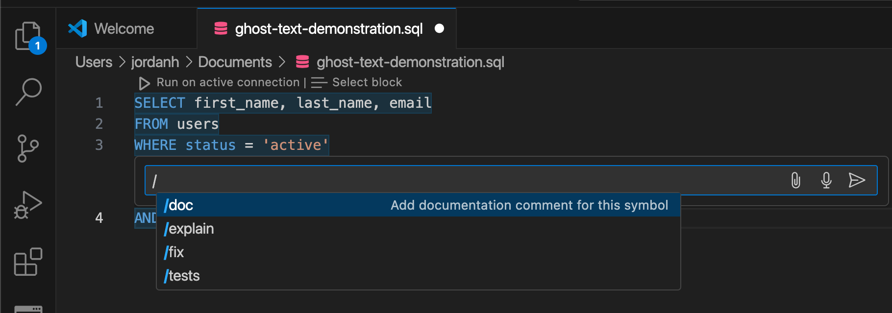

# Verbind [!DNL GitHub Copilot] en [!DNL Visual Studio Code] met de Dienst van de Vraag

>[!IMPORTANT]
>
>Alvorens dit geïntegreerde hulpmiddel te gebruiken, moet u begrijpen welke gegevens met GitHub worden gedeeld. De gedeelde gegevens omvatten contextuele informatie over de code en de dossiers die (&quot;herinneringen&quot;) worden uitgegeven en details over gebruikersacties (&quot;gebruikersbetrokkenheidsgegevens&quot;).  Lees de privacyverklaring van [[!DNL GitHub Copilot] ](https://docs.github.com/en/site-policy/privacy-policies/github-general-privacy-statement#github-privacy-statement) voor meer informatie over de gegevens die ze verzamelen. U moet ook rekening houden met de gevolgen voor de beveiliging van het inschakelen van services van derden, aangezien u verantwoordelijk bent voor de naleving van het beleid voor gegevensbeheer van uw organisatie. Adobe is niet verantwoordelijk voor eventuele bezorgdheid over gegevens of problemen die uit het gebruik van dit instrument kunnen voortvloeien. Raadpleeg de documentatie van GitHub voor meer informatie.

[!DNL GitHub Copilot] , dat wordt aangestuurd door OpenAI Codex, is een door AI aangedreven hulpmiddel dat uw codeerervaring verbetert door codefragmenten en volledige functies direct binnen uw redacteur voor te stellen. [!DNL Visual Studio Code] is geïntegreerd met [!DNL VS Code] ([!DNL Copilot] ) en kan uw workflow aanzienlijk versnellen, vooral wanneer u werkt met complexe query&#39;s. Volg deze handleiding voor het maken van een verbinding tussen [!DNL GitHub Copilot] en [!DNL VS Code] en de Query Service om uw query&#39;s efficiënter te schrijven en te beheren. Voor meer informatie over [!DNL Copilot], bezoek [ GitHub het productpagina van de Kopilot van de Bezoeker ](https://github.com/pricing) en de [ officiële  [!DNL Copilot]  documentatie ](https://docs.github.com/en/copilot/about-github-copilot/what-is-github-copilot).

In dit document worden de stappen beschreven die zijn vereist om [!DNL GitHub Copilot] en [!DNL VS Code] te verbinden met Adobe Experience Platform Query Service.

## Aan de slag {#get-started}

Deze gids vereist dat u reeds toegang tot een rekening GitHub hebt en zich voor [!DNL GitHub Copilot] hebt aangemeld. U kunt [ omhoog van de website van GitHub ](https://github.com/github-copilot/signup) ondertekenen. U hebt ook [!DNL VS Code] nodig. U kunt [ downloaden  [!DNL VS Code]  van hun officiële website ](https://code.visualstudio.com/download).

Nadat u [!DNL VS Code] hebt geïnstalleerd en uw [!DNL Copilot] -abonnement hebt geactiveerd, verkrijgt u uw verbindingsgegevens voor Experience Platform. Deze referenties bevinden zich op het tabblad [!UICONTROL Credentials] van de [!UICONTROL Queries] -werkruimte in de gebruikersinterface van Experience Platform. Lees de geloofsbrieven gids aan [ leren hoe te om deze waarden in Experience Platform te vinden UI ](../ui/credentials.md). Neem contact op met uw organisatiebeheerder als u momenteel geen toegang hebt tot de werkruimte van [!UICONTROL Queries] .

### Vereiste [!DNL Visual Studio Code] extensies {#required-extensions}

De volgende [!DNL Visual Studio Code] -extensies zijn vereist om uw Experience Platform SQL-databases effectief te beheren en er query&#39;s op uit te voeren, rechtstreeks in de code-editor. Download en installeer deze extensies.

- [ SQLTools ](https://marketplace.visualstudio.com/items?itemName=mtxr.sqltools): Gebruik de uitbreiding SQLTools om veelvoudige SQL gegevensbestanden te beheren en te vragen. Het bevat functies zoals een queryfunctie, SQL-formatter en verbindingsverkenner, met ondersteuning voor extra stuurprogramma&#39;s om de productiviteit van ontwikkelaars te verhogen. Lees het overzicht op de Marketplace van Visual Studio voor meer details.
- [ De Bestuurder van SQLTools PostgreSQL/Cockroach ](https://marketplace.visualstudio.com/items?itemName=mtxr.sqltools-driver-pg): Deze uitbreiding laat u toe om, gegevensbestanden te verbinden te vragen en te beheren PostgreSQL en CockroachDB direct binnen uw coderedacteur.

De volgende extensies schakelen [!DNL GitHub Copilot] en de chatfuncties in.

- [[!DNL GitHub Copilot] ](https://marketplace.visualstudio.com/items?itemName=GitHub.copilot): verstrekt gealigneerde coderingssuggesties aangezien u typt.
- [[!DNL GitHub Copilot]  Praatje ](https://marketplace.visualstudio.com/items?itemName=GitHub.copilot-chat): Een metgezeluitbreiding die gesprekssteun AI verstrekt.

## Verbinding maken {#create-connection}

Selecteer het cilinderpictogram () in de linkernavigatie van [!DNL VS Code], gevolgd door **[!DNL Add New Connection]** of de cilinder plus pictogram ().

De lus **[!DNL Connection Assistant]** wordt weergegeven. Selecteer het databasestuurprogramma van **[!DNL PostgreSQL]** .

![ de montages SQLTools pagina in [!DNL VS Code] met benadrukt PostgreSQl.](../images/clients/github-copilot/postgres-database-driver.png)

### Invoerverbindingsinstellingen {#input-connection-settings}

De weergave [!DNL Connection Settings] wordt weergegeven. Voer uw Experience Platform-verbindingsgegevens in de desbetreffende velden van de SQLTools [!DNL Connection Assistant] in. De vereiste waarden worden in de onderstaande tabel uitgelegd.

| Eigenschap | Beschrijving |
| --- |--- |
| [!DNL Connection name] | Verstrek &quot;[!DNL Connection name]&quot;als `Prod_MySQL_Server` die beschrijvend is en duidelijk zijn doel (bijvoorbeeld, een productiemilieu voor een server MySQL) wijst. De beste praktijken omvatten: <ul><li>Volg de naamgevingsconventies van uw organisatie om ervoor te zorgen dat deze binnen het systeem uniek is.</li><li>Houd het beknopt om duidelijkheid te behouden en verwarring met andere verbindingen te voorkomen.</li><li>Vermeld relevante details over de functie of omgeving van de verbinding in de naam.</li></ul> |
| [!DNL Connect using] | Gebruik de optie **[!DNL Server and Port]** om het adres (hostnaam) van de server en het poortnummer op te geven voor een directe verbinding met Experience Platform |
| [!DNL Server address] | Voer de **[!UICONTROL Host]** -waarde in die u hebt opgegeven in uw Experience Platform Postgres-referenties, zoals `acmeprod.platform-query.adobe.io` . |
| [!DNL Port] | Deze waarde is doorgaans `80` voor Experience Platform-services. |
| [!DNL Database] | Voer de **[!UICONTROL Database]** -waarde in die u hebt opgegeven in uw Experience Platform Postgres-referenties, zoals `prod:all` . |
| [!DNL Username] | Deze eigenschap verwijst naar uw organisatie-id. Voer de **[!UICONTROL Username]** -waarde in die in uw Experience Platform Postgres-referenties wordt opgegeven. |
| [!DNL Password] | Dit bezit is uw toegangstoken. Voer de **[!UICONTROL Password]** -waarde in die in uw Experience Platform Postgres-referenties wordt opgegeven. |

Selecteer vervolgens **[!DNL Use Password]** , gevolgd door **[!DNL Save as plaintext in settings]** in het vervolgkeuzemenu dat wordt weergegeven. Het veld [!DNL Password] wordt weergegeven. Gebruik dit tekstinvoerveld om uw toegangstoken in te voeren.

Als u SSL wilt inschakelen, selecteert u het invoerveld [!DNL SSL] en kiest u [!DNL Enabled] in het vervolgkeuzemenu dat wordt weergegeven.

>[!TIP]
>
>Nadat u al uw gegevens hebt ingevoerd, kunt u de verbinding testen voordat u de verbinding opslaat. Schuif omlaag naar de onderkant van de werkruimte en selecteer **[!DNL Test Connection]** .
>
>{width="100" zoomable="yes"}

Nadat u de verbindingsgegevens correct hebt ingevoerd, selecteert u **[!DNL Save Connection]** om uw instellingen te bevestigen.

De weergave [!DNL Review connection details] wordt weergegeven en uw verbindingsgegevens worden weergegeven. Selecteer **[!DNL Connect Now]** als u zeker weet dat de verbindingsgegevens correct zijn.

De werkruimte van [!DNL VS Code] wordt weergegeven met een suggestie van [!DNL GitHub Copilot] .

![ een verbonden SQL zitting in [!DNL VS Code].](../images/clients/github-copilot/connected.png)

## [!DNL GitHub Copilot] handleiding

Nadat u verbinding hebt gemaakt met uw Experience Platform-instantie, kunt u [!DNL Copilot] gebruiken als AI-codeerassistent om sneller en betrouwbaarder code te schrijven. In deze sectie worden de belangrijkste functies en het gebruik ervan besproken.

## Aan de slag met [!DNL GitHub Copilot] {#get-started-with-copilot}

Controleer eerst of u de nieuwste versie van [!DNL VS Code] hebt geïnstalleerd. Een verouderde [!DNL VS Code] versie kan belangrijke [!DNL Copilot] eigenschappen verhinderen te werken zoals bedoeld. Controleer vervolgens of de instelling [!DNL Enable Auto Completions] is ingeschakeld. Als [!DNL Copilot] correct loopt, verschijnt het **[!DNL Copilot]pictogram** () in uw statusbar (als er een kwestie is, in plaats daarvan toont het [!DNL Copilot] foutenpictogram). Selecteer het **[!DNL Copilot]pictogram** om het [!DNL [!DNL GitHub Copilot] Menu] te openen. Van **[!DNL [!DNL GitHub Copilot] Menu]**, uitgezochte **[!DNL Edit Settings]**

![ de [!DNL VS Code] redacteur met [!DNL GitHub Copilot Menu] getoond en het [!DNL Copilot] pictogram en geeft benadrukte Montages uit.](../images/clients/github-copilot/github-copilot-menu.png)

Schuif omlaag de opties en controleer of het selectievakje is ingeschakeld voor de instelling [!DNL Enable Auto Completions] .

![ het montagespaneel voor [!DNL GitHub Copilot] met de Enable Auto geselecteerde en benadrukte checkbox van Voltooiingen.](../images/clients/github-copilot/enable-auto-completions.png)

## Codevoltooiing {#code-completions}

Zodra u de [!DNL GitHub Copilot] uitbreiding en login installeert, activeert het automatisch een eigenschap genoemd **Tekst van Ghost**, die codevoltooiing voorstelt aangezien u typt. Deze suggesties helpen u code efficiënter en met minder onderbrekingen te schrijven. U kunt ook opmerkingen gebruiken als richtlijn voor suggesties voor AI-code. Dit betekent dat niet-technische gebruikers gewone spraak kunnen omzetten in code om hun gegevens te verkennen.

![ VSCode UI met een codesuggestie en het [!DNL GitHub Copilot] benadrukte pictogram.](../images/clients/github-copilot/ghost-text.png)

>[!TIP]
>
>Als u [!DNL Copilot] voor een specifiek bestand of een bepaalde taal wilt uitschakelen, selecteert u het pictogram op de statusbalk en schakelt u het uit.

### Ghost-tekstsuggesties volledig of gedeeltelijk accepteren {#accept-suggestions}

Als [!DNL GitHub Copilot] codevoltooiing voorstelt, kunt u gedeeltelijke of volledige suggesties goedkeuren. Selecteer **Lusje** om de volledige suggestie goed te keuren, of onderdruk **Controle (of Bevel op Mac)** en druk de **juiste pijl** om gedeeltelijke tekst goed te keuren. Om een suggestie te sluiten, druk **Escape**.

>[!TIP]
>  
>Als u geen suggesties krijgt, zorg ervoor dat [[!DNL Copilot]  in de taal van uw dossier ](#get-started-with-copilot) wordt toegelaten.

![ de [!DNL VS Code] redacteur die een vervagende grijze tekstsuggestie van [!DNL GitHub Copilot] als Tekst van de Schim naast gedeeltelijk getypte code toont.](../images/clients/github-copilot/accept-partial-suggestions.png)

### Alternatieve suggesties {#alternative-suggestions}

Als u alternatieve codesuggesties wilt doorlopen, selecteert u de pijlen in het dialoogvenster [!DNL Copilot] .

![ de [!DNL VS Code] redacteur die het de alternatieve suggesties van Copilot paneel toont.](../images/clients/github-copilot/code-suggestions.png)

## Inline chatten gebruiken {#inline-chat}

U kunt ook rechtstreeks chatten met [!DNL Copilot] over uw code. Gebruik **Controle (of Bevel) + I** om de gealigneerde praatjedialoog teweeg te brengen. Deze functie wordt gebruikt om uw code te herhalen en suggesties in context te verfijnen. U kunt een codeblok markeren en inline chatten gebruiken om een andere oplossing te zien die door de AI is voorgesteld voordat u deze accepteert.

<!-- THis section is poss unnecessary:
There are inline features for chat including doc, expalin, fix and test

 -->

## Speciale chatweergave {#dedicated-chat}

U kunt een meer traditionele praatjeinterface met een specifieke praatjezijbalk gebruiken om ideeën en strategie te vormen, codeerkwesties op te lossen, en implementatiedetails te bespreken. Selecteer het praatjepictogram ( ) in de zijbalk van [!DNL VS Code] om een speciaal chatvenster te openen.

![ sidebar van het 1} praatje met het benadrukte praatjepictogram.[!DNL GitHub Copilot]](../images/clients/github-copilot/chat-sidebar.png)

U kunt tot praatjegeschiedenis ook toegang hebben door het geschiedenispictogram te selecteren ( ) boven aan het venster Chat.

## Volgende stappen

U kunt nu op efficiënte wijze rechtstreeks vanuit uw code-editor query&#39;s uitvoeren op uw Experience Platform-databases en de door AIR aangedreven codesuggesties van [!DNL GitHub Copilot] gebruiken om het schrijven en optimaliseren van SQL-query&#39;s te stroomlijnen. Voor meer informatie over hoe te om vragen te schrijven en in werking te stellen, verwijs naar de [ begeleiding voor vraaguitvoering ](../best-practices/writing-queries.md).
