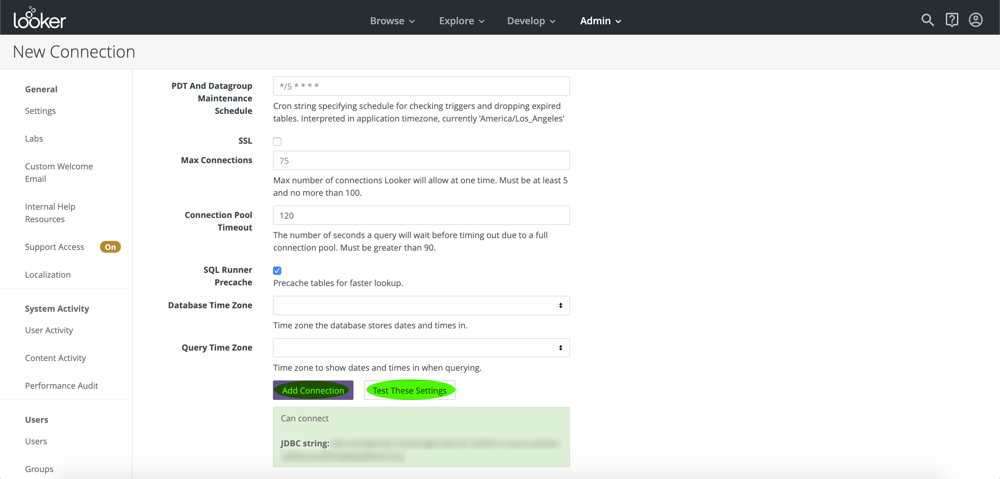

# Verbinding maken met Looker

Volg onderstaande stappen om verbinding te maken met Adobe Query Service op Adobe Experience Platform:

Nadat u zich hebt aangemeld bij Lader, klikt u op **Beheer**, gevolgd door **Verbindingen**.

Klik op deze pagina op **Nieuwe verbinding**.

Van hier, kunt u de details voor de Montages van de Verbinding invullen.

- **Naam:** De naam van de verbinding.
- **Dialect:** Het dialect dat voor het SQL gegevensbestand wordt gebruikt. De Dienst van de vraag gebruikt **PostgreSQL**.
- **Host en poort:** Het gastheereindpunt en zijn haven voor de Dienst van de Vraag.
- **Database:** De database die wordt gebruikt.
- **Gebruikersnaam en wachtwoord:** De aanmeldingsgegevens die worden gebruikt. De gebruikersnaam heeft de vorm van `ORG_ID@AdobeOrg`.

>[!NOTE] Ga naar de pagina met [referenties op Platform](https://platform.adobe.com/query/configuration)voor meer informatie over het zoeken naar uw host en poort, databasenaam en aanmeldingsgegevens. Om uw geloofsbrieven te vinden, login aan Platform, klik **Vragen**, dan klik **Referenties**.

Nadat u de verbindingsgegevens hebt ingevoerd, klikt u op Deze instellingen **** testen om te controleren of uw referenties naar behoren werken. Als dat het geval is, wordt hieronder een bericht weergegeven dat u verbinding kunt maken. Als de verbinding daadwerkelijk tot stand is gebracht, klikt u op Verbinding **** toevoegen om de verbinding te maken.

## Volgende stappen

Nu u met de Dienst van de Vraag hebt verbonden, kunt u Drager gebruiken om vragen te schrijven. Voor meer informatie over hoe te om vragen te schrijven en in werking te stellen, te lezen gelieve de [lopende vraaggids](../creating-queries/creating-queries.md).