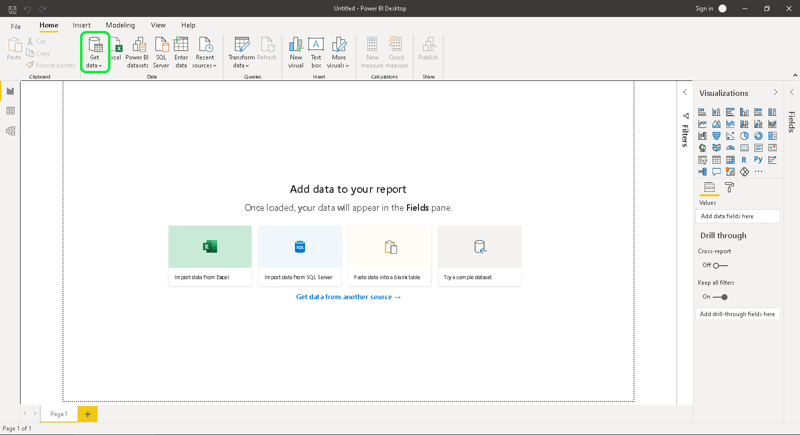
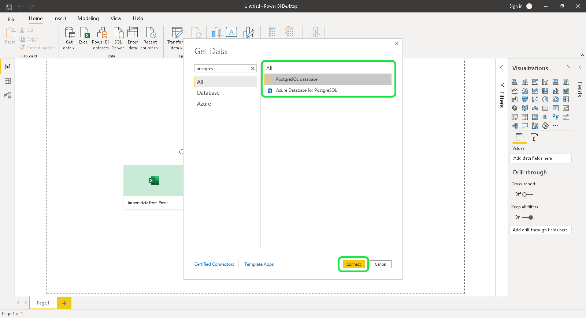
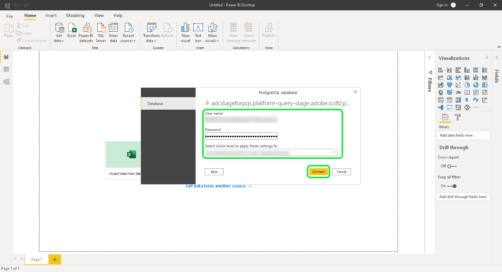

# [!DNL Power BI] verbinden met de Dienst van de Vraag (PC)

In dit document worden de stappen beschreven voor het maken van verbinding met Adobe Experience Platform Query Service.

>[!NOTE]
>
> Deze gids veronderstelt u reeds toegang tot [!DNL Power BI] hebt en vertrouwd met hoe te om zijn interface te navigeren. Meer informatie over [!DNL Power BI] vindt u in de [officiële [!DNL Power BI] documentatie](https://docs.looker.com/).
>
> Bovendien is Power BI **alleen** beschikbaar op Windows-apparaten.

Na het installeren van Power BI, zult u `Npgsql`, een .NET bestuurderspakket voor PostSQL moeten installeren. Meer informatie over Npgsql vindt u in de [Npgsql-documentatie](https://www.npgsql.org/doc/index.html).

>[!IMPORTANT]
>
>U moet versie 4.0.10 of lager downloaden omdat nieuwere versies fouten opleveren.

Selecteer **[!DNL Will be installed on local hard drive]** onder &quot;[!DNL Npgsql GAC Installation]&quot; in het aangepaste instellingsscherm.

Start de computer opnieuw op voordat u verdergaat met de volgende stappen om ervoor te zorgen dat npgsql correct is geïnstalleerd.

## [!DNL Power BI] verbinden met [!DNL Query Service]

Als u [!DNL Power BI] wilt verbinden met [!DNL Query Service], opent u [!DNL Power BI] en selecteert u **[!DNL Get Data]** in het bovenste menullint.

Selecteer **[!DNL PostgreSQL database]**, gevolgd door **[!DNL Connect]**.

U kunt nu waarden voor de server en database invoeren. Voor meer informatie bij het vinden van uw gegevensbestandnaam, gastheer, haven, en login geloofsbrieven, bezoek de [geloofsbrieven pagina op Platform](https://platform.adobe.com/query/configuration). Als u uw referenties wilt zoeken, meldt u zich aan bij [!DNL Platform] en selecteert u **[!UICONTROL Vragen]**, gevolgd door **[!UICONTROL Referenties]**.

**[!DNL Server]** is de host die onder de verbindingsgegevens is gevonden. Voor productie, voeg haven `:80` aan het eind van het gastheerkoord toe. **[!DNL Database]** kan &quot;all&quot;of een naam van de datasetlijst zijn.

Bovendien kunt u uw **[!DNL Data Connectivity mode]** selecteren. Selecteer **[!DNL Import]** om een lijst van alle beschikbare lijsten te tonen, of **[!DNL DirectQuery]** te selecteren om een vraag direct tot stand te brengen.

Voor meer informatie over de modus **[!DNL Import]** leest u de sectie over [het voorvertonen en importeren van een tabel](#preview). Lees voor meer informatie over de modus **[!DNL DirectQuery]** de sectie over het maken van SQL-instructies](#create). [ Selecteer **[!DNL OK]** nadat u de databasedetails hebt bevestigd.

Er wordt een vraag om uw gebruikersnaam, wachtwoord en toepassingsinstellingen weergegeven. Vul deze details in en selecteer **[!DNL Connect]** om door te gaan naar de volgende stap.

## Een tabel voorvertonen en importeren {#preview}

Als u de modus **[!DNL Import]** hebt geselecteerd, wordt een dialoogvenster weergegeven met een lijst van alle beschikbare tabellen. Selecteer de lijst u wilt voorproef, die door **[!DNL Load]** wordt gevolgd om de dataset in [!DNL Power BI] te brengen.

De tabel wordt nu geïmporteerd in Power BI.

## SQL-instructies {#create} maken

Als u de modus **[!DNL DirectQuery]** hebt geselecteerd, moet u de sectie Geavanceerde opties invullen met de SQL-query die u wilt maken.

Voeg onder **[!DNL SQL statement]** de SQL-query in die u wilt maken. Zorg ervoor dat het selectievakje **[!DNL Include relationship columns]** is ingeschakeld. Nadat u de query hebt geschreven, selecteert u **[!DNL OK]** om door te gaan.

Er wordt een voorbeeld van de query weergegeven. Selecteer **[!DNL Load]** om de resultaten van de vraag te zien.

## Volgende stappen

Nu u met [!DNL Query Service] hebt verbonden, kunt u [!DNL Power BI] gebruiken om vragen te schrijven. Voor meer informatie over hoe te om vragen te schrijven en in werking te stellen, te lezen gelieve de gids op [lopende vragen](../best-practices/writing-queries.md).