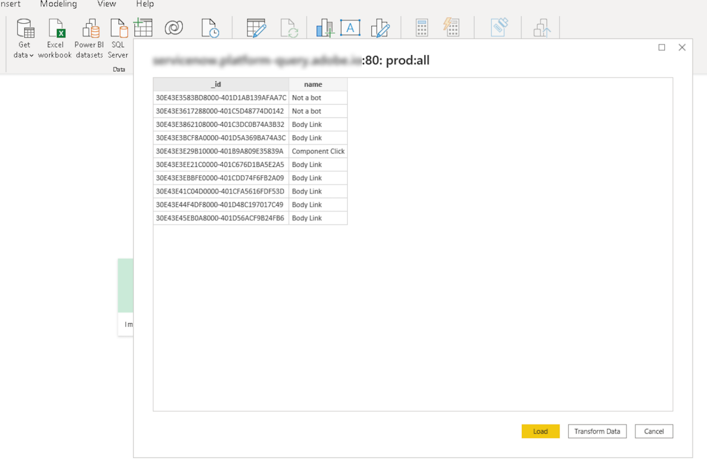

# Verbinding maken met Power BI-zoekservice

In dit document worden de stappen beschreven voor het verbinden van Power BI Desktop met Adobe Experience Platform Query Service.

## Aan de slag

Deze handleiding vereist dat u al toegang hebt tot de Power BI-bureaubladtoepassing en bekend bent met de manier waarop u door de interface kunt navigeren. Als u Power BI Desktop wilt downloaden, raadpleegt u de [officiële Power BI](https://docs.microsoft.com/en-us/power-bi/).

>[!IMPORTANT]
>
> De Power BI-bureaubladtoepassing is **alleen** beschikbaar op Windows-apparaten.

Om de noodzakelijke geloofsbrieven te verkrijgen voor het verbinden van Power BI met Experience Platform, moet u toegang tot de werkruimte van Vragen in Platform UI hebben. Neem contact op met de beheerder van de IMS-organisatie als u momenteel geen toegang hebt tot de werkruimte Query&#39;s.

Na het installeren van Power BI, zult u moeten installeren `Npgsql`, een .NET stuurprogrammapakket voor PostgreSQL. Meer informatie over Npgsql vindt u in de [Npgsql-documentatie](https://www.npgsql.org/doc/index.html).

>[!IMPORTANT]
>
>U moet versie 4.0.10 of lager downloaden omdat nieuwere versies fouten opleveren.

Onder &quot;[!DNL Npgsql GAC Installation]&quot; in het aangepaste instellingenscherm selecteert u **[!DNL Will be installed on local hard drive]**.

Start de computer opnieuw op voordat u verdergaat met de volgende stappen om ervoor te zorgen dat Npgsql correct is geïnstalleerd.

## Verbinding maken met Power BI-zoekservice {#connect-power-bi}

Als u Power BI wilt verbinden met Query Service, opent u Power BI en selecteert u **[!DNL Get Data]** in het bovenste menulint.

Voer &quot;PostgreSQL&quot; in de zoekbalk in om de lijst met gegevensbronnen te beperken. Onder de resultaten die worden weergegeven, selecteert u **[!DNL PostgreSQL database]**, gevolgd door **[!DNL Connect]**.

Het dialoogvenster PostgreSQl-database wordt weergegeven met daarin waarden voor uw server en database. Deze waarden zijn ontleend aan je Adobe Experience Platform-gebruikersgegevens. Meld u aan bij de gebruikersinterface van het Platform en selecteer **[!UICONTROL Queries]** van de linkernavigatie, gevolgd door **[!UICONTROL Credentials]**. Voor meer informatie over het vinden van uw gegevensbestandnaam, gastheer, haven, en login geloofsbrieven, gelieve te lezen [aanmeldingsgids](../ui/credentials.md).

Voor de **[!DNL Server]** in Power BI, ga de waarde voor de gastheer in die in de sectie van de Verantwoordelijkheden van de Dienst van de Vraag wordt gevonden. Voor productie, voeg haven toe `:80` tot het einde van de hosttekenreeks. Bijvoorbeeld, `made-up.platform-query.adobe.io:80`.

De **[!DNL Database]** het veld kan &quot;all&quot; of een tabelnaam van een gegevensset zijn. Bijvoorbeeld, `prod:all`.

>[!IMPORTANT]
>
>De genestelde gegevensstructuren in derdehulpmiddelen van BI kunnen worden afgevlakt om hun bruikbaarheid te verbeteren en de vereiste werkbelasting te verminderen om gegevens terug te winnen, te analyseren, om te zetten en te melden. Zie de documentatie op de[`FLATTEN` functie](../best-practices/flatten-nested-data.md) voor instructies over het activeren van deze instelling wanneer u verbinding maakt met een database.

### De modus Gegevensconnectiviteit

Vervolgens kunt u uw **[!DNL Data Connectivity mode]**. Selecteren **[!DNL Import]** gevolgd door **[!DNL OK]** om een lijst van alle beschikbare lijsten te tonen, of selecteer **[!DNL DirectQuery]** om de gegevensbron te vragen direct zonder het invoeren of het kopiëren gegevens in Power BI.

Meer informatie over **[!DNL Import]** in de modus, lees de sectie op [een tabel importeren](#import). Meer informatie over **[!DNL DirectQuery]** in de modus, lees de sectie op [het vragen van een dataset zonder gegevens in te voeren](#direct-query).

Selecteren **[!DNL OK]** nadat u de databasedetails hebt bevestigd.

### Verificatie

Er wordt een vraag om uw gebruikersnaam, wachtwoord en toepassingsinstellingen weergegeven. De gebruikersnaam is in dit geval uw organisatie-id en het wachtwoord is uw verificatietoken. Beide zijn te vinden op de pagina van de geloofsbrieven van de Dienst van de Vraag.

Vul deze details in en selecteer vervolgens **[!DNL Connect]** om door te gaan met de volgende stap.

## Een tabel importeren {#import}

Als u **[!DNL Import]** [!DNL Data Connectivity mode], wordt de volledige dataset ingevoerd die u toestaat om de geselecteerde lijsten en de kolommen binnen de Desktoptoepassing van de Power BI te gebruiken ongewijzigd.

>[!IMPORTANT]
>
>Om gegevensveranderingen te zien die sinds de aanvankelijke invoer zijn voorgekomen, moet u de gegevens binnen Power BI vernieuwen door de volledige dataset opnieuw in te voeren.

Als u een tabel wilt importeren, voert u de server- en databasedetails in [zoals hierboven beschreven](#connect-power-bi) en selecteert u de **[!DNL Import]** [!DNL Data Connectivity mode], gevolgd door **[!DNL OK]**. Er wordt een dialoogvenster weergegeven met een lijst van alle beschikbare tabellen. Selecteer de tabel waarvan u een voorvertoning wilt weergeven, gevolgd door **[!DNL Load]** om de gegevensset in Power BI te brengen.

De tabel wordt nu geïmporteerd in Power BI.

### Tabellen importeren met behulp van aangepaste SQL

Power BI en andere hulpmiddelen van derden, zoals Tableau, staan gebruikers momenteel niet toe geneste objecten, zoals XDM-objecten in Platform, te importeren. Om dit te verklaren, staat Power BI u toe om douaneSQL te gebruiken om tot deze genestelde gebieden toegang te hebben en een samengevoegde mening van de gegevens tot stand te brengen. Power BI laadt vervolgens deze samengevoegde weergave van de eerder geneste gegevens als een normale tabel.

Selecteer in het pop-upvenster PostSQL-database de optie **[!DNL Advanced options]** om een aangepaste SQL-query in te voeren in het dialoogvenster **[!DNL SQL statement]** sectie. Deze aangepaste query moet worden gebruikt om de naam-waardeparen van JSON af te vlakken in een tabelindeling.

Nadat u uw aangepaste vraag hebt ingegaan, uitgezocht **[!DNL OK]** om door te gaan met het verbinden van uw database. Zie de [verificatie](#authentication) Zie de bovenstaande sectie voor instructies voor het verbinden van een database vanuit dit gedeelte van de workflow.

Zodra de authentificatie volledig is, verschijnt een voorproef van de samengevoegde gegevens in het dashboard van de Desktop van de Power BI als lijst. De server- en databasenaam worden boven in het dialoogvenster weergegeven. Selecteren **[!DNL Load]** om het importproces te voltooien.

De visualisaties kunnen nu worden bewerkt en geëxporteerd vanuit de Power BI Desktop-app.

## Vraag de dataset zonder gegevens in te voeren {#direct-query}

De **[!DNL DirectQuery]** [!DNL Data Connectivity mode] vraagt rechtstreeks de gegevensbron zonder het invoeren van of het kopiëren van gegevens in de Desktop van de Power BI. Met deze verbindingsmodus kunt u alle visualisaties met de huidige gegevens vernieuwen via de gebruikersinterface. De tijd die nodig is om de visualisatie te produceren of te vernieuwen, is echter afhankelijk van de prestaties van de onderliggende gegevensbron.

Om dit te gebruiken [!DNL Data Connectivity mode], selecteert u de **[!DNL DirectQuery]** vervolgens schakelen **[!DNL Advanced options]** om een aangepaste SQL-query in te voeren in het dialoogvenster **[!DNL SQL statement]** sectie. Zorg ervoor dat **[!DNL Include relationship columns]** is geselecteerd. Als u de query hebt voltooid, selecteert u **[!DNL OK]** om door te gaan.

Er wordt een voorbeeld van de query weergegeven. Selecteren **[!DNL Load]** om de resultaten van de query weer te geven.

## Volgende stappen

Door dit document te lezen, moet u nu weten hoe u verbinding maakt met de bureaubladtoepassing Power BI en de verschillende beschikbare gegevensverbindingsmodi. Voor meer informatie over hoe te om vragen te schrijven en in werking te stellen, verwijs naar [richtlijnen voor het uitvoeren van query&#39;s](../best-practices/writing-queries.md).
