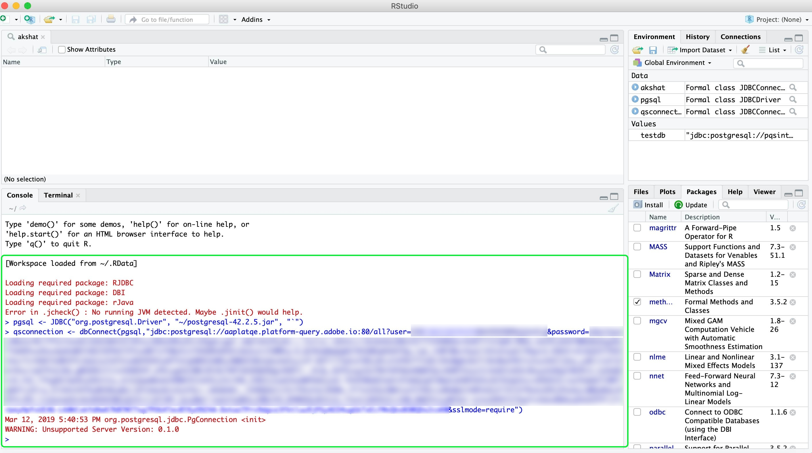

# [!DNL RStudio] verbinden met de Dienst van de Vraag

Dit document doorloopt de stappen voor het verbinden van [!DNL RStudio] met Adobe Experience Platform [!DNL Query Service].

>[!NOTE]
>
> Deze gids veronderstelt u reeds toegang tot [!DNL RStudio] hebt en vertrouwd met hoe te om het te gebruiken. Meer informatie over [!DNL RStudio] vindt u in de [officiële [!DNL RStudio] documentatie](https://rstudio.com/products/rstudio/).
> 
> Bovendien, om RStudio met de Dienst van de Vraag te gebruiken, moet u de Bestuurder PostSQL JDBC 4.2 installeren. U kunt het JDBC-stuurprogramma downloaden van de [officiële PostSQL-site](https://jdbc.postgresql.org/download.html).

## Een [!DNL Query Service]-verbinding maken in de [!DNL RStudio]-interface

Nadat u [!DNL RStudio] hebt geïnstalleerd, moet u het RJDBC-pakket installeren. Ga naar **[!DNL Packages]** ruit, en selecteer **[!DNL Install]**.


Er verschijnt een pop-up met het scherm **[!DNL Install Packages]**. Zorg ervoor dat **[!DNL Repository (CRAN)]** voor **[!DNL Install from]** sectie wordt geselecteerd. De waarde voor **[!DNL Packages]** moet `RJDBC` zijn. Zorg ervoor dat **[!DNL Install dependencies]** is geselecteerd. Nadat u hebt bevestigd dat alle waarden correct zijn, selecteert u **[!DNL Install]** om de pakketten te installeren.


Nu het RJDBC-pakket is geïnstalleerd, start u RStudio opnieuw om het installatieproces te voltooien.

Nadat RStudio opnieuw is begonnen, kunt u met de Dienst van de Vraag nu verbinden. Selecteer het **[!DNL RJDBC]** pakket in **[!DNL Packages]** ruit, en ga het volgende bevel in de console in:

```console
pgsql <- JDBC("org.postgresql.Driver", "{PATH TO THE POSTGRESQL JDBC JAR}", "`")
```

Waar {PAD NAAR DE POSTGRESQL JDBC    het pad vertegenwoordigt naar de PostSQL JDBC JAR die op uw computer is geïnstalleerd.

Nu, kunt u uw verbinding aan de Dienst van de Vraag tot stand brengen door het volgende bevel in de console in te gaan:

```console
qsconnection <- dbConnect(pgsql, "jdbc:postgresql://{HOSTNAME}:{PORT}/{DATABASE_NAME}?user={USERNAME}&password={PASSWORD}&sslmode=require")
```

>[!NOTE]
>
>Voor meer informatie bij het vinden van uw gegevensbestandnaam, gastheer, haven, en login geloofsbrieven, bezoek de [geloofsbrieven pagina op Platform](https://platform.adobe.com/query/configuration). Als u uw referenties wilt zoeken, meldt u zich aan bij [!DNL Platform] en selecteert u **[!UICONTROL Vragen]**, gevolgd door **[!UICONTROL Referenties]**.



## Bezig met schrijven van query&#39;s

Nu u met [!DNL Query Service] hebt verbonden, kunt u vragen schrijven om SQL verklaringen uit te voeren en uit te geven. U kunt bijvoorbeeld `dbGetQuery(con, sql)` gebruiken om query&#39;s uit te voeren, waarbij `sql` de SQL-query is die u wilt uitvoeren.

De volgende query gebruikt een dataset met [Experience Events](../best-practices/experience-event-queries.md) en maakt een histogram van paginaweergaven van een website, gezien de schermhoogte van het apparaat.

```sql
df_pageviews <- dbGetQuery(con,
"SELECT t.range AS buckets, 
 Count(*) AS pageviews 
FROM (SELECT CASE 
 WHEN device.screenheight BETWEEN 0 AND 99 THEN '0 - 99' 
 WHEN device.screenheight BETWEEN 100 AND 199 THEN '100-199' 
 WHEN device.screenheight BETWEEN 200 AND 299 THEN '200-299' 
 WHEN device.screenheight BETWEEN 300 AND 399 THEN '300-399' 
 WHEN device.screenheight BETWEEN 400 AND 499 THEN '400-499' 
 WHEN device.screenheight BETWEEN 500 AND 599 THEN '500-599' 
 ELSE '600-699' 
 end AS range 
 FROM aa_post_vals_3) t 
GROUP BY t.range 
ORDER BY buckets 
LIMIT 1000000")
```

Een succesvol antwoord retourneert de resultaten van de query:

```r
df_pageviews
 buckets pageviews
1 0 - 99 198985
2 500-599 67138
3 300-399 2147
4 200-299 354
5 400-499 6947
6 100-199 4415
7 600-699 3097040
```

## Volgende stappen

Voor meer informatie over hoe te om vragen te schrijven en in werking te stellen, te lezen gelieve de gids op [lopende vragen](../best-practices/writing-queries.md).