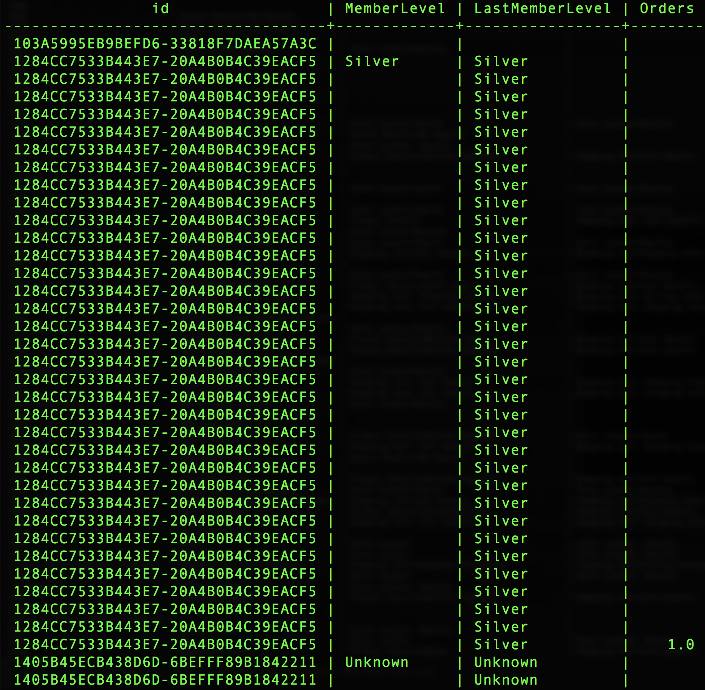

# Door Adobe gedefinieerde functies gebruiken

Een van de grote onderscheidende factoren van Adobe is dat zij ervaren gegevens begrijpen en weten wat klanten met die gegevens moeten kunnen doen. U kunt dit inzicht gebruiken om hulpfuncties te bouwen die uw baan gemakkelijker maken.

Dit document behandelt door Adobe gedefinieerde functies (ADF&#39;s) ter ondersteuning van drie belangrijke analytische activiteiten:
- [Sessionering](#sessionization)
- [Attributie](#attribution)
- [Plakken](#pathing)

## Sessionering

De `SESS_TIMEOUT()` reproduceren de bezoekersgroepen die bij Adobe Analytics zijn gevonden. Het voert een gelijkaardige op tijd-gebaseerde groepering uit, maar met klantgerichte parameters.

**Syntaxis:**

`SESS_TIMEOUT(timestamp, timeout_in_seconds) OVER ([partition] [order] [frame])`

**Retourneert:**

Structuur met velden `(timestamp_diff, num, is_new, depth)`

### Rijniveau `SESS_TIMEOUT()` en uitvoer verkennen

```sql
SELECT analyticsVisitor,
      session.is_new,
      session.timestamp_diff,
      session.num,
      session.depth
FROM  (
        SELECT endUserIDs._experience.aaid.id as analyticsVisitor,
        SESS_TIMEOUT(timestamp, 60 * 30)
        OVER (PARTITION BY endUserIDs._experience.aaid.id
        ORDER BY timestamp
        ROWS BETWEEN UNBOUNDED PRECEDING AND CURRENT ROW)
        AS session
        FROM your_analytics_table
        WHERE _ACP_YEAR = 2018
      )
LIMIT 100;
```


### Een nieuw verouderd rapport maken met bezoekers, sessies en paginaweergaven

```sql
SELECT
      date_format( from_utc_timestamp(timestamp, 'EDT') , 'yyyy-MM-dd') as Day,
      COUNT(DISTINCT analyticsVisitor ) as Visitors,
      COUNT(DISTINCT analyticsVisitor || session.num ) as Sessions,
      SUM( PageViews ) as PageViews
FROM
    (
      SELECT
          timestamp,
          endUserIDs._experience.aaid.id as analyticsVisitor,
          SESS_TIMEOUT(timestamp, 60 * 30)
      OVER (PARTITION BY endUserIDs._experience.aaid.id
      ORDER BY timestamp
      ROWS BETWEEN UNBOUNDED PRECEDING AND CURRENT ROW)
      AS session,
          web.webPageDetails.pageviews.value as PageViews
      FROM your_analytics_table
      WHERE _ACP_YEAR = 2018
    )
GROUP BY Day 
ORDER BY Day DESC 
LIMIT 31;
```


## Attributie

De attributie is hoe u metriek of omzettingen zoals opbrengst, orde, of sign-ups aan uw marketing inspanningen toewijst.

In Adobe Analytics worden attributie-instellingen geconfigureerd met behulp van variabelen zoals eVars en worden deze gegenereerd wanneer gegevens worden ingevoerd.

De Attributie ADFs die in de Dienst van de Vraag wordt gevonden staat die toewijzingen toe om bij vraagtijd worden bepaald en worden geproduceerd.

In dit voorbeeld wordt de nadruk gelegd op kenmerk last-touch, maar Adobe biedt ook de eigenschap first-touch.

>[!NOTE] Andere opties met onderbrekingen en op gebeurtenis-gebaseerde afloop zullen in toekomstige versies van de Dienst van de Vraag beschikbaar zijn.

**Syntaxis:**

`ATTRIBUTION_LAST_TOUCH(timestamp, [channel_name], column) OVER ([partition] [order] [frame])`

**Retourneert:**

Structuur met veld `(value)`

### De kenmerk op rijniveau verkennen

```sql
SELECT
  endUserIds._experience.aaid.id,
  _experience.analytics.customDimensions.evars.evar10 as MemberLevel,
  ATTRIBUTION_LAST_TOUCH(timestamp, 'eVar10', _experience.analytics.customDimensions.evars.evar10)
      OVER(PARTITION BY endUserIds._experience.aaid.id
           ORDER BY timestamp
           ROWS BETWEEN UNBOUNDED PRECEDING AND CURRENT ROW).value
      AS LastMemberLevel,
  commerce.purchases.value as Orders
FROM your_analytics_table 
WHERE _ACP_YEAR=2018 AND _ACP_MONTH=4
LIMIT 50;
```



### Een uitsplitsing van orders naar niveau van het laatste lid maken (eVar10)

```sql
SELECT
  LastMemberLevel,
  SUM(Orders) as MemberLevelOrders
FROM 
(SELECT
  ATTRIBUTION_LAST_TOUCH(timestamp, 'eVar10', _experience.analytics.customDimensions.evars.evar10)
      OVER(PARTITION BY endUserIds._experience.aaid.id
           ORDER BY timestamp
           ROWS BETWEEN UNBOUNDED PRECEDING AND CURRENT ROW).value
      AS LastMemberLevel,
  commerce.purchases.value as Orders
FROM your_analytics_table 
WHERE _ACP_YEAR=2018 AND _ACP_MONTH=4
)
GROUP BY LastMemberLevel 
ORDER BY MemberLevelOrders DESC
LIMIT 25;
```


## Plakken

Met tekenen krijgt u meer inzicht in de manier waarop klanten door uw site navigeren. De `NEXT()` ADF&#39; `PREVIOUS()` s en ADF&#39;s maken dit mogelijk.

**Syntaxis:**

```
NEXT(key, [shift, [ignoreNulls]]) OVER ([partition] [order] [frame])
PREVIOUS(key, [shift, [ignoreNulls]]) OVER ([partition] [order] [frame])
```

**Retourneert:**

Structuur met veld `(value)`

### Huidige pagina en volgende pagina selecteren

```sql
SELECT 
      endUserIds._experience.aaid.id,
      timestamp,
      web.webPageDetails.name,
      NEXT(web.webPageDetails.name, 1, true)
          OVER(PARTITION BY endUserIds._experience.aaid.id
              ORDER BY timestamp
              ROWS BETWEEN CURRENT ROW AND UNBOUNDED FOLLOWING).value
          AS next_pagename
FROM your_analytics_table
WHERE _ACP_YEAR=2018 
LIMIT 10;
```


### Maak bij het begin van de sessie een uitsplitsingsrapport voor de bovenste namen van vijf pagina&#39;s

```sql
  SELECT 
    PageName,
    PageName_2,
    PageName_3,
    PageName_4,
    PageName_5,
    SUM(PageViews) as PageViews
  FROM
    (SELECT
      PageName,
      NEXT(PageName, 1, true)
        OVER(PARTITION BY VisitorID, session.num
              ORDER BY timestamp
              ROWS BETWEEN CURRENT ROW AND UNBOUNDED FOLLOWING).value
        AS PageName_2,
      NEXT(PageName, 2, true)
        OVER(PARTITION BY VisitorID, session.num
              ORDER BY timestamp
              ROWS BETWEEN CURRENT ROW AND UNBOUNDED FOLLOWING).value
        AS PageName_3,
      NEXT(PageName, 3, true)
         OVER(PARTITION BY VisitorID, session.num
              ORDER BY timestamp
              ROWS BETWEEN CURRENT ROW AND UNBOUNDED FOLLOWING).value
        AS PageName_4,
      NEXT(PageName, 4, true)
         OVER(PARTITION BY VisitorID, session.num
              ORDER BY timestamp
              ROWS BETWEEN CURRENT ROW AND UNBOUNDED FOLLOWING).value
        AS PageName_5,
      PageViews,
      session.depth AS SessionPageDepth
    FROM
      (SELECT
        endUserIds._experience.aaid.id as VisitorID,
        timestamp,
        web.webPageDetails.pageviews.value AS PageViews,
        web.webPageDetails.name AS PageName,
        SESS_TIMEOUT(timestamp, 60 * 30) 
          OVER (PARTITION BY endUserIDs._experience.aaid.id 
                ORDER BY timestamp 
                ROWS BETWEEN UNBOUNDED PRECEDING AND CURRENT ROW) 
        AS session
      FROM your_analytics_table
      WHERE _ACP_YEAR=2018)
    )
  WHERE SessionPageDepth=1
  GROUP BY PageName, PageName_2, PageName_3, PageName_4, PageName_5
  ORDER BY PageViews DESC
  LIMIT 100;
```


