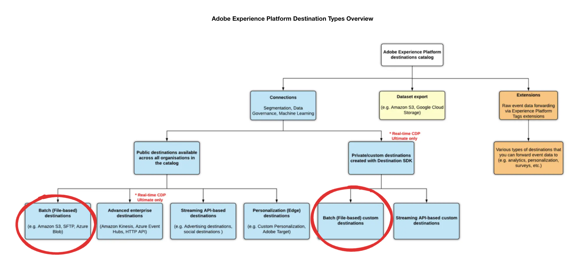

# Stimuleer publiek met SQL

Gebruik de SQL publieksuitbreiding om publiek met gegevens van het gegevensmeer, met inbegrip van om het even welke bestaande afmetingsentiteiten (zoals klantenattributen of productinformatie) te bouwen.

Het gebruik van deze SQL-extensie verbetert de mogelijkheid om een publiek te maken omdat u geen onbewerkte gegevens in uw profielen nodig hebt wanneer u publiekssegmenten definieert. Het publiek dat met deze methode wordt gecreeerd wordt automatisch geregistreerd in de werkruimte van het Publiek, waar u hen aan op dossier-gebaseerde bestemmingen kunt verder richten.


In dit document wordt beschreven hoe u de SQL-publieksextensie in Adobe Experience Platform Data Distiller kunt gebruiken voor het maken, beheren en publiceren van soorten publiek met SQL-opdrachten.

## Levenscyclus voor het maken van publiek in Data Distiller {#audience-creation-lifecycle}

Voer de volgende stappen uit om uw publiek te maken, te beheren en te activeren. Gemaakt publiek integreert naadloos in de &#39;publieksstroom&#39;, zodat u segmenten kunt maken van het basispubliek en doelbestandsgebaseerde doelen (bijvoorbeeld CSV-uploads of cloudopslaglocaties) voor klantenservice. De &quot;stroom van het publiek&quot;verwijst naar het volledige proces om, publiek tot stand te brengen te leiden en te activeren, die naadloze integratie over bestemmingen verzekeren.

Als deel van uw &quot;publieksstroom,&quot;gebruik de volgende SQL bevelen om ](#create-audience) tot stand te brengen, [ wijzigen ](#add-profiles-to-audience), en [ schrapt ](#delete-audience) publiek binnen Adobe Experience Platform.[

### Een publiek maken {#create-audience}

Gebruik de opdracht `CREATE AUDIENCE AS SELECT` om een nieuw publiek te definiëren. Het gemaakte publiek wordt opgeslagen in een gegevensset en geregistreerd in de [!UICONTROL Audiences] -werkruimte onder Data Distiller.

```sql
CREATE AUDIENCE table_name  
WITH (primary_identity='IdentitycolName', identity_namespace='Namespace for the identity used', [schema='target_schema_title'])
AS (select_query)
```

**Parameters**

Gebruik deze parameters om uw SQL vraag van de publieksverwezenlijking te bepalen:

| Parameter | Beschrijving |
|--------------------|------------------------------------------------------------------|
| `schema` | Optioneel. Bepaalt het schema XDM voor de dataset die door de vraag wordt gecreeerd. |
| `table_name` | Naam van de tabel en het publiek. |
| `primary_identity` | Hiermee geeft u de primaire identiteitskolom voor het publiek op. |
| `identity_namespace` | Naamruimte van de identiteit. U kunt een bestaande naamruimte gebruiken of een nieuwe naamruimte maken. Gebruik de opdracht `SHOW NAMESPACES` om beschikbare naamruimten weer te geven. Gebruik `CREATE NAMESPACE` om een nieuwe naamruimte te maken. Bijvoorbeeld: `CREATE NAMESPACE lumaCrmId WITH (code='testns', TYPE='Email')` . |
| `select_query` | Een SELECT-instructie die het publiek definieert. De syntaxis van de UITGEZOCHTE vraag kan in de [ UITGEZOCHTE vragen ](../sql/syntax.md#select-queries) sectie worden gevonden. |

{style="table-layout:auto"}

>[!NOTE]
>
>Om complexe gegevensstructuren flexibeler te maken, kunt u verrijkte kenmerken nesten bij het definiëren van soorten publiek. Verrijkte kenmerken, zoals `orders` , `total_revenue` , `recency` , `frequency` en `monetization` , kunnen zo nodig worden gebruikt om het publiek te filteren.

**Voorbeeld:**

In het volgende voorbeeld wordt getoond hoe u de query voor het maken van uw SQL-publiek kunt structureren:

```sql
CREATE Audience aud_test
WITH (primary_identity=userId, identity_namespace=lumaCrmId)
AS SELECT userId, orders, total_revenue, recency, frequency, monetization FROM profile_dim_customer;
```

In dit voorbeeld wordt de kolom `userId` geïdentificeerd als de identiteitskolom, en een aangewezen namespace (`lumaCrmId`) wordt toegewezen. De resterende kolommen (`orders`, `total_revenue`, `recency`, `frequency` en `monetization`) zijn verrijkte kenmerken die extra context voor het publiek bieden.

**Beperkingen:**

Houd rekening met de volgende beperkingen wanneer u SQL gebruikt voor het maken van publiek:

- De primaire identiteitskolom **moet** op het hoogste niveau van de dataset zijn, zonder wordt genesteld binnen andere attributen of categorieën.
- Het externe publiek dat met SQL-opdrachten wordt gemaakt, heeft een retentieperiode van 30 dagen. Na 30 dagen worden deze doelgroepen automatisch verwijderd. Dit is een belangrijke overweging bij het plannen van strategieën voor het beheer van het publiek.

### Profielen toevoegen aan een bestaand publiek {#add-profiles-to-audience}

Gebruik de opdracht `INSERT INTO` om profielen (of volledige doelgroepen) toe te voegen aan een bestaand publiek.

```sql
INSERT INTO table_name
SELECT select_query
```

**Parameters**

In de volgende tabel worden de parameters beschreven die voor de opdracht `INSERT INTO` zijn vereist:

| Parameter | Beschrijving |
|----------------|--------------------------------------------------------------------------------|
| `table_name` | De naam van de lijst die als deel van creeer publieksbevel werd gecreeerd. |
| `select_query` | Een SELECT-instructie. De syntaxis van de SELECT-query vindt u in de sectie met SELECT-query&#39;s. |

{style="table-layout:auto"}

**Voorbeeld:**

In het volgende voorbeeld wordt getoond hoe u profielen aan een bestaand publiek kunt toevoegen met de opdracht `INSERT INTO` :

```sql
INSERT INTO Audience aud_test
SELECT userId, orders, total_revenue, recency, frequency, monetization FROM customer_ds;
```

### Audiogegevens vervangen (OVERSCHRIJVEN INVOEGEN) {#replace-audience}

Gebruik de opdracht `INSERT OVERWRITE INTO` om alle bestaande profielen in een publiek te vervangen door de resultaten van een nieuwe SQL-query. Dit bevel is nuttig om dynamische publiekssegmenten te beheren door u toe te staan om de inhoud van een publiek in één enkele stap volledig te verfrissen.

>[!AVAILABILITY]
>
>De opdracht `INSERT OVERWRITE INTO` is alleen beschikbaar voor Distiller-klanten met gegevens. Neem contact op met uw Adobe-vertegenwoordiger voor meer informatie over de Data Distiller-invoegtoepassing.

In tegenstelling tot [`INSERT INTO`](#add-profiles-to-audience) , dat aan het huidige publiek toevoegt, verwijdert `INSERT OVERWRITE INTO` alle bestaande publieksleden en voegt alleen die in die door de query worden geretourneerd. Dit biedt meer controle en flexibiliteit bij het beheer van soorten publiek die regelmatig of volledig moeten worden bijgewerkt.

Gebruik het volgende syntaxismalplaatje om een publiek met een nieuwe reeks profielen te beschrijven:

```sql
INSERT OVERWRITE INTO audience_name
SELECT select_query
```

**Parameters**

In de volgende tabel worden de parameters beschreven die voor de opdracht `INSERT OVERWRITE INTO` zijn vereist:

| Parameter | Beschrijving |
|-----------|-------------|
| `audience_name` | De naam van het publiek dat is gemaakt met de opdracht `CREATE AUDIENCE` . |
| `select_query` | Een instructie `SELECT` die de profielen definieert die in het publiek moeten worden opgenomen. |

**Voorbeeld:**

In dit voorbeeld wordt het publiek van `audience_monthly_refresh` volledig overschreven door de resultaten van de query. Profielen die niet door de query worden geretourneerd, worden uit het publiek verwijderd.

>[!NOTE]
>
>Overschrijvingsbewerkingen werken alleen correct als er maar één batch-upload aan de doelgroep is gekoppeld.

```sql
INSERT OVERWRITE INTO audience_monthly_refresh
SELECT user_id FROM latest_transaction_summary WHERE total_spend > 100;
```

#### Het gedrag van het publiek beschrijft gedrag in het Profiel van de Klant In real time

Wanneer u een publiek overschrijft, past het Profiel van de Klant in real time de volgende logica toe om profiellidmaatschap bij te werken:

- Profielen die alleen in de nieuwe batch worden weergegeven, worden gemarkeerd als ingevoerd.
- Profielen die alleen in de vorige batch bestonden, worden gemarkeerd als verlaten.
- Profielen in beide batches blijven ongewijzigd (er wordt geen bewerking uitgevoerd).

Dit zorgt ervoor dat de publieksupdates nauwkeurig in stroomafwaartse systemen en werkschema&#39;s worden weerspiegeld.

**scenario van het Voorbeeld**

Als een publiek `A1` oorspronkelijk bevat:

| ID | NAAM |
|----|------|
| A | Jack |
| B | John |
| C | Martha |

En de overschrijvingsvraag keert terug:

| ID | NAAM |
|----|------|
| A | Stewart |
| C | Martha |

Dan zal het bijgewerkte publiek bevatten:

| ID | NAAM |
|----|------|
| A | Stewart |
| C | Martha |

Profiel B wordt verwijderd, profiel A wordt bijgewerkt en profiel C blijft ongewijzigd.

Als de overschrijvingsquery een nieuw profiel bevat:

| ID | NAAM |
|----|------|
| A | Stewart |
| C | Martha |
| D | Chris |

Dan zal het uiteindelijke publiek zijn:

| ID | NAAM |
|----|------|
| A | Stewart |
| C | Martha |
| D | Chris |

### Voorbeeld van publiek van RFM-model {#rfm-model-audience-example}

In het volgende voorbeeld ziet u hoe u een publiek maakt met behulp van het model Recency, Frequency en Monetization (RFM). Dit voorbeeld segmenteert klanten die op hun recentie, frequentie, en monetisatiescores worden gebaseerd om zeer belangrijke groepen, zoals loyale klanten, nieuwe klanten, en high-value klanten te identificeren.

<!--  Q) Since the focus of this document is on external audiences, or should I just include this temporarily? We could simply provide a link to the separate RFM modeling documentation rather than including the full example here. (Add link to new RFM document when it is published) -->

Met de volgende query wordt een schema voor het RFM-publiek gemaakt. De instructie stelt velden zo in dat deze klantgegevens bevatten, zoals `userId` , `days_since_last_purchase` , `orders` , `total_revenue` , enzovoort.

```sql
CREATE Audience adls_rfm_profile
WITH (primary_identity=userId, identity_namespace=lumaCrmId) AS
SELECT
    cast(NULL AS string) userId,
    cast(NULL AS integer) days_since_last_purchase,
    cast(NULL AS integer) orders,
    cast(NULL AS decimal(18,2)) total_revenue,
    cast(NULL AS integer) recency,
    cast(NULL AS integer) frequency,
    cast(NULL AS integer) monetization,
    cast(NULL AS string) rfm_model
WHERE false;
```

Nadat u het publiek hebt gemaakt, vult u het met klantgegevens en segmenteert u de profielen op basis van hun RFM-scores. De SQL-instructie hieronder gebruikt de functie `NTILE(4)` om klanten te rangschikken in kwartielen op basis van hun RFM-scores (Recency, Frequency, Monetization). Deze scores categoriseren klanten in zes segmenten, zoals &#39;Kern,&#39; &#39;Koninklijk&#39; en &#39;Walvissen&#39;. De gesegmenteerde klantgegevens worden dan opgenomen in de publiekstabel `adls_rfm_profile`.&quot;

```sql
INSERT INTO Audience adls_rfm_profile
SELECT
    userId,
    days_since_last_purchase,
    orders,
    total_revenue,
    recency,
    frequency,
    monetization,
    CASE
        WHEN Recency=1 AND Frequency=1 AND Monetization=1 THEN '1. Core - Your Best Customers'
        WHEN Recency IN(1,2,3,4) AND Frequency=1 AND Monetization IN (1,2,3,4) THEN '2. Loyal - Your Most Loyal Customers'
        WHEN Recency IN(1,2,3,4) AND Frequency IN (1,2,3,4) AND Monetization=1 THEN '3. Whales - Your Highest Paying Customers'
        WHEN Recency IN(1,2,3,4) AND Frequency IN(1,2,3) AND Monetization IN(2,3,4) THEN '4. Promising - Faithful Customers'
        WHEN Recency=1 AND Frequency=4 AND Monetization IN (1,2,3,4) THEN '5. Rookies - Your Newest Customers'
        WHEN Recency IN (2,3,4) AND Frequency=4 AND Monetization IN (1,2,3,4) THEN '6. Slipping - Once Loyal, Now Gone'
    END AS rfm_model
FROM (
    SELECT
        userId,
        days_since_last_purchase,
        orders,
        total_revenue,
        NTILE(4) OVER (ORDER BY days_since_last_purchase) AS recency,
        NTILE(4) OVER (ORDER BY orders DESC) AS frequency,
        NTILE(4) OVER (ORDER BY total_revenue DESC) AS monetization
    FROM (
        SELECT
            userid,
            DATEDIFF(current_date, MAX(purchase_date)) AS days_since_last_purchase,
            COUNT(purchaseid) AS orders,
            CAST(SUM(total_revenue) AS double) AS total_revenue
        FROM (
            SELECT DISTINCT
                ENDUSERIDS._EXPERIENCE.EMAILID.ID AS userid,
                commerce.`ORDER`.purchaseid AS purchaseid,
                commerce.`ORDER`.pricetotal AS total_revenue,
                TO_DATE(timestamp) AS purchase_date
            FROM sample_data_for_ootb_templates
            WHERE commerce.`ORDER`.purchaseid IS NOT NULL
        ) AS b
        GROUP BY userId
    )
);
```

### Een publiek verwijderen (DROP-PUBLIEK) {#delete-audience}

Gebruik de opdracht `DROP AUDIENCE` om een bestaand publiek te verwijderen. Als het publiek niet bestaat, treedt een uitzondering op, tenzij `IF EXISTS` wordt opgegeven.

```sql
DROP AUDIENCE [IF EXISTS] [db_name.]table_name
```

**Parameters**

De tabel bevat de parameters die voor de opdracht `DROP AUDIENCE` zijn vereist:

| Parameter | Beschrijving |
|----------------|----------------------------------------------------------------------------------------|
| `IF EXISTS` | Optioneel. Indien gespecificeerd, als de lijst niet wordt gevonden, wordt geen uitzondering opgeheven. |
| `db_name` | Specificeert de gegevensgroep die wordt gebruikt om de publieksdataset te kwalificeren. |
| `table_name` | De naam van de lijst die als deel van creeer publieksbevel werd gecreeerd. |

{style="table-layout:auto"}

**Voorbeeld:**

In het volgende voorbeeld ziet u hoe u een publiek verwijdert met de opdracht DROP AUDIENCE:

```sql
DROP AUDIENCE IF EXISTS aud_test;
```

### Automatische publieksregistratie en beschikbaarheid {#registration-and-availability}

Soorten publiek dat is gemaakt met de SQL-extensie, worden automatisch geregistreerd onder de Data Distiller [!UICONTROL Origin] in de werkruimte Publiek. Zodra geregistreerd, zijn deze publiek beschikbaar voor het richten in op dossier-gebaseerde bestemmingen, die segmentatie en het richten strategieën verbeteren. Dit proces vereist geen extra configuratie, die publieksbeheer stroomlijnt. Voor meer details op hoe te om, publiek binnen Experience Platform UI te bekijken te beheren en te creëren, zie het [ Poortoverzicht van het Poortpubliek van het Publiek ](../../segmentation/ui/audience-portal.md).

<!-- Q) Do you know how long it takes for the audience to register? This info would help manage user expectations. -->


## Soorten publiek naar doelen activeren {#activate-audiences}

Activeer uw doelgroepen door deze naar een bestandsdoel te sturen, zoals [!DNL Amazon S3] , [!DNL SFTP] of [!DNL Azure Blob] . De verrijkte publieksattributen zijn beschikbaar voor verdere verfijning en het filtreren zoals nodig.



## Specificaties {#faqs}

In deze sectie worden veelgestelde vragen over het maken en beheren van een extern publiek met SQL in Data Distiller behandeld.

**Vragen**:

- Wordt het creëren van het publiek gesteund slechts voor vlakke datasets?

+++Antwoord

Het maken van een publiek is momenteel beperkt tot vlakke kenmerken (op hoofdniveau) bij het definiëren van het publiek.

+++

- Resulteert de publieksverwezenlijking in één enkele dataset of veelvoudige datasets, of varieert het afhankelijk van de configuratie?

+++Antwoord

Er is een één-op-één afbeelding tussen een publiek en een dataset.

+++

- Wordt de dataset gecreeerd tijdens publieksverwezenlijking duidelijk voor Profiel?

+++Antwoord

Nr, wordt de dataset die tijdens publieksverwezenlijking wordt gecreeerd niet duidelijk voor Profiel.

+++

- Is de dataset gecreeerd op het gegevensmeer?

+++Antwoord

Ja, wordt de dataset verbonden aan het publiek gecreeerd op het gegevens meer. De kenmerken van deze dataset zijn beschikbaar in Audience Composer en bestemmingsstroom als verrijkte attributen.

+++

- Zijn de attributen in het publiek beperkt tot onderneming op dossier-gebaseerde bestemmingen? (Ja of Nee)

+++Antwoord

Nee. De verrijkte attributen in het publiek zijn beschikbaar voor gebruik in zowel ondernemingspartij als op dossier-gebaseerde bestemmingen. Als u een fout als &quot;volgende segment IDs hebt namespaces die niet voor deze bestemming worden toegestaan: e917f626-a038-42f7-944c-xyxyxyx,&quot;creeer een nieuw segment in Gegevens Distiller en gebruik het met om het even welke beschikbare bestemming.

+++

- Kan ik een publiek van publiek creëren dat een publiek van Gegevens Distiller gebruikt?

+++Antwoord

Ja, u kunt een publiek van publiek tot stand brengen dat een publiek van Gegevens Distiller gebruikt.

+++

- Worden deze soorten publiek in Adobe Journey Optimizer weergegeven? Als niet, wat gebeurt wanneer ik een nieuw publiek in de regelbouwer creeer die alle leden van dit publiek omvat?

+++Antwoord

Distiller-doelgroepen voor gegevens zijn ook beschikbaar in Adobe Journey Optimizer. U kunt het publiek van Gegevens Distiller in Adobe Journey Optimizer gebruiken en de resultaten filtreren die op de verrijkte attributen worden gebaseerd.

+++

- Worden Distiller-doelgroepen om de 30 dagen verwijderd omdat ze een extern publiek zijn?

+++Antwoord

Ja, het publiek van Data Distiller wordt om de 30 dagen verwijderd omdat het een extern publiek is.

+++

## Volgende stappen

Nadat u dit document hebt gelezen, hebt u geleerd hoe u de SQL-publieksextensie in Data Distiller kunt gebruiken om een publiek met SQL-opdrachten te maken, te beheren en te publiceren. U kunt publieksdefinities nu aanpassen die op uw unieke bedrijfsvereisten worden gebaseerd en hen over diverse bestemmingen activeren, die uw marketing strategieën en gegeven-gedreven besluiten optimaliseren.

Vervolgens kunt u de volgende documentatie lezen om uw Experience Platform-beheerstrategieën voor het publiek verder te ontwikkelen en te optimaliseren:

- **Onderzoek de Evaluatie van het publiek**: Leer over de [ methodes van de publieksevaluatie in Adobe Experience Platform ](../../segmentation/home.md#evaluate-segments): het stromen segmentatie voor updates in real time, partijsegmentatie voor geplande of verwerking op bestelling, en randsegmentatie voor onmiddellijke evaluatie op Edge Network.
- **integreer met Doelen**: Lees de gids op hoe te [ dossiers op bestelling uitvoeren aan partijbestemmingen ](../../destinations/ui/export-file-now.md) gebruikend de Doelen UI van Experience Platform.
- **Prestaties van het publiek van het Overzicht**: Analyseer hoe uw SQL-bepaald publiek over verschillende kanalen presteert. Gebruik gegevensinzichten om uw publieksdefinities en doelstrategieën aan te passen en te verbeteren. Lees het document op [ de inzichten van het Publiek ](../../dashboards/insights/audiences.md) om te leren hoe te om tot de SQL vragen voor publieksinzichten in Adobe Real-Time CDP toegang te hebben en aan te passen. Vervolgens kunt u uw eigen inzichten maken en onbewerkte gegevens transformeren in activeerbare informatie door het dashboard Soorten publiek aan te passen en deze inzichten effectief te visualiseren en te gebruiken voor een betere besluitvorming.

