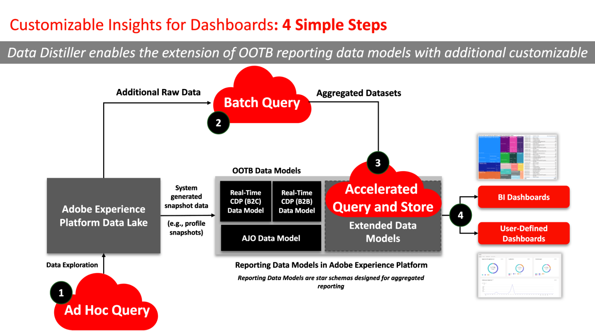

# SQL Insights

Creeer op maat gebaseerde rapporteringsgegevensmodellen om diepere inzichten te halen, strategieën te optimaliseren, en analyses aan te passen aan specifieke bedrijfsbehoeften met Gegevens Distiller SQL Inzichten. Gebruik de SQL-inzichten om de transparantie te vergroten en operationele inzichten te verkrijgen van uw Adobe Experience Platform-gegevens in verschillende dimensies, zoals profielen, publiek, campagnes, reizen, rechten en toestemming. Deze mogelijkheid biedt een veelzijdige, adaptieve oplossing om de rapporteringsgegevensmodellen van uw organisatie aan te passen aan uw specifieke bedrijfsbehoeften.

Om [&#x200B; visualiseren uw SQL Inzichten &#x200B;](../../../dashboards/sql-insights-query-pro-mode/overview.md) kunt u [&#x200B; vraag pro wijze &#x200B;](../../../dashboards/sql-insights-query-pro-mode/overview.md) gebruiken om complexe analyse met douaneSQL vragen te leiden en uw gegevens in gemakkelijk te interpreteren grafieken om te zetten. Gebruik query pro-modus om op maat gemaakte inzichten en inzichten op uw dashboards te maken en rekening te houden met zowel technisch als niet-technisch publiek door uw inzichten als CSV-bestanden te downloaden.

In dit document worden de gebruiksgevallen, essentiële functies en vereiste stappen beschreven voor het ontwikkelen van een SQL-inzichten-dashboard met Data Distiller.

## Vereisten

In deze zelfstudie worden door de gebruiker gedefinieerde dashboards gebruikt om gegevens van uw aangepaste gegevensmodel in de gebruikersinterface van Experience Platform te visualiseren. Zie [&#x200B; user-defined dashboards documentatie &#x200B;](../../../dashboards/standard-dashboards.md) om meer over deze eigenschap te leren.

## Aan de slag

Distiller SKU van Gegevens wordt vereist om een model van douanegegevens voor uw rapporteringsinzichten te bouwen en de de gegevensmodellen van Real-Time CDP uit te breiden die verrijkte gegevens van Experience Platform houden. Zie het [&#x200B; verpakken &#x200B;](../../packaging.md), [&#x200B; guardrails &#x200B;](../../guardrails.md#query-accelerated-store), en [&#x200B; verlenen van vergunningen &#x200B;](../../data-distiller/license-usage.md) documentatie die op het SKU van Gegevens Distiller betrekking heeft. Als u de Data Distiller SKU niet hebt, neemt u contact op met uw Adobe-medewerker van de klantenservice voor meer informatie.

## Gebruiksgevallen van SQL Insights {#use-cases}

Hieronder vindt u veelvoorkomende gebruiksgevallen die effectief kunnen worden aangepakt via SQL Insights in Data Distiller.

### Transparantie voor profiel- en publieksgebruik {#usage-transparency}

**Uitdaging:** hoe te om Zeer belangrijke Indicatoren van Prestaties (KPIs) door specifieke criteria zoals bedrijfseenheden, loyaliteitsstatus, of de Waarde van het Leven van de Klant (CLTV) te onderbreken.

**SQL de Oplossing van Inzichten:** Gegevens Distiller laat de uitbreiding van het melden van gegevensmodellen in Adobe Experience Platform toe, die [&#x200B; de toevoeging van de attributen van het douaneprofiel zoals CLTV &#x200B;](../../use-cases/customer-lifetime-value.md) of loyaliteitsstatus vergemakkelijkt.

### Constante anomalieën bijhouden {#consent-anomaly-tracking}

**Uitdaging:** hoe te om publieksoverlapping en de rapporten van de groottetrendline op aangepaste toestemmingsattributen voor kanalen zoals e-mail, SMS, en telefoon toe te passen.

**SQL Oplossing van Inzichten:** het rapporteringsgegevensmodel kan worden uitgebreid om veranderingen in toestemmingsvoorkeur in tijd te volgen. Dit impliceert de bouw van extra feiten en afmetingslijsten aan de voorkeur van de trendtoestemming en het plannen van [&#x200B; stijgende gegevens verfrissen zich &#x200B;](../../key-concepts/incremental-load.md).

### Segmentatiestrategie voor het publiek optimaliseren {#optimize-audience-segmentation-strategy}

**Uitdaging:** hoe te om het Leren van de Machine (ML) model-geproduceerde aandrijvingsscores in hun publiekKPI rapporten te integreren.

**SQL Oplossing van Inzichten:** Gegevens Distiller staat de opneming van [&#x200B; bezitsscores van modellen van douaneML &#x200B;](../../use-cases/propensity-score.md) toe, die de berekening van gezamenlijke scores op het publieksniveau vergemakkelijken. Deze gegevens kunnen vervolgens worden gerapporteerd naast standaard-KPI&#39;s.

### Uitbreiding publiek {#audience-expansion}

**Uitdaging:** hoe te om meer dan enkel profieltellingen in publiek te verwerven overlapt rapporten en extra demografische gegevens of voorkeur te bereiken om de strategieën van de publieksuitbreiding te begeleiden.

**SQL de Oplossing van Inzichten:** door het rapporteringsgegevensmodel uit te breiden, kunnen de gebruikers extra profielattributen opnemen, die het publiek verrijken overlappen rapport met relevante demografische gegevens en voorkeur.

## Belangrijke mogelijkheden voor het genereren van SQL-inzichten {#key-capabilities}

In de onderstaande afbeelding worden verschillende essentiële functies voor het genereren van SQL-inzichten beschreven. Deze mogelijkheden omvatten:

1. **visualisaties van Gegevens:** Incorporating visuele elementen zoals tendensen en staafgrafieken voor een uitvoerige mening van gegevenstrends.
1. **het schrijven van het dashboard:** toelatend de verwezenlijking van douanedashboards die aan specifieke gebruiksgevallen worden aangepast, die een meer gepersonaliseerde en gerichte analytische ervaring verstrekken.
1. **Flexibele SQL gegevensmodellering:** gebruik een veelzijdige SQL benadering van gegevensmodellering die gebruikers toestaat om verschillende datasets naadloos te combineren en te manipuleren, die aanpassingsvermogen, en analytische diepte verbeteren.
1. **Versnelde opslag:** Uitvoerend een versneld opslagmechanisme om samengevoegde inzichten door SQL efficiënt te dienen, die gestroomlijnde en snelle toegang tot waardevolle informatie verzekeren.
1. **connectiviteit van BI:** vergemakkelijkt naadloze integratie met populaire hulpmiddelen van Business Intelligence (BI), met inbegrip van Power BI, Tableau, Looker, en Apache Superset. Deze connectiviteit zorgt voor compatibiliteit met verschillende BI-omgevingen en biedt gebruikers de flexibiliteit om hun keuze te gebruiken voor diepgaande analyse en rapportage.

## Stappen om SQL-inzichten te maken {#steps-to-create}

Volg onderstaande stapsgewijze instructies voor het ontwikkelen van een SQL Insights-dashboard in Data Distiller.

1. **Ad hoc vraagexploratie:** begin door ad hoc `SELECT` vragen uit te voeren om ruwe gegevens over het gegevenshoeveelheid te onderzoeken. Hierdoor kan ter plekke een verkennende gegevensanalyse worden uitgevoerd om gegevens te experimenteren, en worden gegevens gevalideerd wanneer de resultaten van de query&#39;s niet in het datumpeer zijn opgeslagen.
1. **het vraaggebruik van de Partij van de Partij:** de partijvragen van het Gebruik [&#x200B; creëren geplande banen &#x200B;](../../api/scheduled-queries.md#create-a-new-scheduled-query) voor het produceren van inzichten samengevoegde lijsten, die een systematische en geautomatiseerde benadering van gegevensverwerking verzekeren. Batchquery&#39;s worden uitgevoerd `INSERT TABLE AS SELECT` en `CREATE TABLE AS SELECT` -query&#39;s om gegevens op te schonen, vorm te geven, te manipuleren en te verrijken. De resultaten van deze vragen worden opgeslagen op het gegevens meer.
1. **Geaggregeerde inzichten die laden:** Laad de geproduceerde bijeengevoegde inzichten in de versnelde opslag en gebruik SQL om vragen te testen, en de nauwkeurigheid en de efficiency van gegevensherwinning te verzekeren. Leren hoe te om stateless vragen aan de versnelde opslag [&#128279;](../../api/accelerated-queries.md) te maken, zie de documentatie.
1. **Toegang en integratie:** heb toegang tot de inzichten die in de versnelde opslag foutloos door met Adobe Experience Platform [&#x200B; gebruiker-bepaalde Dashboards &#x200B;](../../../dashboards/standard-dashboards.md) of andere aangewezen hulpmiddelen van Business Intelligence (BI) te integreren worden opgeslagen. Deze integratie met externe clients maakt een consistente en intuïtieve ervaring voor gebruikers mogelijk.

## Volgende stappen

Door dit document te lezen hebt u nu een beter inzicht in de gebruiksgevallen, essentiële mogelijkheden en noodzakelijke stappen voor het ontwikkelen van een SQL-inzichten-dashboard met Data Distiller. Om verder te leren over het creëren van maats het melden gegevensmodellen, zie de [&#x200B; rapporterende gids van het gegevensmodel van inzichten &#x200B;](./reporting-insights-data-model.md).
