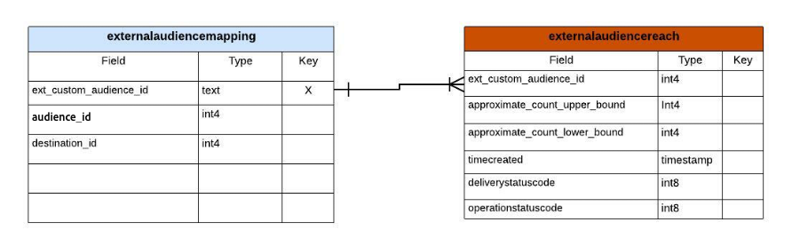
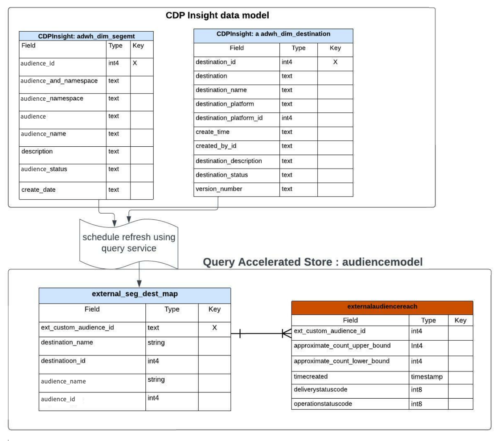
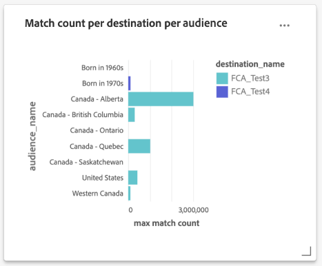

# Met query versnelde handleiding voor het rapporteren van inzichten in winkels

De vraag versnelde opslag staat u toe om de tijd en de verwerkingscapaciteit te verminderen die wordt vereist om kritieke inzichten van uw gegevens te bereiken. Doorgaans worden gegevens regelmatig verwerkt (bijvoorbeeld op uurbasis of dagelijks), waar geaggregeerde weergaven worden gemaakt en gerapporteerd. De analyse van deze verslagen, die op basis van geaggregeerde gegevens zijn opgesteld, leidt tot inzichten die tot doel hebben de bedrijfsresultaten te verbeteren. De opslag met query-versnelling biedt een cacheservice, gelijktijdige uitvoering, een interactieve ervaring en een stateless API. Er wordt echter aangenomen dat de gegevens vooraf worden verwerkt en geoptimaliseerd voor geaggregeerd opvragen en niet voor onbewerkte opvragen van gegevens.

Met de opslag met query-versnelling kunt u een aangepast gegevensmodel maken en/of een bestaand Adobe Real-Time Customer Data Platform-gegevensmodel uitbreiden. Vervolgens kunt u naar keuze uw rapportinzichten gebruiken of insluiten in een rapportage-/visualisatieframework van uw keuze. Gelieve te zien de documentatie van het Model van Gegevens van de Gegevens van Real-Time Customer Data Platform van Inzichten leren hoe te [ uw SQL vraagmalplaatjes aanpassen om de rapporten van Real-Time CDP voor uw marketing en zeer belangrijke het gebruiksgevallen van de prestatiesindicator (KPI) tot stand te brengen ](../../../dashboards/data-models/cdp-insights-data-model-b2c.md).

Het Real-Time CDP-gegevensmodel van Adobe Experience Platform biedt inzicht in profielen, soorten publiek en bestemmingen en maakt de Real-Time CDP insight-dashboards mogelijk. Dit document begeleidt u door het proces van het creëren van uw het gegevensmodel van het Rapport van Inzichten en ook hoe te om de gegevensmodellen van Real-Time CDP uit te breiden zoals nodig.

## Vereisten

In deze zelfstudie worden door de gebruiker gedefinieerde dashboards gebruikt om gegevens van uw aangepaste gegevensmodel in de gebruikersinterface van Experience Platform te visualiseren. Gelieve te zien de [ user-defined dashboards documentatie ](../../../dashboards/standard-dashboards.md) om meer over deze eigenschap te leren.

## Aan de slag

Distiller SKU van Gegevens wordt vereist om een model van douanegegevens voor uw rapporteringsinzichten te bouwen en de de gegevensmodellen van Real-Time CDP uit te breiden die verrijkte gegevens van Experience Platform houden. Gelieve te zien het [ verpakken ](../../packaging.md), [ guardrails ](../../guardrails.md#query-accelerated-store), en [ verlenen van vergunningen ](../../data-distiller/license-usage.md) documentatie die op het SKU van Gegevens Distiller betrekking heeft. Als u geen gegevens hebt, neemt u contact op met uw Adobe-medewerker van de klantenservice voor meer informatie.

## Een gegevensmodel voor het rapporteren van inzichten maken

In deze zelfstudie wordt een voorbeeld gebruikt van het bouwen van een insight-gegevensmodel voor het publiek. Als u een of meer adverteerderplatforms gebruikt om uw publiek te bereiken, kunt u de API van de adverteerder gebruiken om een geschatte gelijke telling van uw publiek te krijgen.

Aan het begin hebt u een eerste gegevensmodel uit uw bronnen (mogelijk via de API van uw adverteerderplatform). Als u een geaggregeerde weergave van uw onbewerkte gegevens wilt maken, maakt u een model voor rapportinzichten, zoals hieronder in de afbeelding wordt beschreven. Dit staat voor één dataset toe om de hogere en lagere grenzen van de publieksgelijke te krijgen.



In dit voorbeeld is de `externalaudiencereach` tabel/dataset gebaseerd op een id en worden de onderste en bovenste begrenzingen voor het aantal overeenkomsten bijgehouden. De `externalaudiencemapping` afmetingstabel/dataset brengt externe identiteitskaart aan een bestemming en een publiek op Experience Platform in kaart.

## Een model maken voor het rapporteren van inzichten met Data Distiller

Maak vervolgens een insight-model voor rapportage (`audienceinsight` in dit voorbeeld) en gebruik de SQL-opdracht `ACCOUNT=acp_query_batch and TYPE=QSACCEL` om ervoor te zorgen dat dit model wordt gemaakt in de versnelde opslag. Gebruik vervolgens Query Service om een `audienceinsight.audiencemodel` -schema voor de `audienceinsight` -database te maken.

>[!NOTE]
>
>De gegevens Distiller SKU wordt vereist voor het `ACCOUNT=acp_query_batch` bevel. Zonder dit, wordt een regelmatig gegevensmodel gecreeerd op het gegevens meer.

```sql
CREATE database audienceinsight WITH (TYPE=QSACCEL, ACCOUNT=acp_query_batch);
 
CREATE schema audienceinsight.audiencemodel;
```

## Tabellen, relaties en gegevens vullen

Nu u uw `audienceinsight` rapportmodel voor insight hebt gemaakt, maakt u de tabellen `externalaudiencereach` en `externalaudiencemapping` en brengt u de relaties tussen deze tabellen tot stand. Gebruik vervolgens de opdracht `ALTER TABLE` om een beperking voor een vreemde sleutel tussen de tabellen toe te voegen en een relatie te definiëren. In het volgende SQL-voorbeeld wordt getoond hoe u dit doet.

```sql
CREATE TABLE IF NOT exists audienceinsight.audiencemodel.externalaudiencereach
WITH ( DISTRIBUTION = REPLICATE ) AS
  SELECT cast(null as int) approximate_count_upper_bound,
         cast(null as string) deliverystatusdescription,
         cast(null as timestamp)  timeupdated ,
         cast(null as int) operationstatuscode ,
         cast(null as string) operationstatusdescription,
         cast(null as int) approximate_count_lower_bound,
         cast(null as timestamp)timecreated ,
         cast(null as timestamp)timecontentupdated ,
         cast(null as int) deliverystatuscode ,
         cast(null as int)  ext_custom_audience_id
   WHERE false;
 
CREATE TABLE IF NOT exists audienceinsight.audiencemodel.externalaudiencemapping
WITH ( DISTRIBUTION = REPLICATE ) AS
SELECT cast(null as int) audience_id,
       cast(null as int) destination_id,
       cast(null as int) ext_custom_audience_id
 WHERE false;
 
ALTER TABLE externalaudiencereach ADD  CONSTRAINT FOREIGN KEY (ext_custom_audience_id) REFERENCES externalaudiencemapping (ext_custom_audience_id) NOT enforced;
```

Nadat beide `ALTER TABLE` -opdrachten met succes zijn uitgevoerd, wordt de relatie tussen de feit- en dimensietabellen gevormd.

Wanneer de instructies zijn uitgevoerd, gebruikt u de opdracht `SHOW datagroups;` om een lijst met de beschikbare gegevenssets in de versnelde opslag vanuit de `audienceinsight.audiencemodel` te retourneren. De tabellarische resultaten moeten overeenkomen met het onderstaande voorbeeld.

>[!IMPORTANT]
>
>Alleen gegevens in de versnelde opslag zijn toegankelijk via het stateless API-eindpunt van Query Service `POST /data/foundation/query/accelerated-queries` .

```console
    Database     |    Schema     | GroupType |      ChildType       |        ChildName        | PhysicalParent |               ChildId               
-----------------+---------------+-----------+----------------------+-------------------------+----------------+--------------------------------------
 audienceinsight | audiencemodel | QSACCEL   | Data Warehouse Table | externalaudiencemapping | true           | 9155d3b4-889d-41da-9014-5b174f6fa572
 audienceinsight | audiencemodel | QSACCEL   | Data Warehouse Table | externalaudiencereach   | true           | 1b941a6d-6214-4810-815c-81c497a0b636
```

## Vraag het rapporterende insight-gegevensmodel

Gebruik Query Service om een query uit te voeren op de tabel met `audiencemodel.externalaudiencereach` dimensies. Een voorbeeldvraag kan hieronder worden gezien.

```sql
SELECT a.ext_custom_audience_id,
       a.approximate_count_upper_bound
FROM   audiencemodel.externalaudiencereach AS a
       LEFT OUTER JOIN audiencemodel.externalaudiencemapping AS b
                    ON ( ( a.ext_custom_audience_id ) =
                         ( b.ext_custom_audience_id ) )
GROUP  BY a.ext_custom_audience_id,
          a.approximate_count_upper_bound
LIMIT  5000 ;
```

De tabellarische resultaten bevatten een telling en een id.

```console
ext_custom_audience_id | approximate_count_upper_bound
------------------------+-------------------------------
 23850912218170554      |                          1000
 23850808585120554      |                       1012000
 23850808585220554      |                        100000
 23850814978560554      |                          1000
 23850808585180554      |                        421000
 23850814978510554      |                       3001000
 23850814978530554      |                        300000
 23850912218160554      |                        105000
 23850808584990554      |                          1000
 23850809520110554      |                          1000
(10 rows)
```

## Vergroot uw gegevensmodel met het Real-Time CDP-gegevensmodel voor inzichten

U kunt het publieksmodel uitbreiden met extra details om een rijkere dimensietabel te maken. U kunt bijvoorbeeld de publieksnaam en de doelnaam toewijzen aan de externe publieksidentificatie. Om dit te doen, gebruik de Dienst van de Vraag om een nieuwe dataset tot stand te brengen of te verfrissen en het toe te voegen aan het publieksmodel dat publiek en bestemmingen met een externe identiteit combineert. In het onderstaande diagram wordt het concept van deze extensie van het gegevensmodel geïllustreerd.



## Tabellen met dimensies maken om uw model met rapportageinzichten uit te breiden

De Dienst van de Vraag van het gebruik om zeer belangrijke beschrijvende attributen van de verrijkte de afmetingsdatasets van Real-Time CDP aan het `audienceinsight` gegevensmodel toe te voegen en een verband tussen uw feitenlijst en de nieuwe afmetinglijst te vestigen. SQL toont hieronder aan hoe te om bestaande afmetinglijsten in uw rapporterend gegevensmodel van inzichten te integreren.

```sql
CREATE TABLE audienceinsight.audiencemodel.external_seg_dest_map AS
  SELECT ext_custom_audience_id,
         destination_name,
         audience_name,
         destination_status,
         a.destination_id,
         a.audience_id
  FROM   externalaudiencemapping AS a
         LEFT OUTER JOIN adwh_dim_audiences AS b
                      ON ( ( a.audience_id ) = ( b.audience_id ) )
         LEFT OUTER JOIN adwh_dim_destination AS c
                      ON ( ( a.destination_id ) = ( c.destination_id ) );
 
ALTER TABLE externalaudiencereach  ADD  CONSTRAINT FOREIGN KEY (ext_custom_audience_id) REFERENCES external_seg_dest_map (ext_custom_audience_id) NOT enforced;
```

Gebruik de opdracht `SHOW datagroups;` om het maken van de extra `external_seg_dest_map` -dimensietabel te bevestigen.

```console
    Database     |     Schema     | GroupType |      ChildType       |                ChildName  | PhysicalParent |               ChildId               
-----------------+----------------+-----------+----------------------+----------------------------------------------------+----------------+--------------------------------------
 audienceinsight | audiencemodel | QSACCEL   | Data Warehouse Table | external_seg_dest_map      | true           | 4b4b86b7-2db7-48ee-a67e-4b28cb900810
 audienceinsight | audiencemodel | QSACCEL   | Data Warehouse Table | externalaudiencemapping    | true           | b0302c05-28c3-488b-a048-1c635d88dca9
 audienceinsight | audiencemodel | QSACCEL   | Data Warehouse Table | externalaudiencereach      | true           | 4485c610-7424-4ed6-8317-eed0991b9727
```

## Vraag uw uitgebreide versnelde opslagrapportering van inzichten gegevensmodel

Nu het gegevensmodel van `audienceinsight` is uitgebreid, kan er een query op worden uitgevoerd. In de volgende SQL-code ziet u de lijst met toegewezen doelen en doelgroepen.

```sql
SELECT a.ext_custom_audience_id,
       b.destination_name,
       b.audience_name,
       b.destination_status,
       b.destination_id,
       b.audience_id
FROM   audiencemodel.externalaudiencereach1 AS a
       LEFT OUTER JOIN audiencemodel.external_seg_dest_map AS b
                    ON ( ( a.ext_custom_audience_id ) = (
                         b.ext_custom_audience_id ) )
LIMIT  25; 
```

De vraag keert alle datasets op de vraag versnelde opslag terug:

```console
ext_custom_audience_id | destination_name |       audience_name        | destination_status | destination_id | audience_id 
------------------------+------------------+---------------------------+--------------------+----------------+-------------
 23850808595110554      | FCA_Test2        | United States             | enabled            |     -605911558 | -1357046572
 23850799115800554      | FCA_Test2        | Born in 1980s             | enabled            |     -605911558 | -1224554872
 23850799115790554      | FCA_Test2        | Born in 1970s             | enabled            |     -605911558 |  1899603869
 23850798177620554      | FCA_Test1        | Billionaires              | enabled            |      321720439 |  1401872665
 23850814978560554      | FCA_Test3        | Canada - Saskatchewan     | enabled            |     1182494936 | -1917996562
 23850808585180554      | FCA_Test3        | United States             | enabled            |     1182494936 | -1357046572
 23850814978530554      | FCA_Test3        | Canada - British Columbia | enabled            |     1182494936 |  -652840507
 23850808585120554      | FCA_Test3        | Canada - Quebec           | enabled            |     1182494936 |  -519557860
 23850809520110554      | FCA_Test3        | Born in 1960s             | enabled            |     1182494936 |   237824266
 23850808585220554      | FCA_Test3        | Western Canada            | enabled            |     1182494936 |  1075937528
 23850808584990554      | FCA_Test3        | Canada - Ontario          | enabled            |     1182494936 |  1593438041
 23850814978510554      | FCA_Test3        | Canada - Alberta          | enabled            |     1182494936 |  1862946783
 23850912218170554      | FCA_Test4        | Canada - Alberta          | enabled            |     1549248886 |  1862946783
 23850912218160554      | FCA_Test4        | Born in 1970s             | enabled            |     1549248886 |  1899603869
```

## Visualiseer uw gegevens met door de gebruiker gedefinieerde dashboards

Nu u uw model van douanegegevens hebt gecreeerd, bent u bereid om uw gegevens met douanevragen en user-defined dashboards te visualiseren.

De volgende SQL verstrekt een uitsplitsing van de gelijke telling door publiek in een bestemming en een uitsplitsing van elke bestemming van publiek door publiek.

```sql
SELECT b.destination_name,
       a.approximate_count_upper_bound,
       b.audience_name
FROM   audiencemodel.externalaudiencereach AS a
       LEFT OUTER JOIN audiencemodel.external_seg_dest_map AS b
                    ON ( ( a.ext_custom_audience_id ) = (
                         b.ext_custom_audience_id ) )
GROUP  BY b.destination_name,
          a.approximate_count_upper_bound,
          b.audience_name
ORDER BY b.destination_name
LIMIT  5000
```

De afbeelding hieronder geeft een voorbeeld van de mogelijke aangepaste visualisaties aan de hand van het gegevensmodel voor het rapporteren van inzichten.



Het aangepaste gegevensmodel vindt u in de lijst met beschikbare gegevensmodellen in de door de gebruiker gedefinieerde dashboardwerkruimte. Zie de [ user-defined dashboardgids ](../../../dashboards/standard-dashboards.md) voor begeleiding op hoe te om uw model van douanegegevens te gebruiken.
