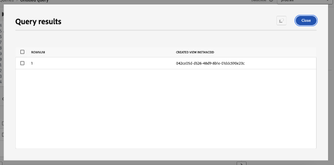

# Knopinfo voor maximale waarde met Adobe Experience Platform Data Distiller - OS656

Deze pagina bevat de voorbeelddataset voor u om toe te passen wat u in Adobe Summit zitting &quot;OS656 - Hoogste Tips leerde om Waarde met de Distiller van Gegevens van Adobe Experience Platform te maximaliseren&quot;. U leert hoe u de implementatie van Adobe Real-Time Customer Data Platform en Journey Optimizer kunt versnellen door de gegevens van het profiel Real-Time te verbeteren. Deze verrijking maakt gebruik van diepgaande inzichten in gedragspatronen van klanten om een publiek te maken voor het leveren en optimaliseren van ervaringen.

Door het casestudy van de Luma, zult u gebruikersgedragsgegevens analyseren en a *Recency, Frequentie, Monetair (RFM)* model-een marketing analysetechniek creëren voor klantensegmentatie die op aankooppatronen wordt gebaseerd.

## Voorwaarde

Om dit gebruiksgeval uit te voeren, moet uw instantie van Adobe Experience Platform voor [ Gegevens Distiller ](./overview.md) worden vergunning gegeven. Neem contact op met uw Adobe-vertegenwoordiger voor meer informatie.

## Overzicht van het RFM-model {#rfm-overview}

RFM, kort voor Recency (R), Frequency (F), en Monetair (M), is een gegevensgestuurde benadering van klantsegmentatie en -analyse. Deze methode evalueert drie belangrijke aspecten van klantengedrag: hoe recent een klant een aankoop maakte, hoe vaak zij, en hoeveel zij uitgeven. Door deze factoren te kwantificeren, kunnen de ondernemingen actionable inzichten in klantensegmenten bereiken en gerichte marketing strategieën ontwikkelen die beter aan individuele klantenbehoeften voldoen.

## Begrijp klantengedrag met het RFM model {#understand-customer-behavior}

Het RFM model segmenteert klanten die op transactioneel gedrag gebruikend drie zeer belangrijke parameters worden gebaseerd.

- **Recency** meet de tijd sinds de laatste aankoop van een klant, wijzend op betrokkenheidsniveaus en toekomstig het kopen potentieel.
- **de Frequentie** volgt hoe vaak een klant interactie aangaat, die als duidelijke indicator van loyaliteit en aanhoudende betrokkenheid dienen.
- **Monetaire waarde** beoordeelt de totale uitgaven door klanten, die hun algemene waarde aan de zaken benadrukken.

Door deze factoren te combineren, wijzen bedrijven aan elke klant numerieke scores toe (doorgaans op een schaal van `1` naar `4` ). Lagere scores duiden op gunstiger resultaten. Zo wordt een score van een klant `1` in alle categorieën als een van de beste beschouwd, wat recente activiteiten, hoge betrokkenheid en aanzienlijke uitgaven aantoont.

## Voordelen en beperkingen van het RFM-model {#benefits-and-limitations}

Elke techniek voor het maken van marketingmodellen heeft betrekking op voordelen en beperkingen. RFM-modellering is een waardevol instrument voor het begrijpen van het gedrag van klanten en het verfijnen van marketingstrategieën. Zijn voordelen omvatten het segmenteren van klanten om overseinen te personaliseren, opbrengst te optimaliseren, en reactiesnelheden, behoud, tevredenheid, en de Waarde van het Leven van de Klant (CLTV) te verbeteren.

RFM-modellering kent echter beperkingen. Het veronderstelt uniformiteit binnen segmenten die op recentie, frequentie, en monetaire waarde worden gebaseerd, die klantengedrag kan overdreven vereenvoudigen. In het model wordt ook een gelijk gewicht aan deze factoren toegewezen, waardoor de waarde van de klant mogelijk onjuist wordt weergegeven. Bovendien wordt er geen rekening gehouden met context, zoals productspecifieke kenmerken of klantvoorkeuren, die tot verkeerde interpretaties van aankoopgedrag kan leiden.

## Een dynamisch SQL-publiek op basis van RFM-score opbouwen {#build-a-dynamic-rfm-audience}

Voordat u de Luminantiestudie start, moet u een voorbeeldgegevensset invoeren. Eerst, [ selecteer de verbinding om de `luma_web_data.zip` dataset plaatselijk ](../resources/luma_web_data.zip) te downloaden. De voorbeelddataset is een CSV-bestand met een gecomprimeerde ZIP-indeling dat kan worden uitgelijnd met het gebruiksscenario. Decomprimeer dit ZIP-bestand met Adobe Acrobat of een programma voor het ophalen van vertrouwde bestanden, zoals het ingebouwde hulpprogramma van uw besturingssysteem. In de praktijk zou u doorgaans gegevens van Adobe Analytics, Adobe Commerce of Adobe Web/Mobile SDK betrekken.

Tijdens deze zelfstudie gebruikt u Data Distiller om relevante gebeurtenissen en velden op te halen in een gestandaardiseerde CSV-indeling. Het doel is alleen essentiële gebieden op te nemen en tegelijkertijd een uniforme gegevensstructuur te handhaven voor efficiëntie en gebruiksgemak.

### Stap 1: De CSV-gegevens uploaden naar Experience Platform {#upload-csv-data}

Voer de volgende stappen uit om een CSV-bestand te uploaden naar Adobe Experience Platform.

#### Een gegevensset maken van een CSV-bestand {#create-a-dataset}

Selecteer in de gebruikersinterface van Experience Platform **[!UICONTROL Datasets]** in de linkernavigatieregel, gevolgd door **[!UICONTROL Create dataset]** . Selecteer vervolgens **[!UICONTROL Create dataset from CSV file]** uit de beschikbare opties.

Het deelvenster [!UICONTROL Configure Dataset] wordt weergegeven. Voer in het veld **[!UICONTROL Name]** de naam van de gegevensset in als &quot;luma_web_data&quot; en selecteer **[!UICONTROL Next]** .

Het deelvenster [!UICONTROL Add data] wordt weergegeven. Sleep het CSV-bestand naar het vak **[!UICONTROL Add data]** of selecteer **[!UICONTROL Choose File]** om het bestand te zoeken en te uploaden.

Om meer over dit proces te leren, verwijs naar het [ batch ingestion leerprogramma ](../../ingestion/tutorials/ingest-batch-data.md) en het [ werkschema van de datasetverwezenlijking ](../../catalog/datasets/user-guide.md#create) in de gids van de Dataset UI.

#### Het uploaden controleren en voltooien {#review-and-complete-upload}

Zodra het bestand is geüpload, wordt onder aan de gebruikersinterface een gegevensvoorbeeld weergegeven. Selecteer **[!UICONTROL Finish]** om het uploaden te voltooien.


De weergave van de gegevenssetactiviteiten voor de gegevensset &quot;luma_web_data&quot; wordt weergegeven. Het handmatig uploaden van het CSV-bestand
wordt opgenomen als een batch en wordt geïdentificeerd door een [!UICONTROL Batch ID] . In een deelvenster aan de rechterkant wordt de tabelnaam weergegeven als `luma_web_data` .

>[!TIP]
>
>Wanneer het schrijven van vragen in Gegevens Distiller, gebruik de lijstnaam in plaats van de datasetnaam. De naam van de dataset wordt slechts gebruikt voor het doorbladeren in UI.


<!--  
My table name is; luma_web_data_20250312_235611_817 Should we explain the suffix? 
-->

Nadat de gegevens zijn verwerkt, selecteert u [!UICONTROL Preview dataset] in de rechterbovenhoek om een voorvertoning van de gegevensset weer te geven. Zo wordt de voorvertoning van de gegevensset weergegeven:


#### Schema-overwegingen {#schema-considerations}

Een gestructureerd XDM-schema (bijvoorbeeld record-, gebeurtenis- of B2B-schema&#39;s) is niet vereist omdat de gegevens als een Raw CSV-bestand worden geïmporteerd. In plaats daarvan gebruikt de dataset een ad hoc schema.

>[!TIP]
>
>Ad hoc schema&#39;s zijn XDM schema met gebieden die voor gebruik slechts door één enkele dataset worden namespaced. Ad-hocschema&#39;s worden gebruikt in verschillende workflows voor gegevensinvoer voor Experience Platform en het maken van bepaalde soorten bronverbindingen.

Hoewel Data Distiller alle schematypen steunt, zal de definitieve dataset voor opname in het Real-Time Profiel van de Klant een Verslag XDM schema gebruiken.

### Stap 2: Verbind met het datumpeer en verken beschikbare datasets {#connect-to-the-data-lake-and-explore-datasets}

De volgende stap bestaat uit het verkennen van gegevens in het Adobe Experience Platform data Lake om nauwkeurigheid en integriteit te waarborgen. De gegevens moeten nauwkeurig en volledig zijn om zinvolle inzichten te produceren, maar de fouten, de inconsistenties, of de ontbrekende waarden kunnen voorkomen tijdens gegevensoverdrachten. Dit maakt gegevensverificatie en -exploratie essentieel.

>[!TIP]
>
>In het datumpomeer worden onbewerkte, onverwerkte gegevens voor analyse en verwerking opgeslagen, zoals gebeurtenislogboeken, klikstreamgegevens en records met ingeklapte inhoud. De profielopslag bevat klant-identificeerbare gegevens, met inbegrip van identiteit-gestikte gebeurtenissen en attributeninformatie, om verpersoonlijking en activering in real time te steunen.

Gebruik Data Distiller om de kwaliteit en volledigheid van gegevenssets te controleren door middel van verschillende bewerkingen. Om te bevestigen dat de gegevens tijdens inname correct zijn vertaald, voert u `SELECT` query&#39;s uit om de gegevens te inspecteren, te valideren en te analyseren. Dit proces helpt discrepanties, inconsistenties of ontbrekende informatie te identificeren en op te lossen.

#### Een basisverkenningsquery uitvoeren {#basic-exploration-queries}

Selecteer in de gebruikersinterface van Adobe Experience Platform **[!UICONTROL Queries]** in de linkernavigatieregel en selecteer vervolgens **[!UICONTROL Create Query]** . De Query-editor wordt weergegeven.

Plak de volgende query in de editor en voer deze uit:

```sql
SELECT * FROM luma_web_data; 
```

De resultaten van de query worden weergegeven onder de Query Editor op het tabblad **[!UICONTROL Results]** . Selecteer **[!UICONTROL View results]** als u de resultaten in een nieuw dialoogvenster wilt uitvouwen. De resultaten zien er ongeveer hetzelfde uit als de onderstaande afbeelding.


Zie de [ algemene begeleiding voor het document van de vraaguitvoering ](../best-practices/writing-queries.md) voor meer informatie.

#### Focus op orders en sluit geannuleerde transacties uit {#focus-orders-exclude-cancelled}

Het RFM-model evalueert de frequentie, frequentie en monetaire waarde op basis van afgeronde aankopen. Niet-transactionele gebeurtenissen, zoals paginaweergaven en uitcheckinteracties, worden uitgesloten van de analyse. Bovendien moeten geannuleerde orders worden verwijderd, omdat ze niet bijdragen aan geldige RFM-berekeningen en een andere verwerkingsmethode vereisen.

Om de nauwkeurigheid te waarborgen:

- Identificeer aankoop-id&#39;s die aan annuleringen zijn gekoppeld en groepeer deze met `GROUP BY`.
- Sluit deze aankoop-id&#39;s uit van de gegevensset.
- Filter de gegevens om alleen voltooide orders te behouden.

De volgende vragen tonen aan hoe te om geannuleerde orden van de dataset te identificeren en uit te sluiten.

Met deze eerste query worden alle aanschaf-id&#39;s geselecteerd die niet gelijk zijn aan null en worden deze met `GROUP BY` geaggregeerd. De resulterende aankoop-id&#39;s moeten van de gegevensset worden uitgesloten.

```sql
CREATE VIEW orders_cancelled
AS
  SELECT purchase_id
  FROM   luma_web_data
  WHERE  event_type IN ( 'order', 'cancellation' )
         AND purchase_id IS NOT NULL
  GROUP  BY purchase_id
  HAVING Count(DISTINCT event_type) = 2; 
```

Met de tweede query worden alleen de aankoop-id&#39;s opgehaald die niet in deze uitgesloten set staan.

```sql
SELECT *
FROM   luma_web_data
WHERE  purchase_id NOT IN (SELECT purchase_id
                           FROM   orders_cancelled)
        OR purchase_id IS NULL; 
```

De derde vraag verwijdert alle niet-ordegebeurtenissen uit de dataset.

```sql
SELECT *
FROM   luma_web_data
WHERE  event_type = 'order'
       AND purchase_id NOT IN (SELECT purchase_id
                               FROM   orders_cancelled); 
```

### Stap 3: Verrijk de gegevens gebruikend de functies van Distiller van Gegevens {#enrich-the-data}

Gebruik vervolgens Data Distiller om klantgegevens te extraheren en te transformeren, RFM-scores te genereren, transacties samen te voegen en klanten te segmenteren door gedrag aan te schaffen. Voer de volgende stappen uit om de waarden voor Recency, Frequency en Monetary (RFM) te berekenen, een publieksmodel op te bouwen en inzichten voor activering voor te bereiden.

#### De RFM-score berekenen voor elke unieke gebruikersnaam

Als u de RFM-scores wilt berekenen, haalt u sleutelvelden uit de onbewerkte gegevens op met veldfiltering.

De volgende query bouwt verder op de logica van de vorige sectie door e-mail te selecteren als de `userid` , omdat voor elke bestelling een e-mailaanmelding is vereist. Data Distiller past de functie `TO_DATE` toe om de tijdstempel om te zetten in een datumnotatie. Het veld `total_revenue` vertegenwoordigt de prijs van elke transactie en wordt later samengevoegd door deze voor elke `userid` op te tellen.

```sql
SELECT email AS userid, 
       purchase_id AS purchaseid, 
       price_total AS total_revenue, -- reflects the price for each individual transaction
       TO_DATE(timestamp) AS purchase_date -- converts timestamp to date format
FROM luma_web_data 
WHERE event_type = 'order' 
      AND purchase_id NOT IN (SELECT purchase_id FROM orders_cancelled) 
      AND email IS NOT NULL;
```

De resultaten lijken op de onderstaande afbeelding.


Daarna, creeer a `TABLE` om de resultaten van de vorige vraag in een afgeleide dataset op te slaan. Kopieer en plak de volgende opdracht in de Query-editor om een `TABLE` -opdracht te maken.

```sql
CREATE TABLE IF NOT EXISTS order_data AS
  SELECT email              AS userid,
         purchase_id        AS purchaseid,
         price_total        AS total_revenue,
         To_date(timestamp) AS purchase_date
  FROM   luma_web_data
  WHERE  event_type = 'order'
         AND purchase_id NOT IN (SELECT purchase_id FROM orders_cancelled)
         AND email IS NOT NULL; 
```

Het resultaat ziet er ongeveer hetzelfde uit als de volgende afbeelding, maar met een andere id voor de gegevensset.


Als beste praktijken, stel eenvoudig in werking onderzoeken vraag om de gegevens in de dataset te inspecteren. Gebruik de volgende verklaring om uw gegevens te bekijken.

```sql
SELECT * FROM order_data;
```


#### De transacties samenvoegen om de RFM-waarden te genereren {#aggregate-transactions}

Om de RFM-waarden te berekenen, aggregeert deze query transacties voor elke gebruiker.

De functie `DATEDIFF(CURRENT_DATE, MAX(purchase_date)) AS days_since_last_purchase` berekent het aantal dagen sinds de meest recente aankoop voor elke gebruiker.

Gebruik de volgende SQL-query:

```sql
SELECT 
    userid, 
    DATEDIFF(CURRENT_DATE, MAX(purchase_date)) AS days_since_last_purchase, 
    COUNT(purchaseid) AS orders, 
    SUM(total_revenue) AS total_revenue 
FROM order_data 
GROUP BY userid;
```

De resultaten lijken op de onderstaande afbeelding.


Om query-efficiëntie en herbruikbaarheid te verbeteren, maakt u een `VIEW` waarin de samengevoegde RFM-waarden worden opgeslagen.

```sql
CREATE VIEW rfm_values
AS
  SELECT userid,
         DATEDIFF(current_date, MAX(purchase_date)) AS days_since_last_purchase,
         COUNT(purchaseid)                          AS orders,
         SUM(total_revenue)                         AS total_revenue
  FROM   order_data
  GROUP BY userid; 
```

Het resultaat lijkt op de volgende afbeelding, maar heeft een andere id.


Nogmaals als beste praktijken, stel eenvoudig in werking onderzoeken vraag om de gegevens in de mening te inspecteren. Gebruik de volgende instructie.

```sql
SELECT * FROM rfm_values;
```

De volgende schermafbeelding toont een voorbeeldresultaat van de query, waarbij de berekende RFM-waarden voor elke gebruiker worden weergegeven. Het resultaat komt overeen met de weergave-id van de query `CREATE VIEW` .


#### De multidimensionale RFM-kubus genereren {#generate-multi-dimensional-cube}

Gebruik een multidimensionale RFM-kubus om klanten te segmenteren op basis van hun RFM-scores. De vensterfunctie `NTILE` sorteert waarden in gerangschikte emmers en verdeelt elke dimensie in vier gelijke groepen (kwartielen), die voor gestructureerde segmentatie toestaan.

- Recente gebeurtenis: klanten worden gerangschikt op basis van hoe recent ze een aankoop hebben gedaan (`days_since_last_purchase`). Degenen die het laatst hebben aangeschaft, bevinden zich in groep 1, terwijl zij die het langst niet hebben aangeschaft, in groep 4 zitten.
- Frequentie: klanten worden gerangschikt op basis van hoe vaak ze aankopen doen (`ORDER BY orders DESC`). De meest voorkomende kopers zijn in groep 1, terwijl de minst frequente kopers in groep 4 zijn.
- Monetair: klanten worden gerangschikt door totale uitgaven (`total_revenue`). De hoogste spenders vallen onder groep 1, terwijl de laagste spenders onder groep 4 vallen.

Voer de volgende SQL-query uit om de multidimensionale kubus van RFM te genereren:

```sql
SELECT userid,
       days_since_last_purchase,
       orders,
       total_revenue,
       5 - NTILE(4)
             OVER (
               ORDER BY days_since_last_purchase DESC) AS recency,
       NTILE(4)
         OVER (
           ORDER BY orders DESC)                       AS frequency,
       NTILE(4)
         OVER (
           ORDER BY total_revenue DESC)                AS monetization
FROM rfm_values; 
```

De resultaten lijken op de onderstaande afbeeldingen.


Gebruik vervolgens de volgende instructie om een `VIEW` voor deze gegevens te maken.

Het creëren van een `VIEW` voor de multidimensionale kubus van RFM verbetert efficiency door voorgesegmenteerde gegevens op te slaan, eliminerend de behoefte om de scores van RFM in toekomstige vragen opnieuw te berekenen. Het vereenvoudigt SQL verklaringen, verzekert gegevensconsistentie, en verbetert herbruikbaarheid voor verdere analyse.

```sql
CREATE OR replace VIEW rfm_scores
AS
  SELECT userid,
         days_since_last_purchase,
         orders,
         total_revenue,
         5 - NTILE(4)
               over (
                 ORDER BY days_since_last_purchase DESC) AS recency,
         NTILE(4)
           over (
             ORDER BY orders DESC)                       AS frequency,
         NTILE(4)
           over (
             ORDER BY total_revenue DESC)                AS monetization
  FROM   rfm_values;
```

Het resultaat ziet er ongeveer hetzelfde uit als de volgende afbeelding, maar met een andere weergave-id.



#### Model-RFM-segmenten {#model-rfm-segments}

Met de berekende RFM-scores kunnen klanten worden ingedeeld in de volgende zes prioritaire segmenten:

1. `Core`: Beste klanten met een hoge recenentie, Frequentie en Monetaire waarde (Recency = 1, Frequency = 1, Monetary = 1).
2. `Loyal`: Frequente klanten die wel consistent zijn, maar geen topspenders (Frequentie = 1).
3. `Whales`: De hoogste uitschieters, ongeacht Recency en Frequency (Monetair = 1).
4. `Promising`: Frequente maar onderste uitschieters (Frequentie = 1, 2, 3; Monetair = 2, 3, 4).
5. `Rookies`: Nieuwe klanten met lage frequentie (Recency = 1, Frequency = 4).
6. `Slipping`: Vroeger loyale klanten met verminderde activiteit (Recentie = 2, 3, 4; Frequentie = 4).

Als u toegang en hergebruik wilt stroomlijnen, maakt u een `VIEW` waarin de RFM-segmenten, -scores en -waarden worden opgeslagen.

De `CASE` -instructies in de volgende SQL categoriseren klanten in segmenten op basis van hun RFM-scores en wijzen de resultaten toe aan de `RFM_Model` -variabele.

+++Selecteren om SQL weer te geven

```sql
CREATE OR replace VIEW rfm_model_segment
AS
  SELECT userid,
         days_since_last_purchase,
         orders,
         total_revenue,
         recency,
         frequency,
         monetization,
         CASE
           WHEN recency = 1
                AND frequency = 1
                AND monetization = 1 THEN '1. Core - Your Best Customers'
           WHEN recency IN( 1, 2, 3, 4 )
                AND frequency = 1
                AND monetization IN ( 1, 2, 3, 4 ) THEN
           '2. Loyal - Your Most Loyal Customers'
           WHEN recency IN( 1, 2, 3, 4 )
                AND frequency IN ( 1, 2, 3, 4 )
                AND monetization = 1 THEN
           '3. Whales - Your Highest Paying Customers'
           WHEN recency IN( 1, 2, 3, 4 )
                AND frequency IN ( 1, 2, 3 )
                AND monetization IN( 2, 3, 4 ) THEN
           '4. Promising - Faithful customers'
           WHEN recency = 1
                AND frequency = 4
                AND monetization IN ( 1, 2, 3, 4 ) THEN
           '5. Rookies - Your Newest Customers'
           WHEN recency IN ( 2, 3, 4 )
                AND frequency = 4
                AND monetization IN ( 1, 2, 3, 4 ) THEN
           '6. Slipping - Once Loyal, Now Gone'
         END RFM_Model
  FROM   rfm_scores; 
```

+++

De gegenereerde `VIEW` volgt dezelfde structuur als vorige ontwerpen, maar met een andere id.

Als beste praktijken, stel een eenvoudige onderzoek vraag in werking om de gegevens in de mening te inspecteren. Gebruik de volgende instructie.

<!-- Double check this SQL. I wrote it.- it was absent fom the KT doc. -->

```sql
SELECT * FROM rfm_model_segment;
```

<!-- Perhaps these VIEW results could be chopped? -->

In de volgende schermafbeeldingen wordt een voorbeeldresultaat van de query `SELECT * FROM rfm_model_segment;` weergegeven met de gesegmenteerde RFM-modelgegevens. De uitvoer weerspiegelt de structuur van de gegenereerde `VIEW` , inclusief toegewezen klantsegmenten op basis van RFM-scores.


### Stap 4: Gebruik SQL om RFM-gegevens in real-time klantprofiel te plaatsen {#sql-batch-ingest-rfm-data}

Daarna, partij neemt RFM-Verrijkte klantengegevens in het Profiel van de Klant in real time op. Begin door een profiel-Toegelaten dataset te creëren en de getransformeerde gegevens op te nemen gebruikend SQL.

#### Een afgeleide gegevensset maken om RFM-kenmerken op te slaan {#create-a-derived-dataset}

Aangezien deze dataset in de Opslag van het Profiel zal worden opgenomen, vereist het een verdelingssleutel.

>[!TIP]
>
>Het primaire identiteitsgebied dient als verdelingssleutel, die efficiënte gegevensdistributie, herwinning, en vraagprestaties verzekert. Als u een primaire identiteit toewijst aan een naamruimte voor identiteiten, groepeert u verwante profielrecords, waarbij u de zoekopdrachten en updates optimaliseert in de profielenarchief.

Maak een lege dataset om RFM-kenmerken op te slaan en een primaire identiteit toe te wijzen.

In deze SQL-instructie:

- `userId TEXT PRIMARY IDENTITY NAMESPACE 'Email'`: definieert de userId-kolom als de primaire identiteit met de naamruimte &#39;E-mail&#39;. &#x200B;
- `days_since_last_purchase INTEGER`: slaat het aantal dagen op sinds de laatste aankoop van de gebruiker. &#x200B;
- `orders INTEGER`: geeft het totale aantal orders aan dat de gebruiker heeft geplaatst. &#x200B;
- `total_revenue DECIMAL(18, 2)`: legt de totale opbrengst die door de gebruiker wordt geproduceerd, met precisie tot 18 cijfers en twee decimalen vast. &#x200B;
- `recency INTEGER, frequency INTEGER, monetization INTEGER`: Sla de respectievelijke RFM-scores voor de gebruiker op. &#x200B;
- `rfm_model TEXT`: houdt de RFM-segmentclassificatie aan die aan de gebruiker is toegewezen. &#x200B;
- `WITH (LABEL = 'PROFILE')`: markeert de tabel als voor profiel geschikt in Experience Platform, zodat de opgenomen gegevens bijdragen aan het samenstellen van realtime-klantprofielen. &#x200B;

>[!NOTE]
>
>&quot;E-mail&quot;namespace is a [ standaardidentiteitsnamespace ](../../identity-service/features/namespaces.md#standard) in Adobe Experience Platform. Zorg er bij het definiëren van identiteitsvelden voor dat de juiste naamruimte is opgegeven om een nauwkeurige identiteitsresolutie mogelijk te maken. &#x200B;
>
>Voor meer informatie bij het bepalen van identiteitsgebieden en het werken met identiteit namespaces, verwijs naar de [ documentatie van de Dienst van de Identiteit ](../../identity-service/home.md) of de gids op [ het bepalen van een identiteitsgebied in Adobe Experience Platform UI ](../../xdm/ui/fields/identity.md).

Aangezien de Redacteur van de Vraag opeenvolgende uitvoering steunt, kunt u de lijstverwezenlijking en de vragen van de gegevenstoevoeging in één enkele zitting omvatten. In de volgende SQL-instructie wordt eerst een tabel gemaakt waarin Profiel is ingeschakeld en waarin de RFM-kenmerken worden opgeslagen. Vervolgens worden door RFM verrijkte klantgegevens uit `rfm_model_segment` ingevoegd in de `adls_rfm_profile` -tabel, waarbij elke record wordt gerangschikt onder de naamruimte die specifiek is voor de gebruiker in realtime.

Aangezien de Redacteur van de Vraag opeenvolgende uitvoering steunt, kunt u de lijstverwezenlijking en de vragen van de gegevenstoevoeging in één enkele zitting in werking stellen. In de volgende SQL-instructie wordt eerst een tabel gemaakt waarin Profiel is ingeschakeld en waarin de RFM-kenmerken worden opgeslagen. Daarna, neemt het RFM-Verrijkte klantengegevens van `rfm_model_segment` in de `adls_rfm_profile` lijst op, die ervoor zorgt dat elk verslag behoorlijk onder uw huurdersspecifieke namespace (`_{TENANT_ID}`) wordt gestructureerd. Deze naamruimte is essentieel voor opname in realtime van het klantprofiel en voor nauwkeurige identiteitsresolutie.

>[!IMPORTANT]
>
>Vervang `_{TENANT_ID}` door de naamruimte voor huurders van uw organisatie. Deze naamruimte is uniek voor uw organisatie en zorgt ervoor dat alle opgenomen gegevens correct worden toegewezen in Adobe Experience Platform.

```sql
CREATE TABLE IF NOT EXISTS adls_rfm_profile (
    userId TEXT PRIMARY IDENTITY NAMESPACE 'Email', -- Primary identity field using the 'Email' namespace
    days_since_last_purchase INTEGER, -- Days since the last purchase
    orders INTEGER, -- Total number of orders
    total_revenue DECIMAL(18, 2), -- Total revenue with two decimal precision
    recency INTEGER, -- Recency score
    frequency INTEGER, -- Frequency score
    monetization INTEGER, -- Monetary score
    rfm_model TEXT -- RFM segment classification
) WITH (LABEL = 'PROFILE'); -- Enable the table for Real-Time Customer Profile

INSERT INTO adls_rfm_profile
SELECT STRUCT(userId, days_since_last_purchase, orders, total_revenue, recency,
              frequency, monetization, rfm_model) _{TENANT_ID}
FROM rfm_model_segment;
```

Het resultaat van deze vraag lijkt op vorige dataset creaties in dit playbook maar met verschillende identiteitskaart

Nadat u de gegevensset hebt gemaakt, navigeert u naar **[!UICONTROL Datasets]** > **[!UICONTROL Browse]** > `adls_rfm_profile` om te controleren of de gegevensset leeg is.


U kunt ook naar **[!UICONTROL Schemas]** > **[!UICONTROL Browse]** > `adls_rfm_profile` navigeren om het XDM-diagram Individueel profielschema van uw zojuist gemaakte gegevensset en de bijbehorende aangepaste veldgroepen weer te geven.


#### Gegevens invoegen in de nieuw gemaakte afgeleide dataset {#insert-data-into-derived-dataset}

Voeg vervolgens de gegevens van de `rfm_model_segment VIEW` in `adls_rfm_profile` in, die is ingeschakeld voor Real-Time Klantprofiel.

Zorg ervoor dat de veldvolgorde in de `SELECT` -query van de `INSERT` -instructie exact overeenkomt met de structuur van `rfm_model_segment` . Deze uitlijning zorgt ervoor dat waarden uit `rfm_model_segment` correct worden ingevoegd in de corresponderende velden in de doeltabel. Onjuiste uitlijning tussen bron- en doelvelden kan leiden tot gegevensafwijkingen.

>[!NOTE]
>
>Deze query wordt uitgevoerd in de batchmodus. Hiervoor moet een cluster worden gedraaid om het proces uit te voeren. De verrichting leest gegevens van het gegevensmeer, verwerkt het binnen de cluster, en schrijft de resultaten terug naar het gegevensmeer.

```sql
INSERT INTO adls_rfm_profile
SELECT Struct(userid, days_since_last_purchase, orders, total_revenue, recency,
              frequency, monetization, rfm_model) _{TENANT_ID}
FROM   rfm_model_segment; 
```

Zodra volledig, toont de vraagoutput &quot;Vraag volledig&quot;in de console.

### Stap 5: Plan de query voor batchverwerking {#schedule-the-query}

Nu uw SQL code een afgeleide dataset produceert en het voor het Profiel van de Klant in real time toelaat, moet de volgende stap updates automatiseren door de vraag te plannen om met specifieke intervallen te lopen. Door automatische datasetupdates, elimineert u de behoefte aan handuitvoering.

#### De uitvoering van de query plannen

Nadat u de SQL-instructies hebt opgeslagen, navigeert u naar het tabblad **[!UICONTROL Templates]** om de opgeslagen query weer te geven en het planningsproces te starten. Er zijn twee manieren om een vraag te plannen:

Selecteer **[!UICONTROL Add Schedule]** in de rechterzijbalk.


U kunt ook het tabblad **[!UICONTROL Schedules]** onder de sjabloonnaam selecteren en vervolgens **[!UICONTROL Add Schedule]** selecteren.


Voor meer details bij het plannen van vragen, verwijs naar de [ documentatie van de Planningen van de Vraag ](../ui/query-schedules.md).

De weergave [!UICONTROL Schedule details] wordt weergegeven. Van hier, input de volgende details om het programma te vormen:

- **[!UICONTROL Execution Frequency]**: **Wekelijks**
- **[!UICONTROL Day of Execution]**: **Maandag &amp; Dinsdag**
- **[!UICONTROL Schedule Execution Time]**: **10:10 AM UTC**
- **[!UICONTROL Schedule Period]**: **Maart 17 - 30 april, 2025**

Selecteer **[!UICONTROL Save]** om het schema te bevestigen.


Nadat u het schema hebt opgeslagen, kunt u naar het **[!UICONTROL Scheduled Queries]** lusje op om het even welk punt navigeren om geplande banen van Gegevens Distiller te controleren. Voor meer details bij [ het bekijken van de status van de vraaguitvoering, foutenmeldingen, en alarm ](../ui/monitor-queries.md), zie het document van de monitor geplande vragen.

Zodra gevormd, de SQL vraaglooppas automatisch bij de bepaalde intervallen, die ervoor zorgen dat de gegevens bijgewerkt blijven zonder handinterventie te vereisen.

### Stap 6: Een op RFM gebaseerd publiek maken en activeren

<!-- double check this intro paragraph ... -->

Deze zelfstudie bevat twee methoden om een op RFM gebaseerd publiek te maken en te activeren.

- Oplossing 1: creeer en activeer rechtstreeks een publiek gebruikend Gegevens Distiller en SQL vragen.
- Oplossing 2: Definieer en beheer een publiek in de gebruikersinterface van Experience Platform met behulp van vooraf berekende RFM-kenmerken, zonder SQL.

Kies de benadering die het beste bij uw werkstroom past.

#### Oplossing 1: SQL-publiek via Data Distiller {#data-distiller-sql-audience}

Gebruik de opdracht `CREATE AUDIENCE AS SELECT` om een nieuw publiek te definiëren. Het gemaakte publiek wordt opgeslagen in een gegevensset en geregistreerd in de **[!UICONTROL Audiences]** -werkruimte onder **[!UICONTROL Data Distiller]** .

Soorten publiek dat is gemaakt met de SQL-extensie, worden automatisch geregistreerd onder de oorsprong [!UICONTROL Data Distiller] in de werkruimte van [!UICONTROL Audiences] . Van [ Portaal van het Publiek ](../../segmentation/ui/audience-portal.md), kunt u, uw publiek bekijken beheren en activeren zoals nodig.


Voor meer details op SQL publiek, verwijs naar de [ documentatie van het publiek van Gegevens Distiller ](../data-distiller-audiences/overview.md). Leren hoe te om publiek in UI te beheren, zie het [ Poortoverzicht van het publiek Poorten ](../../segmentation/ui/audience-portal.md#audience-list).

#### Een publiek maken {#create-an-audience}

Als u een publiek wilt maken, gebruikt u de volgende SQL-opdrachten:

```sql
-- Define an audience for best customers based on RFM scores
CREATE AUDIENCE rfm_best_customer 
WITH (
    primary_identity = _{TENANT_ID}.userId, 
    identity_namespace = queryService
) AS ( 
    SELECT * FROM adls_rfm_profile 
    WHERE _{TENANT_ID}.recency = 1 
        AND _{TENANT_ID}.frequency = 1 
        AND _{TENANT_ID}.monetization = 1 
);

-- Define an audience that includes all customers
CREATE AUDIENCE rfm_all_customer 
WITH (
    primary_identity = _{TENANT_ID}.userId, 
    identity_namespace = queryService
) AS ( 
    SELECT * FROM adls_rfm_profile 
);

-- Define an audience for core customers based on email identity
CREATE AUDIENCE rfm_core_customer 
WITH (
    primary_identity = _{TENANT_ID}.userId, 
    identity_namespace = Email
) AS ( 
    SELECT * FROM adls_rfm_profile 
    WHERE _{TENANT_ID}.recency = 1 
        AND _{TENANT_ID}.frequency = 1 
        AND _{TENANT_ID}.monetization = 1 
);
```

#### Een publiek invoegen {#insert-an-audience}

Gebruik de opdracht `INSERT INTO` om profielen toe te voegen aan een bestaand publiek. Dit staat u toe om individuele profielen of volledig publiek aan een bestaande publieksdataset toe te voegen.

```sql
-- Insert profiles into the audience dataset
INSERT INTO AUDIENCE adls_rfm_audience 
SELECT 
    _{TENANT_ID}.userId, 
    _{TENANT_ID}.days_since_last_purchase, 
    _{TENANT_ID}.orders, 
    _{TENANT_ID}.total_revenue, 
    _{TENANT_ID}.recency, 
    _{TENANT_ID}.frequency, 
    _{TENANT_ID}.monetization 
FROM adls_rfm_profile 
WHERE _{TENANT_ID}.rfm_model = '6. Slipping - Once Loyal, Now Gone';
```

#### Profielen toevoegen aan een publiek {#add-profiles-to-audience}

Gebruik de volgende SQL-opdrachten om een publiek te maken en te vullen:

```sql
-- Create an empty audience dataset
CREATE AUDIENCE adls_rfm_audience 
WITH (
    primary_identity = userId, 
    identity_namespace = Email
) AS 
SELECT 
    CAST(NULL AS STRING) userId, 
    CAST(NULL AS INTEGER) days_since_last_purchase, 
    CAST(NULL AS INTEGER) orders, 
    CAST(NULL AS DECIMAL(18,2)) total_revenue, 
    CAST(NULL AS INTEGER) recency, 
    CAST(NULL AS INTEGER) frequency, 
    CAST(NULL AS INTEGER) monetization, 
    CAST(NULL AS STRING) rfm_model 
WHERE FALSE;
```

#### Een publiek verwijderen {#delete-an-audience}

Als u een bestaand publiek wilt verwijderen, gebruikt u de opdracht `DROP AUDIENCE` . Als het publiek niet bestaat, treedt een uitzondering op, tenzij `IF EXISTS` wordt opgegeven.

Gebruik de volgende SQL-opdracht om een publiek te verwijderen:

```sql
DROP AUDIENCE IF EXISTS adls_rfm_audience;
```

#### Oplossing 2: een publiek met RFM-kenmerken maken {#create-audience-with-rfm-attributes}

Gebruik RFM-kenmerken om gebruikers te segmenteren op basis van hun gedrag en kenmerken. In deze sectie wordt u door de gebruikersinterface van Adobe Experience Platform geleid om een publiek te definiëren met behulp van RFM-scores.

Navigeer naar **[!UICONTROL Customers]> [!UICONTROL Profiles] >[!UICONTROL Browse]** om te controleren of de gegevens zijn geladen in Real-Time klantprofiel. Selecteer **[!UICONTROL Identity Namespace]** als `Email` en voer `user0076@example.com` in. Controleer de profieldetails om te bevestigen dat het de verwachte attributen van RFM bevat.


Als u door bestaande doelgroepen wilt bladeren, selecteert u **[!UICONTROL Audiences]** in het navigatievenster aan de linkerkant en zorgt u ervoor dat het tabblad **[!UICONTROL Browse]** is geselecteerd. De lijst met beschikbare soorten publiek in de sandbox wordt weergegeven. Als u een publiek selecteert, worden de beschrijving, de kwalificatieregels en het aantal opgenomen profielen weergegeven.

Als u een nieuw publiek wilt maken, selecteert u **[!UICONTROL Create Audience]** in de rechterbovenhoek. Er wordt een dialoogvenster weergegeven met twee opties. Selecteer **[!UICONTROL Build Rule]** gevolgd door **[!UICONTROL Create]** .


De interface voor publiekscompositie biedt toegang tot profielkenmerken. Navigeer naar **[!UICONTROL Attributes]>[!UICONTROL XDM Individual Profile]** om de beschikbare kenmerken weer te geven.

Voor meer details bij het gebruiken van de Samenstelling van het Publiek, zie de [ gids UI van de Samenstelling van het Publiek ](../../segmentation/ui/audience-composition.md). Voor meer details bij het gebruiken van de Bouwer van het Segment, zie de [ gids UI van de Bouwer van het Segment ](../../segmentation/ui/segment-builder.md).


Aangepaste kenmerken die in Data Distiller zijn gemaakt, worden opgeslagen in de map die overeenkomt met de naam van de naamruimte voor de huurder, die naast de naam van de sandbox wordt weergegeven. Deze attributen kunnen worden gebruikt om de criteria van de publiekssegmentatie te bepalen.


Als u een publiek wilt maken met gebruik van RFM-kenmerken, sleept u het kenmerk `Rfm_Model` naar de Audience Composer. Deze kenmerken kunnen worden gebruikt voor Edge, Streaming en Batch-soorten.


Als u het publiek wilt voltooien, selecteert u **[!UICONTROL Save and Publish]** in de rechterbovenhoek. Na het opslaan wordt het nieuwe publiek weergegeven in de [!UICONTROL Audiences] -werkruimte, waar u het overzicht en de kwalificatiecriteria kunt bekijken.

Gebruik de Bouwer van het Segment om tot de afgeleide attributen toegang te hebben RFM en extra publiek te ontwerpen. Activeer het nieuwe SQL-publiek op basis van RFM-scores en stuur het naar een van de aangewezen doelen, waaronder Adobe Journey Optimizer.
