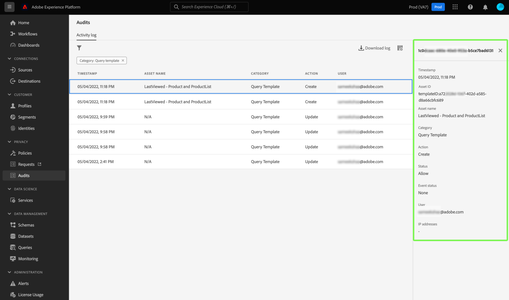

# [!DNL Query Service] integratie van auditlogbestand

De Adobe Experience Platform [!DNL Query Service] de integratie van het controlelogboek verstrekt verslagen van vraag-verwante gebruikersacties. Auditlogboeken zijn een essentieel hulpmiddel voor het oplossen van problemen en het naleven van het beleid en de regelgevende vereisten van het bedrijfsgegevensbeheer. Het vermogen staat u toe om een actielogboek voor vele gebeurtenistypen en filter terug te keren en de verslagen uit te voeren. De logbestanden zijn toegankelijk via de gebruikersinterface van het Platform of via de [Audit Query API](https://www.adobe.io/experience-platform-apis/references/audit-query/) en gedownload in CSV- of JSON-bestandsindelingen.

Meer over het gebruikersinterface van de controlelogboeken leren, verwijs naar [overzichtsdocument voor auditlogboeken](../../landing/governance-privacy-security/audit-logs/overview.md). Voor meer informatie over het maken van aanroepen naar Platform-API&#39;s raadpleegt u de [handleiding voor auditlogs API](../../landing/api-guide.md).

## Vereisten

U moet beschikken over de [!DNL Data Governance] [!UICONTROL View User Activity Log] toestemming die wordt toegelaten om het dashboard van het controlelogboek binnen het Platform UI te bekijken. De toestemming wordt toegelaten door de Adobe [Admin Console](https://adminconsole.adobe.com/). Neem contact op met de beheerder van uw organisatie als u geen beheerdersrechten hebt om deze machtiging in te schakelen. Zie de documentatie van het toegangsbeheer voor [volledige instructies over het toevoegen van toestemmingen door Admin Console](../../access-control/home.md).

## [!DNL Query Service] categorieën controlelogboeken {#audit-log-categories}

De categorieën controlelogboeken die door [!DNL Query Service] De bedragen zijn als volgt.

| Categorie | Beschrijving |
|---|---|
| [!UICONTROL Scheduled query] | Met deze categorie kunt u de programma&#39;s controleren die zijn gemaakt, bijgewerkt of verwijderd binnen [!DNL Query Service]. |
| [!UICONTROL Query template] | Met deze categorie kunt u de verschillende handelingen (maken, bijwerken en verwijderen) controleren die op een querysjabloon zijn uitgevoerd. |
<!-- | [!UICONTROL Query] | This category allows you to audit query executions. | -->

## Een [!DNL Query Service] auditlogboek {#perform-an-audit-log}

Een controle uitvoeren voor [!DNL Query Service] activiteiten, selecteren **[!UICONTROL Audits]** van de linkernavigatie, gevolgd door het trechter pictogram () om een lijst met filterbesturingselementen weer te geven om de resultaten te beperken.

Van de [!UICONTROL Audits] dashboard [!UICONTROL Activity log] kunt u alle opgenomen handelingen van het Platform filteren op een van de volgende [!DNL Query Service] categorieën. De logboekresultaten kunnen verder worden gefiltreerd gebaseerd op de tijdsperiode zij werden uitgevoerd, de actie/de functie die, of de gebruiker werd genomen die de vraag uitvoerde. Zie de documentatie van het controlelogboek voor [volledige instructies over hoe te om de logboeken te filtreren die op categorie, actie, gebruiker, en status worden gebaseerd](../../landing/governance-privacy-security/audit-logs/overview.md#managing-audit-logs-in-the-ui).

De teruggekeerde gegevens van het controlelogboek bevatten de volgende informatie over alle vragen die aan uw gekozen filtercriteria voldoen.

| Kolomnaam | Beschrijving |
|---|---|
| [!UICONTROL Timestamp] | De exacte datum en tijd van de actie die in een `month/day/year hour:minute AM/PM` gebruiken. |
| [!UICONTROL Asset Name] | De waarde voor de [!UICONTROL Asset Name] wordt bepaald door de categorie die als filter wordt gekozen. Wanneer u de [!UICONTROL Scheduled query] categorie is **naam van schema**. Wanneer u de [!UICONTROL Query template] categorie, dit is de **sjabloonnaam**. |
| [!UICONTROL Category] | Dit veld komt overeen met de categorie die u in de vervolgkeuzelijst met filters hebt geselecteerd. |
| [!UICONTROL Action] | Dit kan worden gemaakt, verwijderd, bijgewerkt of uitgevoerd. Welke acties beschikbaar zijn, is afhankelijk van de categorie die u als filter hebt gekozen. |
| [!UICONTROL User] | Dit veld bevat de gebruikersnaam die de query heeft uitgevoerd. |

>[!NOTE]
>
>Meer vraagdetails worden verstrekt door de logboekresultaten in of CSV of JSON dossierformaten te downloaden, dan door gebrek in het dashboard van het controlelogboek wordt getoond.

Selecteer een rij controlelogbestandresultaten om een deelvenster met details rechts van het scherm te openen.

>[!NOTE]
>
>U kunt het deelvenster Details gebruiken om de [!UICONTROL Asset ID]. De waarde van de [!UICONTROL Asset ID] wijzigingen afhankelijk van de categorie die in de controle wordt gebruikt. Wanneer u de [!UICONTROL Query template] de categorie [!UICONTROL Asset ID] is de **sjabloon-id**. Wanneer u de [!UICONTROL Scheduled query] de categorie [!UICONTROL Asset ID] is de  **schema-id**.

## Beschikbare filters voor [!DNL Query Service] categorieën controlelogboeken {#available-filters}

Welke filters beschikbaar zijn, is afhankelijk van de categorie die is geselecteerd in de vervolgkeuzelijst. In de volgende tabel worden de filters beschreven die beschikbaar zijn voor [[!DNL Query Service] categorieën controlelogboeken](#audit-log-categories).

| Filter | Beschrijving |
|---|---|
| Categorie | Zie de [[!DNL Query Service] categorieën controlelogboeken](#audit-log-categories) voor een volledige lijst van beschikbare categorieën. |
| Actie | Wanneer u verwijst naar [!DNL Query Service] auditcategorieën, update is een **wijziging van het bestaande formulier**, delete is de **schrapping van het schema of de sjabloon**, create is **een nieuw schema of sjabloon maken** en voert een query uit. |
| Gebruiker | Voer de volledige gebruikersnaam in (bijvoorbeeld johndoe@acme.com) om te filteren op gebruiker. |
| Status | Dit filter is niet van toepassing op de [!DNL Query Service] auditlogboeken. De [!UICONTROL Allow], [!UICONTROL Success], en [!UICONTROL Failure] de opties zullen niet de resultaten filtreren terwijl de [!UICONTROL Deny] filter uit **alles** logboeken. |
| Datum | Selecteer een begindatum en/of een einddatum om een datumbereik te definiëren waarop de resultaten moeten worden gefilterd. |

## Volgende stappen

Door dit document te lezen, hebt u een beter inzicht in de [!DNL Query Service] de capaciteit van het controlelogboek en hoe het kan worden gebruikt om uw te filtreren [!DNL Query Service] gebruikershandelingen.

Als u het [!DNL Query Service] het vermogen van het controlelogboek voor het oplossen van problemendoeleinden, wordt u geadviseerd om te lezen [gids voor problemen](../troubleshooting-guide.md).
