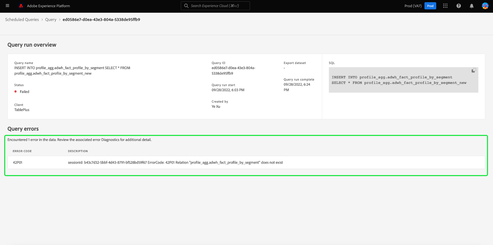

# Bewakingsquery&#39;s (beperkte release)

>[!IMPORTANT]
>
>Deze functie is momenteel een beperkte release en is alleen beschikbaar voor een klein aantal klanten.

Adobe Experience Platform biedt een verbeterde zichtbaarheid voor de status van alle querytaken via de gebruikersinterface. Van [!UICONTROL Scheduled Queries] kunt u belangrijke informatie over uw vraaglooppas nu vinden die de status, planningsdetails, en foutenmeldingen/codes omvat indien zij ontbreken. U kunt aan alarm voor vragen ook intekenen die op hun status door UI voor om het even welk van deze vragen worden gebaseerd door [!UICONTROL Scheduled Queries] tab.

## [!UICONTROL Scheduled Queries]

De [!UICONTROL Scheduled Queries] biedt een overzicht van de uitgevoerde en geplande query&#39;s. De werkruimte bevat al uw vragen CTAS en ITAS die of gepland om zijn te lopen of minstens eens uitgevoerd. De details van de looppas kunnen voor alle geplande vragen evenals foutencodes en berichten voor ontbroken vragen worden gevonden.

Ga naar de [!UICONTROL Scheduled Queries] tab, selecteert u **[!UICONTROL Queries]** van de linkernavigatiebalk, gevolgd door **[!UICONTROL Scheduled Queries]**

In de onderstaande tabel wordt elke beschikbare kolom beschreven.

>[!NOTE]
>
>Het waarschuwingspictogram voor abonnementen staat in elke rij in een kolom zonder naam. Zie de [waarschuwingsabonnementen](#alert-subscription) voor meer informatie.

| Kolom | Beschrijving |
|---|---|
| Naam | Het naamveld is de sjabloonnaam of de eerste paar tekens van uw SQL-query. Om het even welke vraag die door UI met de Redacteur van de Vraag wordt gecreeerd wordt genoemd bij aanvang. Als de query via de API is gemaakt, is de naam van de query een fragment van de eerste SQL die is gebruikt om de query te maken. |
| Sjabloon | De sjabloonnaam van de query. Selecteer een sjabloonnaam om naar de Query-editor te navigeren. Het vraagmalplaatje wordt getoond in de Redacteur van de Vraag voor gemak. Als er geen malplaatjenaam is, wordt de rij duidelijk met een koppelteken en er is geen capaciteit om aan de Redacteur van de Vraag om de vraag te bekijken opnieuw te richten. |
| SQL | Een fragment van de SQL-query. |
| Uitvoerfrequentie | Dit is de kadentie waarbij uw vraag wordt geplaatst om te lopen. De beschikbare waarden zijn `Run once` en `Scheduled`. U kunt query&#39;s filteren op basis van hun uitvoeringsfrequentie. |
| Gemaakt door | De naam van de gebruiker die de query heeft gemaakt. |
| Gemaakt | De tijdstempel in UTC-indeling waarin de query is gemaakt. |
| Tijdstempel voor laatste uitvoering | De meest recente tijdstempel toen de query werd uitgevoerd. Deze kolom benadrukt of een vraag volgens zijn huidig programma is uitgevoerd. |
| Status van laatste uitvoering | De status van de meest recente queryuitvoering. De drie statuswaarden zijn: `successful` `failed` of `in progress`. |

>[!TIP]
>
>Als u naar de Query-editor navigeert, kunt u **[!UICONTROL Queries]** om terug te keren naar de [!UICONTROL Templates] tab.

### Tabelinstellingen aanpassen voor geplande query&#39;s

U kunt de kolommen op de [!UICONTROL Scheduled Queries] op uw behoeften. Selecteer het instellingenpictogram () om de [!UICONTROL Customize table] het dialoogvenster Instellingen en bewerk beschikbare kolommen.

Schakel de desbetreffende selectievakjes in of uit om een tabelkolom te verwijderen of toe te voegen. Selecteer vervolgens **[!UICONTROL Apply]** om je keuzes te bevestigen.

>[!NOTE]
>
>Om het even welke vraag die door UI werd gecreeerd wordt een genoemd malplaatje als deel van het creatieproces. De sjabloonnaam wordt weergegeven in de sjabloonkolom. Als de query via de API is gemaakt, is de sjabloonkolom leeg.

### Abonneren op waarschuwingen {#alert-subscription}

U kunt zich abonneren op waarschuwingen van de [!UICONTROL Scheduled Queries] tab. Selecteer het waarschuwingspictogram () naast de naam van een query om het dialoogvenster [!UICONTROL Alerts] . De [!UICONTROL Alerts] Hiermee meldt u zich aan zowel UI-berichten als e-mailwaarschuwingen. Waarschuwingen zijn gebaseerd op de status van de query. Er zijn drie opties beschikbaar: `start`, `success`, en `failure`. Vak of vakken invullen en **[!UICONTROL Save]** om in te schrijven.

<!-- This dialog will be updated before release. THe image below will need to be updated inline with these changes. -->

<!-- Link to alert subscriptions doc when available -->

### Filterquery&#39;s

U kunt vragen filteren op runtime frequentie. Van de [!UICONTROL Scheduled Queries] tab, selecteer het filterpictogram () om de filterzijbalk te openen.

Selecteer een van de **[!UICONTROL Scheduled]** of **[!UICONTROL Run once]** Voer de controledozen van de frequentiefilter in werking om de lijst van vragen te filtreren.

>[!NOTE]
>
>Om het even welke vraag die is uitgevoerd maar niet gepland kwalificeert als [!UICONTROL Run once].

Als u de filtercriteria hebt ingeschakeld, selecteert u **[!UICONTROL Hide Filters]** om het filterdeelvenster te sluiten.

## Zoekopdracht voert planningdetails uit

Selecteer een querynaam om naar de pagina met planningsdetails te navigeren. Deze mening verstrekt een lijst van alle looppas die als deel van die geplande vraag wordt uitgevoerd. De verstrekte informatie omvat de begin en eindtijd, status, en gebruikte dataset.

Deze informatie wordt verstrekt in een vijf-kolomlijst. Elke rij geeft een query-uitvoering aan.

| Kolomnaam | Beschrijving |
|---|---|
| ID van query-uitvoering | ID van de vraaglooppas voor de dagelijkse uitvoering. |
| Start query | De tijdstempel wanneer de query werd uitgevoerd. Dit heeft de UTC-indeling. |
| Query uitvoeren voltooid | De tijdstempel wanneer de query is voltooid. Dit heeft de UTC-indeling. |
| Status | De status van de meest recente queryuitvoering. De drie statuswaarden zijn: `successful` `failed` of `in progress`. |
| Gegevensset | De dataset betrokken bij de uitvoering. |

De details van de vraag die kunnen worden gepland in worden gezien [!UICONTROL Properties] deelvenster. Dit deelvenster bevat de initiële query-id, het type client, de sjabloonnaam, de query-SQL en het corresponderende schema.

### Details uitvoeren

Selecteer een id voor een query om naar de pagina met uitvoerdetails te navigeren en query-informatie weer te geven.

Deze mening verstrekt informatie over individuele looppas voor deze geplande vraag en een meer gedetailleerde specificatie van de looppasstatus. Deze pagina omvat ook de cliëntinformatie en details van om het even welke fouten die de vraag om hebben veroorzaakt te ontbreken.

De sectie met de querystatus bevat de foutcode en het foutbericht als de query is mislukt.

U kunt de SQL-query van deze weergave naar het klembord kopiëren. Selecteer het kopieerpictogram rechtsboven in het SQL-fragment om de query te kopiëren. Een pop-upbericht bevestigt dat de code is gekopieerd.

Selecteren **[!UICONTROL Query]** om terug te keren naar het scherm met planningsdetails, of **[!UICONTROL Scheduled Queries]** om terug te keren naar de [!UICONTROL Scheduled Queries] tab.

