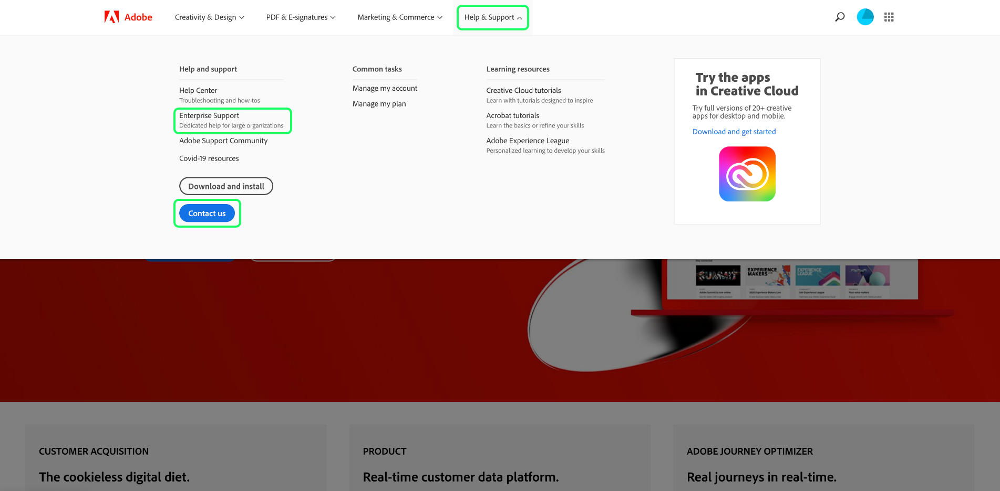

# [!DNL Query Service] gids voor problemen

Dit document verstrekt antwoorden op vaak gestelde vragen over de Dienst van de Vraag en verstrekt een lijst van algemeen gezien foutencodes wanneer het gebruiken van de Dienst van de Vraag. Voor vragen en problemen met betrekking tot andere services in Adobe Experience Platform raadpleegt u de [Handleiding voor het oplossen van problemen met Experience Platforms](../landing/troubleshooting.md).

De volgende lijst met antwoorden op veelgestelde vragen is onderverdeeld in de volgende categorieën:

- [Algemeen](#general)
- [Data exporteren](#exporting-data)
- [Gereedschappen van derden](#third-party-tools)
- [PostSQL API-fouten](#postgresql-api-errors)
- [REST API-fouten](#rest-api-errors)

## Algemene vragen over Query Service {#general}

Deze sectie bevat informatie over prestaties, beperkingen en processen.

### Kan ik de auto-volledige eigenschap in de Redacteur van de Dienst van de Vraag uitzetten?

+++Antwoord nr. Het uitschakelen van de functie voor automatisch aanvullen wordt momenteel niet ondersteund door de editor.
+++

### Waarom wordt de Redacteur van de Vraag soms langzaam wanneer ik in een vraag typ?

+++Antwoord Een mogelijke oorzaak is de functie voor automatisch aanvullen. De eigenschap verwerkt bepaalde meta-gegevensbevelen die de redacteur tijdens vraag het uitgeven soms kunnen vertragen.
+++

### Kan ik Postman gebruiken voor de API voor zoekservices?

+++Antwoord ja, kunt u visualiseren en met alle Adobe API diensten in wisselwerking staan gebruikend Postman (een vrije, derdetoepassing). Kijk naar de [Postman Setup Guide](https://video.tv.adobe.com/v/28832) voor geleidelijke instructies op hoe te opstelling een project in de Console van de Ontwikkelaar van de Adobe en verwerft alle noodzakelijke geloofsbrieven voor gebruik met Postman. Zie de officiële documentatie voor [richtlijnen voor het starten, uitvoeren en delen van Postman-verzamelingen](https://learning.postman.com/docs/running-collections/intro-to-collection-runs/).
+++

### Is er een grens aan het maximumaantal rijen die van een vraag door UI zijn teruggekeerd?

++ antwoord ja, de Dienst van de Vraag past intern een grens van 50.000 rijen toe tenzij een expliciete grens extern wordt gespecificeerd. Zie de leidraad voor [interactieve query-uitvoering](./best-practices/writing-queries.md#interactive-query-execution) voor meer informatie .
+++

### Is er een grens van de gegevensgrootte voor de resulterende output van een vraag?

+++Antwoord nr. De gegevensgrootte is niet beperkt, maar er geldt een time-outlimiet van 10 minuten voor de query voor een interactieve sessie. Als de vraag als partij CTAS wordt uitgevoerd dan is een 10 minieme onderbreking niet van toepassing. Zie de leidraad voor [interactieve query-uitvoering](./best-practices/writing-queries.md#interactive-query-execution) voor meer informatie .
+++

### Hoe mijd ik de grens op het outputaantal rijen van een UITGEZOCHTE vraag?

+++Antwoord om de grens van de outputrij te mijden, pas &quot;LIMIT 0&quot;in de vraag toe. Bijvoorbeeld:

```sql
SELECT * FROM customers LIMIT 0;
```

+++

### Hoe kan ik voorkomen dat mijn vragen over 10 minuten worden uitgesteld?

+++Antwoord Één of meerdere van de volgende oplossingen worden geadviseerd in het geval van vraagtiming uit.

- [De query converteren naar een CTAS-query](./sql/syntax.md#create-table-as-select) en plant de uitvoering. Het plannen van een looppas kan of worden gedaan [via de gebruikersinterface](./ui/user-guide.md#scheduled-queries) of de [API](./api/scheduled-queries.md#create).
- Voer de vraag op een kleiner gegevenssegment uit door extra toe te passen [filtervoorwaarden](https://spark.apache.org/docs/latest/api/sql/index.html#filter).
- [De opdracht EXPLAIN uitvoeren](./sql/syntax.md#explain) voor meer informatie.
- Herzie de statistieken van de gegevens binnen de dataset.
- De query converteren naar een vereenvoudigd formulier en opnieuw uitvoeren met [voorbereide instructies](./sql/prepared-statements.md).
+++

### Is er om het even welke kwestie of effect op de prestaties van de Dienst van de Vraag als de veelvoudige vragen gelijktijdig lopen?

+++Antwoord nr. De Dienst van de vraag heeft een autoscaling vermogen dat gezamenlijke vragen verzekert geen merkbaar effect op de prestaties van de dienst hebben.
+++

### Hoe vind ik een kolomnaam van een hiërarchische dataset?

+++Antwoord De volgende stappen beschrijven hoe te om een tabelmening van een dataset door UI, met inbegrip van alle genestelde gebieden en kolommen in een samengevoegde vorm te tonen.

- Nadat u zich hebt aangemeld bij Experience Platform, selecteert u **[!UICONTROL Datasets]** in de linkernavigatie van UI om te navigeren naar [!UICONTROL Datasets] dashboard.
- De datasets [!UICONTROL Browse] wordt geopend. Met de zoekbalk kunt u de beschikbare opties verfijnen. Selecteer een dataset van de getoonde lijst.


- De [!UICONTROL Datasets activity] wordt weergegeven. Selecteren [!UICONTROL Preview dataset] om een dialoog van het schema XDM en in tabelvorm mening van samengevoegde gegevens van de geselecteerde dataset te openen. Meer informatie vindt u in het gedeelte [een voorbeeld bekijken van een gegevenssetdocumentatie](../catalog/datasets/user-guide.md#preview-a-dataset)


- Selecteer een veld in het schema om de inhoud ervan in een samengevoegde kolom weer te geven. De naam van de kolom wordt boven de inhoud weergegeven aan de rechterkant van de pagina. Kopieer deze naam voor het opvragen van deze gegevensset.


Zie de documentatie voor meer informatie over [hoe te werken met geneste gegevensstructuren](./best-practices/nested-data-structures.md) het gebruiken van de Redacteur van de Vraag of een derdecliënt.
+++

### Hoe kan ik een vraag over een dataset versnellen die series bevat?

+++Antwoord om de prestaties van vragen op datasets te verbeteren die series bevatten, zou u moeten [de array exploderen](https://spark.apache.org/docs/latest/api/sql/index.html#explode) als [CTAS-query](./sql/syntax.md#create-table-as-select) tijdens runtime, en dan het voor mogelijkheden verder te onderzoeken om zijn verwerkingstijd te verbeteren.
+++

### Waarom verwerkt mijn vraag CTAS nog na vele uren voor slechts een klein aantal rijen?

+++Antwoord als de vraag lange tijd op een zeer kleine dataset heeft geduurd, gelieve klantensteun te contacteren.

Een query kan om het even welk aantal redenen vastlopen tijdens de verwerking. Om de precieze oorzaak te bepalen, is een grondige analyse per geval nodig. [Contact opnemen met de klantenondersteuning van Adobe](#customer-support) om dit proces te zijn.
+++

### Hoe neem ik contact op met de klantenondersteuning van Adobe? {#customer-support}

+++Antwoord
[Een volledige lijst met telefoonnummers voor Adobe-klantenondersteuning](https://helpx.adobe.com/ca/contact/phone.html) is beschikbaar op de Adobe Help-pagina. U kunt de Help ook online vinden door de volgende stappen uit te voeren:

- Navigeren naar [https://www.adobe.com/](https://www.adobe.com/) in uw webbrowser.
- Selecteer rechts van de bovenste navigatiebalk de optie **[!UICONTROL Sign In]**.


- Gebruik uw Adobe ID en wachtwoord die bij uw Adobe-licentie zijn geregistreerd.
- Selecteren **[!UICONTROL Help & Support]** in de bovenste navigatiebalk.



Een vervolgkeuzelijst wordt weergegeven met een [!UICONTROL Help and support] sectie. Selecteren **[!UICONTROL Contact us]** om de virtuele assistent voor de klantenservice van Adobe te openen, of selecteer **[!UICONTROL Enterprise support]** voor specifieke hulp voor grote organisaties.
+++

### Hoe kan ik een sequentiële reeks taken uitvoeren, zonder dat ik vervolgens taken moet uitvoeren als de vorige taak niet succesvol is voltooid?

+++Antwoord Met de functie Anonieme blokken kunt u een of meer SQL-instructies ketenen die op volgorde worden uitgevoerd. Zij bieden ook de mogelijkheid om uitzonderingen af te handelen.

Zie de [anonieme blokdocumentatie](./best-practices/anonymous-block.md) voor meer informatie .
+++

### Hoe voer ik douaneattributie in de Dienst van de Vraag uit?

+++Antwoord Er zijn twee manieren om aangepaste toewijzing te implementeren:

1. Een combinatie van bestaande [Adobe-gedefinieerde functies](./sql/adobe-defined-functions.md) om na te gaan of aan de gebruiksbehoeften is voldaan.
1. Als de bovenstaande suggestie niet voldoet aan uw gebruiksaanwijzing, dient u een combinatie van [vensterfuncties](./sql/adobe-defined-functions.md#window-functions). De functies van het venster kijken naar alle gebeurtenissen in een opeenvolging. Met deze gegevens kunt u ook de historische gegevens beoordelen en deze kunnen in elke combinatie worden gebruikt.
+++

### Mag ik mijn vragen templatiseren zodat ik ze gemakkelijk kan hergebruiken?

++ + Antwoord ja, kunt u vragen door het gebruik van voorbereide verklaringen templatiseren. Bereide instructies kunnen de prestaties optimaliseren en voorkomen dat een query herhaaldelijk wordt geparseerd. Zie de [documentatie over voorbereide instructies](./sql/prepared-statements.md) voor meer informatie .
+++

### Hoe wint ik foutenlogboeken voor een vraag terug? {#error-logs}

+++Antwoord om foutenlogboeken voor een specifieke vraag terug te winnen, moet u eerst de Dienst API van de Vraag gebruiken om de details van het vraaglogboek te halen. De reactie van HTTP bevat vraag IDs die worden vereist om een vraagfout te onderzoeken.

Gebruik het bevel van de GET om veelvoudige vragen terug te winnen. Informatie over het aanroepen van de API vindt u in de [voorbeeld API-aanroepdocumentatie](./api/queries.md#sample-api-calls).

Van de reactie, identificeer de vraag u wilt onderzoeken en een ander verzoek van de GET maken gebruikend zijn `id` waarde. Volledige instructies vindt u in het gedeelte [vraag door de documentatie van identiteitskaart terugwinnen](./api/queries.md#retrieve-a-query-by-id).

Een geslaagde reactie retourneert HTTP-status 200 en bevat de eigenschap `errors` array. De reactie is verkort vanwege de beknoptheid.

```json
{
    "isInsertInto": false,
    "request": {
                "dbName": "prod:all",
                "sql": "SELECT *\nFROM\n  accounts\nLIMIT 10\n"
            },
    "clientId": "8c2455819a624534bb665c43c3759877",
    "state": "SUCCESS",
    "rowCount": 0,
    "errors": [{
      'code': '58000', 
      'message': 'Batch query execution gets : [failed reason ErrorCode: 58000 Batch query execution gets : [Analysis error encountered. Reason: [sessionId: f055dc73-1fbd-4c9c-8645-efa609da0a7b Function [varchar] not defined.]]]', 
      'errorType': 'USER_ERROR'
      }],
    "isCTAS": false,
    "version": 1,
    "id": "343388b0-e0dd-4227-a75b-7fc945ef408a",
}
```

De [Referentiedocumentatie voor Query Service API](https://www.adobe.io/experience-platform-apis/references/query-service/) biedt meer informatie over alle beschikbare eindpunten.
+++

### Wat betekent &quot;Fout bij valideren van schema&quot;?

++ Antwoord Het bericht &quot;Fout die schema&quot;bevestigt betekent dat het systeem van een gebied binnen het schema niet kan de plaats bepalen. U moet het document met aanbevolen procedures lezen voor [gegevenselementen organiseren in Query Service](./best-practices/organize-data-assets.md) gevolgd door de [Tabel maken als geselecteerde documentatie](./sql/syntax.md#create-table-as-select).

In het volgende voorbeeld wordt het gebruik van een CTAS-syntaxis en een struct-gegevenstype getoond:

```sql
CREATE TABLE table_name WITH (SCHEMA='schema_name')

AS SELECT '1' as _id,

 STRUCT

  ('2021-02-17T15:39:29.0Z' AS taskActualCompletionDate,

    '2020-09-09T21:21:16.0Z' AS taskActualStartDate,

    'Consulting' AS taskdescription,

    '5f6527c10011e09b89666c52d9a8c564' AS taskguide,

    'Stakeholder Consulting Engagement' AS taskname, 

    '2020-09-09T15:00:00.0Z' AS taskPlannedStartDate,

    '2021-02-15T11:00:00.0Z' AS taskPlannedCompletionDate

  ) AS _workfront ;
```

+++

### Hoe kan ik de nieuwe gegevens die dagelijks in het systeem komen, snel verwerken?

++ beantwoord [`SNAPSHOT`](./sql/syntax.md#snapshot-clause) De clausule kan worden gebruikt om gegevens over een lijst incrementeel te lezen die op een momentopname identiteitskaart wordt gebaseerd. Dit is ideaal voor gebruik met de [incrementele belasting](./best-practices/incremental-load.md) ontwerppatroon dat slechts informatie in de dataset verwerkt die sinds de laatste ladingsuitvoering is gecreeerd of gewijzigd. Hierdoor neemt de verwerkingsefficiëntie toe en kan deze zowel bij het streamen als bij het verwerken van batchgegevens worden gebruikt.
+++

### Waarom is er een verschil tussen de aantallen die in Profiel UI worden getoond en de aantallen die van de dataset van de profieluitvoer worden berekend?

+++Antwoord De getallen die worden weergegeven in het profieldashboard zijn nauwkeurig vanaf de laatste opname. De getallen die in de profielexporttabel worden gegenereerd, zijn volledig afhankelijk van de exportquery. Daarom is het vragen van het aantal profielen dat in aanmerking komt voor een bepaald segment een algemene oorzaak van deze discrepantie.

>[!NOTE]
>
>Het vragen omvat historische gegevens, terwijl UI slechts de huidige profielgegevens toont.

+++

### Waarom retourneerde mijn query een lege subset en wat moet ik doen?

+++Antwoord De meest waarschijnlijke oorzaak is dat uw vraag in werkingsgebied te smal is. U moet systematisch een gedeelte van het dialoogvenster `WHERE` clausule tot u begint te zien wat gegevens.

U kunt ook bevestigen dat uw dataset gegevens door een kleine vraag zoals te gebruiken bevat:

```sql
SELECT count(1) FROM myTableName
```

+++

### Kan ik mijn gegevens kopiëren?

+++Antwoord Deze functie is momenteel een werk in uitvoering. Details worden beschikbaar gesteld in [releaseopmerkingen](../release-notes/latest/latest.md) en via dialoogvensters van de gebruikersinterface van het Platform als de functie gereed is voor release.
+++

### Welke hulpfuncties worden gesteund door de Dienst van de Vraag?

+++De Dienst van de Vraag van het Antwoord verstrekt verscheidene ingebouwde SQL helperfuncties om SQL functionaliteit uit te breiden. Zie het document voor een volledige lijst van [SQL-functies die worden ondersteund door Query Service](./sql/spark-sql-functions.md).
+++

### Wat moet ik doen als mijn geplande query mislukt?

+++Antwoord eerst, controleer de logboeken om de details van de fout te weten te komen. De sectie Veelgestelde vragen over [fouten in logbestanden zoeken](#error-logs) biedt meer informatie over hoe u dit kunt doen.

U moet ook de documentatie controleren voor richtlijnen over het uitvoeren van [geplande vragen in UI](./ui/user-guide.md#scheduled-queries) en via [de API](./api/scheduled-queries.md).

Het volgende is een lijst van overwegingen voor geplande vragen wanneer het gebruiken van [!DNL Query Editor]. Zij zijn niet van toepassing op de [!DNL Query Service] API:<br/>U kunt alleen een schema toevoegen aan een query die al is gemaakt, opgeslagen en uitgevoerd.<br/>U **kan** voeg een programma aan een parameterized vraag toe.<br/>Geplande query&#39;s **kan** bevat een anoniem blok.<br/>U kunt alleen plannen **één** vraagmalplaatje gebruikend UI. Als u extra programma&#39;s aan een vraagmalplaatje wilt toevoegen, zult u API moeten gebruiken. Als er al een schema is toegevoegd met behulp van de API, kunt u geen aanvullende schema&#39;s toevoegen met behulp van de interface.
+++

### Wat betekent de fout &quot;Sessiebeperking bereikt&quot;?

+++Antwoord &quot;De Grens van de Zitting&quot;betekent bereikt dat het maximumaantal zittingen van de Dienst van de Vraag die voor uw organisatie wordt toegestaan is bereikt. Maak verbinding met de Adobe Experience Platform-beheerder van uw organisatie.
+++

### Hoe behandelt het vraaglogboek vragen met betrekking tot een geschrapte dataset?

+++De Dienst van de Vraag van het Antwoord schrapt nooit vraaggeschiedenis. Dit betekent dat om het even welke vragen die naar een geschrapte dataset verwijzen &quot;Geen geldige dataset&quot;als resultaat zouden terugkeren.
+++

### Hoe kan ik slechts de meta-gegevens voor een vraag krijgen?

+++Antwoord U kunt een vraag in werking stellen die nul rijen terugkeert om slechts de meta-gegevens in antwoord te krijgen. Deze voorbeeldquery retourneert alleen de metagegevens voor de opgegeven tabel.

```sql
SELECT * FROM <table> WHERE 1=0
```

+++

### Hoe kan ik snel op een vraag herhalen CTAS (Creeer Lijst zoals Uitgezochte) zonder het materialiseren?

+++Antwoord U kunt tot tijdelijke lijsten leiden om op een vraag snel te herhalen en te experimenteren alvorens het voor gebruik materialiseert. U kunt tijdelijke lijsten ook gebruiken om te bevestigen als een vraag functioneel is.

U kunt bijvoorbeeld een tijdelijke tabel maken:

```sql
CREATE temp TABLE temp_dataset AS
SELECT *
FROM actual_dataset
WHERE 1 = 0;
```

Vervolgens kunt u de tijdelijke tabel als volgt gebruiken:

```sql
INSERT INTO temp_dataset
SELECT a._company AS _company,
a._id AS _id,
a.timestamp AS timestamp
FROM actual_dataset a
WHERE timestamp >= TO_TIMESTAMP('2021-01-21 12:00:00')
AND timestamp < TO_TIMESTAMP('2021-01-21 13:00:00')
LIMIT 100;
```

+++

### Hoe kan ik de tijdzone wijzigen van en naar een UTC-tijdstempel?

+++Antwoord Adobe Experience Platform houdt gegevens in UTC (Coordinated Universal Time) timestamp formaat voort. Een voorbeeld van de UTC-indeling is `2021-12-22T19:52:05Z`

De Dienst van de vraag steunt ingebouwde SQL functies om een bepaalde timestamp in en van formaat om te zetten UTC. Beide `to_utc_timestamp()` en de `from_utc_timestamp()` methoden hebben twee parameters : tijdstempel en tijdzone.

| Parameter | Beschrijving |
|-----------|---------------|
| Tijdstempel | De tijdstempel kan in UTC- of eenvoudig worden geschreven `{year-month-day}` gebruiken. Als er geen tijd is opgegeven, is de standaardwaarde middernacht op de ochtend van de opgegeven dag. |
| Tijdzone | De tijdzone wordt geschreven in een `{continent/city})` gebruiken. Dit moet een van de erkende tijdzonecodes zijn, zoals die in de [public-domain TZ-database](https://data.iana.org/time-zones/tz-link.html#tzdb). |

#### Omzetten in UTC-tijdstempel

De `to_utc_timestamp()` methode interpreteert de opgegeven parameters en converteert deze **naar het tijdstempel van uw lokale tijdzone** in UTC-indeling. De tijdzone in Seoul, Zuid-Korea, is bijvoorbeeld UTC/GMT +9 uur. Door een datum-enige timestamp te verstrekken, gebruikt de methode een standaardwaarde van middernacht in de ochtend. De tijdstempel en tijdzone worden vanuit dat gebied omgezet in de UTC-indeling in een UTC-tijdstempel van uw lokale regio.

```SQL
SELECT to_utc_timestamp('2021-08-31', 'Asia/Seoul');
```

De query retourneert een tijdstempel in de lokale tijd van de gebruiker. In dit geval is 3 uur de vorige dag, zoals Seoul, negen uur voor.

```
2021-08-30 15:00:00
```

Als een ander voorbeeld, als de opgegeven tijdstempel `2021-07-14 12:40:00.0` voor de `Asia/Seoul` timezone, de geretourneerde UTC-tijdstempel is `2021-07-14 03:40:00.0`

De consoleoutput die in de Dienst UI van de Vraag wordt verstrekt is een meer mens-leesbaar formaat:

```
8/30/2021, 3:00 PM
```

#### Omzetten vanuit de UTC-tijdstempel

De `from_utc_timestamp()` methode interpreteert de opgegeven parameters **van de tijdstempel van uw lokale tijdzone** en geeft het equivalente tijdstempel van het gewenste gebied in UTC-indeling. In het onderstaande voorbeeld is het uur 2:40PM in de lokale tijdzone van de gebruiker. De tijdzone van Seoul die als variabele wordt overgegaan is negen uur vóór lokale timezone.

```SQL
SELECT from_utc_timestamp('2021-08-31 14:40:00.0', 'Asia/Seoul');
```

De query retourneert een tijdstempel in UTC-indeling voor de tijdzone die als parameter is doorgegeven. Het resultaat is negen uur voor de tijdzone die de vraag in werking stelde.

```
8/31/2021, 11:40 PM
```

### Hoe moet ik mijn tijdreeksgegevens filteren?

+++Antwoord wanneer het vragen met tijd-reeksgegevens, zou u het timestamp filter waar mogelijk voor nauwkeurigere analyse moeten gebruiken.

>[!NOTE]
>
> De datumtekenreeks **moet** heeft de notatie `yyyy-mm-ddTHH24:MM:SS`.

Hieronder ziet u een voorbeeld van het gebruik van het tijdstempelfilter:

```sql
SELECT a._company  AS _company,
       a._id       AS _id,
       a.timestamp AS timestamp
FROM   dataset a
WHERE  timestamp >= To_timestamp('2021-01-21 12:00:00')
       AND timestamp < To_timestamp('2021-01-21 13:00:00')
```

+++

### Hoe gebruik ik de `CAST` operator om mijn tijdstempels om te zetten in SQL query&#39;s?

+++Antwoord wanneer het gebruiken van `CAST` om een tijdstempel om te zetten, moet u beide datums opnemen **en** tijd.

Als bijvoorbeeld de tijdcomponent ontbreekt, zoals hieronder wordt weergegeven, resulteert dit in een fout:

```sql
SELECT * FROM ABC
WHERE timestamp = CAST('07-29-2021' AS timestamp)
```

Het juiste gebruik van de `CAST` operator wordt hieronder weergegeven:

```sql
SELECT * FROM ABC
WHERE timestamp = CAST('07-29-2021 00:00:00' AS timestamp)
```

+++

### Moet ik vervangingen, zoals * gebruiken om alle rijen van mijn datasets te krijgen?

+++Antwoord U kunt geen vervangingen gebruiken om alle gegevens van uw rijen te krijgen, aangezien de Dienst van de Vraag als a zou moeten worden behandeld **columnar-store** in plaats van een traditioneel opslagsysteem op basis van rijen.
+++

### Moet ik gebruiken `NOT IN` in mijn SQL-query?

++ beantwoord `NOT IN` wordt vaak gebruikt om rijen op te halen die niet in een andere lijst of SQL verklaring worden gevonden. Deze operator kan de prestaties vertragen en onverwachte resultaten opleveren als de kolommen die worden vergeleken, accepteren `NOT NULL`of u hebt een groot aantal records.

In plaats van `NOT IN`kunt u beide `NOT EXISTS` of `LEFT OUTER JOIN`.

Als u bijvoorbeeld de volgende tabellen hebt gemaakt:

```sql
CREATE TABLE T1 (ID INT)
CREATE TABLE T2 (ID INT)
INSERT INTO T1 VALUES (1)
INSERT INTO T1 VALUES (2)
INSERT INTO T1 VALUES (3)
INSERT INTO T2 VALUES (1)
INSERT INTO T2 VALUES (2)
```

Als u het `NOT EXISTS` -operator, kunt u repliceren met de `NOT IN` operator door de volgende query te gebruiken:

```sql
SELECT ID FROM T1
WHERE NOT EXISTS
(SELECT ID FROM T2 WHERE T1.ID = T2.ID)
```

U kunt ook de opdracht `LEFT OUTER JOIN` -operator, kunt u repliceren met de `NOT IN` operator door de volgende query te gebruiken:

```sql
SELECT T1.ID FROM T1
LEFT OUTER JOIN T2 ON T1.ID = T2.ID
WHERE T2.ID IS NULL
```

+++

## Data exporteren {#exporting-data}

Deze sectie bevat informatie over het exporteren van gegevens en beperkingen.

### Is er een manier om gegevens uit de Dienst van de Vraag na vraagverwerking te halen en de resultaten in een Csv- dossier te bewaren?

++ + Antwoord Ja. De gegevens kunnen uit de Dienst van de Vraag worden gehaald en er is ook de optie om de resultaten in formaat CSV via een SQL bevel op te slaan.

Er zijn twee manieren om de resultaten van een vraag te bewaren wanneer het gebruiken van een cliënt PSQL. U kunt de `COPY TO` gebruiken of een instructie maken met de volgende indeling:

```sql
SELECT column1, column2 
FROM <table_name>  
\g <table_name>.out
```

[Richtsnoeren voor het gebruik van de `COPY TO` command](./sql/syntax.md#copy) vindt u in de documentatie bij de SQL-syntaxisverwijzing.
+++

### Kan ik de inhoud van de definitieve dataset halen die door CTAS vragen is opgenomen (veronderstellend zijn deze grotere hoeveelheden gegevens zoals Terabytes)?

+++Antwoord nr. Er is momenteel geen functie beschikbaar voor het ophalen van opgenomen gegevens.
+++

## Gereedschappen van derden {#third-party-tools}

Deze sectie bevat informatie over het gebruik van hulpmiddelen van derden, zoals PSQL en Power BI.

### Kan ik de Dienst van de Vraag met een derdehulpmiddel verbinden?

++ Antwoord ja, kunt u veelvoudige derdeDesktopcliënten met de Dienst van de Vraag verbinden. Zie de documentatie voor [volledige details over de beschikbare cliënten en hoe te om hen met de dienst van de Vraag te verbinden](./clients/overview.md).
+++

### Is er een manier om de Dienst van de Vraag eenmaal voor ononderbroken gebruik met een derdehulpmiddel aan te sluiten?

++ antwoord ja, kunnen de derdeDesktopcliënten met de Dienst van de Vraag door een eenmalig opstelling van niet-vervallende geloofsbrieven worden verbonden. Niet-vervallende gegevens kunnen worden gegenereerd door een geautoriseerde gebruiker en worden ontvangen in een JSON-bestand dat naar de lokale computer is gedownload. Volledig [richtlijnen voor het maken en downloaden van niet-vervallende referenties](./ui/credentials.md#non-expiring-credentials) te vinden in de documentatie.
+++

### Welk soort redacteurs van derdeSQL kan ik met de Redacteur van de Dienst van de Vraag verbinden?

++ Antwoord om het even welke derdeSQL redacteur die PSQL of is [!DNL Postgres] cliënt volgzaam kan met de Redacteur van de Dienst van de Vraag worden verbonden. Zie de documentatie voor [clients verbinden met Query Service](./clients/overview.md) voor een lijst met beschikbare instructies.
+++

### Kan ik het hulpmiddel van de Power BI met de Dienst van de Vraag verbinden?

++ antwoord ja, kunt u Power BI met de Dienst van de Vraag verbinden. Zie de documentatie voor [instructies voor het aansluiten van de Power BI desktop-app op Query Service](./clients/power-bi.md).
+++

### Waarom duurt het lang om de dashboards te laden wanneer verbonden met de Dienst van de Vraag?

+++Antwoord Wanneer het systeem met de Dienst van de Vraag wordt verbonden, wordt het verbonden met een interactieve of partijverwerkingsmotor. Dit kan resulteren in langere laadtijden voor de verwerkte gegevens.

Als u de reactietijden voor uw dashboards zou willen verbeteren, zou u een server van de Business Intelligence (BI) als caching laag tussen de Dienst van de Vraag en de hulpmiddelen van BI moeten uitvoeren. Over het algemeen, hebben de meeste hulpmiddelen van BI een extra aanbieding voor een server.

Het doel om de laag van de geheim voorgeheugenserver toe te voegen is de gegevens van de Dienst van de Vraag in het voorgeheugen onder te brengen en het zelfde voor dashboards te gebruiken om de reactie te versnellen. Dit is mogelijk aangezien de resultaten voor vragen die worden uitgevoerd in het voorgeheugen onder zouden worden gebracht elke dag in de server van BI. De caching server dient dan deze resultaten voor om het even welke gebruiker met de zelfde vraag om latentie te verminderen. Raadpleeg de documentatie bij het hulpprogramma of het hulpprogramma van derden dat u gebruikt voor meer informatie over deze installatie.
+++

### Is het mogelijk om tot de Dienst van de Vraag toegang te hebben gebruikend het pgAdmin verbindingshulpmiddel?

+++Antwoord nr., wordt de connectiviteit pgAdmin niet gesteund. A [lijst van beschikbare derde cliënten en instructies op hoe te om hen met de Dienst van de Vraag te verbinden](./clients/overview.md) te vinden in de documentatie.
+++

## PostSQL API-fouten {#postgresql-api-errors}

De volgende tabel bevat PSQL-foutcodes en de mogelijke oorzaken ervan.

| Foutcode | Verbindingsstatus | Beschrijving | Mogelijke oorzaak |
|------------|---------------------------|-------------|----------------|
| **08P01** | N.v.t. | Niet-ondersteund berichttype | Niet-ondersteund berichttype |
| **28P01** | Opstarten - verificatie | Ongeldig wachtwoord | Ongeldig verificatietoken |
| **28000** | Opstarten - verificatie | Ongeldig autorisatietype | Ongeldig autorisatietype. Moet `AuthenticationCleartextPassword`. |
| **42P12** | Opstarten - verificatie | Geen tabellen gevonden | Geen tabellen gevonden voor gebruik |
| **42601** | Query | Syntaxisfout | Ongeldige opdracht- of syntaxisfout |
| **42P01** | Query | Tabel niet gevonden | Tabel die is opgegeven in de query, is niet gevonden |
| **42P07** | Query | Tabel bestaat | Er bestaat al een tabel met dezelfde naam (CREATE TABLE) |
| **53400** | Query | LIMIT overschrijdt max. waarde | Gebruiker heeft een LIMIT-component opgegeven die hoger is dan 100.000 |
| **53400** | Query | Time-out instructie | De ingediende liveverklaring nam meer dan maximaal 10 minuten in beslag |
| **58000** | Query | Systeemfout | Interne systeemfout |
| **0A000** | Query/opdracht | Niet ondersteund | De functie/functionaliteit in de query/opdracht wordt niet ondersteund |
| **42501** | DROP TABLE-query | Droptable not created by Query Service | De lijst die wordt gelaten vallen werd niet gecreeerd door de Dienst van de Vraag gebruikend `CREATE TABLE` statement |
| **42501** | DROP TABLE-query | Tabel niet gemaakt door de geverifieerde gebruiker | De lijst die wordt gelaten vallen werd niet gecreeerd door de momenteel het programma geopende gebruiker |
| **42P01** | DROP TABLE-query | Tabel niet gevonden | De tabel die in de query is opgegeven, is niet gevonden |
| **42P12** | DROP TABLE-query | Geen tabel gevonden voor `dbName`: gelieve de `dbName` | Er zijn geen tabellen gevonden in de huidige database |

### Waarom ontving ik een 58000 foutcode toen het gebruiken van de history_meta () methode op mijn lijst?

++ beantwoord `history_meta()` De methode wordt gebruikt om tot een momentopname van een dataset toegang te hebben. Eerder, als u een vraag op een lege dataset in Azure Data Lake Storage (ADLS) moest in werking stellen, zou u een 58000 foutencode ontvangen die zegt dat de gegevensreeks niet bestaat. Hieronder wordt een voorbeeld van de oude systeemfout weergegeven.

```shell
ErrorCode: 58000 Internal System Error [Invalid table your_table_name. historyMeta can be used on datalake tables only.]
```

Deze fout is opgetreden omdat de query geen retourwaarde heeft. Dit gedrag is nu gecorrigeerd om het volgende bericht te retourneren:

```text
Query complete in {timeframe}. 0 rows returned. 
```

+++

## REST API-fouten {#rest-api-errors}

De volgende tabel bevat HTTP-foutcodes en de mogelijke oorzaken ervan.

| HTTP-statuscode | Beschrijving | Mogelijke oorzaken |
|------------------|-----------------------|----------------------------|
| 400 | Ongeldig verzoek | Onjuiste of ongeldige query |
| 401 | Verificatie mislukt | Ongeldig auteur-token |
| 500 | Interne serverfout | Interne systeemfout |
