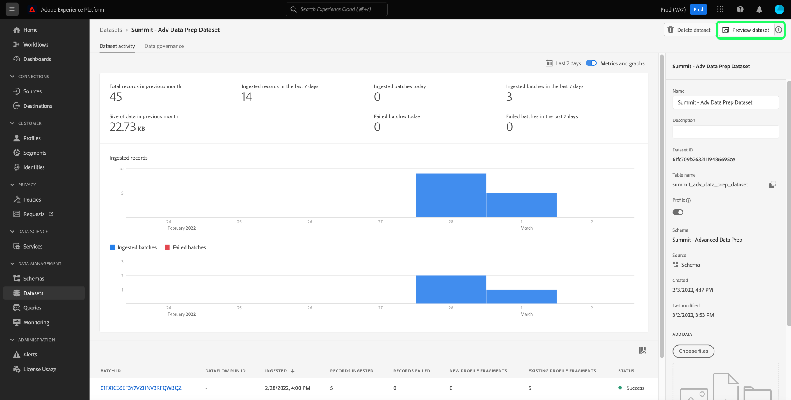

# Query Service en Data Distiller hebben vaak vragen gesteld

In dit document worden veelgestelde vragen over Query Service en Data Distiller beantwoord. Het omvat ook algemeen gezien foutencodes terwijl het gebruiken van het product van &quot;Vragen&quot;voor gegevensbevestiging of het schrijven van getransformeerde gegevens terug naar het gegevenspeer. Voor vragen en het oplossen van problemen andere diensten van Adobe Experience Platform, gelieve te verwijzen naar de [&#x200B; het oplossen van problemengids van Experience Platform &#x200B;](../landing/troubleshooting.md).

Om te verduidelijken hoe de Dienst van de Vraag en Gegevens Distiller binnen Adobe Experience Platform samenwerken, zijn hier twee grondvragen.

## Wat is het verband tussen de Dienst van de Vraag en Gegevens Distiller?

De Dienst van de vraag en Gegevens Distiller zijn verschillende, complementaire componenten die specifieke gegevens het vragen mogelijkheden verstrekken. De Dienst van de vraag wordt ontworpen voor ad hoc vragen om, met ingebedde gegevens te onderzoeken te bevestigen en te experimenteren zonder het gegevensmeer te veranderen. In tegenstelling, concentreert Distiller van Gegevens zich op partijvragen die transformeren en gegevens verrijken, met resultaten die terug in het gegevenspeer voor toekomstig gebruik worden opgeslagen. De vragen van de partij in Gegevens Distiller kunnen worden gepland, worden gecontroleerd, en worden beheerd, ondersteunend diepere gegevensverwerking en manipulatie die de Dienst van de Vraag alleen niet vergemakkelijkt.

Samen maakt Query Service snel inzicht mogelijk, terwijl Data Distiller diepgaande, permanente gegevenstransformaties mogelijk maakt.

## Wat is het verschil tussen de Dienst van de Vraag en Gegevens Distiller?

**Dienst van de Vraag**: Gebruikt voor SQL vragen die op gegevensexploratie, bevestiging, en experimenteren worden geconcentreerd. De output wordt niet opgeslagen in het gegevensmeer, en de uitvoertijd is beperkt tot 10 minuten. Ad hoc vragen zijn geschikt voor lichtgewicht, interactieve gegevenscontroles en analyses.

**Gegevens Distiller**: Laat partijvragen toe die, gegevens verwerken, schoonmaken en verrijken, met resultaten die terug in het gegevensmeer worden opgeslagen. Deze vragen steunen langere uitvoering (tot 24 uren) en extra eigenschappen zoals het plannen, controle, en versnelde rapportering. Data Distiller is ideaal voor uitgebreide gegevensmanipulatie en geplande gegevensverwerkingstaken.

Zie het [&#x200B; het verpakken document van de Dienst van de Vraag &#x200B;](./packaging.md) voor meer gedetailleerde informatie.

## Categorieën vragen {#categories}

De volgende lijst met antwoorden op veelgestelde vragen is onderverdeeld in de volgende categorieën:

- [Algemeen](#general)
- [Data Distiller](#data-distiller)
- [Gebruikersinterface voor query&#39;s](#queries-ui)
- [Gegevenssetvoorbeelden](#dataset-samples)
- [Gegevens exporteren](#exporting-data)
- [&#x200B; SQL Syntaxis &#x200B;](#sql-syntax) 
- [&#x200B; ITAS Vragen &#x200B;](#itas-queries)
- [Gereedschappen van derden](#third-party-tools)
- [PostSQL API-fouten](#postgresql-api-errors)
- [REST API-fouten](#rest-api-errors)

## Algemene vragen van Query Service {#general}

Deze sectie bevat informatie over prestaties, beperkingen en processen.

### Kan ik de auto-volledige eigenschap in de Redacteur van de Dienst van de Vraag uitzetten?

+++Antwoord
Nee. Het uitschakelen van de functie voor automatisch aanvullen wordt momenteel niet ondersteund door de editor.
+++

### Waarom wordt de Redacteur van de Vraag soms langzaam wanneer ik in een vraag typ?

+++Antwoord
Een mogelijke oorzaak is de functie voor automatisch aanvullen. De eigenschap verwerkt bepaalde meta-gegevensbevelen die de redacteur tijdens vraag het uitgeven soms kunnen vertragen.
+++

### Kan ik [!DNL Postman] gebruiken voor de API van de Query-service?

+++Antwoord
Ja, u kunt alle Adobe API-services visualiseren en interactief gebruiken met [!DNL Postman] (een gratis toepassing van derden). Bekijk de [[!DNL Postman]  opstellingsgids &#x200B;](https://video.tv.adobe.com/v/28832) voor geleidelijke instructies op hoe te opstelling een project in Adobe Developer Console en alle noodzakelijke geloofsbrieven voor gebruik met [!DNL Postman] te verkrijgen. Zie de officiële documentatie voor [&#x200B; begeleiding bij het beginnen, het lopen, en het delen van  [!DNL Postman]  inzamelingen &#x200B;](https://learning.postman.com/docs/running-collections/intro-to-collection-runs/).
+++

### Is er een grens aan het maximumaantal rijen die van een vraag door UI zijn teruggekeerd?

+++Antwoord
Ja, past de Dienst van de Vraag intern een grens van 50.000 rijen toe tenzij een expliciete grens extern wordt gespecificeerd. Zie de begeleiding bij [&#x200B; interactieve vraaguitvoering &#x200B;](./best-practices/writing-queries.md#interactive-query-execution) voor meer details.
+++

### Kan ik query&#39;s gebruiken om rijen bij te werken?

+++Antwoord
In partijvragen, wordt het bijwerken van een rij binnen de dataset niet gesteund.
+++

### Is er een grens van de gegevensgrootte voor de resulterende output van een vraag?

+++Antwoord
Nee. De gegevensgrootte is niet beperkt, maar er geldt een time-outlimiet van 10 minuten voor de query voor een interactieve sessie. Als de vraag als partij CTAS wordt uitgevoerd dan is een 10 minieme onderbreking niet van toepassing. Zie de begeleiding bij [&#x200B; interactieve vraaguitvoering &#x200B;](./best-practices/writing-queries.md#interactive-query-execution) voor meer details.
+++

### Hoe kan ik voorkomen dat mijn vragen over 10 minuten worden uitgesteld?

+++Antwoord
Één of meerdere van de volgende oplossingen worden geadviseerd in het geval van vraagtiming uit.

- [&#x200B; zet de vraag in een vraag CTAS &#x200B;](./sql/syntax.md#create-table-as-select) om en plant de looppas. Het plannen van een looppas kan of [&#x200B; door UI &#x200B;](./ui/user-guide.md#scheduled-queries) of [&#x200B; worden gedaan API &#x200B;](./api/scheduled-queries.md#create).
- Voer de vraag op een kleiner gegevenssegment uit door extra [&#x200B; filtervoorwaarden &#x200B;](https://spark.apache.org/docs/latest/api/sql/index.html#filter) toe te passen.
- [&#x200B; voert het bevel EXPLAIN &#x200B;](./sql/syntax.md#explain) uit om meer details te verzamelen.
- Herzie de statistieken van de gegevens binnen de dataset.
- Zet de vraag in een vereenvoudigde vorm om en re-looppas gebruikend [&#x200B; voorbereide verklaringen &#x200B;](./sql/prepared-statements.md).
+++

### Is er om het even welke kwestie of effect op de prestaties van de Dienst van de Vraag als de veelvoudige vragen gelijktijdig lopen?

+++Antwoord
Nee. De Dienst van de vraag heeft een autoscaling vermogen dat gezamenlijke vragen verzekert geen merkbaar effect op de prestaties van de dienst hebben.
+++

### Kan ik gereserveerde trefwoorden als kolomnaam gebruiken?

+++Antwoord
Er zijn bepaalde gereserveerde trefwoorden die niet als kolomnaam kunnen worden gebruikt, zoals `ORDER` , `GROUP BY` , `WHERE` en `DISTINCT` . Als u deze sleutelwoorden wilt gebruiken, dan moet u deze kolommen ontsnappen.
+++

### Hoe vind ik een kolomnaam van een hiërarchische dataset?

+++Antwoord
De volgende stappen beschrijven hoe te om een tabelmening van een dataset door UI, met inbegrip van alle genestelde gebieden en kolommen in een samengevoegde vorm te tonen.

- Nadat u zich hebt aangemeld bij Experience Platform, selecteert u **[!UICONTROL Datasets]** in de linkernavigatie van de gebruikersinterface om naar het [!UICONTROL Datasets] -dashboard te navigeren.
- Het tabblad Gegevenssets [!UICONTROL Browse] wordt geopend. Met de zoekbalk kunt u de beschikbare opties verfijnen. Selecteer een dataset van de getoonde lijst.


- Het scherm [!UICONTROL Datasets activity] wordt weergegeven. Selecteer **[!UICONTROL Preview dataset]** om een dialoog van het schema XDM en tabelmening van samengevoegde gegevens van de geselecteerde dataset te openen. Meer details kunnen in de [&#x200B; voorproef worden gevonden een documentatie van de dataset &#x200B;](../catalog/datasets/user-guide.md#preview-a-dataset)



- Selecteer een veld in het schema om de inhoud ervan in een samengevoegde kolom weer te geven. De naam van de kolom wordt boven de inhoud weergegeven aan de rechterkant van de pagina. Kopieer deze naam voor het opvragen van deze gegevensset.


Zie de documentatie voor volledige begeleiding op [&#x200B; hoe te met genestelde gegevensstructuren &#x200B;](./key-concepts/nested-data-structures.md) werken gebruikend de Redacteur van de Vraag of een derdecliënt.
+++

### Hoe kan ik een vraag over een dataset versnellen die series bevat?

+++Antwoord
Om de prestaties van vragen op datasets te verbeteren die series bevatten, zou u de serie [&#x200B; als vraag van a &#x200B;](https://spark.apache.org/docs/latest/api/sql/index.html#explode) CTAS [&#x200B; op runtime moeten ontploffen, en dan het voor verdere kansen onderzoeken om zijn verwerkingstijd te verbeteren.](./sql/syntax.md#create-table-as-select)
+++

### Waarom verwerkt mijn vraag CTAS nog na vele uren voor slechts een klein aantal rijen?

+++Antwoord
Als de vraag lange tijd op een zeer kleine dataset heeft geduurd, gelieve klantensteun te contacteren.

Een query kan om het even welk aantal redenen vastlopen tijdens de verwerking. Om de precieze oorzaak te bepalen, is een grondige analyse per geval nodig. [&#x200B; de klantensteun van Adobe van het Contact &#x200B;](#customer-support) aan zijn dit proces.
+++

### Hoe kan ik contact opnemen met de klantenondersteuning van Adobe? {#customer-support}

+++Antwoord
[&#x200B; een volledige lijst van de telefoonaantallen van de klantensteun van Adobe &#x200B;](https://helpx.adobe.com/ca/contact/phone.html) is beschikbaar op de de hulppagina van Adobe. U kunt de Help ook online vinden door de volgende stappen uit te voeren:

- Navigeer aan [&#x200B; https://www.adobe.com/ &#x200B;](https://www.adobe.com/) in uw Webbrowser.
- Selecteer **[!UICONTROL Sign In]** rechts van de bovenste navigatiebalk.


- Gebruik uw Adobe ID en wachtwoord die bij uw Adobe-licentie zijn geregistreerd.
- Selecteer **[!UICONTROL Help & Support]** in de bovenste navigatiebalk.


Er wordt een vervolgkeuzelijst met een sectie [!UICONTROL Help and support] weergegeven. Selecteer **[!UICONTROL Contact us]** om de Adobe Customer Care Virtual Assistant te openen of selecteer **[!UICONTROL Enterprise support]** voor speciale hulp voor grote organisaties.
+++

### Hoe kan ik een sequentiële reeks taken uitvoeren, zonder dat ik vervolgens taken moet uitvoeren als de vorige taak niet succesvol is voltooid?

+++Antwoord
Met de functie voor anonieme blokken kunt u een of meer SQL-instructies ketenen die op volgorde worden uitgevoerd. Zij bieden ook de mogelijkheid om uitzonderingen af te handelen.

Zie de [&#x200B; anonieme blokdocumentatie &#x200B;](./key-concepts/anonymous-block.md) voor meer details.
+++

### Hoe voer ik douaneattributie in de Dienst van de Vraag uit?

+++Antwoord
Er zijn twee manieren om aangepaste toewijzing te implementeren:

1. Gebruik een combinatie bestaande [&#x200B; Adobe-bepaalde functies &#x200B;](./sql/adobe-defined-functions.md) om te identificeren als de gebruik-geval behoeften worden voldaan aan.
1. Als de vorige suggestie uw gebruiksgeval niet tevredenstelt, zou u een combinatie [&#x200B; vensterfuncties &#x200B;](./sql/adobe-defined-functions.md#window-functions) moeten gebruiken. Vensterfuncties kijken naar alle gebeurtenissen in een reeks. Met deze gegevens kunt u ook de historische gegevens beoordelen en deze kunnen in elke combinatie worden gebruikt.
+++

### Mag ik mijn vragen templatiseren zodat ik ze gemakkelijk kan hergebruiken?

+++Antwoord
Ja, u kunt vragen door het gebruik van voorbereide verklaringen templatiseren. Bereide instructies kunnen de prestaties optimaliseren en voorkomen dat een query herhaaldelijk wordt geparseerd. Zie de [&#x200B; voorbereide verklaringen documentatie &#x200B;](./sql/prepared-statements.md) voor meer details.
+++

### Hoe wint ik foutenlogboeken voor een vraag terug? {#error-logs}

+++Antwoord
Om foutenlogboeken voor een specifieke vraag terug te winnen, moet u eerst de Dienst API van de Vraag gebruiken om de details van het vraaglogboek te halen. De reactie van HTTP bevat vraag IDs die worden vereist om een vraagfout te onderzoeken.

Gebruik de opdracht GET om meerdere query&#39;s op te halen. De informatie over hoe te om een vraag aan API te maken kan in de [&#x200B; steekproefAPI vraagdocumentatie &#x200B;](./api/queries.md#sample-api-calls) worden gevonden.

In de reactie identificeert u de query die u wilt onderzoeken en maakt u een andere GET-aanvraag met behulp van de `id` -waarde. De volledige instructies kunnen in [&#x200B; worden gevonden wint een vraag door identiteitskaart documentatie &#x200B;](./api/queries.md#retrieve-a-query-by-id) terug.

Een geslaagde reactie retourneert HTTP-status 200 en bevat de array `errors` . De reactie is verkort vanwege de beknoptheid.

```json
{
    "isInsertInto": false,
    "request": {
                "dbName": "prod:all",
                "sql": "SELECT *\nFROM\n  accounts\nLIMIT 10\n"
            },
    "clientId": "8c2455819a624534bb665c43c3759877",
    "state": "SUCCESS",
    "rowCount": 0,
    "errors": [{
      'code': '58000', 
      'message': 'Batch query execution gets : [failed reason ErrorCode: 58000 Batch query execution gets : [Analysis error encountered. Reason: [sessionId: f055dc73-1fbd-4c9c-8645-efa609da0a7b Function [varchar] not defined.]]]', 
      'errorType': 'USER_ERROR'
      }],
    "isCTAS": false,
    "version": 1,
    "id": "343388b0-e0dd-4227-a75b-7fc945ef408a",
}
```

De [&#x200B; de verwijzingsdocumentatie van de Dienst API van de Vraag &#x200B;](https://www.adobe.io/experience-platform-apis/references/query-service/) verstrekt meer informatie over alle beschikbare eindpunten.
+++

### Wat betekent &quot;Fout bij valideren van schema&quot;?

+++Antwoord
Het bericht &#39;Fout bij het valideren van het schema&#39; betekent dat het systeem een veld in het schema niet kan vinden. U zou het beste praktijkdocument voor [&#x200B; moeten lezen organiserend gegevensactiva in de Dienst van de Vraag &#x200B;](./best-practices/organize-data-assets.md) die door [&#x200B; wordt gevolgd creeert Lijst als Uitgezochte documentatie &#x200B;](./sql/syntax.md#create-table-as-select).

In het volgende voorbeeld wordt het gebruik van een CTAS-syntaxis en een struct-gegevenstype getoond:

```sql
CREATE TABLE table_name WITH (SCHEMA='schema_name')

AS SELECT '1' as _id,

 STRUCT

  ('2021-02-17T15:39:29.0Z' AS taskActualCompletionDate,

    '2020-09-09T21:21:16.0Z' AS taskActualStartDate,

    'Consulting' AS taskdescription,

    '5f6527c10011e09b89666c52d9a8c564' AS taskguide,

    'Stakeholder Consulting Engagement' AS taskname, 

    '2020-09-09T15:00:00.0Z' AS taskPlannedStartDate,

    '2021-02-15T11:00:00.0Z' AS taskPlannedCompletionDate

  ) AS _workfront ;
```

+++

### Hoe kan ik de nieuwe gegevens die dagelijks in het systeem komen, snel verwerken?

+++Antwoord
De [`SNAPSHOT`](./sql/syntax.md#snapshot-clause) -component kan worden gebruikt voor het incrementeel lezen van gegevens in een tabel op basis van een opname-id. Dit is ideaal voor gebruik met het [&#x200B; stijgende ladings &#x200B;](./key-concepts/incremental-load.md) ontwerppatroon dat slechts informatie in de dataset verwerkt die sinds de laatste ladingsuitvoering is gecreeerd of gewijzigd. Hierdoor neemt de verwerkingsefficiëntie toe en kan deze zowel bij het streamen als bij het verwerken van batchgegevens worden gebruikt.
+++

### Waarom is er een verschil tussen de aantallen die in Profiel UI worden getoond en de aantallen die van de dataset van de profieluitvoer worden berekend?

+++Antwoord
De getallen die in het profieldashboard worden weergegeven, zijn nauwkeurig vanaf de laatste opname. De getallen die in de profielexporttabel worden gegenereerd, zijn volledig afhankelijk van de exportquery. Daarom is het vragen van het aantal profielen dat in aanmerking komt voor een bepaald publiek een algemene oorzaak van deze discrepantie.

>[!NOTE]
>
>Het vragen omvat historische gegevens, terwijl UI slechts de huidige profielgegevens toont.

+++

### Waarom retourneerde mijn query een lege subset en wat moet ik doen?

+++Antwoord
De meest waarschijnlijke oorzaak is dat uw vraag in werkingsgebied te smal is. Verwijder systematisch een gedeelte van de component `WHERE` totdat u gegevens ziet.

U kunt ook bevestigen dat uw dataset gegevens door een kleine vraag zoals te gebruiken bevat:

```sql
SELECT count(1) FROM myTableName
```

+++

### Kan ik mijn gegevens bemonsteren?

+++Antwoord
Deze functie is momenteel in uitvoering. De details zullen beschikbaar in [&#x200B; versienota&#39;s &#x200B;](../release-notes/latest/latest.md) en door de dialogen van UI van Experience Platform worden gemaakt zodra de eigenschap klaar voor versie is.
+++

### Welke hulpfuncties worden gesteund door de Dienst van de Vraag?

+++Antwoord
De Dienst van de vraag verstrekt verscheidene ingebouwde SQL helperfuncties om SQL functionaliteit uit te breiden. Zie het document voor een volledige lijst van de [&#x200B; SQL functies die door de Dienst van de Vraag &#x200B;](./sql/spark-sql-functions.md) worden gesteund.
+++

### Worden alle native [!DNL Spark SQL] functies ondersteund of zijn gebruikers beperkt tot alleen de omvattende [!DNL Spark SQL] -functies die door Adobe worden geboden?

+++Antwoord
Tot nu toe zijn niet alle open-source [!DNL Spark SQL] -functies getest op data Lake data. Nadat de tests en bevestigingen zijn uitgevoerd, worden ze toegevoegd aan de lijst met ondersteunde items. Gelieve te verwijzen de [&#x200B; lijst van gesteunde  [!DNL Spark SQL]  functies &#x200B;](./sql/spark-sql-functions.md) om voor een specifieke functie te controleren.
+++

### Kunnen de gebruikers hun eigen user-defined functies (UDF) bepalen die over andere vragen kunnen worden gebruikt?

+++Antwoord
Vanwege gegevensbeveiligingsoverwegingen is de aangepaste definitie van UDF&#39;s niet toegestaan.
+++

### Wat moet ik doen als mijn geplande query mislukt?

+++Antwoord
Controleer eerst de logboeken om de details van de fout te achterhalen. De sectie FAQ op [&#x200B; het vinden fouten binnen logboeken &#x200B;](#error-logs) verstrekt meer informatie over hoe te om dit te doen.

U zou de documentatie voor begeleiding ook moeten controleren hoe te om [&#x200B; geplande vragen in UI &#x200B;](./ui/user-guide.md#scheduled-queries) en door [&#x200B; API &#x200B;](./api/scheduled-queries.md) uit te voeren.

Houd er rekening mee dat u bij het gebruik van de [!DNL Query Editor] alleen een schema kunt toevoegen aan een query die al is gemaakt en opgeslagen. Dit is niet van toepassing op de [!DNL Query Service] API.
+++

### Wat betekent de fout &quot;Sessiebeperking bereikt&quot;?

+++Antwoord
&quot;Sessielimiet bereikt&quot; betekent dat het maximumaantal sessies van Query Service dat is toegestaan voor uw organisatie, is bereikt. Maak verbinding met de Adobe Experience Platform-beheerder van uw organisatie.
+++

### Hoe behandelt het vraaglogboek vragen met betrekking tot een geschrapte dataset?

+++Antwoord
De Dienst van de vraag schrapt nooit vraaggeschiedenis. Dit betekent dat om het even welke vragen die naar een geschrapte dataset verwijzen &quot;Geen geldige dataset&quot;als resultaat zouden terugkeren.
+++

### Hoe kan ik slechts de meta-gegevens voor een vraag krijgen?

+++Antwoord
U kunt een vraag in werking stellen die nul rijen terugkeert om slechts de meta-gegevens in antwoord te krijgen. Deze voorbeeldquery retourneert alleen de metagegevens voor de opgegeven tabel.

```sql
SELECT * FROM <table> WHERE 1=0
```

+++

### Hoe kan ik snel op een vraag herhalen CTAS (Creeer Lijst zoals Uitgezochte) zonder het materialiseren?

+++Antwoord
U kunt tijdelijke lijsten tot stand brengen om een vraag snel te herhalen en te experimenteren alvorens het voor gebruik materializing. U kunt tijdelijke lijsten ook gebruiken om te bevestigen als een vraag functioneel is.

U kunt bijvoorbeeld een tijdelijke tabel maken:

```sql
CREATE temp TABLE temp_dataset AS
SELECT *
FROM actual_dataset
WHERE 1 = 0;
```

Vervolgens kunt u de tijdelijke tabel als volgt gebruiken:

```sql
INSERT INTO temp_dataset
SELECT a._company AS _company,
a._id AS _id,
a.timestamp AS timestamp
FROM actual_dataset a
WHERE timestamp >= TO_TIMESTAMP('2021-01-21 12:00:00')
AND timestamp < TO_TIMESTAMP('2021-01-21 13:00:00')
LIMIT 100;
```

+++

### Hoe kan ik de tijdzone wijzigen van en naar een UTC-tijdstempel?

+++Antwoord
Adobe Experience Platform zet gegevens voort in de tijdstempelindeling UTC (Coordinated Universal Time). Een voorbeeld van de UTC-indeling is `2021-12-22T19:52:05Z`

De Dienst van de vraag steunt ingebouwde SQL functies om een bepaalde timestamp in en van formaat om te zetten UTC. Zowel de methode `to_utc_timestamp()` als de methode `from_utc_timestamp()` hebben twee parameters: tijdstempel en tijdzone.

| Parameter | Beschrijving |
|-----------|---------------|
| Tijdstempel | De tijdstempel kan in UTC- of eenvoudige `{year-month-day}` -indeling worden geschreven. Als er geen tijd is opgegeven, is de standaardwaarde middernacht op de ochtend van de opgegeven dag. |
| Tijdzone | De tijdzone wordt geschreven in een `{continent/city})` -indeling. Het moet één van de erkende timezone codes zijn zoals die in het [&#x200B; publiek-domeinTZ gegevensbestand &#x200B;](https://data.iana.org/time-zones/tz-link.html#tzdb) worden gevonden. |

#### Omzetten in UTC-tijdstempel

De `to_utc_timestamp()` methode interpreteert de bepaalde parameters en zet het **in timestamp van uw lokale timezone** in formaat UTC om. De tijdzone in Seoul, Zuid-Korea, is bijvoorbeeld UTC/GMT +9 uur. Door een datum-enige timestamp te verstrekken, gebruikt de methode een standaardwaarde van middernacht in de ochtend. De tijdstempel en tijdzone worden vanuit dat gebied omgezet in de UTC-indeling in een UTC-tijdstempel van uw lokale regio.

```SQL
SELECT to_utc_timestamp('2021-08-31', 'Asia/Seoul');
```

De query retourneert een tijdstempel in de lokale tijd van de gebruiker. In dit geval is 3 uur de vorige dag, zoals Seoul, negen uur voor.

```
2021-08-30 15:00:00
```

Als een ander voorbeeld is dat de opgegeven tijdstempel `2021-07-14 12:40:00.0` is voor de `Asia/Seoul` tijdzone, wordt de geretourneerde UTC-tijdstempel `2021-07-14 03:40:00.0`

De consoleoutput die in de Dienst UI van de Vraag wordt verstrekt is een meer mens-leesbaar formaat:

```
8/30/2021, 3:00 PM
```

#### Omzetten vanuit de UTC-tijdstempel

De `from_utc_timestamp()` methode interpreteert de bepaalde parameters **van timestamp van uw lokale timezone** en verstrekt gelijkwaardige timestamp van het gewenste gebied in formaat UTC. In het voorbeeld hieronder, is het uur 2 :40PM in lokale timezone van de gebruiker. De tijdzone van Seoul die als variabele wordt overgegaan is negen uur vóór lokale timezone.

```SQL
SELECT from_utc_timestamp('2021-08-31 14:40:00.0', 'Asia/Seoul');
```

De query retourneert een tijdstempel in UTC-indeling voor de tijdzone die als parameter is doorgegeven. Het resultaat is negen uur voor de tijdzone die de vraag in werking stelde.

```
8/31/2021, 11:40 PM
```

### Hoe moet ik mijn tijdreeksgegevens filteren?

+++Antwoord
Wanneer u gegevens uit tijdreeksen opvraagt, moet u het tijdstempelfilter gebruiken wanneer dat mogelijk is voor nauwkeurigere analyse.

>[!NOTE]
>
> Het datumkoord **moet** in het formaat `yyyy-mm-ddTHH24:MM:SS` zijn.

Hieronder ziet u een voorbeeld van het gebruik van het tijdstempelfilter:

```sql
SELECT a._company  AS _company,
       a._id       AS _id,
       a.timestamp AS timestamp
FROM   dataset a
WHERE  timestamp >= To_timestamp('2021-01-21 12:00:00')
       AND timestamp < To_timestamp('2021-01-21 13:00:00')
```

+++

### Hoe gebruik ik de operator `CAST` correct om mijn tijdstempels om te zetten in SQL-query&#39;s?

+++Antwoord
Wanneer het gebruiken van de `CAST` exploitant om een timestamp om te zetten, moet u zowel de datum **als** tijd omvatten.

Als bijvoorbeeld de tijdcomponent ontbreekt, zoals hieronder wordt weergegeven, resulteert dit in een fout:

```sql
SELECT * FROM ABC
WHERE timestamp = CAST('07-29-2021' AS timestamp)
```

Het correcte gebruik van de operator `CAST` wordt hieronder weergegeven:

```sql
SELECT * FROM ABC
WHERE timestamp = CAST('07-29-2021 00:00:00' AS timestamp)
```

+++

### Moet ik vervangingen, zoals * gebruiken om alle rijen van mijn datasets te krijgen?

+++Antwoord
U kunt geen vervangingen gebruiken om alle gegevens van uw rijen te krijgen, aangezien de Dienst van de Vraag als a **zou moeten worden behandeld column-store** eerder dan een traditioneel op rij-gebaseerd opslagsysteem.
+++

### Moet ik `NOT IN` gebruiken in mijn SQL-query?

+++Antwoord
De operator `NOT IN` wordt vaak gebruikt om rijen op te halen die niet in een andere tabel of SQL-instructie worden gevonden. Deze operator kan de prestaties vertragen en onverwachte resultaten opleveren als de kolommen die worden vergeleken `NOT NULL` accepteren of als u een groot aantal records hebt.

In plaats van `NOT IN` te gebruiken, kunt u `NOT EXISTS` of `LEFT OUTER JOIN` gebruiken.

Als u bijvoorbeeld de volgende tabellen hebt gemaakt:

```sql
CREATE TABLE T1 (ID INT)
CREATE TABLE T2 (ID INT)
INSERT INTO T1 VALUES (1)
INSERT INTO T1 VALUES (2)
INSERT INTO T1 VALUES (3)
INSERT INTO T2 VALUES (1)
INSERT INTO T2 VALUES (2)
```

Als u de operator `NOT EXISTS` gebruikt, kunt u het repliceren met de operator `NOT IN` met de volgende query:

```sql
SELECT ID FROM T1
WHERE NOT EXISTS
(SELECT ID FROM T2 WHERE T1.ID = T2.ID)
```

Als u de operator `LEFT OUTER JOIN` gebruikt, kunt u het repliceren met de operator `NOT IN` met behulp van de volgende query:

```sql
SELECT T1.ID FROM T1
LEFT OUTER JOIN T2 ON T1.ID = T2.ID
WHERE T2.ID IS NULL
```

+++

### Kan ik een dataset tot stand brengen gebruikend een vraag CTAS met een dubbel onderstreeptekennaam zoals die getoond in UI? Bijvoorbeeld: `test_table_001` .

+++Antwoord
Nee, dit is een opzettelijke beperking in Experience Platform die van toepassing is op alle Adobe-services, inclusief Query Service. Een naam met twee onderstrepingstekens is aanvaardbaar als schema en datasetnaam, maar de lijstnaam voor de dataset kan slechts één enkel onderstrepingsteken bevatten.
+++

### Hoeveel gezamenlijke vragen kunt u tegelijkertijd lopen?

+++Antwoord
Er is geen grens van de vraaggelijktijdig aangezien de partijvragen als achterste deelbanen in werking worden gesteld. Er is echter een time-outlimiet voor de query ingesteld op 24 uur.
+++

### Is er een activiteitendashboard waar u vraagactiviteiten en status kunt zien?

+++Antwoord
Er zijn controle en alarmeringsmogelijkheden om vraagactiviteiten en statussen te controleren. Zie de [&#x200B; integratie van het de controlelogboek van de Dienst van de Vraag &#x200B;](./data-governance/audit-log-guide.md) en [&#x200B; vraaglogboeken &#x200B;](./ui/overview.md#log) documenten voor meer informatie.
+++

### Is er een manier om updates terug te draaien? Bijvoorbeeld, als er een fout is of sommige berekeningen moeten aanpassen wanneer het schrijven van gegevens terug naar Experience Platform, hoe zou dat scenario moeten worden behandeld?

+++Antwoord
Op dit moment ondersteunen we op die manier geen terugdraaiversies of updates.
+++

### Hoe kunt u query&#39;s optimaliseren in Adobe Experience Platform?

+++Antwoord
Het systeem heeft geen indexen aangezien het geen gegevensbestand is maar het heeft andere optimalisaties op zijn plaats verbonden aan de gegevensopslag. De volgende opties zijn beschikbaar om uw vragen te stemmen:

- Een op tijd gebaseerd filter op tijdlijngegevens.
- Geoptimaliseerde onderdruk voor het struct gegevenstype.
- Geoptimaliseerde kosten- en geheugenpush-down voor arrays en gegevenstypen in kaart.
- Incrementele verwerking met behulp van momentopnamen.
- Een blijvend gegevensformaat.
+++

### Kunnen logins tot bepaalde aspecten van de Dienst van de Vraag worden beperkt of is het een &quot;alle of niets&quot;oplossing?

+++Antwoord
De Dienst van de vraag is een &quot;alle of niets&quot;oplossing. Gedeeltelijke toegang kan niet worden opgegeven.
+++

### Kan ik beperken welke dienst van de gegevensVraag kan gebruiken, of heeft het eenvoudig toegang tot het volledige de gegevens van Adobe Experience Platform meer?

+++Antwoord
Ja, kunt u het vragen tot datasets met read-only toegang beperken.
+++

### Welke andere opties zijn er voor het beperken van de gegevens die de Dienst van de Vraag kan toegang hebben?

+++Antwoord
Er zijn drie manieren om de toegang te beperken. Deze zijn als volgt:

- Gebruik alleen de instructies SELECT en geef gegevenssets alleen-lezen toegang. Wijs ook de machtiging voor query beheren toe.
- Gebruik de instructies SELECT/INSERT/CREATE en geef datasets schrijftoegang. Wijs ook de machtiging voor query-beheer toe.
- Gebruik een integratierekening met de vorige bovenstaande suggesties en wijs de toestemming van de vraagintegratie toe.

+++

### Zijn er controles die Experience Platform kan uitvoeren om te controleren of er geen beveiligde gegevens zijn geretourneerd nadat de gegevens door Query Service zijn geretourneerd?

- De Dienst van de vraag steunt op attribuut-gebaseerde toegangsbeheer. U kunt toegang tot gegevens op kolom/bladniveau en/of struct niveau beperken. Zie de documentatie om meer over op attribuut-gebaseerde toegangsbeheer te leren.

### Kan ik een SSL-modus opgeven voor de verbinding met een externe client? Kan ik bijvoorbeeld &#39;verify-full&#39; gebruiken bij Power BI?

+++Antwoord
Ja, SSL-modi worden ondersteund. Zie de [&#x200B; SSL wijzedocumentatie &#x200B;](./clients/ssl-modes.md) voor een uitsplitsing van de verschillende beschikbare SSL wijzen en het niveau van bescherming zij verstrekken.
+++

### Kan ik toegang tot specifieke datasets en kolommen voor een bepaalde verbinding controleren? Hoe wordt dit gevormd?

+++Antwoord
Ja, op attribuut-gebaseerde toegangsbeheer wordt afgedwongen als gevormd. Zie het [&#x200B; op attributen-gebaseerde overzicht van de toegangscontrole &#x200B;](../access-control/abac/overview.md) voor meer informatie.
+++

### Steunt de Dienst van de Vraag het &quot;TUSSENVOEGSEL OVERSCHRIJVEN IN&quot;bevel?

+++Antwoord
Nr, de Dienst van de Vraag steunt niet het &quot;TUSSENVOEGSEL OVERSCHRIJVEN IN&quot;bevel.
+++

### Hoe vaak worden de gebruiksgegevens op het dashboard van het vergunningsgebruik bijgewerkt voor Gegevens Distiller Compute Hours?

+++Antwoord
Het licentiegebruiksdashboard voor Data Distiller-computeruren wordt vier keer per dag bijgewerkt, elke zes uur.
+++

### Kan ik het CREATE bevel van de MENING zonder de toegang van Distiller van Gegevens gebruiken?

+++Antwoord
Ja, u kunt de opdracht `CREATE VIEW` gebruiken zonder Data Distiller-toegang. Dit bevel verstrekt een logische mening van gegevens maar schrijft het niet terug naar het gegevens meer.
+++

### Kan ik anonieme blokken gebruiken in DbVisualizer?

+++Antwoord
Ja. Hoewel, bepaalde derdecliënten, zoals DbVisualizer, een afzonderlijke herkenningsteken voor en na een SQL blok kunnen vereisen om erop te wijzen dat een deel van een manuscript als één enkele verklaring zou moeten worden behandeld. Meer details kunnen in de [&#x200B; anonieme blokdocumentatie &#x200B;](./key-concepts/anonymous-block.md) of in [&#x200B; de officiële documentatie DbVisualizer &#x200B;](https://confluence.dbvis.com/display/UG120/Executing+Complex+Statements#ExecutingComplexStatements-UsinganSQLDialect) worden gevonden.
+++

## TLS, de Toegang van de Haven, en de Encryptie {#tls-port-questions}

### Gebruikt een verbinding die op poort 80 wordt gemaakt nog steeds HTTPS- en TLS-codering?

+++Antwoord
Ja. Verbindingen op poort 80 worden beveiligd met TLS-codering en TLS-handhaving wordt vereist door de service. Onbewerkte HTTP-verbindingen worden niet geaccepteerd. Poort 80 steun bestaat om bepaalde beleid van het klantennetwerk aan te passen. Als uw organisatie poort 80 blokkeert, gebruikt u in plaats daarvan poort 5432. Beide havens vereisen TLS en verstrekken de zelfde veiligheidshouding.
+++

### Maakt Adobe Query Service gegevens beschikbaar via niet-gecodeerde HTTP (poort 80)?

+++Antwoord
Nee. Verbindingen op poort 80 vereisen TLS en HTTP-aanvragen voor gewone tekst worden afgewezen op de server. Poort 5432 wordt ook ondersteund en is met TLS gecodeerd.
+++

### Is het gebruik van haven 80 voor de Dienst van de Vraag en Gegevens Distiller een erfenisconfiguratie?

+++Antwoord
Nee. Poort 80 met verplicht TLS is een ondersteunde configuratie die is ontworpen voor klanten met specifieke netwerkvereisten. Het is geen verouderde of onveilige modus. Als uw milieu uitgaande verbindingen op haven 80 beperkt, gebruik haven 5432 in plaats daarvan; beide havens dwingen TLS af.
+++

### Gebruiken wij TLS 1.2 voor alle verbindingen van de cliënten van Power BI aan de Dienst van de Vraag?

+++Antwoord
Ja. Gegevens in doorvoer worden altijd beveiligd met HTTPS en de versie die momenteel wordt ondersteund, is TLS 1.2. Alle Power BI-verbindingen met Query Service vereisen gecodeerd transport.
+++

### Is poort 80 niet gecodeerd bij gebruik met Data Distiller?

+++Antwoord
Nee. Data Distiller dwingt TLS af op poort 80 en verwerpt alle HTTP-aanvragen voor platte tekst. Poort 5432 wordt ook ondersteund en is met TLS gecodeerd.
+++

### Zijn er om het even welke risico&#39;s of beperkingen wanneer het gebruiken van haven 80 met de Dienst van de Vraag of Gegevens Distiller?

+++Antwoord
Ja. TLS wordt afgedwongen op poort 80 en niet-gecodeerde verbindingen worden niet ondersteund. Sommige organisaties blokkeren uitgaand verkeer op haven 80 toe te schrijven aan beleidsbeperkingen. Als dit op uw netwerk van toepassing is, gebruik in plaats daarvan haven 5432. Beide poorten bieden hetzelfde beveiligingsniveau, omdat TLS in alle gevallen verplicht is.
+++

## Data Distiller {#data-distiller}

### Hoe wordt het gebruik van een Distiller-licentie voor gegevens bijgehouden en waar kan ik deze informatie zien?

+++Antwoord  
Het belangrijkste metrisch wordt gebruikt om partijvraaggebruik te volgen is de Rekte Uur. U hebt toegang tot deze informatie en uw huidige consumptie door het [&#x200B; dashboard van het gebruiksdashboard van de Vergunning &#x200B;](../dashboards/guides/license-usage.md).
+++

### Wat is een rekenuur?

+++Antwoord  
Compute hours is de maatregel van tijd die door de motoren van de Dienst van de Vraag wordt genomen om, gegevens terug in het gegevensmeer te lezen te verwerken en te schrijven wanneer een partijvraag wordt uitgevoerd.
+++

### Hoe worden de Compute Uren gemeten?

+++Antwoord  
Rekenuren worden cumulatief gemeten over al uw geoorloofde Sandboxen.
+++

### Waarom zie ik soms een variatie in Compute het verbruik van Uur zelfs wanneer ik de zelfde vraag achtereenvolgens in werking stel?

+++Antwoord  
De rekenuren voor een vraag kunnen als gevolg van veelvoudige factoren fluctueren. Deze omvatten het verwerkte gegevensvolume, de ingewikkeldheid van transformatieverrichtingen binnen de SQL vraag, etc. De Dienst van de vraag schaalt de cluster die op de bovengenoemde parameters voor elke vraag wordt gebaseerd, die tot verschillen in Compute Uren kan leiden.
+++

### Is het normaal om een vermindering in Compute Uren op te merken wanneer ik de zelfde vraag gebruikend de zelfde gegevens over een lange periode in werking stel? Waarom zou dit gebeuren?

+++Antwoord  
De achtergrondinfrastructuur wordt constant verbeterd om het gebruik en de verwerkingstijd van de Rekenuren te optimaliseren. Hierdoor kunnen er na verloop van tijd wijzigingen optreden wanneer prestatieverbeteringen worden geïmplementeerd.
+++

### Verschillen de prestaties van Data Distiller tussen ontwikkeling en productie zandbakken?

+++Antwoord
U kunt vergelijkbare prestaties verwachten wanneer u query&#39;s uitvoert in zowel ontwikkelings- als productiesandboxen. Beide omgevingen zijn ontworpen om hetzelfde niveau van verwerkingscapaciteit te bieden. Nochtans, kunnen de verschillen in gegevens verwerken uren voorkomen, afhankelijk van de hoeveelheid gegevens u verwerkt en algemene systeemactiviteit op het tijdstip dat u uw vraag in werking stelt.

Houd uw gegevens verwerkt uurgebruik in het [&#x200B; dashboard van het Gebruik van de Vergunning &#x200B;](../dashboards/guides/license-usage.md) in Experience Platform UI bij.
+++

## Gebruikersinterface voor query&#39;s

### De &quot;Create query&quot; zit vast &quot;Initializing connection...&quot; wanneer u probeert verbinding te maken met Query Service. Hoe los ik het probleem op?

+++Antwoord
Als de &quot;Create query&quot; vastzit op &quot;Initializing connection...&quot;, is dit waarschijnlijk een verbindings- of sessieprobleem. Vernieuw de browser als u de gebruikersinterface van Experience Platform gebruikt en probeer het opnieuw.
+++

## Gegevenssetvoorbeelden

### Kan ik steekproeven op een systeemdataset tot stand brengen?

+++Antwoord
Nee. Schrijf toestemmingen worden beperkt op systeemdatasets zodat kunt u geen steekproeven tot stand brengen.
+++

## Gegevens exporteren {#exporting-data}

Deze sectie bevat informatie over het exporteren van gegevens en beperkingen.

### Is er een manier om gegevens uit de Dienst van de Vraag na vraagverwerking te halen en de resultaten in een Csv- dossier te bewaren? {#export-csv}

+++Antwoord
Ja. De gegevens kunnen uit de Dienst van de Vraag worden gehaald en er is ook de optie om de resultaten in formaat CSV via een SQL bevel op te slaan.

Er zijn twee manieren om de resultaten van een vraag te bewaren wanneer het gebruiken van een cliënt PSQL. U kunt de opdracht `COPY TO` gebruiken of een instructie maken met de volgende indeling:

```sql
SELECT column1, column2 
FROM <table_name>  
\g <table_name>.out
```

[&#x200B; Begeleiding op het gebruik van het `COPY TO` bevel &#x200B;](./sql/syntax.md#copy) kan in de SQL documentatie van de syntaxisverwijzing worden gevonden.
+++

### Kan ik de inhoud van de definitieve dataset halen die door CTAS vragen is opgenomen (veronderstellend zijn deze grotere hoeveelheden gegevens zoals Terabytes)?

+++Antwoord
Nee. Er is momenteel geen functie beschikbaar voor het ophalen van opgenomen gegevens.
+++

### Waarom retourneert de gegevensconnector Analytics geen gegevens?

+++Antwoord
Een veelvoorkomende oorzaak van dit probleem is het opvragen van gegevens uit de tijdreeks zonder tijdfilter. Bijvoorbeeld:

```sql
SELECT * FROM prod_table LIMIT 1;
```

Moet worden geschreven als:

```sql
SELECT * FROM prod_table
WHERE
timestamp >= to_timestamp('2022-07-22')
and timestamp < to_timestamp('2022-07-23');
```

+++

## SQL-syntaxis

### Wordt SAMENVOEGEN IN ondersteund door Data Distiller of Query Service?

+++Antwoord
De SAMENVOEGING IN SQL-constructie wordt niet ondersteund door Data Distiller of Query Service.
+++

## ITAS-query&#39;s {#itas-queries}

### Wat zijn ITAS query&#39;s?

+++Antwoord
HET INVOEGEN IN vragen wordt genoemd ITAS vragen. Merk op dat CREATE de vragen van de LIJST als vragen van CTAS worden bedoeld.
+++

### Steunt de Dienst van de Vraag update en schrapt verrichtingen?

+++Antwoord
Nee, Query Service ondersteunt geen update- of verwijderbewerkingen. Het steunt slechts toevoegt-slechts verrichtingen gebruikend ITAS.
+++

## Gereedschappen van derden {#third-party-tools}

Deze sectie bevat informatie over het gebruik van hulpmiddelen van derden, zoals PSQL en Power BI.

### Kan ik de Dienst van de Vraag met een derdehulpmiddel verbinden?

+++Antwoord
Ja, u kunt veelvoudige derdeDesktopcliënten met de Dienst van de Vraag verbinden. Zie de documentatie voor [&#x200B; volledige details over de beschikbare cliënten en hoe te om hen met de dienst van de Vraag &#x200B;](./clients/overview.md) te verbinden.
+++

### Is er een manier om de Dienst van de Vraag eenmaal voor ononderbroken gebruik met een derdehulpmiddel aan te sluiten?

+++Antwoord
Ja, kunnen de derdeDesktopcliënten met de Dienst van de Vraag door een éénmalige opstelling van niet-vervallende geloofsbrieven worden verbonden. Niet-vervallende gegevens kunnen worden gegenereerd door een geautoriseerde gebruiker en worden ontvangen in een JSON-bestand dat automatisch wordt gedownload naar de lokale computer. De volledige [&#x200B; begeleiding op hoe te om niet-vervallende geloofsbrieven &#x200B;](./ui/credentials.md#non-expiring-credentials) tot stand te brengen en te downloaden kan in de documentatie worden gevonden.
+++

### Waarom werken mijn niet-vervallende geloofsbrieven niet?

+++Antwoord
De waarde voor niet-verlopen referenties zijn de samengevoegde argumenten van de `technicalAccountID` en de `credential` die uit het JSON-configuratiebestand zijn genomen. De wachtwoordwaarde heeft de notatie: `{{technicalAccountId}:{credential}}`.
Zie de documentatie voor meer informatie over hoe te [&#x200B; met externe cliënten met geloofsbrieven &#x200B;](./ui/credentials.md#using-credentials-to-connect-to-external-clients) verbinden.
+++

### Zijn er om het even welke beperkingen op speciale karakters voor niet vervallende geloofsbrieven wachtwoorden?

+++Antwoord
Ja. Wanneer u een wachtwoord instelt voor referenties die niet verlopen, moet u ten minste één getal, één kleine letter, één hoofdletter en één speciaal teken opnemen. Het dollarteken ($) wordt niet ondersteund. Gebruik in plaats hiervan speciale tekens zoals !, @, #, ^ of &amp;.
+++

### Welk soort redacteurs van derdeSQL kan ik met de Redacteur van de Dienst van de Vraag verbinden?

+++Antwoord
Om het even welke derde SQL redacteur die PSQL of [!DNL Postgres] cliënt volgzaam is kan met de Redacteur van de Dienst van de Vraag worden verbonden. Zie de documentatie voor [&#x200B; verbindend cliënten met de Dienst van de Vraag &#x200B;](./clients/overview.md) voor een lijst van beschikbare instructies.
+++

### Kan ik het Power BI-hulpprogramma verbinden met Query Service?

+++Antwoord
Ja, u kunt Power BI verbinden met Query Service. Zie de documentatie voor [&#x200B; instructies bij het aansluiten van de Desktopapp van Power BI aan de Dienst van de Vraag &#x200B;](./clients/power-bi.md).
+++

### Waarom duurt het lang om de dashboards te laden wanneer verbonden met de Dienst van de Vraag?

+++Antwoord
Wanneer het systeem met de Dienst van de Vraag wordt verbonden, wordt het verbonden met een interactieve of partijverwerkingsmotor. Dit kan resulteren in langere laadtijden voor de verwerkte gegevens.

Als u de reactietijden voor uw dashboards wilt verbeteren, zou u een server van Business Intelligence (BI) als caching laag tussen de Dienst van de Vraag en de hulpmiddelen van BI moeten uitvoeren. Over het algemeen, hebben de meeste hulpmiddelen van BI een extra aanbieding voor een server.

Het doel om de laag van de geheim voorgeheugenserver toe te voegen is de gegevens van de Dienst van de Vraag in het voorgeheugen onder te brengen en het zelfde voor dashboards te gebruiken om de reactie te versnellen. Dit is mogelijk aangezien de resultaten voor vragen die worden uitgevoerd in het voorgeheugen onder zouden worden gebracht elke dag in de server van BI. De caching server dient dan deze resultaten voor om het even welke gebruiker met de zelfde vraag om latentie te verminderen. Raadpleeg de documentatie bij het hulpprogramma of het hulpprogramma van derden dat u gebruikt voor meer informatie over deze installatie.
+++

### Is het mogelijk om tot de Dienst van de Vraag toegang te hebben gebruikend het pgAdmin verbindingshulpmiddel?

+++Antwoord
Nee, pgAdmin-connectiviteit wordt niet ondersteund. A [&#x200B; lijst van beschikbare derdecliënten en instructies op hoe te om hen met de Dienst van de Vraag te verbinden &#x200B;](./clients/overview.md) kan in de documentatie worden gevonden.
+++

## PostSQL API-fouten {#postgresql-api-errors}

De volgende tabel bevat PSQL-foutcodes en de mogelijke oorzaken ervan.

| Foutcode | Verbindingsstatus | Beschrijving | Mogelijke oorzaak |
|------------|---------------------------|-------------|----------------|
| **08P01** | N.v.t. | Niet-ondersteund berichttype | Niet-ondersteund berichttype |
| **28P01** | Opstarten - verificatie | Ongeldig wachtwoord | Ongeldig verificatietoken |
| **28000** | Opstarten - verificatie | Ongeldig autorisatietype | Ongeldig autorisatietype. Moet `AuthenticationCleartextPassword` zijn. |
| **42P12** | Opstarten - verificatie | Geen tabellen gevonden | Geen tabellen gevonden voor gebruik |
| **42601** | Query | Syntaxisfout | Ongeldige opdracht- of syntaxisfout |
| **42P01** | Query | Tabel niet gevonden | Tabel die is opgegeven in de query, is niet gevonden |
| **42P07** | Query | Tabel bestaat | Er bestaat al een tabel met dezelfde naam (CREATE TABLE) |
| **53400** | Query | LIMIT overschrijdt max. waarde | Gebruiker heeft een LIMIT-component opgegeven die hoger is dan 100.000 |
| **53400** | Query | Time-out instructie | De ingediende liveverklaring nam meer dan maximaal 10 minuten in beslag |
| **58000** | Query | Systeemfout | Interne systeemfout |
| **0A000** | Query/opdracht | Niet ondersteund | De functie/functionaliteit in de query/opdracht wordt niet ondersteund |
| **42501** | DROP TABLE-query | Droptable not created by Query Service | De lijst die wordt gelaten vallen werd niet gecreeerd door de Dienst van de Vraag gebruikend de `CREATE TABLE` verklaring |
| **42501** | DROP TABLE-query | Tabel niet gemaakt door de geverifieerde gebruiker | De tabel die wordt verwijderd, is niet gemaakt door de momenteel aangemelde gebruiker |
| **42P01** | DROP TABLE-query | Tabel niet gevonden | De tabel die in de query is opgegeven, is niet gevonden |
| **42P12** | DROP TABLE-query | Geen tabel gevonden voor `dbName`: controleer de `dbName` | Geen tabellen gevonden in de huidige database |

### Waarom ontving ik een 58000 foutcode toen het gebruiken van de history_meta () methode op mijn lijst?

+++Antwoord
De methode `history_meta()` wordt gebruikt om tot een momentopname van een dataset toegang te hebben. Eerder, als u een vraag op een lege dataset in Azure Data Lake Storage (ADLS) moest in werking stellen, zou u een 58000 foutencode ontvangen die zegt dat de gegevensreeks niet bestaat. Hieronder wordt een voorbeeld van de oude systeemfout weergegeven.

```shell
ErrorCode: 58000 Internal System Error [Invalid table your_table_name. historyMeta can be used on datalake tables only.]
```

Deze fout is opgetreden omdat de query geen retourwaarde heeft. Dit gedrag is nu gecorrigeerd om het volgende bericht te retourneren:

```text
Query complete in {timeframe}. 0 rows returned. 
```

+++

## REST API-fouten {#rest-api-errors}

De volgende tabel bevat HTTP-foutcodes en de mogelijke oorzaken ervan.

| HTTP-statuscode | Beschrijving | Mogelijke oorzaken |
|------------------|-----------------------|----------------------------|
| 400 | Ongeldig verzoek | Onjuiste of ongeldige query |
| 401 | Verificatie mislukt | Ongeldig auteur-token |
| 500 | Interne serverfout | Interne systeemfout |
