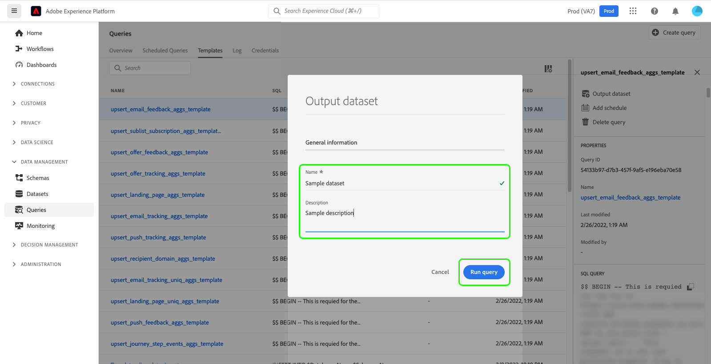

# Gegevenssets genereren op basis van resultaten in [!DNL Query Service]

[!DNL Query Service] staat u toe om vragen te gebruiken om datasets in te produceren [!DNL Data Lake]. Deze datasets kunnen dan als input voor meer vragen of in andere diensten zoals worden gebruikt [!DNL Data Science Workspace], realtime klantprofiel, of [!DNL Analysis Workspace].

## Gegevenssets genereren vanuit de gebruikersinterface van Adobe Experience Platform

<!-- Screenshot for #3 will need to be updated if schedule queries is moved. -->

Ga als volgt te werk om gegevenssets te maken van de gebruikersinterface van Adobe Experience Platform (UI):

1. Maak een query met een verbonden client en valideer de uitvoer. Leren hoe u query&#39;s kunt schrijven met [!DNL Query Editor], lees de [!DNL Query Editor] UI-hulplijn [over het schrijven van vragen](./user-guide.md#writing-queries).

2. In Platform UI, navigeer aan **[!UICONTROL Queries]** gevolgd door de **[!UICONTROL Browse]** en selecteert u de query die u hebt gemaakt. Voor meer informatie over hoe te om vragen te bekijken die voor uw organisatie binnen de UI van het Platform werden gecreeerd en werden bewaard, lees [[!DNL Query Service] overzicht](./overview.md#browse).

3. Selecteer in het deelvenster Query-details de optie **[!UICONTROL Output dataset]**.

   

4. Voer in het dialoogvenster dat wordt weergegeven een naam in voor de gegevensset die is toegevoegd met uw LDAP-id. De naam van de gegevensset hoeft niet uniek of SQL-veilig te zijn. Merk op dat de lijstnaam voor uw dataset zal worden geproduceerd gebaseerd op de datasetnaam u hier creeert.

5. Voer vervolgens een beschrijving in voor uw gegevensset in het dialoogvenster [!UICONTROL Description] veld en selecteer **[!UICONTROL Run query]**.

   

6. Wanneer de query is uitgevoerd, navigeert u naar **[!UICONTROL Datasets]** om de dataset te bekijken u hebt gecreeerd. Meer over leren hoe te om gemeenschappelijke acties uit te voeren wanneer het werken met datasets binnen de Platform UI, zie [UI-gids voor gegevensbestanden](../../catalog/datasets/user-guide.md).

Nadat een dataset wordt gecreeerd, kan het als een andere dataset in worden betreden [!DNL Data Lake] en worden gebruikt voor diverse gebruiksgevallen.

>[!NOTE]
>
>In een levende implementatie, moet u de etiketten van de Governance van Gegevens toepassen nadat de dataset wordt gecreeerd. Meer informatie over hoe te om de etiketten van het gegevensgebruik op datasets toe te passen, zie [Overzicht van labels voor gegevensgebruik](../../data-governance/labels/overview.md).

## Gegevenssets genereren met een vooraf gedefinieerde [!DNL Experience Data Model] schema

Gebruik de SQL syntaxis om een dataset met vooraf bepaald te produceren [!DNL Experience Data Model] (XDM) schema. Voor meer informatie over de syntaxis die door wordt gesteund [!DNL Query Service], lees de [SQL-syntaxishandleiding](../sql/syntax.md#create-table-as-select).

## Uitvoergegevenssets

Datasets die met deze functie worden gemaakt, worden gegenereerd met een ad-hocschema dat overeenkomt met de structuur van de uitvoergegevens zoals gedefinieerd in de SQL-instructie. Sommige downstream diensten vereisen datasets met bepaalde schema&#39;s XDM. Verifieer de gegevens het formatteren vereisten voor de stroomafwaartse diensten alvorens uw vragen te schrijven.

## Volgende stappen

Nadat u dit document hebt gelezen, moet u nu weten hoe u het kunt gebruiken [!DNL Query Service] om datasets van het Platform UI te produceren. Voor meer informatie over hoe te om tot, schrijven, en vragen binnen de Platform UI uit te voeren, zie [[!DNL Query Service] Overzicht van gebruikersinterface](./overview.md).
