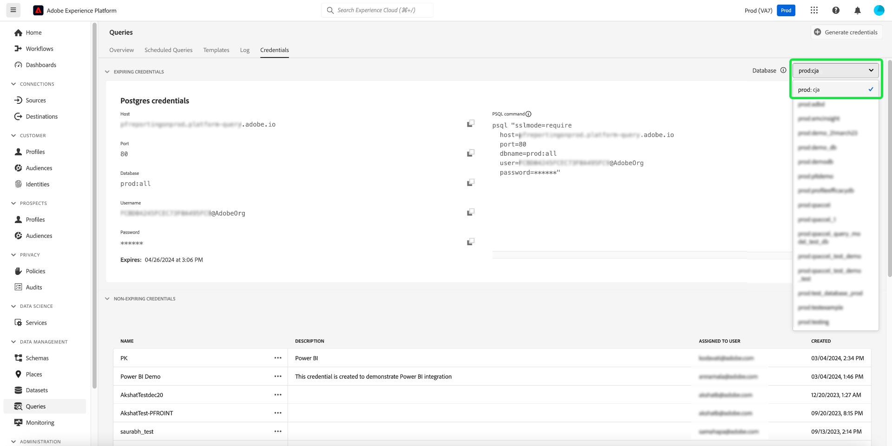

# Referentiegids

Met Adobe Experience Platform Query Service kunt u verbinding maken met externe clients. U kunt met deze externe cliënten verbinden door of het verlopen van geloofsbrieven of niet-vervallende geloofsbrieven te gebruiken.

>[!NOTE]
>
>Het venster Referenties is niet automatisch beschikbaar voor alle gebruikers. Neem contact op met uw Adobe-accountteam om te vragen dat het tabblad [!UICONTROL Credentials] wordt opgenomen in de werkruimte van de Query Service als u dit nodig hebt. Indien gevraagd, is deze verandering organisatie wijd en geleid door het technische team van Adobe. Dit is geen instelling die door gebruikers wordt beheerd.

## Referenties vervallen {#expiring-credentials}

>[!CONTEXTUALHELP]
>id="platform_queryservice_credentials_expiringcredentials"
>title="SSL-modus van client"
>abstract="SSL moet worden ingeschakeld in clients die zijn verbonden met Query Service. Zorg ervoor dat de SSL-modus is ingesteld op &#39;require&#39;."

U kunt verlopen referenties gebruiken om snel een verbinding met een externe client in te stellen.


De sectie **[!UICONTROL Expiring credentials]** bevat de volgende informatie:

- **[!UICONTROL Host]**: De naam van de host waarmee de client verbinding moet maken. Dit neemt de naam van uw organisatie zoals die in het hoogste lint van Experience Platform UI wordt gezien op.
- **[!UICONTROL Port]**: Het poortnummer van de host waarmee verbinding moet worden gemaakt.
- **[!UICONTROL Database]**: De naam van de database waarmee een client verbinding moet maken.
- **[!UICONTROL Username]**: De gebruikersnaam die wordt gebruikt om verbinding te maken met Query Service.
- **[!UICONTROL Password]**: Het wachtwoord dat wordt gebruikt om verbinding te maken met Query Service. De wachtwoorden in UI zijn gehakt voor veiligheid. Selecteer het exemplaarpictogram ( ) om uw volledige, niet-gehashte gegevens naar het klembord te kopiëren.
- **[!UICONTROL PSQL command]**: Een bevel dat automatisch alle relevante informatie voor u om met de Dienst van de Vraag gebruikend PSQL op de bevellijn heeft opgenomen te verbinden.
- **[!UICONTROL Expires]**: De verloopdatum en -tijd voor de verloopgegevens. De standaard geldigheidstermijn van het token is 24 uur, maar deze kan worden gewijzigd in de geavanceerde instellingen van de Admin Console.

>[!TIP]
>
>Om het zittingsleven voor uw het verlopen geloofsbrieven verbinding aan de Dienst van de Vraag te veranderen, navigeer aan [ Admin Console ](https://adminconsole.adobe.com/) en selecteer het volgende op het schermopties: **Montages** > **Privacy en Veiligheid** > **Montages van de Authentificatie** > **Geavanceerde montages** > **Max zittingsleven**.
>
>
>
>Zie de documentatie van de Hulp van Adobe voor meer informatie over de [ Geavanceerde montages ](https://helpx.adobe.com/enterprise/using/authentication-settings.html#advanced-settings) die door Admin console worden aangeboden.

### Verbinding maken met Customer Journey Analytics-gegevens binnen querysessies {#connect-to-customer-journey-analytics}

Gebruik de uitbreiding van Customer Journey Analytics BI met Power BI of Tableau om tot uw Customer Journey Analytics [ gegevensmeningen ](https://experienceleague.adobe.com/en/docs/analytics-platform/using/cja-dataviews/data-views) met SQL toegang te hebben. Door de Dienst van de Vraag met de uitbreiding te integreren BI, kunt u tot uw gegevensmeningen direct binnen de zittingen van de Dienst van de Vraag toegang hebben. Deze integratie stroomlijnt functionaliteit voor hulpmiddelen BI die de Dienst van de Vraag als hun interface PostgreSQL gebruiken. Deze functionaliteit elimineert de behoefte om gegevensmeningen in hulpmiddelen van BI te dupliceren, verzekert verenigbare rapportering over platforms, en vereenvoudigt de integratie van de gegevens van Customer Journey Analytics met andere bronnen in platforms van BI.

Zie de documentatie leren hoe te om de Dienst van de Vraag aan een verscheidenheid van de toepassingen van de Desktopcliënt [ zoals ](../clients/overview.md) Power BI [ of ](../clients/power-bi.md) Tableau [ te verbinden](../clients/tableau.md)

>[!IMPORTANT]
>
>U hebt een Customer Journey Analytics-werkruimteproject en een gegevensweergave nodig om deze functionaliteit te kunnen gebruiken.

Als u uw Customer Journey Analytics-gegevens in Power BI of Tableau wilt openen, selecteert u het vervolgkeuzemenu [!UICONTROL Database] en selecteert u `prod:cja` in de beschikbare opties. Kopieer vervolgens de [!DNL Postgres] verificatieparameters (host, poort, database, gebruikersnaam en andere) voor gebruik in uw Power BI- of tableau-configuratie.



>[!NOTE]
>
>Wanneer u Power BI of Tableau aansluit op Customer Journey Analytics, wordt de machtiging &#39;Gelijktijdige sessies&#39; van de Query Service gebruikt. Als extra sessies en query&#39;s vereist zijn, kan een extra add-on voor het pakket voor gebruikers van ad-hocquery&#39;s worden aangeschaft om vijf extra gelijktijdige sessies en één extra gelijktijdige query te verkrijgen.

U kunt uw gegevens van Customer Journey Analytics tot direct van de Redacteur van de Vraag of CLI van Postgres toegang hebben. U doet dit door naar de `cja` -database te verwijzen wanneer u uw query schrijft. Zie de redacteur van de Vraag [ vraag auteursgids ](./user-guide.md#query-authoring) voor meer informatie over hoe te schrijven, uit te voeren en, vragen te bewaren.

Zie de [ BI uitbreidingsgids ](https://experienceleague.adobe.com/en/docs/analytics-platform/using/cja-dataviews/bi-extension) voor volledige instructies bij de toegang tot van uw de gegevensmeningen van Customer Journey Analytics met SQL.

## Niet-verlopen referenties {#non-expiring-credentials}

>[!CONTEXTUALHELP]
>id="platform_queryservice_credentials_migratenonexpiringcredentials"
>title="Migreren naar OAuth Server-to-Server referentie"
>abstract="Deze migratie is vereist omdat JWT-referenties na 30 juni 2025 niet meer werken. Het duurt ongeveer 30 tot 40 seconden en kan niet worden geannuleerd als het programma eenmaal is gestart. Alle bestaande banen en integratie zullen na migratie met OAuth blijven werken. U kunt dit scherm verlaten en terugkeren om de status te controleren."

U kunt niet-verlopen geloofsbrieven gebruiken aan opstelling een duurdere verbinding aan een externe cliënt.

>[!NOTE]
>
>Niet-vervallende referenties hebben de volgende beperkingen:
>
>- Gebruikers moeten zich aanmelden met hun gebruikersnaam en wachtwoord in de notatie `{technicalAccountId}:{credential}` . Meer informatie kan in [ worden gevonden produceert geloofsbrieven ](#generate-credentials) sectie.
>- Standaard krijgen niet-verlopen referenties machtigingen om alleen `SELECT` query&#39;s uit te voeren. Als u `CTAS` - of `ITAS` -query&#39;s wilt uitvoeren, voegt u de machtigingen Gegevensset beheren en Schema&#39;s beheren handmatig toe aan de rol die is gekoppeld aan de niet-vervallende referentie. De &quot;Manage Schemas&quot;toestemming kan onder de &quot;Modeling van Gegevens&quot;sectie worden gevonden, en de &quot;Manage toestemmingen van Datasets&quot;wordt gevestigd onder de &quot;sectie van het Beheer van Gegevens&quot;van [ Adobe Developer Console ](<https://developer.adobe.com/console/>).
>- Externe clients kunnen anders presteren dan u had verwacht bij het weergeven van queryobjecten. Sommige clients van derden, zoals [!DNL DB Visualizer] , geven de weergavenaam bijvoorbeeld niet weer in het linkerdeelvenster. De weergavenaam is echter toegankelijk als deze wordt aangeroepen binnen een query `SELECT` . Op dezelfde manier geeft [!DNL PowerUI] mogelijk geen lijst weer van de tijdelijke weergaven die met SQL zijn gemaakt voor selectie in het maken van dashboard.

### Vereisten

Voordat u niet-vervallende gegevens kunt genereren, moet u de volgende stappen in Adobe Admin Console uitvoeren:

1. Logboek in [ Adobe Admin Console ](https://adminconsole.adobe.com/) en selecteert de relevante organisatie van de hoogste navigatiebar.
2. [Selecteer een productprofiel.](../../access-control/ui/browse.md)
3. [ vormt zowel de **Sandboxes** als **de Toestemmingen van de Integratie van de Dienst van de Vraag** ](../../access-control/ui/permissions.md) voor het productprofiel.
4. [ voeg een nieuwe gebruiker aan een productprofiel ](../../access-control/ui/users.md) toe zodat worden zij verleend zijn gevormde toestemmingen.
5. [ voeg de gebruiker als admin van het productprofiel ](https://helpx.adobe.com/enterprise/using/manage-product-profiles.html) toe om een rekeningsverwezenlijking voor om het even welk actief productprofiel toe te staan.
6. [ voeg de gebruiker als ontwikkelaar van het productprofiel ](https://helpx.adobe.com/nl/enterprise/using/manage-developers.html) toe om een integratie tot stand te brengen.

Na deze stappen, worden de vereiste toestemmingen gevormd in [ Adobe Developer Console ](https://developer.adobe.com/console/) voor u om Server-aan-Server geloofsbrieven te produceren OAuth en de het verlopen of niet-verlopen geloofsbrieven te gebruiken.

Voor gedetailleerde informatie bij het toewijzen van toestemmingen, zie de [ documentatie van de toegangscontrole ](../../access-control/home.md).

### Referenties genereren {#generate-credentials}

Als u een set niet-vervallende gegevens wilt maken, gaat u terug naar de gebruikersinterface van Experience Platform en selecteert u **[!UICONTROL Queries]** in de linkernavigatie om de werkruimte van [!UICONTROL Queries] te openen. Selecteer vervolgens de tab **[!UICONTROL Credentials]** gevolgd door **[!UICONTROL Generate credentials]** .


Er wordt een dialoogvenster weergegeven waarin u referenties kunt genereren. Als u niet-vervallende gegevens wilt maken, moet u de volgende gegevens opgeven:

- **[!UICONTROL Name]**: De naam van de referenties die u genereert.
- **[!UICONTROL Description]**: (Optioneel) Een beschrijving van de referenties die u genereert.
- **[!UICONTROL Assigned to]**: De gebruiker waaraan de referenties worden toegewezen. Deze waarde moet het e-mailadres zijn van de gebruiker die de referenties maakt.
- **[!UICONTROL Password]** (Optioneel) Een optioneel wachtwoord voor uw referenties. Als het wachtwoord niet is ingesteld, genereert Adobe automatisch een wachtwoord voor u.

Nadat u alle vereiste gegevens hebt opgegeven, selecteert u **[!UICONTROL Generate credentials]** om uw referenties te genereren.


>[!IMPORTANT]
>
>Als **[!UICONTROL Generate credentials]** is geselecteerd, wordt een JSON-configuratiebestand gedownload naar uw lokale computer. Aangezien Adobe **&#x200B;**&#x200B;niet de geproduceerde geloofsbrieven registreert, moet u het gedownloade dossier veilig opslaan en een verslag van de referentie houden.
>
>Bovendien, als de geloofsbrieven niet gedurende 90 dagen worden gebruikt, zullen de geloofsbrieven worden verklaard.

Het configuratie-JSON-bestand bevat informatie zoals de naam van de technische account, de id van de technische account en de referentie. Deze wordt in het volgende formaat verstrekt.

```json
{"technicalAccountName":"9F0A21EE-B8F3-4165-9871-846D3C8BC49E@TECHACCT.ADOBE.COM","credential":"3d184fa9e0b94f33a7781905c05203ee","technicalAccountId":"4F2611B8613AA3670A495E55"}
```

Nadat u de gegenereerde gegevens hebt opgeslagen, selecteert u **[!UICONTROL Close]** . U kunt nu een lijst zien van al uw niet-vervallende geloofsbrieven.


U kunt uw niet-vervallende gegevens bewerken of verwijderen. Om een niet-verkennende referentie uit te geven, selecteer het potloodpictogram (). Om een niet-expirerende referentie te schrappen, selecteer het schrappingspictogram ().

Wanneer u een niet-verkennende referentie bewerkt, wordt een modaal veld weergegeven. U kunt de volgende gegevens opgeven om bij te werken:

- **[!UICONTROL Name]**: De naam van de referenties die u genereert.
- **[!UICONTROL Description]**: (Optioneel) Een beschrijving van de referenties die u genereert.
- **[!UICONTROL Assigned to]**: De gebruiker waaraan de referenties worden toegewezen. Deze waarde moet het e-mailadres zijn van de gebruiker die de referenties maakt.


Nadat u alle vereiste gegevens hebt opgegeven, selecteert u **[!UICONTROL Update account]** om de update van uw referenties te voltooien.

### Crediteringen migreren naar OAuth {#migrate-credentials}

Als u niet-vervallende geloofsbrieven van JWT gebruikt, moet u elk naar Server-aan-Server OAuth vóór 30 Juni, 2025 migreren om de dienstverstoring te vermijden.

>[!IMPORTANT]
>
>JWT geloofsbrieven zullen ophouden werkend na 30 juni 2025. U moet deze migratie handmatig voltooien om de autorisatie te behouden.

Leren hoe te om beïnvloede geloofsbrieven te identificeren en de migratie te voltooien, zie [ migreren van JWT aan de Server-aan-Server geloofsgids van OAuth ](./migrate-jwt-to-oauth.md).

Voor gemeenschappelijke vragen, verwijs naar [ migratie FAQ ](./migrate-jwt-to-oauth.md#faq).

## Referenties gebruiken om verbinding te maken met externe clients {#use-credential-to-connect}

U kunt of de het verlopen of niet-verlopen geloofsbrieven gebruiken om met externe cliënten, zoals de Studio van Gegevens Aqua, Teller, of Power BI te verbinden. De invoermethode voor deze referenties is afhankelijk van de externe client. Raadpleeg de documentatie van de externe client voor specifieke instructies over het gebruik van deze referenties.

De afbeelding geeft de locatie aan van elke parameter die in de gebruikersinterface wordt gevonden, behalve het wachtwoord van de niet-vervallende gegevens. Terwijl niet-vervallende geloofsbrieven door hun JSON configuratiedossiers worden verstrekt, kunt u uw het verlopen geloofsbrieven onder het **Credentials** lusje in UI bekijken.


In de onderstaande tabel worden de parameters beschreven die doorgaans vereist zijn om verbinding te maken met externe clients.

>[!NOTE]
>
>Wanneer u verbinding maakt met een host die niet-vervallende gegevens gebruikt, moet u nog steeds alle parameters gebruiken die in de sectie [!UICONTROL EXPIRING CREDENTIALS] worden vermeld, behalve het wachtwoord en de gebruikersnaam.
>&#x200B;>Voor de notatie voor het invoeren van uw gebruikersnaam en wachtwoord worden door dubbele punten gescheiden waarden gebruikt, zoals in dit voorbeeld `username:{your_username}` en `password:{password_string}` wordt getoond.

| Parameter | Beschrijving | Voorbeeld |
|---|---|---|
| **Server/Gastheer** | De naam van de server/host waarmee u verbinding maakt. <ul><li>Deze waarde wordt gebruikt voor zowel verlopen als niet-verlopen referenties en heeft de vorm van `server.adobe.io` . De waarde staat onder **[!UICONTROL Host]** in de [!UICONTROL EXPIRING CREDENTIALS] -sectie.</ul></li> | `acme.platform.adobe.io` |
| **Haven** | De poort voor de server/host waarmee u verbinding maakt. <ul><li>Deze waarde wordt gebruikt voor verlopen en niet-vervallende gegevens en staat onder **[!UICONTROL Port]** in de sectie [!UICONTROL EXPIRING CREDENTIALS] .</ul></li> | `80` |
| **Database** | De database waarmee u verbinding maakt. <ul><li>Deze waarde wordt gebruikt voor verlopen en niet-vervallende gegevens en wordt gevonden onder **[!UICONTROL Database]** in de sectie [!UICONTROL EXPIRING CREDENTIALS] . </ul></li> | `prod:all` |
| **Gebruikersnaam** | De gebruikersnaam voor de gebruiker die verbinding maakt met de externe client. <ul><li>Deze waarde wordt gebruikt voor zowel het verlopen van geloofsbrieven als niet-vervallende geloofsbrieven. De notatie heeft de vorm van een alfanumerieke tekenreeks voor `@AdobeOrg` . Deze waarde staat onder **[!UICONTROL Username]** .</li></ul> | `ECBB80245ECFC73E8A095EC9@AdobeOrg` |
| **Wachtwoord** | Het wachtwoord voor de gebruiker die verbinding maakt met de externe client. <ul><li>Als u verloopt, vindt u dit onder **[!UICONTROL Password]** in de sectie [!UICONTROL EXPIRING CREDENTIALS] .</li><li>Als u niet-vervallende geloofsbrieven gebruikt, is deze waarde de samengevoegde argumenten van technicalAccountID en de referentie die uit het configuratieJSON dossier wordt genomen. De wachtwoordwaarde heeft de notatie: `{technicalAccountId}:{credential}`.</li></ul> | <ul><li>Een vervallend referentie-wachtwoord is meer dan duizend alfanumerieke tekens. Er wordt geen voorbeeld gegeven.</li><li>Een niet-verkennend credentiewachtwoord is als volgt:<br>`4F2611B8613DK3670V495N55:3d182fa9e0b54f33a7881305c06203ee`</li></ul> |

{style="table-layout:auto"}

## Volgende stappen

Nu u begrijpt hoe zowel het verlopen als niet-het verlopen geloofsbrieven werken, kunt u deze geloofsbrieven gebruiken om met externe cliënten te verbinden. Voor meer informatie gedetailleerde informatie over externe cliënten, te lezen gelieve [ cliënten aan de gids van de Dienst van de Vraag ](../clients/overview.md) verbinden.
