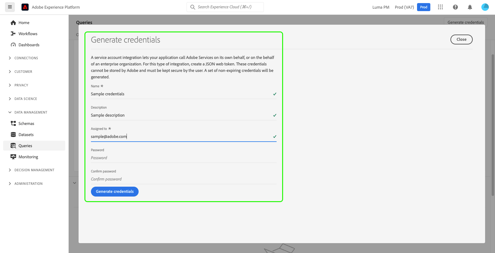

# Referentiegids

Met Adobe Experience Platform Query Service kunt u verbinding maken met externe clients. U kunt met deze externe cliënten verbinden door of het verlopen van geloofsbrieven of niet-vervallende geloofsbrieven te gebruiken.

## Referenties vervallen

U kunt verlopen referenties gebruiken om snel een verbinding met een externe client in te stellen.


De **[!UICONTROL Expiring credentials]** Deze sectie bevat de volgende informatie:

- **[!UICONTROL Host]**: De naam van de host waarmee u verbinding wilt maken. Voor het verbinden met de Dienst van de Vraag, zal dit de naam van de IMS Organisatie omvatten u momenteel gebruikt.
- **[!UICONTROL Port]**: Het poortnummer van de host waarmee u verbinding wilt maken.
- **[!UICONTROL Database]**: De naam van de database waarmee u verbinding wilt maken.
- **[!UICONTROL Username]**: De gebruikersnaam die u gebruikt om verbinding te maken met Query Service.
- **[!UICONTROL Password]**: Het wachtwoord dat u zult gebruiken om met de Dienst van de Vraag te verbinden.
- **[!UICONTROL PSQL command]**: Een bevel dat automatisch alle relevante informatie voor u heeft opgenomen om met de Dienst van de Vraag te verbinden gebruikend PSQL op de bevellijn.
- **[!UICONTROL Expires]**: De vervaldatum voor de vervallende geloofsbrieven. De referenties verlopen 24 uur nadat ze zijn gegenereerd.

## Niet-verlopen referenties {#non-expiring-credentials}

U kunt niet-verlopen geloofsbrieven gebruiken aan opstelling een duurdere verbinding aan een externe cliënt.

### Vereisten

Voordat u niet-vervallende gegevens kunt genereren, moet u de volgende stappen in Adobe Admin Console uitvoeren:

1. Aanmelden [Adobe Admin Console](https://adminconsole.adobe.com/) en selecteer de relevante organisatie in de bovenste navigatiebalk.
2. [Selecteer een productprofiel.](../../access-control/ui/browse.md)
3. [Vorm beide **Sandboxen** en **De integratie van Query Service beheren** machtigingen](../../access-control/ui/permissions.md) voor het productprofiel.
4. [Een nieuwe gebruiker toevoegen aan een productprofiel](../../access-control/ui/users.md) zodat wordt hun gevormd toestemmingen verleend.
5. [De gebruiker toevoegen als beheerder van een productprofiel](https://helpx.adobe.com/enterprise/using/manage-product-profiles.html) om een account te maken voor een actief productprofiel.
6. [De gebruiker toevoegen als ontwikkelaar van een productprofiel](https://helpx.adobe.com/enterprise/using/manage-developers.html) om een integratie tot stand te brengen.

Voor meer informatie over het toewijzen van machtigingen leest u de documentatie op [toegangsbeheer](../../access-control/home.md).

Alle vereiste machtigingen zijn nu geconfigureerd in Adobe Developer Console, zodat de gebruiker de functie voor het verlopen van referenties kan gebruiken.

### Referenties genereren

Als u een set niet-vervallende gegevens wilt maken, gaat u terug naar de gebruikersinterface van het Platform en selecteert u **[!UICONTROL Queries]** van de linkernavigatie om tot [!UICONTROL Queries] werkruimte. Selecteer vervolgens de **[!UICONTROL Credentials]** tab gevolgd door **[!UICONTROL Generate credentials]**.


Er wordt een dialoogvenster weergegeven waarin u referenties kunt genereren. Als u niet-vervallende gegevens wilt maken, moet u de volgende gegevens opgeven:

- **[!UICONTROL Name]**: De naam van de referenties die u genereert.
- **[!UICONTROL Description]**: (Optioneel) Een beschrijving van de referenties die u genereert.
- **[!UICONTROL Assigned to]**: De gebruiker waaraan de geloofsbrieven zullen worden toegewezen. Deze waarde moet het e-mailadres zijn van de gebruiker die de referenties maakt.
- **[!UICONTROL Password]** (Optioneel) Een optioneel wachtwoord voor uw referenties. Als het wachtwoord niet is ingesteld, genereert Adobe automatisch een wachtwoord voor u.

Als u alle vereiste gegevens hebt opgegeven, selecteert u **[!UICONTROL Generate credentials]** om uw referenties te genereren.



>[!IMPORTANT]
>
>Wanneer **[!UICONTROL Generate credentials]** is geselecteerd, wordt een JSON-configuratiebestand gedownload naar uw lokale computer. Aangezien Adobe **niet** registreert de geproduceerde geloofsbrieven, moet u het gedownloade dossier veilig opslaan en een verslag van de referentie houden.
>
>Bovendien, als de geloofsbrieven niet gedurende 90 dagen worden gebruikt, zullen de geloofsbrieven worden verklaard.

Het configuratie-JSON-bestand bevat informatie zoals de naam van de technische account, de id van de technische account en de referentie. Deze wordt in het volgende formaat verstrekt.

```json
{"technicalAccountName":"9F0A21EE-B8F3-4165-9871-846D3C8BC49E@TECHACCT.ADOBE.COM","credential":"3d184fa9e0b94f33a7781905c05203ee","technicalAccountId":"4F2611B8613AA3670A495E55"}
```

Nadat u de gegenereerde gegevens hebt opgeslagen, selecteert u **[!UICONTROL Close]**. U kunt nu een lijst zien van al uw niet-vervallende geloofsbrieven.


U kunt uw niet-vervallende gegevens bewerken of verwijderen. Als u een niet-vervallende referentie wilt bewerken, selecteert u het potloodpictogram (). Als u een niet-vervallende referentie wilt verwijderen, selecteert u het verwijderingspictogram ().

Wanneer u een niet-verkennende referentie bewerkt, wordt een modaal veld weergegeven. U kunt de volgende gegevens opgeven om bij te werken:

- **[!UICONTROL Name]**: De naam van de referenties die u genereert.
- **[!UICONTROL Description]**: (Optioneel) Een beschrijving van de referenties die u genereert.
- **[!UICONTROL Assigned to]**: De gebruiker waaraan de geloofsbrieven zullen worden toegewezen. Deze waarde moet het e-mailadres zijn van de gebruiker die de referenties maakt.


Als u alle vereiste gegevens hebt opgegeven, selecteert u **[!UICONTROL Update account]** om de update van uw referenties te voltooien.

## Referenties gebruiken om verbinding te maken met externe clients

U kunt of de het verlopen of niet-verlopen geloofsbrieven gebruiken om met externe cliënten, zoals de Studio van Gegevens Aqua, Leider, of Power BI te verbinden. De invoermethode voor deze referenties is afhankelijk van de externe client. Raadpleeg de documentatie van de externe client voor specifieke instructies over het gebruik van deze referenties.

De afbeelding geeft de locatie aan van elke parameter die in de gebruikersinterface wordt gevonden, behalve het wachtwoord van de niet-vervallende gegevens. Terwijl niet-vervallende geloofsbrieven door hun JSON configuratiedossiers worden verstrekt, kunt u uw het verlopen geloofsbrieven onder bekijken **Credentials** in de gebruikersinterface.


In de onderstaande tabel worden de parameters beschreven die doorgaans vereist zijn om verbinding te maken met externe clients.

>[!NOTE]
>
>Wanneer het verbinden met een gastheer die niet-vervallende geloofsbrieven gebruikt, is het nog noodzakelijk om alle parameters te gebruiken die in [!UICONTROL EXPIRING CREDENTIALS] , behalve het wachtwoord en de gebruikersnaam.
>De notatie voor het invoeren van uw gebruikersnaam en wachtwoord gebruikt door dubbele punten gescheiden waarden, zoals in dit voorbeeld wordt getoond `username:{your_username}` en `password:{password_string}`.

| Parameter | Beschrijving |
|---|---|
| **Server/host** | De naam van de server/host waarmee u verbinding maakt. <ul><li>Deze waarde wordt gebruikt voor zowel het verlopen van geloofsbrieven als niet-vervallende geloofsbrieven en neemt de vorm van aan `server.adobe.io`. De waarde is gevonden onder **[!UICONTROL Host]** in de [!UICONTROL EXPIRING CREDENTIALS] sectie.</ul></li> |
| **Poort** | De poort voor de server/host waarmee u verbinding maakt. <ul><li>Deze waarde wordt gebruikt voor zowel het verlopen van geloofsbrieven als niet-het verlopen geloofsbrieven en onder gevonden **[!UICONTROL Port]** in de [!UICONTROL EXPIRING CREDENTIALS] sectie. Een voorbeeldwaarde voor de haven zou zijn `80`.</ul></li> |
| **Database** | De database waarmee u verbinding maakt. <ul><li>Deze waarde wordt gebruikt voor zowel het verlopen van geloofsbrieven als niet-het verlopen geloofsbrieven en onder gevonden **[!UICONTROL Database]** in de [!UICONTROL EXPIRING CREDENTIALS] sectie. Een voorbeeldwaarde voor de database zou `prod:all`.</ul></li> |
| **Gebruikersnaam** | De gebruikersnaam voor de gebruiker die verbinding maakt met de externe client. <ul><li>Deze waarde wordt gebruikt voor zowel het verlopen van geloofsbrieven als niet-vervallende geloofsbrieven. De notatie heeft de vorm van een alfanumerieke tekenreeks voor `@AdobeOrg`. Deze waarde is te vinden onder **[!UICONTROL Username]**.</li></ul> |
| **Wachtwoord** | Het wachtwoord voor de gebruiker die verbinding maakt met de externe client. <ul><li>Als u het verlopen geloofsbrieven gebruikt, kan dit onder worden gevonden **[!UICONTROL Password]** binnen de [!UICONTROL EXPIRING CREDENTIALS] sectie.</li><li>Als u niet-vervallende geloofsbrieven gebruikt, is deze waarde de samengevoegde argumenten van technicalAccountID en de referentie die uit het configuratieJSON dossier wordt genomen. De wachtwoordwaarde heeft de vorm: `{technicalAccountId}:{credential}`.</li></ul> |

## Volgende stappen

Nu u begrijpt hoe zowel het verlopen als niet-het verlopen geloofsbrieven werken, kunt u deze geloofsbrieven gebruiken om met externe cliënten te verbinden. Lees voor meer informatie over externe clients de [Verbind cliënten met de gids van de Dienst van de Vraag](../clients/overview.md).
