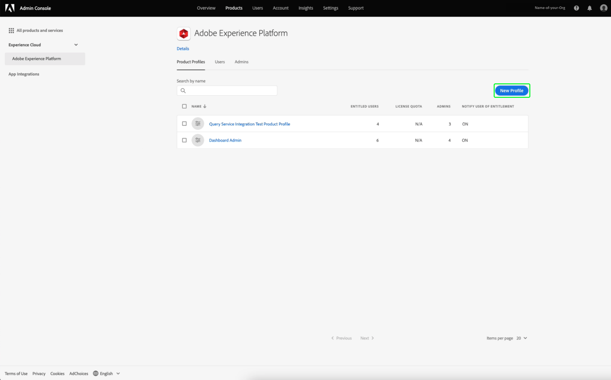
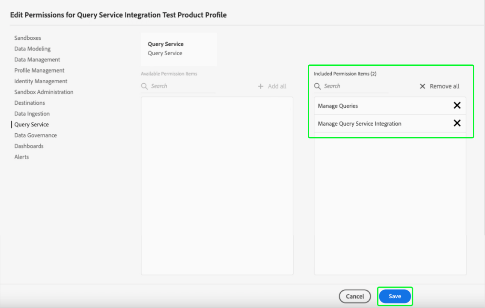

# Referentiegids

Met Adobe Experience Platform Query Service kunt u verbinding maken met externe clients. U kunt met deze externe cliënten verbinden door of het verlopen van geloofsbrieven of niet-vervallende geloofsbrieven te gebruiken.

## Referenties vervallen

U kunt verlopen referenties gebruiken om snel een verbinding met een externe client in te stellen.


De sectie **[!UICONTROL Expiring credentials]** bevat de volgende informatie:

- **[!UICONTROL Host]**: De naam van de host waarmee u verbinding wilt maken. Voor het verbinden met de Dienst van de Vraag, zal dit de naam van de IMS Organisatie omvatten u momenteel gebruikt.
- **[!UICONTROL Port]**: Het poortnummer van de host waarmee u verbinding wilt maken.
- **[!UICONTROL Database]**: De naam van de database waarmee u verbinding wilt maken.
- **[!UICONTROL Username]**: De gebruikersnaam die u gebruikt om verbinding te maken met Query Service.
- **[!UICONTROL Password]**: Het wachtwoord dat u zult gebruiken om met de Dienst van de Vraag te verbinden.
- **[!UICONTROL PSQL command]**: Een bevel dat automatisch alle relevante informatie voor u heeft opgenomen om met de Dienst van de Vraag te verbinden gebruikend PSQL op de bevellijn.
- **[!UICONTROL Expires]**: De vervaldatum voor de vervallende geloofsbrieven. De referenties verlopen 24 uur nadat ze zijn gegenereerd.

## Niet-verlopen referenties

U kunt niet-verlopen geloofsbrieven gebruiken aan opstelling een duurdere verbinding aan een externe cliënt.

Voordat u niet-vervallende referenties kunt maken, moet u zowel de **Sandboxen** als **Query Service Integration**-machtigingen voor uw organisatie in de Adobe Admin Console configureren.

Meld u aan bij [Adobe Admin Console](https://adminconsole.adobe.com/) en selecteer de relevante organisatie in de bovenste navigatiebalk.

Selecteer **Adobe Experience Platform** in de sectie [!UICONTROL Products and services] van [!UICONTROL Overview].


De pagina Adobe Experience Platform Details wordt weergegeven. Maak vervolgens een nieuw profiel. Selecteer [!UICONTROL **Nieuw profiel**].



Er wordt een dialoogvenster voor het maken van profielen weergegeven. Voer een beschrijvende naam in voor het nieuwe profiel en selecteer [!UICONTROL **Opslaan**]. De pagina [!UICONTROL Settings] voor het nieuwe profiel wordt weergegeven. Selecteer het tabblad [!UICONTROL **Machtigingen**] in de beschikbare opties.

### Machtigingen voor Query-service inschakelen

Om ervoor te zorgen dat de correcte toestemmingen van de Dienst van de Vraag voor uw Org worden toegelaten, vind en selecteer [!UICONTROL **de categorie van de Vraag Service**] van de lijst.


De werkruimte [!UICONTROL Edit Permissions] voor de Dienst van de Vraag verschijnt. Selecteer het plusteken (**+**) voor [!UICONTROL **Query&#39;s beheren**], en [!UICONTROL **De Integratie van de Dienst van de Vraag beheren**] om hen aan [!UICONTROL Included Permission Items] kolom toe te voegen. Selecteer vervolgens [!UICONTROL **Opslaan**] om uw wijzigingen te bevestigen.



Hiermee gaat u terug naar het tabblad Instellingen > Machtigingen.

### Sandbox-machtigingen inschakelen

Zoek en selecteer de categorie [!UICONTROL **Sandboxen**] in de lijst om ervoor te zorgen dat de juiste sandbox is geselecteerd voor uw organisatie.


De werkruimte Sandboxen wordt weergegeven. Zoek in de [!UICONTROL Available Permission Items] de relevante sandbox, in deze afbeelding is het de Prod-sandbox. Selecteer het plusteken (**+**) om het aan [!UICONTROL Included Permission Items] toe te voegen. Selecteer vervolgens [!UICONTROL **Opslaan**] om uw wijzigingen te bevestigen.


Hiermee gaat u terug naar het tabblad Instellingen > Machtigingen.

Er zijn nog drie stappen vereist om een gebruiker toegang te geven tot de accountfunctie die niet vervalt.

- Voeg een nieuwe gebruiker toe om de pas gecreëerde toestemmingen aan te verlenen. Selecteer de tab [!UICONTROL **Users**], gevolgd door [!UICONTROL **Gebruiker toevoegen**].


Het dialoogvenster Gebruiker maken wordt weergegeven. Voer een naam en een e-mailbericht in voor de nieuwe gebruiker en selecteer [!UICONTROL **Opslaan**].

- De gebruiker moet vervolgens als beheerder worden toegevoegd om een account te kunnen maken voor elk actief productprofiel. De nieuwe gebruiker toevoegen als beheerder. Selecteer de tab [!UICONTROL **Admins**], gevolgd door [!UICONTROL **Admins**] toevoegen.


Het dialoogvenster Admin toevoegen wordt weergegeven. Voer de details van de nieuwe beheerder in de tekstvelden in en selecteer [!UICONTROL **Opslaan**].

- De gebruiker moet dan als ontwikkelaar voor een integratie worden toegevoegd om worden gecreeerd. Selecteer het tabblad **Ontwikkelaars**, gevolgd door **Developer** toevoegen.


Het dialoogvenster Ontwikkelaar toevoegen wordt weergegeven. Voer de details van de nieuwe ontwikkelaar in de tekstvelden in en selecteer **Opslaan**.

Lees de documentatie op [Toegangsbeheer](../../access-control/home.md) voor meer informatie over het toewijzen van machtigingen.

Alle vereiste toestemmingen worden nu gevormd in de console van de Ontwikkelaar van Adobe voor de gebruiker om de het verlopen geloofsbrieven te gebruiken eigenschap.

Als u een set niet-vervallende gegevens wilt maken, selecteert u **[!UICONTROL Generate credentials]** in de werkruimte Credentials.


Het modaal formulier voor het genereren van referenties wordt weergegeven. Als u niet-vervallende gegevens wilt maken, moet u de volgende gegevens opgeven:

- **[!UICONTROL Name]**: De naam van de referenties die u genereert.
- **[!UICONTROL Description]**: (Optioneel) Een beschrijving van de referenties die u genereert.
- **[!UICONTROL Assigned to]**: De gebruiker aan wie de geloofsbrieven zullen worden toegewezen. Deze waarde moet het e-mailadres zijn van de gebruiker die de referenties maakt.
- **[!UICONTROL Password]** (Optioneel) Een optioneel wachtwoord voor uw referenties. Als het wachtwoord niet is ingesteld, genereert Adobe automatisch een wachtwoord voor u.

Nadat u alle vereiste gegevens hebt opgegeven, selecteert u **[!UICONTROL Generate credentials]** om uw referenties te genereren.


>[!IMPORTANT]
>
>Wanneer de knop **[!UICONTROL Generate credentials]** is geselecteerd, wordt een JSON-configuratiebestand gedownload naar uw lokale computer. Aangezien Adobe **not** de gegenereerde referentie opneemt, moet u **must** het gedownloade bestand veilig opslaan en een overzicht van de referentie bijhouden.
>
>Bovendien, als de geloofsbrieven niet voor 90 dagen worden gebruikt, zullen de geloofsbrieven worden gesnoeid.

Het configuratie-JSON-bestand bevat informatie zoals de naam van de technische account, de id van de technische account en de referentie. Deze wordt in het volgende formaat verstrekt.

```json
{"technicalAccountName":"9F0A21EE-B8F3-4165-9871-846D3C8BC49E@TECHACCT.ADOBE.COM","credential":"3d184fa9e0b94f33a7781905c05203ee","technicalAccountId":"4F2611B8613AA3670A495E55"}
```

Nu u uw geproduceerde geloofsbrieven hebt bewaard, selecteer **[!UICONTROL Close]**. U kunt nu een lijst zien van al uw niet-vervallende geloofsbrieven.


U kunt uw niet-vervallende gegevens bewerken of verwijderen. Als u een referentie wilt bewerken die niet vervalt, selecteert u het potloodpictogram (). Als u een niet-vervallende referentie wilt verwijderen, selecteert u het verwijderingspictogram ().

Wanneer u een niet-verkennende referentie bewerkt, wordt een modaal veld weergegeven. U kunt de volgende gegevens opgeven om bij te werken:

- **[!UICONTROL Name]**: De naam van de referenties die u genereert.
- **[!UICONTROL Description]**: (Optioneel) Een beschrijving van de referenties die u genereert.
- **[!UICONTROL Assigned to]**: De gebruiker aan wie de geloofsbrieven zullen worden toegewezen. Deze waarde moet het e-mailadres zijn van de gebruiker die de referenties maakt.


Nadat u alle vereiste gegevens hebt opgegeven, selecteert u **[!UICONTROL Update account]** om de update naar uw referenties te voltooien.

## Referenties gebruiken om verbinding te maken met externe clients

U kunt of de het verlopen of niet-verlopen geloofsbrieven gebruiken om met externe cliënten, zoals de Studio van Gegevens Aqua, Leider, of Power BI te verbinden.

De onderstaande tabel bevat een lijst met parameters en een beschrijving van deze parameters, die doorgaans vereist zijn om verbinding te maken met externe clients.

>[!NOTE]
>
>Wanneer het verbinden met een gastheer die niet-vervallende geloofsbrieven gebruikt, is het nog noodzakelijk om alle parameters te gebruiken die in [!UICONTROL EXPIRING CREDENTIALS] sectie behalve het wachtwoord worden vermeld.

| Parameter | Beschrijving |
|---|---|
| **Server/host** | De naam van de server/host waarmee u verbinding maakt. Deze waarde heeft de vorm van `server.adobe.io` en is te vinden onder **[!UICONTROL Host]**. |
| **Poort** | De poort voor de server/host waarmee u verbinding maakt. Deze waarde is te vinden onder **[!UICONTROL Port]**. Een voorbeeldwaarde voor de poort zou `80` zijn. |
| **Database** | De database waarmee u verbinding maakt. Deze waarde is te vinden onder **[!UICONTROL Database]**. Een voorbeeldwaarde voor het gegevensbestand zou `prod:all` zijn. |
| **Gebruikersnaam** | De gebruikersnaam voor de gebruiker die verbinding maakt met de externe client. Dit heeft de vorm van een alfanumerieke tekenreeks vóór `@AdobeOrg`. Deze waarde staat onder **[!UICONTROL Username]**. |
| **Wachtwoord** | Het wachtwoord voor de gebruiker die verbinding maakt met de externe client. <ul><li>Als u het verlopen geloofsbrieven gebruikt, kan dit onder **[!UICONTROL Password]** binnen de het verlopen geloofsbrieven sectie worden gevonden.</li><li>Als u niet-vervallende geloofsbrieven gebruikt, wordt deze waarde samengesteld uit de argumenten van technicalAccountID en de referentie die uit het configuratieJSON dossier wordt genomen. De wachtwoordwaarde heeft de vorm: `{technicalAccountId}:{credential}`.</li></ul> |

## Volgende stappen

Nu u begrijpt hoe zowel het verlopen als niet-het verlopen geloofsbrieven werken, kunt u deze geloofsbrieven gebruiken om met externe cliënten te verbinden. Lees voor meer informatie over externe clients de handleiding [Verbind clients met Query Service](../clients/overview.md).
