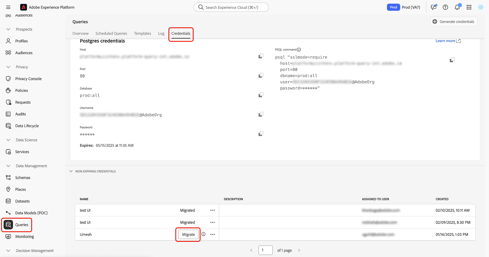

# Migreren van JWT naar OAuth Server-aan-Server geloofsbrieven

>[!IMPORTANT]
>
>Adobe biedt geen ondersteuning voor JWT-referenties (Service Account) die door Query Service worden gebruikt. Na 30 juni 2025 worden API-aanvragen niet meer vernieuwd of geverifieerd wanneer de gegevens op basis van JWT niet verlopen. Om de dienstonderbrekingen te verhinderen, moet u elke in aanmerking komende referentie aan de authentificatie van Server-aan-Server migreren OAuth.

Deze gids toont u hoe te om niet-vervallende geloofsbrieven van JWT aan OAuth server-aan-Server geloofsbrieven in Adobe Experience Platform te migreren. Als u dit proces voltooit, hebt u ononderbroken toegang tot Query Service voordat de ondersteuning voor JWT-referenties op 30 juni 2025 afloopt.

Dit document bevat stapsgewijze instructies voor het uitvoeren van de migratie, het begrijpen van de gevolgen en het controleren van uw bijgewerkte referenties.

## Wie moet migreren? {#who-needs-to-migrate}

Als u niet-vervallende geloofsbrieven in de Dienst van de Vraag gebruikt, moet u elk migreren. Dit is van toepassing op referenties die worden gebruikt in geautomatiseerde workflows, geplande query&#39;s of aangepaste API-integratie.

Als er referenties worden weergegeven onder de sectie **[!UICONTROL Non-expiring Credentials]** op het tabblad **[!UICONTROL Credentials]** , worden deze gegevens beïnvloed.

## Een referentie migreren {#how-to-migrate}

U kunt gebruikersgegevens rechtstreeks migreren in de gebruikersinterface van Experience Platform. Navigeer hiertoe naar **[!UICONTROL Queries]** in de linkernavigatie en selecteer vervolgens de tab **[!UICONTROL Credentials]** . Geef in de sectie **[!UICONTROL Non-expiring Credentials]** een referentie die is gemarkeerd als zijnde geschikt voor migratie en selecteer **[!UICONTROL Migrate]** naast deze referentie.

>[!NOTE]
>
>De migratie duurt 8 tot 10 seconden en kan niet worden geannuleerd als de toepassing eenmaal is gestart.

Na migratie werkt het systeem de referentie bij om OAuth Server-aan-Server authentificatie te gebruiken. De op JWT gebaseerde methode wordt automatisch verwijderd en de status wordt bijgewerkt naar **[!UICONTROL Migrated]** .

Er is geen herconfiguratie vereist. Bestaande banen en integraties blijven zonder onderbreking werken.

## Wat gebeurt er na migratie? {#after-migration}

Nadat u de migratie hebt voltooid:

- Uw referentie blijft naadloos werken, dus er zijn geen wijzigingen nodig in uw taken of integratie.
- De Dienst van de vraag gebruikt automatisch OAuth server-aan-server authentificatie.
- De op JWT gebaseerde authentificatiemethode wordt gepensioneerd en niet meer in gebruik.

>[!IMPORTANT]
>
>U kunt deze wijziging niet ongedaan maken. Na de migratie kan de referentie niet worden teruggezet naar JWT.

## Veelgestelde vragen {#faq}

Deze vragen gaan over gemeenschappelijke zorgen en helpen u een vlotte, onderbrekingsvrije migratie verzekeren.

### Waarom worden JWT-gebruikersgegevens door Adobe afgekeurd?

OAuth Server-aan-Server is een veiligere en gestandaardiseerde authentificatiemethode. Het biedt een beter levenscyclusbeheer en ondersteunt een bredere consistentie van het platform.

### Wat gebeurt er als ik niet migreer tegen 30 juni 2025?

De geloofsbrieven van JWT zullen ophouden verfrissend, en de integratie die op hen baseert zal ontbreken. Adobe kan alleen gegevens migreren als u het proces start.

### Hoe weet ik of ik moet migreren?

Als een referentie wordt weergegeven onder de sectie **[!UICONTROL Non-expiring Credentials]** op het tabblad Referenties, moeten deze gegevens worden gemigreerd.

### Moet ik mijn integraties bijwerken of om het even wat aanpassen?

Nee. Na de migratie neemt de OAuth-referentie automatisch de status over. Er zijn geen handmatige wijzigingen vereist voor uw taken of integratie.

### Kan ik alle gegevens tegelijk migreren?

Nee. U moet elke referentie afzonderlijk migreren met de knop **[!UICONTROL Migrate]** .

### Kan ik blijven gebruikend het verlopen geloofsbrieven?

Ja. Deze wijziging heeft geen invloed op het vervallen van referenties. Alleen niet-vervallende JWT-referenties mogen worden gemigreerd.

### Ik zie een bericht die &quot;[!UICONTROL No non-expiring credentials found.]&quot;zegt wat dat betekent? Moet ik enige actie ondernemen?

Dit bericht betekent dat u nog geen niet-vervallende geloofsbrieven hebt gecreeerd, zodat is er niets u te doen.

### Ik zie een bericht zeggend &quot;[!UICONTROL AEP admin verification failed]..&quot; Wat betekent dat? Moet ik enige actie ondernemen?

Dit bericht wijst erop dat u of geen Admin bent of niet de noodzakelijke toestemmingen hebt om niet-vervallende geloofsbrieven tot stand te brengen.

- Als uw toestemmingen onlangs niet zijn veranderd, betekent het u nooit toegang had om geloofsbrieven tot stand te brengen, zodat is geen actie nodig.
- Als uw machtigingen onlangs zijn gewijzigd, neemt u contact op met uw organisatie Admin en vraagt u deze om de referenties voor u te migreren.

### Kan ik niet-vervallende geloofsbrieven voor iemand anders migreren?

Ja, maar alleen als u een beheerder bent. Alleen beheerders hebben de machtigingen die nodig zijn om niet-vervallende gegevens voor andere gebruikers te maken en te migreren, zodat zij zonder onderbreking kunnen blijven werken.

## Volgende stappen {#next-steps}

Reviseer elke niet-vervallende referentie op het tabblad [!UICONTROL Credentials] en migreer deze afzonderlijk vóór 30 juni 2025. Neem voor vragen of ondersteuning contact op met uw Adobe-accountvertegenwoordiger.
