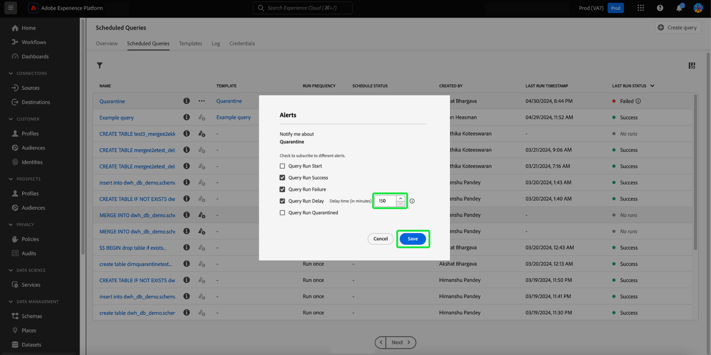

# Geplande query&#39;s controleren

Adobe Experience Platform biedt een verbeterde zichtbaarheid voor de status van alle querytaken via de gebruikersinterface. Van de [!UICONTROL Scheduled Queries] tabblad, kunt u nu belangrijke informatie over uw query-uitvoering vinden die de status, planningsdetails en foutberichten/codes bevat als deze mislukken. U kunt aan alarm voor vragen ook intekenen die op hun status door UI voor om het even welk van deze vragen worden gebaseerd door [!UICONTROL Scheduled Queries] tab.

## [!UICONTROL Scheduled Queries]

De [!UICONTROL Scheduled Queries] verstrekt een overzicht van al uw geplande vragen CTAS en ITAS. De details van de looppas kunnen voor alle geplande vragen evenals foutencodes en berichten voor om het even welke ontbroken vragen worden gevonden.

Ga naar de [!UICONTROL Scheduled Queries] tab, selecteert u **[!UICONTROL Queries]** van de linkernavigatiebalk, gevolgd door **[!UICONTROL Scheduled Queries]**

In de onderstaande tabel wordt elke beschikbare kolom beschreven.

>[!NOTE]
>
>Het waarschuwingspictogram voor abonnementen () bevindt zich in elke rij in een kolom zonder titel. Zie de [waarschuwingsabonnementen](#alert-subscription) voor meer informatie.

| Kolom | Beschrijving |
|---|---|
| **[!UICONTROL Name]** | Het naamveld is de sjabloonnaam of de eerste paar tekens van uw SQL-query. Om het even welke vraag die door UI met de Redacteur van de Vraag wordt gecreeerd wordt genoemd bij aanvang. Als de query via de API is gemaakt, wordt de naam ervan een fragment van de eerste SQL die wordt gebruikt om de query te maken. Als u een lijst wilt zien met alle regels die aan de query zijn gekoppeld, selecteert u een item in het menu [!UICONTROL Name] kolom. Zie de klasse [de loopdienstdetails van de vraaglooppas](#query-runs) sectie. |
| **[!UICONTROL Template]** | De sjabloonnaam van de query. Selecteer een sjabloonnaam om naar de Query-editor te navigeren. Het vraagmalplaatje wordt getoond in de Redacteur van de Vraag voor gemak. Als er geen malplaatjenaam is, wordt de rij duidelijk met een koppelteken en er is geen capaciteit om aan de Redacteur van de Vraag om de vraag te bekijken opnieuw te richten. |
| **[!UICONTROL SQL]** | Een fragment van de SQL-query. |
| **[!UICONTROL Run frequency]** | De frequentie waarmee de query is ingesteld op uitvoeren. De beschikbare waarden zijn `Run once` en `Scheduled`. |
| **[!UICONTROL Created by]** | De naam van de gebruiker die de query heeft gemaakt. |
| **[!UICONTROL Created]** | De tijdstempel in UTC-indeling waarin de query is gemaakt. |
| **[!UICONTROL Last run timestamp]** | De meest recente tijdstempel toen de query werd uitgevoerd. Deze kolom benadrukt of een vraag volgens zijn huidig programma is uitgevoerd. |
| **[!UICONTROL Last run status]** | De status van de meest recente queryuitvoering. De statuswaarden zijn: `Success`, `Failed`, `In progress`, en `No runs`. |
| **[!UICONTROL Schedule Status]** | De huidige status van de geplande query. Er zijn zes potentiële waarden. [!UICONTROL Registering], [!UICONTROL Active], [!UICONTROL Inactive], [!UICONTROL Deleted], een afbreekstreepje en [!UICONTROL Quarantined].<ul><li>De **[!UICONTROL Registering]** de status wijst erop dat het systeem nog de verwezenlijking van het nieuwe programma voor de vraag verwerkt. Opmerking: u kunt een geplande query tijdens de registratie niet uitschakelen of verwijderen.</li><li>De **[!UICONTROL Active]** status geeft aan dat de geplande query **nog niet geslaagd** de datum en het tijdstip van voltooiing.</li><li>De **[!UICONTROL Inactive]** status geeft aan dat de geplande query **passeren** de voltooiingsdatum en -tijd of door een gebruiker is gemarkeerd als inactief.</li><li>De **[!UICONTROL Deleted]** de status wijst erop dat het vraagprogramma is geschrapt.</li><li>Het koppelteken geeft aan dat de geplande query een eenmalige, niet-terugkerende query is.</li><li>De **[!UICONTROL Quarantined]** status geeft aan dat de query is mislukt na tien opeenvolgende uitvoeringen en dat uw tussenkomst vereist is voordat verdere uitvoeringen kunnen plaatsvinden.</li></ul> |

>[!TIP]
>
>Als u naar de Query-editor navigeert, kunt u **[!UICONTROL Queries]** om terug te keren naar de [!UICONTROL Templates] tab.

## Tabelinstellingen aanpassen voor geplande query&#39;s {#customize-table}

U kunt de kolommen op de [!UICONTROL Scheduled Queries] op uw behoeften. Als u het dialoogvenster [!UICONTROL Customize table] het instellingenvenster en de beschikbare kolommen bewerken, selecteert u het instellingenpictogram () van de rechterbovenhoek van het scherm.

>[!NOTE]
>
>De [!UICONTROL Created] kolom die verwijst naar de datum waarop het schema is gemaakt, is standaard verborgen.

Schakel de desbetreffende selectievakjes in of uit om een tabelkolom te verwijderen of toe te voegen. Selecteer vervolgens **[!UICONTROL Apply]** om je keuzes te bevestigen.

>[!NOTE]
>
>Om het even welke vraag die door UI werd gecreeerd wordt een genoemd malplaatje als deel van het creatieproces. De sjabloonnaam wordt weergegeven in de sjabloonkolom. Als de query via de API is gemaakt, is de sjabloonkolom leeg.

## Geplande query&#39;s beheren met inlinehandelingen {#inline-actions}

De [!UICONTROL Scheduled Queries] de mening biedt diverse gealigneerde acties aan om al uw geplande vragen van één plaats te beheren. Inline-handelingen worden aangegeven in elke rij met ovaal. Selecteer de ellips van een geplande vraag die u wilt leiden om de beschikbare opties in een pop-up menu te zien. Tot de beschikbare opties behoren [[!UICONTROL Disable schedule]](#disable) of [!UICONTROL Enable schedule], [[!UICONTROL Delete schedule]](#delete), [[!UICONTROL Subscribe]](#alert-subscription) om waarschuwingen te vragen, en [Inschakelen of [!UICONTROL Disable quarantine]](#quarantined-queries).

### Een geplande query in- of uitschakelen {#disable}

Om een geplande vraag onbruikbaar te maken, selecteer de ellips voor de geplande vraag u wilt leiden, dan selecteren **[!UICONTROL Disable schedule]** van de opties in het pop-upmenu. Er wordt een dialoogvenster weergegeven waarin uw handeling wordt bevestigd. Selecteren **[!UICONTROL Disable]** om uw instelling te bevestigen.

Zodra een geplande vraag gehandicapt is, kunt u het programma door het zelfde proces toelaten. Selecteer de ellips en selecteer vervolgens **[!UICONTROL Enable schedule]** uit de beschikbare opties.

>[!NOTE]
>
>Als een vraag is Gegarandeerd, zou u SQL van het malplaatje moeten herzien alvorens u zijn programma toelaat. Dit voorkomt een verspilling van compute uren als de sjabloonquery nog steeds problemen bevat.

### Een geplande query verwijderen {#delete}

Om een geplande vraag te schrappen, selecteer de ellips voor de geplande vraag u wilt leiden, dan selecteren **[!UICONTROL Delete schedule]** van de opties in het pop-upmenu. Er wordt een dialoogvenster weergegeven waarin uw handeling wordt bevestigd. Selecteren **[!UICONTROL Delete]** om uw instelling te bevestigen.

Zodra een geplande vraag wordt geschrapt, is het **niet** verwijderd uit de lijst met geplande query&#39;s. De inline-acties van de ovalen worden verwijderd en vervangen door het pictogram voor het toevoegen van een waarschuwing met grijs weergegeven. U kunt zich niet abonneren op waarschuwingen voor het verwijderde schema. De rij blijft in UI om informatie over looppas te verstrekken die als deel van de geplande vraag wordt geleid.

Als u looppas voor dat vraagmalplaatje wilt plannen, selecteer de malplaatjenaam van de aangewezen rij om aan de Redacteur van de Vraag te navigeren, dan volg [instructies om een programma aan een vraag toe te voegen](./query-schedules.md#create-schedule) zoals beschreven in de documentatie.

### Abonneren op waarschuwingen {#alert-subscription}

Om aan alarm voor geplande vraaglooppas in te schrijven, selecteer of `...` (weglatingsteken) of waarschuwingspictogram () voor de geplande query die u wilt beheren. Het vervolgkeuzemenu Handelingen inline wordt weergegeven. Selecteer vervolgens **[!UICONTROL Subscribe]** uit de beschikbare opties.

De [!UICONTROL Alerts] wordt geopend. De [!UICONTROL Alerts] Hiermee meldt u zich aan zowel UI-meldingen als e-mailwaarschuwingen. Er zijn verschillende abonnementsopties voor berichten beschikbaar: `start`, `success`, `failure`, `quarantine`, en `delay`. Vak of vakken invullen en **[!UICONTROL Save]** om in te schrijven.

In de onderstaande tabel worden de ondersteunde typen querywaarschuwingen beschreven:

| Type waarschuwing | Beschrijving |
|---|---|
| `start` | Deze waarschuwing brengt u op de hoogte wanneer een geplande vraaglooppas in werking wordt gesteld of begint te verwerken. |
| `success` | Deze waarschuwing geeft aan wanneer een geplande query correct is uitgevoerd en geeft aan dat de query zonder fouten is uitgevoerd. |
| `failed` | Deze waarschuwing treedt op wanneer een geplande query een fout aantreft of niet met succes wordt uitgevoerd. Hiermee kunt u problemen snel identificeren en verhelpen. |
| `quarantine` | Dit alarm wordt geactiveerd wanneer een geplande vraaglooppas in quarantined staat wordt gezet. Wanneer query&#39;s zijn ingeschreven in het dialoogvenster [quarantainevoorziening](#quarantined-queries), om het even welke geplande vraag die tien opeenvolgende looppas ontbreekt wordt automatisch gezet in een [!UICONTROL Quarantined] status. Vervolgens hebben zij uw tussenkomst nodig voordat verdere executies kunnen plaatsvinden. |
| `delay` | Deze waarschuwing geeft een melding als er een [vertraging in het resultaat van een query-uitvoering](#query-run-delay) boven een bepaalde drempel. U kunt een douanetijd plaatsen die de waakzaamheid teweegbrengen wanneer de vraaglooppas voor die duur zonder of het voltooien of het ontbreken. |

>[!NOTE]
>
>Om op de hoogte te worden gebracht van vraaglooppas die quarantined worden, moet u de geplande vraaglooppas in eerst inschrijven [quarantainevoorziening](#quarantined-queries).

Zie de [API-documentatie voor abonnementen](../api/alert-subscriptions.md) voor meer informatie .

### De query-details weergeven {#query-details}

Selecteer het informatiepictogram () om het deelvenster Details voor de query weer te geven. Het detailspaneel bevat alle relevante informatie over de vraag voorbij de feiten inbegrepen in de geplande vraaglijst. De extra informatie omvat vraagidentiteitskaart, de laatste gewijzigde datum, SQL van de vraag, planningsidentiteitskaart, en het huidige vastgestelde programma.

## Quarantated query&#39;s {#quarantined-queries}

>[!NOTE]
>
>De quarantainewaarschuwing is niet beschikbaar voor &#39;run-once&#39;-vragen. De quarantainewaarschuwing is alleen van toepassing op vragen in het kader van een geplande batch (CTAS en ITAS).

Wanneer ingeschreven in de quarantainevoorziening, wordt om het even welke geplande vraag die tien opeenvolgende looppas ontbreekt automatisch gezet in een [!UICONTROL Quarantined] status. Een query met deze status wordt inactief en wordt niet uitgevoerd op de geplande frequentie. Daarna is uw tussenkomst vereist voordat er nog executies kunnen plaatsvinden. Dit beschermt systeemmiddelen aangezien u de kwesties met uw SQL moet herzien en verbeteren alvorens de verdere uitvoeringen voorkomen.

Om een geplande vraag voor de quarantaineeigenschap toe te laten, selecteer de ellipsen (`...`) gevolgd door [!UICONTROL Enable quarantine] in het vervolgkeuzemenu dat wordt weergegeven.

De vragen kunnen ook in de quarantaineeigenschap tijdens het proces van de programmaverwezenlijking worden ingeschreven. Zie de [documentatie met queryplanningen](./query-schedules.md#quarantine) voor meer informatie .

## Uitstel van query-uitvoering {#query-run-delay}

Houd de controle over uw computeruren door alarm voor vraagvertragingen te plaatsen. U kunt vraagprestaties controleren en berichten ontvangen als de status van een vraag onveranderd na een specifieke periode blijft. Gebruik de &#39;[!UICONTROL Query Run Delay]&#39; waakzaam om op de hoogte te worden gebracht als een vraag na een specifieke periode blijft verwerken zonder te voltooien.

Wanneer u [abonneren op waarschuwingen](#alert-subscription) voor geplande vraaglooppas, één van het beschikbare alarm is [!UICONTROL Query Run Delay]. Voor deze waarschuwing moet u een drempelwaarde instellen voor de tijd die nodig is om de bewerking uit te voeren, waarna u op de hoogte wordt gesteld van de vertraging bij de verwerking.

Als u een drempelduur wilt kiezen die de melding activeert, voert u een getal in het tekstinvoerveld in of gebruikt u de pijl-omhoog en -omlaag om de stappen met één minuut te verhogen. Aangezien de drempel in notulen wordt geplaatst, is de maximumduur om een vertraging van de vraaglooppas te waarnemen 1440 minuten (24 uren). De standaardtijdsperiode voor een runtime-vertraging is 150 minuten.

>[!NOTE]
>
>Een queryuitvoering kan slechts één runtime hebben. Als u de vertragingsdrempel verandert, wordt het veranderd voor gebruiker die aan het alarm en voor uw volledige organisatie wordt geabonneerd.

Zie de sectie Abonneren op waarschuwingen voor meer informatie over [abonneren op [!UICONTROL Query Run Delay] waarschuwingen](#alert-subscription).

## Filterquery&#39;s {#filter}

U kunt vragen filteren op runtime frequentie. Van de [!UICONTROL Scheduled Queries] tab, selecteer het filterpictogram () om de filterzijbalk te openen.

Als u de lijst met query&#39;s wilt filteren op basis van de runtimefrequentie, selecteert u de optie **[!UICONTROL Scheduled]** of **[!UICONTROL Run once]** filterselectievakjes.

>[!NOTE]
>
>Om het even welke vraag die is uitgevoerd maar niet gepland kwalificeert als [!UICONTROL Run once].

Als u de filtercriteria hebt ingeschakeld, selecteert u **[!UICONTROL Hide Filters]** om het filterdeelvenster te sluiten.

## De loopplandetails van de vraag {#query-runs}

Als u de pagina met planningsdetails wilt openen, selecteert u een querynaam in het menu [!UICONTROL Scheduled Queries] tab. Deze mening verstrekt een lijst van alle looppas die als deel van die geplande vraag wordt uitgevoerd. De verstrekte informatie omvat de begin en eindtijd, status, en gebruikte dataset.

Deze informatie wordt verstrekt in een vijf-kolomlijst. Elke rij geeft een query-uitvoering aan.

| Kolomnaam | Beschrijving |
|---|---|
| **[!UICONTROL Query run ID]** | ID van de vraaglooppas voor de dagelijkse uitvoering. Selecteer de **[!UICONTROL Query run ID]** om naar de [!UICONTROL Query run overview]. |
| **[!UICONTROL Query run start]** | De tijdstempel wanneer de query werd uitgevoerd. De tijdstempel heeft de UTC-indeling. |
| **[!UICONTROL Query run complete]** | De tijdstempel wanneer de query is voltooid. De tijdstempel heeft de UTC-indeling. |
| **[!UICONTROL Status]** | De status van de meest recente queryuitvoering. De statuswaarden zijn: `Success`, `Failed`, `In progress`, of `Quarantined`. |
| **[!UICONTROL Dataset]** | De dataset betrokken bij de uitvoering. |

De details van de vraag die kunnen worden gepland in worden gezien [!UICONTROL Properties] deelvenster. Dit deelvenster bevat de initiële query-id, het type client, de sjabloonnaam, de query-SQL en het corresponderende schema.

Selecteer een id voor een query om naar de pagina met uitvoerdetails te navigeren en query-informatie weer te geven.

## Overzicht van query-uitvoering {#query-run-overview}

De [!UICONTROL Query run overview] verstrekt informatie over individuele looppas voor deze geplande vraag en een meer gedetailleerde specificatie van de looppasstatus. Deze pagina omvat ook de cliëntinformatie en details van om het even welke fouten die de vraag kunnen hebben veroorzaakt om te ontbreken.

De sectie met de querystatus bevat de foutcode en het foutbericht als de query is mislukt.

U kunt de SQL-query van deze weergave naar het klembord kopiëren. Als u de query wilt kopiëren, selecteert u het kopieerpictogram rechtsboven in het SQL-fragment. Een pop-upbericht bevestigt dat de code is gekopieerd.

### Details uitvoeren voor query&#39;s met anoniem blok {#anonymous-block-queries}

Vragen die anonieme blokken gebruiken om uit hun SQL-instructies te bestaan, worden gescheiden in hun individuele subquery&#39;s. De scheiding in subquery staat u toe om de looppasdetails voor elk vraagblok individueel te inspecteren.

>[!NOTE]
>
>De loopingdetails van een anoniem blok dat het bevel DROP gebruikt zullen **niet** worden gerapporteerd als een aparte subquery. De afzonderlijke looppasdetails zijn beschikbaar voor vragen CTAS, vragen ITAS, en verklaringen van de KOPIE die als anonieme die bloksubquery&#39;s worden gebruikt. Details uitvoeren voor de opdracht DROP wordt momenteel niet ondersteund.

Anonieme blokken worden aangeduid door het gebruik van een `$$` voor de query. Om meer over anonieme blokken in de vraagdienst te weten te komen, zie [anoniem blokdocument](../key-concepts/anonymous-block.md).

Anonieme subquery&#39;s voor blokken hebben tabs links van de status van de run. Selecteer een tabblad om de uitvoergegevens weer te geven.

Als een anonieme blokquery mislukt, kunt u de foutcode voor dat specifieke blok vinden via deze UI.

Selecteren **[!UICONTROL Query]** om terug te keren naar het scherm met planningsdetails, of **[!UICONTROL Scheduled Queries]** om terug te keren naar de [!UICONTROL Scheduled Queries] tab.

