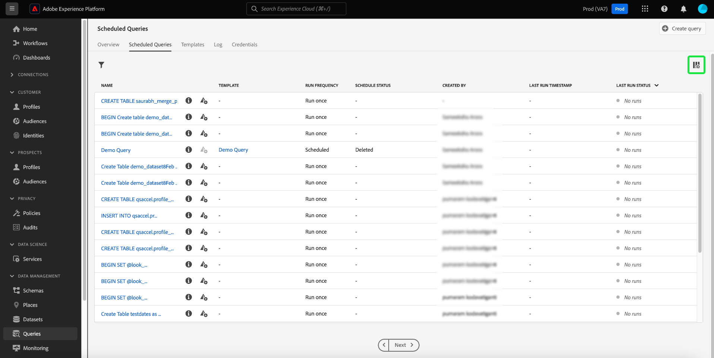

# Geplande query&#39;s controleren

Adobe Experience Platform biedt een verbeterde zichtbaarheid voor de status van alle querytaken via de gebruikersinterface. Vanaf het tabblad [!UICONTROL Scheduled Queries] vindt u nu belangrijke informatie over de query-uitvoering die de status, planningsdetails en foutberichten/codes bevat als deze mislukken. Via de gebruikersinterface kunt u zich ook abonneren op waarschuwingen voor query&#39;s op basis van hun status voor al deze query&#39;s via het tabblad [!UICONTROL Scheduled Queries] .

## [!UICONTROL Scheduled Queries]

Het tabblad [!UICONTROL Scheduled Queries] biedt een overzicht van al uw geplande CTAS- en ITAS-query&#39;s. De details van de looppas kunnen voor alle geplande vragen evenals foutencodes en berichten voor om het even welke ontbroken vragen worden gevonden.

Als u naar het tabblad [!UICONTROL Scheduled Queries] wilt navigeren, selecteert u **[!UICONTROL Queries]** in de linkernavigatiebalk, gevolgd door **[!UICONTROL Scheduled Queries]**

In de onderstaande tabel wordt elke beschikbare kolom beschreven.

>[!NOTE]
>
>Het waakzame abonnementspictogram () bevindt zich in elke rij in een kolom zonder titel. Zie de [ waakzame abonnementen ](#alert-subscription) sectie voor meer informatie.

| Kolom | Beschrijving |
|---|---|
| **[!UICONTROL Name]** | Het naamveld is de sjabloonnaam of de eerste paar tekens van uw SQL-query. Om het even welke vraag die door UI met de Redacteur van de Vraag wordt gecreeerd wordt genoemd bij aanvang. Als de query via de API is gemaakt, wordt de naam ervan een fragment van de eerste SQL die wordt gebruikt om de query te maken. Selecteer een item in de kolom [!UICONTROL Name] om een lijst weer te geven met alle aan de query gekoppelde uitvoering. Voor meer informatie, zie de [ vraag looppas planningsdetails ](#query-runs) sectie. |
| **[!UICONTROL Template]** | De sjabloonnaam van de query. Selecteer een sjabloonnaam om naar de Query-editor te navigeren. Het vraagmalplaatje wordt getoond in de Redacteur van de Vraag voor gemak. Als er geen malplaatjenaam is, wordt de rij duidelijk met een koppelteken en er is geen capaciteit om aan de Redacteur van de Vraag om de vraag te bekijken opnieuw te richten. |
| **[!UICONTROL SQL]** | Een fragment van de SQL-query. |
| **[!UICONTROL Run frequency]** | De frequentie waarmee de query is ingesteld op uitvoeren. De beschikbare waarden zijn `Run once` en `Scheduled` . |
| **[!UICONTROL Created by]** | De naam van de gebruiker die de query heeft gemaakt. |
| **[!UICONTROL Created]** | De tijdstempel in UTC-indeling waarin de query is gemaakt. |
| **[!UICONTROL Last run timestamp]** | De meest recente tijdstempel toen de query werd uitgevoerd. Deze kolom benadrukt of een vraag volgens zijn huidig programma is uitgevoerd. |
| **[!UICONTROL Last run status]** | De status van de meest recente queryuitvoering. De statuswaarden zijn: `Success` , `Failed` , `In progress` en `No runs` . |
| **[!UICONTROL Schedule Status]** | De huidige status van de geplande query. Er zijn zes mogelijke waarden: [!UICONTROL Registering] , [!UICONTROL Active] , [!UICONTROL Inactive] , [!UICONTROL Deleted] , een afbreekstreepje en [!UICONTROL Quarantined] .<ul><li>De **[!UICONTROL Registering]** status wijst erop dat het systeem nog de verwezenlijking van het nieuwe programma voor de vraag verwerkt. Opmerking: u kunt een geplande query tijdens de registratie niet uitschakelen of verwijderen.</li><li>De **[!UICONTROL Active]** status wijst erop dat de geplande vraag **nog niet** zijn voltooiingsdatum en tijd heeft overgegaan.</li><li>De **[!UICONTROL Inactive]** status wijst erop dat de geplande vraag **&#x200B;**&#x200B;zijn voltooiingsdatum en tijd heeft overgegaan of door een gebruiker om in een inactieve staat duidelijk te zijn geweest.</li><li>De status **[!UICONTROL Deleted]** geeft aan dat het queryprogramma is verwijderd.</li><li>Het koppelteken geeft aan dat de geplande query een eenmalige, niet-terugkerende query is.</li><li>De status **[!UICONTROL Quarantined]** geeft aan dat de query is mislukt tijdens tien opeenvolgende uitvoeringen en dat uw tussenkomst vereist is voordat verdere uitvoeringen kunnen plaatsvinden.</li></ul> |

>[!TIP]
>
>Als u naar de Query-editor navigeert, kunt u **[!UICONTROL Queries]** selecteren om terug te keren naar het tabblad [!UICONTROL Templates] .

## Tabelinstellingen aanpassen voor geplande query&#39;s {#customize-table}

U kunt de kolommen op het tabblad [!UICONTROL Scheduled Queries] naar wens aanpassen. Om het [!UICONTROL Customize table] montagedialoog te openen en beschikbare kolommen uit te geven, selecteer het montagespictogram ( ) vanaf de rechterbovenhoek van het scherm.

>[!NOTE]
>
>De kolom [!UICONTROL Created] die verwijst naar de datum waarop het schema is gemaakt, is standaard verborgen.

Schakel de desbetreffende selectievakjes in of uit om een tabelkolom te verwijderen of toe te voegen. Selecteer vervolgens **[!UICONTROL Apply]** om uw keuzes te bevestigen.

>[!NOTE]
>
>Om het even welke vraag die door UI werd gecreeerd wordt een genoemd malplaatje als deel van het creatieproces. De sjabloonnaam wordt weergegeven in de sjabloonkolom. Als de query via de API is gemaakt, is de sjabloonkolom leeg.

## Geplande query&#39;s beheren met inlinehandelingen {#inline-actions}

De weergave [!UICONTROL Scheduled Queries] biedt verschillende inline-handelingen om al uw geplande query&#39;s vanaf één locatie te beheren. Inline-handelingen worden aangegeven in elke rij met ovaal. Selecteer de ellips van een geplande vraag die u wilt leiden om de beschikbare opties in een pop-up menu te zien. Tot de beschikbare opties behoren [[!UICONTROL Disable schedule]](#disable) of [!UICONTROL Enable schedule] , [[!UICONTROL Delete schedule]](#delete) , [[!UICONTROL Subscribe]](#alert-subscription) om waarschuwingen te vragen en [ Inschakelen of [!UICONTROL Disable quarantine]](#quarantined-queries) .

### Een geplande query in- of uitschakelen {#disable}

Als u een geplande query wilt uitschakelen, selecteert u de ellips voor de geplande query die u wilt beheren en selecteert u vervolgens **[!UICONTROL Disable schedule]** in de opties in het pop-upmenu. Er wordt een dialoogvenster weergegeven waarin uw handeling wordt bevestigd. Selecteer **[!UICONTROL Disable]** om uw instelling te bevestigen.

Zodra een geplande vraag gehandicapt is, kunt u het programma door het zelfde proces toelaten. Selecteer de ellips en selecteer vervolgens **[!UICONTROL Enable schedule]** uit de beschikbare opties.

>[!NOTE]
>
>Als een vraag is Gegarandeerd, zou u SQL van het malplaatje moeten herzien alvorens u zijn programma toelaat. Dit voorkomt een verspilling van compute uren als de sjabloonquery nog steeds problemen bevat.

### Een geplande query verwijderen {#delete}

Als u een geplande query wilt verwijderen, selecteert u de ellips voor de geplande query die u wilt beheren en selecteert u vervolgens **[!UICONTROL Delete schedule]** in de opties in het pop-upmenu. Er wordt een dialoogvenster weergegeven waarin uw handeling wordt bevestigd. Selecteer **[!UICONTROL Delete]** om uw instelling te bevestigen.

Zodra een geplande vraag wordt geschrapt, wordt het **niet** verwijderd uit de lijst van geplande vragen. De inline-acties van de ovalen worden verwijderd en vervangen door het pictogram voor het toevoegen van een waarschuwing met grijs weergegeven. U kunt zich niet abonneren op waarschuwingen voor het verwijderde schema. De rij blijft in UI om informatie over looppas te verstrekken die als deel van de geplande vraag wordt geleid.

Als u looppas voor dat vraagmalplaatje wilt plannen, selecteer de malplaatjenaam van de aangewezen rij om aan de Redacteur van de Vraag te navigeren, dan volg de [ instructies om een programma aan een vraag ](./query-schedules.md#create-schedule) toe te voegen zoals die in de documentatie wordt beschreven.

### Abonneren op waarschuwingen {#alert-subscription}

Om aan alarm voor geplande vraaglooppas in te tekenen, selecteer of `...` (ellipse) of waakzaam pictogram van het abonnement ( ) voor de geplande query die u wilt beheren. Het vervolgkeuzemenu Handelingen inline wordt weergegeven. Selecteer vervolgens **[!UICONTROL Subscribe]** uit de beschikbare opties.

Het dialoogvenster [!UICONTROL Alerts] wordt geopend. In het dialoogvenster [!UICONTROL Alerts] wordt u geabonneerd op zowel UI-berichten als e-mailwaarschuwingen. Er zijn verschillende abonnementsopties beschikbaar voor waarschuwingen: `start`, `success`, `failure`, `quarantine` en `delay` . Controleer de desbetreffende doos of vakjes en selecteer **[!UICONTROL Save]** om u te abonneren.

In de onderstaande tabel worden de ondersteunde typen querywaarschuwingen beschreven:

| Type waarschuwing | Beschrijving |
|---|---|
| `start` | Deze waarschuwing brengt u op de hoogte wanneer een geplande vraaglooppas in werking wordt gesteld of begint te verwerken. |
| `success` | Deze waarschuwing geeft aan wanneer een geplande query correct is uitgevoerd en geeft aan dat de query zonder fouten is uitgevoerd. |
| `failed` | Deze waarschuwing treedt op wanneer een geplande query een fout aantreft of niet met succes wordt uitgevoerd. Hiermee kunt u problemen snel identificeren en verhelpen. |
| `quarantine` | Dit alarm wordt geactiveerd wanneer een geplande vraaglooppas in quarantined staat wordt gezet. Wanneer de vragen in de [ quarantaineeigenschap ](#quarantined-queries) worden ingeschreven, wordt om het even welke geplande vraag die tien opeenvolgende looppas ontbreekt automatisch gezet in a [!UICONTROL Quarantined] staat. Vervolgens hebben zij uw tussenkomst nodig voordat verdere executies kunnen plaatsvinden. |
| `delay` | Dit alarm brengt u op de hoogte als er a [ vertraging in het resultaat van een vraaguitvoering ](#query-run-delay) voorbij een gespecificeerde drempel is. U kunt een douanetijd plaatsen die de waakzaamheid teweegbrengen wanneer de vraaglooppas voor die duur zonder of het voltooien of het ontbreken. |

>[!NOTE]
>
>Om op de hoogte te worden gebracht van vraaglooppas die quarantined worden, moet u de geplande vraaglooppas in de [ quarantaineeigenschap ](#quarantined-queries) eerst inschrijven.

Zie de [ waakzame API documentatie van abonnementen ](../api/alert-subscriptions.md) voor meer informatie.

### De query-details weergeven {#query-details}

Selecteer het informatiepictogram () om het deelvenster Details voor de query te bekijken. Het detailspaneel bevat alle relevante informatie over de vraag voorbij de feiten inbegrepen in de geplande vraaglijst. De extra informatie omvat vraagidentiteitskaart, de laatste gewijzigde datum, SQL van de vraag, planningsidentiteitskaart, en het huidige vastgestelde programma.

## Quarantated query&#39;s {#quarantined-queries}

>[!NOTE]
>
>De quarantainewaarschuwing is niet beschikbaar voor &#39;run-once&#39;-vragen. De quarantainewaarschuwing is alleen van toepassing op vragen in het kader van een geplande batch (CTAS en ITAS).

Wanneer u bent ingeschreven voor de quarantainefunctie, wordt elke geplande query die mislukt na tien opeenvolgende uitvoering, automatisch in de status [!UICONTROL Quarantined] geplaatst. Een query met deze status wordt inactief en wordt niet uitgevoerd op de geplande frequentie. Daarna is uw tussenkomst vereist voordat er nog executies kunnen plaatsvinden. Dit beschermt systeemmiddelen aangezien u de kwesties met uw SQL moet herzien en verbeteren alvorens de verdere uitvoeringen voorkomen.

Als u een geplande query voor de quarantainefunctie wilt inschakelen, selecteert u de ellipsen (`...`) gevolgd door [!UICONTROL Enable quarantine] in het vervolgkeuzemenu dat wordt weergegeven.

De vragen kunnen ook in de quarantaineeigenschap tijdens het proces van de programmaverwezenlijking worden ingeschreven. Zie de [ documentatie van vraagprogramma&#39;s ](./query-schedules.md#quarantine) voor meer informatie.

## Uitstel van query-uitvoering {#query-run-delay}

Houd de controle over uw computeruren door alarm voor vraagvertragingen te plaatsen. U kunt vraagprestaties controleren en berichten ontvangen als de status van een vraag onveranderd na een specifieke periode blijft. Gebruik het alarm &quot;[!UICONTROL Query Run Delay]&quot;om op de hoogte te worden gebracht als een vraag na een specifieke periode blijft verwerken zonder de voltooiing.

Wanneer u [ aan alarm ](#alert-subscription) voor geplande vraaglooppas intekent, is één van het beschikbare alarm [!UICONTROL Query Run Delay]. Voor deze waarschuwing moet u een drempelwaarde instellen voor de tijd die nodig is om de bewerking uit te voeren, waarna u op de hoogte wordt gesteld van de vertraging bij de verwerking.

Als u een drempelduur wilt kiezen die de melding activeert, voert u een getal in het tekstinvoerveld in of gebruikt u de pijl-omhoog en -omlaag om de stappen met één minuut te verhogen. Aangezien de drempel in notulen wordt geplaatst, is de maximumduur om een vertraging van de vraaglooppas te waarnemen 1440 minuten (24 uren). De standaardtijdsperiode voor een runtime-vertraging is 150 minuten.

>[!NOTE]
>
>Een queryuitvoering kan slechts één runtime hebben. Als u de vertragingsdrempel verandert, wordt het veranderd voor gebruiker die aan het alarm en voor uw volledige organisatie wordt geabonneerd.

Zie intekenen aan alarm sectie leren hoe te [ intekenen aan [!UICONTROL Query Run Delay] alarm ](#alert-subscription).

## Filterquery&#39;s {#filter}

U kunt vragen filteren op runtime frequentie. Van het [!UICONTROL Scheduled Queries] lusje, selecteer het filterpictogram () om de filterzijbalk te openen.

Als u de lijst met query&#39;s wilt filteren op basis van de uitvoerfrequentie, schakelt u het selectievakje **[!UICONTROL Scheduled]** of **[!UICONTROL Run once]** in.

>[!NOTE]
>
>Elke query die is uitgevoerd maar niet is gepland, wordt gekwalificeerd als [!UICONTROL Run once] .

Wanneer u de filtercriteria hebt ingeschakeld, selecteert u **[!UICONTROL Hide Filters]** om het filterdeelvenster te sluiten.

## De loopplandetails van de vraag {#query-runs}

Als u de pagina met planningsdetails wilt openen, selecteert u een querynaam op het tabblad [!UICONTROL Scheduled Queries] . Deze mening verstrekt een lijst van alle looppas die als deel van die geplande vraag wordt uitgevoerd. De verstrekte informatie omvat de begin en eindtijd, status, en gebruikte dataset.

Deze informatie wordt verstrekt in een vijf-kolomlijst. Elke rij geeft een query-uitvoering aan.

| Kolomnaam | Beschrijving |
|---|---|
| **[!UICONTROL Query run ID]** | ID van de vraaglooppas voor de dagelijkse uitvoering. Selecteer **[!UICONTROL Query run ID]** om naar [!UICONTROL Query run overview] te navigeren. |
| **[!UICONTROL Query run start]** | De tijdstempel wanneer de query werd uitgevoerd. De tijdstempel heeft de UTC-indeling. |
| **[!UICONTROL Query run complete]** | De tijdstempel wanneer de query is voltooid. De tijdstempel heeft de UTC-indeling. |
| **[!UICONTROL Status]** | De status van de meest recente queryuitvoering. De statuswaarden zijn: `Success` , `Failed` , `In progress` of `Quarantined` . |
| **[!UICONTROL Dataset]** | De dataset betrokken bij de uitvoering. |

Details van de query die wordt gepland, zijn beschikbaar in het deelvenster [!UICONTROL Properties] . Dit deelvenster bevat de initiële query-id, het type client, de sjabloonnaam, de query-SQL en het corresponderende schema.

Selecteer een id voor een query om naar de pagina met uitvoerdetails te navigeren en query-informatie weer te geven.

## Overzicht van query-uitvoering {#query-run-overview}

[!UICONTROL Query run overview] verstrekt informatie over individuele looppas voor deze geplande vraag en een meer gedetailleerde specificatie van de looppasstatus. Deze pagina omvat ook de cliëntinformatie en details van om het even welke fouten die de vraag kunnen hebben veroorzaakt om te ontbreken.

De sectie met de querystatus bevat de foutcode en het foutbericht als de query is mislukt.

U kunt de SQL-query van deze weergave naar het klembord kopiëren. Als u de query wilt kopiëren, selecteert u het kopieerpictogram rechtsboven in het SQL-fragment. Een pop-upbericht bevestigt dat de code is gekopieerd.

### Details uitvoeren voor query&#39;s met anoniem blok {#anonymous-block-queries}

Vragen die anonieme blokken gebruiken om uit hun SQL-instructies te bestaan, worden gescheiden in hun individuele subquery&#39;s. De scheiding in subquery staat u toe om de looppasdetails voor elk vraagblok individueel te inspecteren.

>[!NOTE]
>
>De looppasdetails van een anoniem blok dat het bevel DROP gebruikt zullen **niet** als afzonderlijke subquery worden gemeld. De afzonderlijke looppasdetails zijn beschikbaar voor vragen CTAS, vragen ITAS, en verklaringen van de KOPIE die als anonieme die bloksubquery&#39;s worden gebruikt. Details uitvoeren voor de opdracht DROP wordt momenteel niet ondersteund.

Anonieme blokken worden aangegeven door het gebruik van een voorvoegsel `$$` vóór de query. Om meer over anonieme blokken in de vraagdienst te weten te komen, zie het [ anonieme blokdocument ](../key-concepts/anonymous-block.md).

Anonieme subquery&#39;s voor blokken hebben tabs links van de status van de run. Selecteer een tabblad om de uitvoergegevens weer te geven.

Als een anonieme blokquery mislukt, kunt u de foutcode voor dat specifieke blok vinden via deze UI.

Selecteer **[!UICONTROL Query]** om terug te keren naar het scherm met de details van de planning of **[!UICONTROL Scheduled Queries]** om terug te keren naar het tabblad [!UICONTROL Scheduled Queries] .

