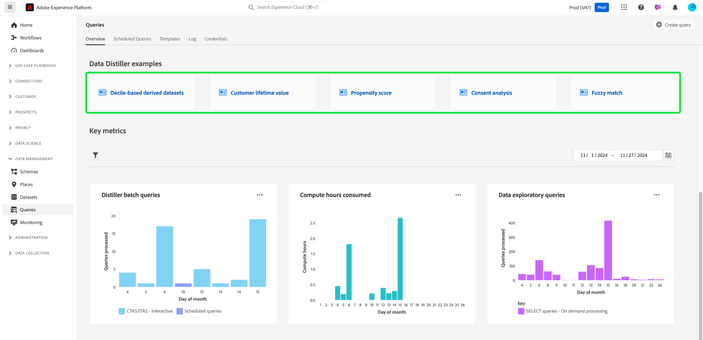
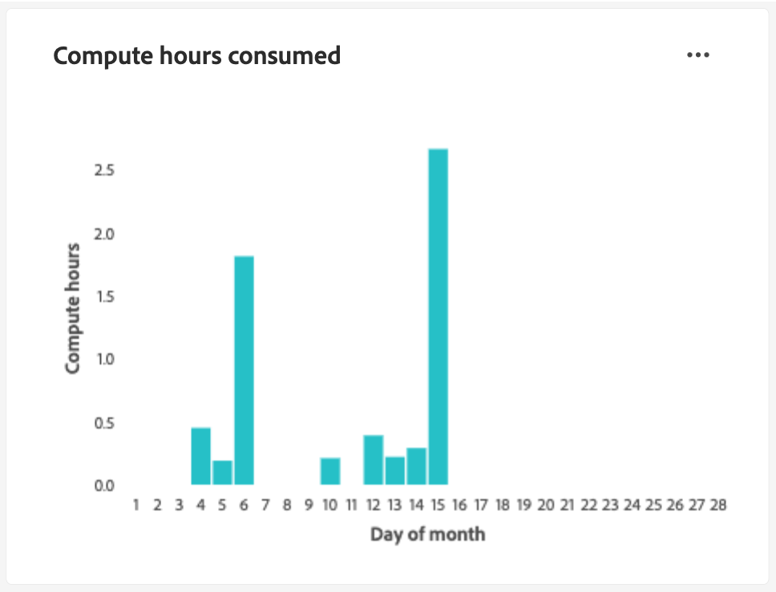

# Handleiding voor Query Service

De Adobe Experience Platform Query Service biedt een gebruikersinterface die kan worden gebruikt voor het schrijven en uitvoeren van query&#39;s, het weergeven van eerder uitgevoerde query&#39;s en het openen van query&#39;s die zijn opgeslagen door gebruikers binnen uw organisatie. Om tot UI binnen [ Adobe Experience Platform ](https://platform.adobe.com) toegang te hebben, selecteer **[!UICONTROL Queries]** in de linkernavigatie. De lus [!UICONTROL Queries] [!UICONTROL Overview] wordt weergegeven.

## Overzicht {#overview}

Het tabblad [!UICONTROL Overview] biedt een gestroomlijnd ingangspunt voor het werken met query&#39;s en Data Distiller-sjablonen. Hier, kunt u tot alle eigenschappen toegang hebben nodig om vragen te schrijven, datasets te onderzoeken, en publieksgegevens te analyseren, om een vlotte werkschema voor uw gegevensanalyses en publieksinzichten te verzekeren. Gebruik dit overzicht om te leren wat u met Gegevens Distiller kunt bereiken en zeer belangrijke metriek over uw gebruik van de Dienst van de Vraag te ontdekken.

### Hoofddeelvensters {#main-panels}

De pagina [!UICONTROL Overview] bevat verschillende hoofdsecties die u helpen aan de slag te gaan:

1. Selecteer **[!UICONTROL Create query]** om snel naar de Redacteur van de Vraag te navigeren om nieuwe vragen te schrijven en uit te voeren.
2. Selecteer **[!UICONTROL Learn more]** om gedetailleerde documentatie over **[!UICONTROL Write queries]** weer te geven.
3. Selecteer **[!UICONTROL Get started]** in de **[!UICONTROL Discover Data Distiller]** -sectie om het Distiller-overzicht voor gegevens te openen en meer te weten te komen over de beschikbare functies.

### Data Distiller-mogelijkheden {#data-distiller-capabilities}

De sectie [!UICONTROL Data Distiller capabilities] bevat documentatiekoppelingen naar meer geavanceerde Distiller-functies voor gegevens:

- **[[!UICONTROL Data exploration]](../use-cases/data-exploration.md)**: Leer hoe u in batch ingesloten gegevens kunt verkennen, oplossen en verifiëren met SQL.
- **[[!UICONTROL Derived datasets for Experience Platform applications]](../data-distiller/derived-datasets/overview.md)**: Leer hoe u afgeleide gegevenssets maakt ter ondersteuning van complexe en diverse gebruiksgevallen die uw gegevenshulpprogramma maximaliseren.
- **[[!UICONTROL AI/ML pipelines]](../data-distiller/ml-feature-pipelines/overview.md)**: Leer belangrijke concepten achter de leergereedschappen van uw voorkeurssysteem en hoe u aangepaste modellen maakt die uw gebruiksscenario&#39;s voor marketingdoeleinden ondersteunen. In deze reeks handleidingen worden de stappen beschreven die nodig zijn om functiepijplijnen te maken die gegevens van Experience Platform voorbereiden om aangepaste modellen te voeden in de leeromgeving van uw computer.
- **[[!UICONTROL SQL insights]](../data-distiller/sql-insights/overview.md)**: Leer over de belangrijkste mogelijkheden en vereiste stappen om een dashboard met inzichten van SQL met Gegevens Distiller te ontwikkelen.

### Aanbevolen Distiller-versnellers voor gegevens {#recommended-accelerators}

Selecteer een snelle koppeling om naar de desbetreffende Distiller-gegevensdashboards [!UICONTROL Templates] te navigeren. Elke versneller verstrekt krachtige hulpmiddelen en visualisaties om u te helpen publieksgegevens analyseren, segmentatie optimaliseren, en het richten strategieën verbeteren.

- **[[!UICONTROL Advanced audience overlaps]](../../dashboards/sql-insights-query-pro-mode/templates/overlaps.md)**: vanaf dit dashboard kunt u de snijpunten tussen verschillende publiekssegmenten analyseren om waardevolle inzichten te ontdekken en segmentatiestrategieën te optimaliseren. U kunt uw inzichten voor verdere off-line analyse of rapporteringsdoeleinden ook uitvoeren.
- **[[!UICONTROL Audience comparison]](../../dashboards/sql-insights-query-pro-mode/templates/comparison.md)**: Op dit dashboard kunt u de belangrijkste publieksmeetgegevens naast elkaar vergelijken en met elkaar vergelijken om twee publieksgroepen in detail te analyseren. Deze inzichten helpen u publieksgrootte, de groei, en andere zeer belangrijke prestatiesindicatoren begrijpen, toelatend u om segmentatie te verfijnen en het richten van strategieën met gegeven-gedreven besluiten te optimaliseren.
- **[[!UICONTROL Audience trends]](../../dashboards/sql-insights-query-pro-mode/templates/trends.md)**: Gebruik het dashboard van [!UICONTROL Audience trends] om te visualiseren hoe uw publiek zich in de loop der tijd door zeer belangrijke metriek zoals publieksgroei, identiteitstellingen, en enige identiteitsprofielen ontwikkelt. Houd trends bij om waardevolle inzichten in het gedrag van het publiek aan het licht te brengen, zodat u segmentatie kunt verfijnen, de betrokkenheid kunt verbeteren en doelgerichte strategieën kunt optimaliseren voor effectievere campagnes.
Houd de meetgegevens van het publiek in de loop der tijd bij om wijzigingen in de publieksgrootte, identiteitsgroei en algemene betrokkenheid te controleren.
- **[[!UICONTROL Audience identity overlaps]](../../dashboards/sql-insights-query-pro-mode/templates/identity-overlaps.md)**: gebruik het dashboard Identiteitsoverlappingen publiek om identiteitsoverlappingen binnen geselecteerde doelgroepen te analyseren. Visualisaties en getabelleerde gegevens bieden inzicht in het optimaliseren van identiteitsstitching, het reduceren van redundantie en het verbeteren van segmentatie. Deze inzichten laten effectiever gericht, verbeterde verpersoonlijking, en gestroomlijnde klanteninteractie toe.

### Distiller-voorbeelden voor gegevens {#data-distiller-examples}

Selecteer een kaart om documentatiegidsen en voorbeelden te openen om u te helpen het beste van Gegevens Distiller maken:

- **[[!UICONTROL Decile-based derived datasets]](../use-cases/deciles-use-case.md)**: Leer hoe u op decile&#39;s gebaseerde gegevenssets maakt voor segmentatie en het creëren van doelgroepen in Adobe Experience Platform. Gebruikend een scenario van de luchtvaartloyaliteit, behandelt het schemaontwerp, decile berekeningen, en vraagvoorbeelden voor het rangschikken van en het samenvoegen van gegevens.
- **[[!UICONTROL Customer lifetime value]](../use-cases/customer-lifetime-value.md)**: Leer hoe u de levensduurwaarde van klanten kunt bijhouden en visualiseren met Real-Time CDP en aangepaste dashboards. Gebruik deze inzichten om strategieën te ontwikkelen voor het verwerven van nieuwe klanten, bestaande klanten te behouden en winstmarges te maximaliseren.
- **[[!UICONTROL Propensity score]](../use-cases/propensity-score.md)**: Leer hoe u de scores van de dichtheid kunt bepalen aan de hand van voorspellende modellen die in de machine zijn leren. Deze handleiding behandelt het verzenden van gegevens voor training, het toepassen van getrainde modellen met SQL en het voorspellen van de aankoopwaarschijnlijkheid van klanten.
- **[[!UICONTROL Consent analysis]](../../dashboards/insights-use-cases/consent-analysis.md)**: Leer hoe u de toestemming van klanten kunt analyseren en volgen met Real-Time CDP, Query Service en Data Distiller. Deze gids behandelt bouwtoestemmingsdashboards, het verfijnen van segmentatie, het volgen van tendensen, en het verzekeren van naleving, die u helpen vertrouwen opbouwen en persoonlijke ervaringen leveren.
- **[[!UICONTROL Fuzzy match]](../use-cases/fuzzy-match.md)**: Leer hoe u een &#39;vage&#39; overeenkomst uitvoert op uw Experience Platform-gegevens om overeenkomsten bij benadering te zoeken en tekenreeksgelijkenis te analyseren in verschillende gegevenssets. Volg deze handleiding om tijd te besparen en uw gegevens toegankelijker te maken. Het voorbeeld toont aan hoe te om de attributen van de hotelruimte tussen twee gegevensreeksen van reisbureaus aan te passen, die tonen hoe te, grote, complexe datasets voor consistentie en nauwkeurigheid efficiënt aanpassen, vergelijken en met elkaar in overeenstemming brengen.

### Belangrijkste cijfers {#key-metrics}

De belangrijkste metrieksectie toont visualisaties van belangrijke gegevens die u helpen het gebruik van de Dienst van de Vraag controleren. Voor elke grafiek, kunt u de ellips (`...`) in het hoogste recht selecteren dat door [!UICONTROL View more] wordt gevolgd om of een van tabellarische vorm van de resultaten te bekijken, of de gegevens als Csv- dossier te downloaden om in een spreadsheet te bekijken. Voor meer details, verwijs naar de [ Meer gids van de Mening ](../../dashboards/sql-insights-query-pro-mode/view-more.md).

#### Datumfilter instellen {#set-date-filter}

Om een globale datumfilter voor deze visualisaties toe te passen, selecteer het filterpictogram ( ) en pas het datumbereik aan in het dialoogvenster **[!UICONTROL Filters]** . Pas dit filter toe om de weergegeven metriek voor een bepaald tijdkader aan te passen en de relevantie van uw analyse te verbeteren.

#### [!UICONTROL Distiller batch queries] {#distiller-batch-queries}

Het [!UICONTROL Distiller batch queries] diagram verstrekt een uitsplitsing van vraagactiviteit door dag, die het aantal verwerkte (interactieve en geplande) vragen CTAS en ITAS benadrukt. De grafiek markeert patronen, zoals pieken in interactieve vragen op bepaalde dagen en het zelden gebruik van geplande vragen. Gebruik deze inzichten om prestaties te optimaliseren door piekactiviteitsperiodes, het raffineren van planningsstrategieën, en het in evenwicht brengen vraaguitvoering te identificeren om werkschemageefficiency en middelgebruik te verbeteren.

#### [!UICONTROL Compute hours consumed] {#compute-hours-consumed}

De grafiek [!UICONTROL Compute hours consumed] verstrekt een dagelijkse visualisatie van compute uren die aan de verrichtingen van de Dienst van de Vraag worden gebruikt te verwerken. Gebruik deze compute uurtendensen om middelverbruik te controleren, high-demand periodes te identificeren, en vraaguitvoering te optimaliseren om efficiënte middeltoewijzing en prestaties te verzekeren.

#### [!UICONTROL Data exploratory queries]

In het [!UICONTROL Data exploratory queries] -diagram wordt het aantal SELECT-query&#39;s weergegeven dat elke dag op aanvraag wordt verwerkt. Deze visualisatie benadrukt de tendensen van de vraagactiviteit, zoals pieken in gebruik op specifieke dagen, om u te helpen begrijpen wanneer uw inspanningen van de gegevensexploratie het meest actief zijn. Gebruik deze inzichten om de patronen van het vraaggebruik te controleren, werklasten in evenwicht te brengen, en middeltoewijzing voor verkennende gegevensanalyse te optimaliseren. Deze analyse verzekert efficiënter gebruik van de Dienst van de Vraag en betere planning voor de periodes van de hoge vraag.

## Query-editor

Gebruik de Redacteur van de Vraag om vragen te schrijven en uit te voeren zonder een externe cliënt te gebruiken. Selecteer **[!UICONTROL Create Query]** om de Redacteur van de Vraag te openen en een nieuwe vraag tot stand te brengen. U kunt de Query-editor ook openen door een query te selecteren op de tabbladen **[!UICONTROL Log]** of **[!UICONTROL Templates]** . Als u een eerder uitgevoerde of bewaarde vraag selecteert, opent de Redacteur van de Vraag en toont SQL voor uw geselecteerde vraag.

Terwijl u in de Query-editor typt, voltooit de editor automatisch voor SQL gereserveerde woorden, tabellen en veldnamen in tabellen. Wanneer u klaar bent met het schrijven van uw vraag, selecteer het speel pictogram ( ) om de query uit te voeren. Op het tabblad **[!UICONTROL Console]** onder de editor ziet u wat de Query-service momenteel doet en geeft u aan wanneer een query is geretourneerd. Het tabblad **[!UICONTROL Result]** naast [!UICONTROL Console] geeft de queryresultaten weer. Zie de [ gids van de Redacteur van de Vraag ](./user-guide.md) voor meer informatie bij het gebruiken van de Redacteur van de Vraag.

## Geplande query&#39;s {#scheduled-queries}

Vragen die al als een sjabloon zijn opgeslagen, kunnen worden gepland voor uitvoering op een normale cadence. Wanneer het plannen van een vraag, kunt u de frequentie van looppas, de begin en einddatum, de dag van de week kiezen de geplande vraaglooppas, evenals de dataset om de vraag naar uit te voeren. De programma&#39;s van de vraag worden geplaatst gebruikend de Redacteur van de Vraag.

Leren hoe te om een vraag door UI te plannen, zie de [ geplande gids van vragen ](./user-guide.md#scheduled-queries). Leren hoe te om programma&#39;s toe te voegen gebruikend API, te lezen gelieve de [ geplande gids van het vraageindpunt ](../api/scheduled-queries.md).

Nadat een query is gepland, wordt deze weergegeven in de lijst met geplande query&#39;s op het tabblad [!UICONTROL Scheduled Queries] . De volledige details betreffende de vraag, de looppas, de schepper, en de tijdopnemers kunnen worden gevonden door een geplande vraag van de lijst te selecteren.

<!--  -->

| Kolom | Beschrijving |
| --- | --- |
| **[!UICONTROL Name]** | Het naamveld is de sjabloonnaam of de eerste paar tekens van uw SQL-query. Om het even welke vraag die door UI met de Redacteur van de Vraag wordt gecreeerd wordt genoemd bij aanvang. Als de query via de API is gemaakt, is de naam van de query een fragment van de eerste SQL die is gebruikt om de query te maken. |
| **[!UICONTROL Template]** | De sjabloonnaam van de query. Selecteer een sjabloonnaam om naar de Query-editor te navigeren. Het vraagmalplaatje wordt getoond in de Redacteur van de Vraag voor gemak. Als er geen malplaatjenaam is, wordt de rij duidelijk met een koppelteken en er is geen capaciteit om aan de Redacteur van de Vraag om de vraag te bekijken opnieuw te richten. |
| **[!UICONTROL SQL]** | Een fragment van de SQL-query. |
| **[!UICONTROL Run frequency]** | Deze kolom geeft de frequentie aan waarmee de query is ingesteld op uitvoeren. De beschikbare waarden zijn `Run once` en `Scheduled` . U kunt query&#39;s filteren op basis van hun uitvoeringsfrequentie. |
| **[!UICONTROL Created by]** | De naam van de gebruiker die de query heeft gemaakt. |
| **[!UICONTROL Created]** | De tijdstempel in UTC-indeling waarin de query is gemaakt. |
| **[!UICONTROL Last run timestamp]** | De meest recente tijdstempel toen de query werd uitgevoerd. Deze kolom benadrukt of een vraag volgens zijn huidig programma is uitgevoerd. |
| **[!UICONTROL Last run status]** | De status van de meest recente queryuitvoering. De drie statuswaarden zijn: `successful` `failed` of `in progress` . |

Zie de documentatie voor meer informatie over hoe te [ controleren vragen door de Dienst UI van de Vraag ](./monitor-queries.md).

## Sjablonen {#browse}

Op het tabblad **[!UICONTROL Templates]** worden query&#39;s weergegeven die door gebruikers in uw organisatie zijn opgeslagen. Het is nuttig om van deze als vraagprojecten te denken, aangezien de vragen hier worden bewaard nog onder bouw kunnen zijn. Vragen die worden weergegeven op het tabblad **[!UICONTROL Templates]** worden ook weergegeven als query&#39;s die worden uitgevoerd op het tabblad **[!UICONTROL Log]** als ze eerder zijn uitgevoerd door Query Service.

| Kolom | Beschrijving |
| --- | --- |
| **[!UICONTROL Name]** | Het naamveld is de naam van de query die door de gebruiker is gemaakt, of de eerste paar tekens van uw SQL-query. Om het even welke vraag die door UI met de Redacteur van de Vraag wordt gecreeerd wordt genoemd bij aanvang. Als de query via de API is gemaakt, is de naam van de query een fragment van de eerste SQL die is gebruikt om de query te maken. U kunt de vraagnaam selecteren om de vraag in de Redacteur van de Vraag te openen. U kunt de zoekbalk ook gebruiken om te zoeken naar de [!UICONTROL Name] van een query. Zoekopdrachten zijn hoofdlettergevoelig. |
| **[!UICONTROL SQL]** | De eerste paar tekens van de SQL-query. Als u de muis boven de code houdt, wordt de volledige query weergegeven. |
| **[!UICONTROL Modified by]** | De laatste gebruiker die de query heeft gewijzigd. Om het even welke gebruiker in uw organisatie met toegang tot de Dienst van de Vraag kan vragen wijzigen. |
| **[!UICONTROL Last modified]** | De datum en de tijd van de laatste wijziging in de query, in de tijdzone van de browser. |

Zie de [ documentatie van vraagmalplaatjes ](./query-templates.md) voor meer informatie over malplaatjes in Experience Platform UI.

## Logboek {#log}

Het tabblad **[!UICONTROL Log]** bevat een lijst met query&#39;s die eerder zijn uitgevoerd. Door gebrek, maakt een lijst van het logboek van de vragen in omgekeerde chronologie.

| Kolom | Beschrijving |
| --- | --- |
| **[!UICONTROL Name]** | De naam van de query, die bestaat uit de eerste verschillende tekens van de SQL-query. Selecteer de sjabloonnaam om de weergave [!UICONTROL Query log details] voor de desbetreffende uitvoering te openen. U kunt de zoekbalk gebruiken om te zoeken op de naam van een query. Zoekopdrachten zijn hoofdlettergevoelig. |
| **[!UICONTROL Start time]** | De tijd dat de query werd uitgevoerd. |
| **[!UICONTROL Complete time]** | De tijd dat de vraag voltooide. |
| **[!UICONTROL Status]** | De huidige status van de query. |
| **[!UICONTROL Dataset]** | De inputdataset die door de vraag wordt gebruikt. Selecteer de dataset om naar het scherm van de details van de inputdataset te gaan. |
| **[!UICONTROL Client]** | De client die voor de query wordt gebruikt. |
| **[!UICONTROL Created by]** | De naam van de persoon die de query heeft gemaakt. |

>
>
>Selecteer het potloodpictogram () van om het even welke rij van het vraaglogboek om aan de Redacteur van de Vraag te navigeren. De query is vooraf ingevuld voor handige bewerking.

Zie de [ documentatie van vraaglogboeken ](./query-logs.md) voor meer informatie over de logboekdossiers automatisch door een vraaggebeurtenis worden geproduceerd.

## Credentials

Op het tabblad **[!UICONTROL Credentials]** worden uw verlopen en niet-verlopen referenties weergegeven. Voor meer informatie over hoe te om deze geloofsbrieven te gebruiken om met externe cliënten te verbinden, te lezen gelieve de [ gids van geloofsbrieven ](../clients/overview.md).

## Volgende stappen

Nu u met het gebruikersinterface van de Dienst van de Vraag op [!DNL Experience Platform] vertrouwd bent, kunt u tot de Redacteur van de Vraag toegang hebben beginnen uw eigen vraagprojecten te creëren om met andere gebruikers in uw organisatie te delen. Voor meer informatie over het schrijven van en het runnen van vragen in de Redacteur van de Vraag, zie de [ gebruikersgids van de Redacteur van de Vraag ](./user-guide.md).
