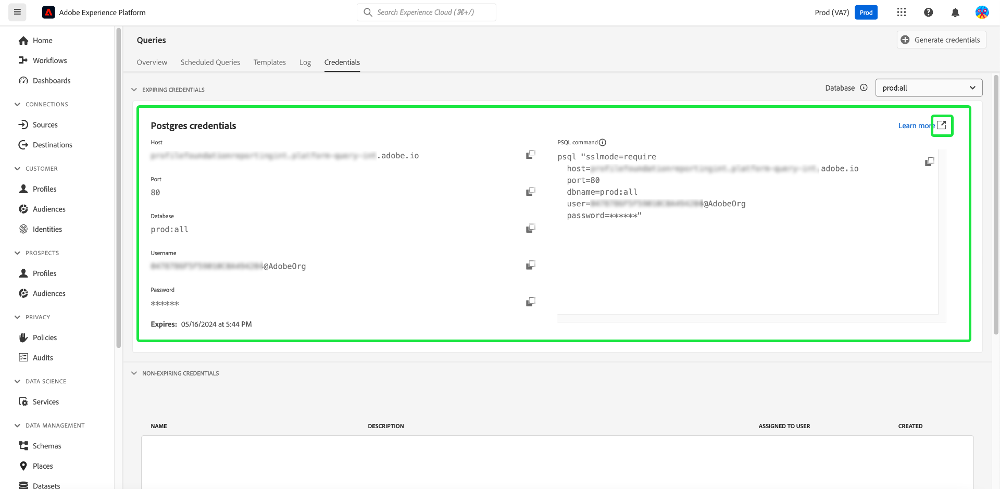

# [!DNL Query Service] UI-hulplijn

Adobe Experience Platform [!DNL Query Service] biedt een gebruikersinterface die kan worden gebruikt voor het schrijven en uitvoeren van query&#39;s, het weergeven van eerder uitgevoerde query&#39;s en het openen van query&#39;s die zijn opgeslagen door gebruikers binnen uw organisatie. Om tot UI binnen [ Adobe Experience Platform ](https://platform.adobe.com) toegang te hebben, selecteer **[!UICONTROL Queries]** in de linkernavigatie.

## [!DNL Query Editor]

Met [!DNL Query Editor] kunt u query&#39;s schrijven en uitvoeren zonder een externe client te gebruiken. Selecteer **[!UICONTROL Create Query]** om [!DNL Query Editor] te openen en een nieuwe query te maken. U kunt de [!DNL Query Editor] ook openen door een query te selecteren op de tabbladen **[!UICONTROL Log]** of **[!UICONTROL Templates]** . Als u een eerder uitgevoerde of opgeslagen query selecteert, wordt de [!DNL Query Editor] geopend en wordt de SQL voor de geselecteerde query weergegeven.

[!DNL Query Editor] biedt bewerkingsruimte waarin u een query kunt typen. Terwijl u typt, voltooit de redacteur automatisch SQL gereserveerde woorden, lijsten, en gebiedsnamen binnen lijsten. Wanneer gebeëindigd het schrijven van uw vraag, selecteer de **Spel** knoop om de vraag in werking te stellen. Op het tabblad **[!UICONTROL Console]** onder de editor ziet u wat [!DNL Query Service] momenteel doet, om aan te geven wanneer een query is geretourneerd. Op het tabblad **[!UICONTROL Result]** naast de Console worden de resultaten van de query weergegeven. Zie de [ gids van de Redacteur van de Vraag ](./user-guide.md) voor meer informatie bij het gebruiken van [!DNL Query Editor].

![ A zoomde in mening van [!DNL Query Editor].](../images/ui/overview/query-editor.png)

## Geplande query&#39;s {#scheduled-queries}

Vragen die al als een sjabloon zijn opgeslagen, kunnen worden gepland voor uitvoering op een normale cadence. Wanneer het plannen van een vraag, kunt u de frequentie van looppas, de begin en einddatum, de dag van de week kiezen de geplande vraaglooppas, evenals de dataset om de vraag naar uit te voeren. De programma&#39;s van de vraag worden geplaatst gebruikend de Redacteur van de Vraag.

Leren hoe te om een vraag door UI te plannen, zie de [ geplande gids van vragen ](./user-guide.md#scheduled-queries). Leren hoe te om programma&#39;s toe te voegen gebruikend API, te lezen gelieve de [ geplande gids van het vraageindpunt ](../api/scheduled-queries.md).

Nadat een query is gepland, wordt deze weergegeven in de lijst met geplande query&#39;s op het tabblad [!UICONTROL Scheduled Queries] . De volledige details betreffende de vraag, de looppas, de schepper, en de tijdopnemers kunnen worden gevonden door een geplande vraag van de lijst te selecteren.

| Kolom | Beschrijving |
| --- | --- |
| **[!UICONTROL Name]** | Het naamveld is de sjabloonnaam of de eerste paar tekens van uw SQL-query. Om het even welke vraag die door UI met de Redacteur van de Vraag wordt gecreeerd wordt genoemd bij aanvang. Als de query via de API is gemaakt, is de naam van de query een fragment van de eerste SQL die is gebruikt om de query te maken. |
| **[!UICONTROL Template]** | De sjabloonnaam van de query. Selecteer een sjabloonnaam om naar de Query-editor te navigeren. Het vraagmalplaatje wordt getoond in de Redacteur van de Vraag voor gemak. Als er geen malplaatjenaam is, wordt de rij duidelijk met een koppelteken en er is geen capaciteit om aan de Redacteur van de Vraag om de vraag te bekijken opnieuw te richten. |
| **[!UICONTROL SQL]** | Een fragment van de SQL-query. |
| **[!UICONTROL Run frequency]** | Dit is de kadentie waarbij uw vraag wordt geplaatst om te lopen. De beschikbare waarden zijn `Run once` en `Scheduled` . U kunt query&#39;s filteren op basis van hun uitvoeringsfrequentie. |
| **[!UICONTROL Created by]** | De naam van de gebruiker die de query heeft gemaakt. |
| **[!UICONTROL Created]** | De tijdstempel in UTC-indeling waarin de query is gemaakt. |
| **[!UICONTROL Last run timestamp]** | De meest recente tijdstempel toen de query werd uitgevoerd. Deze kolom benadrukt of een vraag volgens zijn huidig programma is uitgevoerd. |
| **[!UICONTROL Last run status]** | De status van de meest recente queryuitvoering. De drie statuswaarden zijn: `successful` `failed` of `in progress` . |

Zie de documentatie voor meer informatie over hoe te [ controleren vragen door de Dienst UI van de Vraag ](./monitor-queries.md).

## Sjablonen {#browse}

Op het tabblad **[!UICONTROL Templates]** worden query&#39;s weergegeven die door gebruikers in uw organisatie zijn opgeslagen. Het is nuttig om van deze als vraagprojecten te denken, aangezien de vragen hier worden bewaard nog onder bouw kunnen zijn. Query&#39;s die op het tabblad **[!UICONTROL Templates]** worden weergegeven, worden ook als uitvoerquery&#39;s weergegeven op het tabblad **[!UICONTROL Log]** als deze eerder zijn uitgevoerd door [!DNL Query Service] .

| Kolom | Beschrijving |
| --- | --- |
| **[!UICONTROL Name]** | Het naamveld is de naam van de query die door de gebruiker is gemaakt, of de eerste paar tekens van uw SQL-query. Om het even welke vraag die door UI met de Redacteur van de Vraag wordt gecreeerd wordt genoemd bij aanvang. Als de query via de API is gemaakt, is de naam van de query een fragment van de eerste SQL die is gebruikt om de query te maken. U kunt de naam van de query selecteren om de query te openen in de map [!DNL Query Editor] . U kunt de zoekbalk ook gebruiken om te zoeken naar de [!UICONTROL Name] van een query. Zoekopdrachten zijn hoofdlettergevoelig. |
| **[!UICONTROL SQL]** | De eerste paar tekens van de SQL-query. Als u de muis boven de code houdt, wordt de volledige query weergegeven. |
| **[!UICONTROL Modified by]** | De laatste gebruiker die de query heeft gewijzigd. Elke gebruiker in uw organisatie met toegang tot [!DNL Query Service] kan query&#39;s wijzigen. |
| **[!UICONTROL Last modified]** | De datum en de tijd van de laatste wijziging in de query, in de tijdzone van de browser. |

Zie de [ documentatie van vraagmalplaatjes ](./query-templates.md) voor meer informatie over malplaatjes in Platform UI.

## Logboek {#log}

Het tabblad **[!UICONTROL Log]** bevat een lijst met query&#39;s die eerder zijn uitgevoerd. Door gebrek, maakt een lijst van het logboek van de vragen in omgekeerde chronologie.

| Kolom | Beschrijving |
| --- | --- |
| **[!UICONTROL Name]** | De naam van de query, die bestaat uit de eerste verschillende tekens van de SQL-query. Selecteer de sjabloonnaam om de weergave [!UICONTROL Query log details] voor de desbetreffende uitvoering te openen. U kunt de zoekbalk gebruiken om te zoeken op de naam van een query. Zoekopdrachten zijn hoofdlettergevoelig. |
| **[!UICONTROL Start time]** | De tijd dat de query werd uitgevoerd. |
| **[!UICONTROL Complete time]** | De tijd dat de vraag voltooide. |
| **[!UICONTROL Status]** | De huidige status van de query. |
| **[!UICONTROL Dataset]** | De inputdataset die door de vraag wordt gebruikt. Selecteer de dataset om naar het scherm van de details van de inputdataset te gaan. |
| **[!UICONTROL Client]** | De client die voor de query wordt gebruikt. |
| **[!UICONTROL Created by]** | De naam van de persoon die de query heeft gemaakt. |

>
>
>Selecteer het potloodpictogram () vanuit een willekeurige rij in het querylogboek om naar de map [!DNL Query Editor] te navigeren. De query is vooraf ingevuld voor handige bewerking.

Zie de [ documentatie van vraaglogboeken ](./query-logs.md) voor meer informatie over de logboekdossiers automatisch door een vraaggebeurtenis worden geproduceerd.

## Credentials

Op het tabblad **[!UICONTROL Credentials]** worden uw verlopen en niet-verlopen referenties weergegeven. Voor meer informatie over hoe te om deze geloofsbrieven te gebruiken om met externe cliënten te verbinden, te lezen gelieve de [ gids van geloofsbrieven ](../clients/overview.md).

## Volgende stappen

Nu u bekend bent met de [!DNL Query Service] gebruikersinterface op [!DNL Platform] , kunt u [!DNL Query Editor] gebruiken om uw eigen queryprojecten te maken en deze te delen met andere gebruikers in uw organisatie. Voor meer informatie bij het ontwerpen en het runnen van vragen in [!DNL Query Editor], zie de [[!DNL Query Editor]  gebruikersgids ](./user-guide.md).
